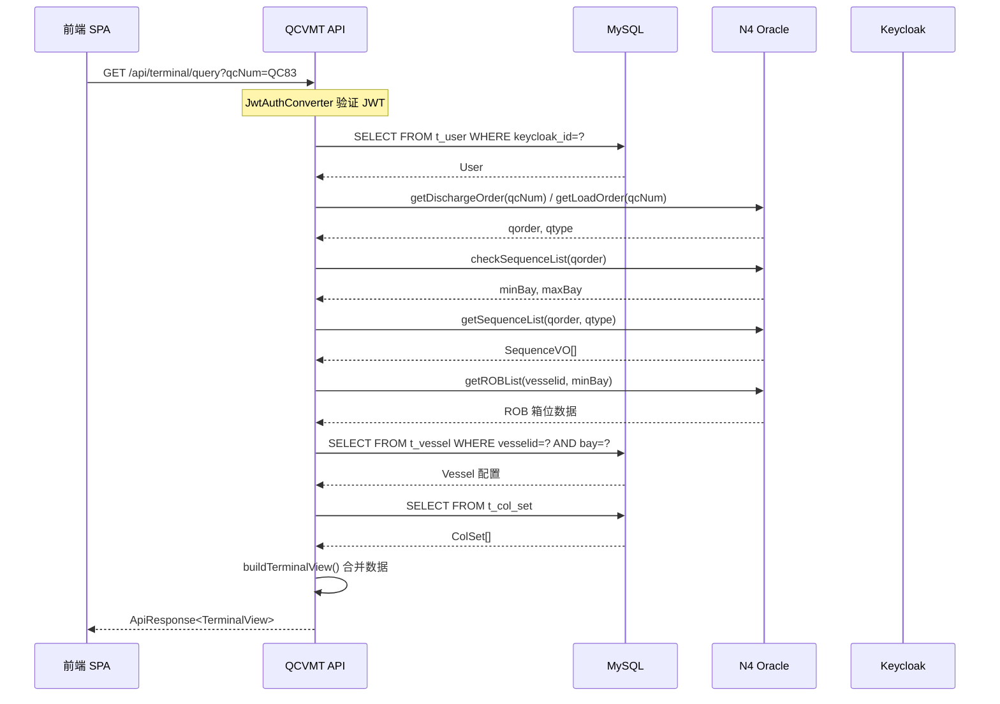

# 代码现状分析与影响范围评估

## 1. 当前实现

### 1.1 项目结构概述

当前项目基于 **Spring MVC 3.0.1 + HibernateTemplate** 构建，使用 Java 1.7，部署为 WAR 包形式。

**主要目录结构：**
```
src/main/java/
├── com/springMVC/
│   ├── control/          # Controller 层
│   │   ├── CellControl.java    # 船舶、颜色集、业务查询
│   │   └── UserControl.java    # 用户管理、登录登出、导入导出
│   ├── dao/              # DAO 层
│   │   ├── CellDaoImpl.java    # N4 Oracle SQL + MySQL 混合操作
│   │   ├── UserDaoImpl.java    # 用户、日志、N4 QC 查询
│   │   └── VesselDaoImpl.java  # 船舶、VesselCol、VesselRefuel
│   ├── entity/           # 实体类
│   │   ├── User.java, Vessel.java, ColSet.java, CellMatrix.java, ...
│   ├── filter/
│   │   └── SecurityInterceptor.java  # 手写 Session 拦截器
│   └── util/             # 工具类
└── com/accenture/vmt/
    ├── Busihandler.java        # 业务响应构建（XML 格式 HTML 表格）
    └── ClientIdentifierConnectionPreparer.java
```

### 1.2 关键技术点

| 维度 | 当前实现 | 问题 |
|------|----------|------|
| **框架版本** | Spring MVC 3.0.1 (2011年) | 已过时 15 年，无官方维护，安全漏洞未修复 |
| **Java 版本** | Java 1.7 | 无法使用现代特性（Lambda、Stream、模块系统） |
| **ORM** | HibernateTemplate (Hibernate 3.2) | API 已废弃，与 Spring Data JPA 不兼容 |
| **认证** | Session + SecurityInterceptor | 手写拦截器，无 OIDC/OAuth2 支持 |
| **数据源** | C3P0 连接池 + 单 JdbcTemplate | Oracle 和 MySQL 混用同一数据源配置 |
| **响应格式** | XML + HTML 字符串 (Busihandler) | 无法支持前后端分离，无法被现代前端框架消费 |
| **构建工具** | Maven WAR 打包 | 无依赖管理自动化，部署复杂 |

### 1.3 核心业务流程

#### 1.3.1 用户认证流程
```
UserControl.login(request)
  → userDao.login(User)
    → HibernateTemplate.find("from User WHERE username=? and password=?")
  → Session.setAttribute(Constants.USER_LOGIN, user)
  → redirect:/user/all.html (管理员) 或 tqcvmt.jsp (操作员)
```

**问题：**
- 明文密码存储（`password` 字段直接存数据库）
- Session 管理脆弱，无 CSRF 防护
- 无法与 Keycloak OIDC 集成

#### 1.3.2 业务查询流程 (CellControl.busiQuery)
```
CellControl.busiQuery(request, response, qcNum)
  → Busihandler.returnResponse(request, response, qcNum, cellDao)
    → cellDao.getCells("", qcid)
      → getQorder(qcid)  # Oracle: 查询当前作业序列号
      → checkSequenceList(hm)  # Oracle: 校验跨 Bay 作业
      → getSequenceList(hm)  # Oracle: 获取完整作业序列
      → getROBList(hm)  # Oracle: 获取剩余箱位
      → getCellMatrixFromnN4(vesselid, bay, qdeck)  # N4 + MySQL: 获取船舶结构
      → buildBay(cellMatrixistList, cellHashMap)  # 构建 HTML 表格字符串
    → response.getWriter().write("<type><table_info>" + cellTable + "</table_info></type>")
```

**问题：**
- 响应为 XML 包裹的 HTML 字符串，前端无法直接解析
- N4 Oracle SQL 与 MySQL 操作混在同一个 DAO 类中
- 无分页、无错误重试、无连接超时管理

#### 1.3.3 数据源配置混乱

当前 `springMVC-servlet.xml` 中：
```xml
<bean id="dataSource" class="com.mchange.v2.c3p0.ComboPooledDataSource">
  <property name="driverClass" value="${database.driver}" />  <!-- Oracle -->
  <property name="jdbcUrl" value="${database.url}" />
</bean>

<bean id="jdbcTemplate" class="org.springframework.jdbc.core.JdbcTemplate">
  <property name="dataSource" ref="dataSource"></property>  <!-- 同一数据源 -->
</bean>
```

**问题：**
- `jdbcTemplate` 指向 Oracle 数据源（用于 N4 SQL）
- `hibernateTemplate` 也指向同一 Oracle 数据源
- 无法区分 MySQL 本地数据和 N4 Oracle 数据

### 1.4 实体映射现状

| 实体 | 当前列名 | 问题 |
|------|----------|------|
| User | userid, QCID, NAME, PASSWORD, ROLE, PARENT, CREATETIME | PASSWORD 明文存储，CREATETIME 为 String |
| Vessel | vmid, vesselid, deck_hold, bay, rowstart, rowend, tierstart, tierend | 列名混用（rowstart vs row_start） |
| ColSet | colsetid, COLOR, BOXCASE | 无唯一约束 |
| ShowLog | userlogid, USERID, USERNAME, QCID, LOGINTIME, OPERATION | LOGINTIME 为 String |
| OperationLog | OPERLOGID, USERNAME, FUNCTION, ACTIONTYPE, VALUECHANGE, TIME | TIME 为 Date |

### 1.5 N4 Oracle SQL 复杂度

`CellDaoImpl.java` 中包含 **12 个 N4 Oracle SQL 查询**，涉及以下表：

| 方法 | 涉及 N4 表 | 行数 | 复杂度 |
|------|-----------|------|--------|
| getLoadOrder | inv_wq, inv_wi, inv_unit_yrd_visit, inv_unit_fcy_visit, inv_unit, xps_craneshift, xps_pointofwork, ref_equipment, inv_goods, argo_carrier_visit | 78 | 10 表 JOIN |
| getDischargeOrder | 同上 | 39 | 10 表 JOIN |
| getSequenceList | 同上 | 251 | 10 表 JOIN + 多子查询 |
| checkSequenceList | 同上 | 81 | 动态 SQL 构建 |
| getROBList | inv_unit_fcy_visit, inv_unit, argo_carrier_visit | 72 | 3 表 JOIN |
| getROBListByBayNew | 同上 | 66 | 3 表 JOIN |
| getCellMatrixFromnN4 | argo_carrier_visit, vsl_vsl_visit_details, vsl_vessels, t_vessel | 97 | 4 表 JOIN + MySQL 回退 |
| queryQcId | xps_pointofwork, argo_yard, argo_facility | 23 | 3 表子查询 |
| queryFacilityByQcId | argo_facility, argo_yard, xps_pointofwork | 19 | 3 表 JOIN |
| getN4VesselNameById | vsl_vessels | 4 | 单表查询 |
| getHazardList | ref_hazardous_material, inv_unit | 32 | 2 表 JOIN |
| getTwentyUnitList | 同上 | 45 | 2 表 JOIN |

**SQL 特点：**
- 所有查询使用 `MN4O_QC_` 前缀的 Schema 视图
- 大量使用 `substr()`、`case when`、子查询
- 无参数化查询（如 `iq.qorder='" + qorder + "'`），存在 SQL 注入风险
- 错误处理粗糙（`catch (Exception e) { e.printStackTrace(); }`）

---

## 2. 需求理解

### 2.1 迁移目标

根据 S00600 和 O00017 文档，本次迁移需完成：

1. **框架升级**：Spring MVC 3.0.1 → Spring Boot 3.5.16 + Spring Data JPA
2. **认证升级**：Session → Keycloak OIDC + Spring Security
3. **数据源拆分**：单数据源 → 双数据源（MySQL + Oracle 只读）
4. **API 重构**：JSP + XML → REST JSON API
5. **实体迁移**：Oracle SEQUENCE → MySQL IDENTITY，时间字段 String → LocalDateTime
6. **N4 SQL 迁移**：CellDaoImpl 中的 Oracle SQL → N4Service 层（JdbcTemplate 只读）

### 2.2 业务规则保留

| 业务规则 | 当前实现位置 | 迁移要求 |
|----------|-------------|----------|
| 用户角色分为 ADMIN/USER | UserControl.login() | 保留，映射为 Keycloak realm roles (qcvmt-admin, qcvmt-user) |
| QC 编号必须存在于 N4 | UserDaoImpl.queryQcId() | 保留，通过 N4FacilityQueryService 查询 |
| 船舶配置按 vesselid + deck_hold + bay 唯一 | VesselDaoImpl.save() | 保留，通过 JPA @UniqueConstraint 约束 |
| 作业序列按 qorder + move_stage 过滤 | CellDaoImpl.getSequenceList() | 保留，N4WorkQueueService 实现相同 SQL |
| 装卸类型区分 LOAD/DISCH | CellDaoImpl.getCells() | 保留，TerminalController 返回 qtype 字段 |
| 跨 Bay 作业校验（minBay/maxBay） | CellDaoImpl.checkSequenceList() | 保留，N4WorkQueueService 实现 |
| ROB（剩余箱位）查询 | CellDaoImpl.getROBList() | 保留，N4ContainerQueryService 实现 |

### 2.3 技术约束

1. **MySQL 主数据**：用户、船舶、颜色集等本地配置存储于 MySQL
2. **Oracle 只读**：N4 TOS 数据仅查询，不写入（HikariCP read-only=true）
3. **Keycloak 集成**：JWT 验证使用公钥（无需调用 Keycloak API 验证 Token）
4. **前后端分离**：前端为 SPA（Vue 3 / React），后端仅提供 REST API
5. **多语言支持**：保留 messages_en/zh_CN/zh_TW.properties，通过 Accept-Language 头切换

### 2.4 待解决问题

| 问题 | 优先级 | 解决方向 |
|------|--------|----------|
| N4 Oracle SQL 参数化 | 高 | 所有 SQL 使用 PreparedStatement，禁止字符串拼接 |
| 双数据源事务隔离 | 高 | MySQL 启用 @Transactional，Oracle 仅查询无事务 |
| Keycloak 用户首次登录同步 | 中 | KeycloakUserSyncService 在 Filter 中自动创建本地用户 |
| CellMatrix N4 回退逻辑 | 中 | CellDaoImpl.getCellMatrixFromnN4() 中 N4 查询失败时回退到 MySQL |
| 分页参数兼容 | 低 | Pageable 替代手动 offset/limit |

---

## 3. 影响范围分析

### 3.1 直接依赖

| 组件 | 当前文件 | 影响范围 | 迁移动作 |
|------|----------|----------|----------|
| CellControl | control/CellControl.java | 所有业务查询 API | 拆分为 VesselController, ColorSetController, TerminalController, BayConfigController |
| UserControl | control/UserControl.java | 用户管理 API | 拆分为 UserController, ImportExportController, OperationLogController |
| CellDaoImpl | dao/CellDaoImpl.java | N4 SQL + MySQL CellMatrix | 拆分为 CellMatrixService (MySQL) + N4WorkQueueService/N4ContainerQueryService/N4VesselQueryService (Oracle) |
| UserDaoImpl | dao/UserDaoImpl.java | 用户 CRUD + ShowLog | 拆分为 UserService (MySQL) + N4FacilityQueryService (Oracle) |
| VesselDaoImpl | dao/VesselDaoImpl.java | Vessel/VesselCol/VesselRefuel CRUD + OperationLog | 拆分为 VesselService, VesselColorService, VesselRefuelService, OperationLogService |
| Busihandler | Busihandler.java | XML/HTML 响应构建 | 移除，由 TerminalController 返回 JSON |
| SecurityInterceptor | filter/SecurityInterceptor.java | Session 拦截 | 移除，由 Spring Security + JwtAuthConverter 替代 |

### 3.2 间接依赖

| 组件 | 依赖者 | 影响传递 |
|------|--------|----------|
| N4 Oracle Schema (MN4O_QC_*) | CellDaoImpl, UserDaoImpl | N4Service 层必须保留所有表名和列名，SQL 语义不变 |
| Session 属性 (Constants.USER_LOGIN) | UserControl, CellControl | 移除 Session，改用 SecurityContextHelper.getCurrentUsername() |
| Cookie 偏好 (defQCNUM) | UserControl.login() | 移除 Cookie，前端 SPA 自行管理 localStorage |
| JSP 视图 (WEB-INF/jsp/*.jsp) | 所有 Controller | 全部移除，前端独立实现 |
| C3P0 连接池配置 | springMVC-servlet.xml | 替换为 HikariCP，配置于 application.yml |
| Messages properties | MessageUtil.getMessage() | 保留，通过 Spring MessageSource 注入 |

### 3.3 传递性依赖（外部系统）

| 外部系统 | 当前交互方式 | 迁移后 |
|----------|-------------|--------|
| N4 TOS (Oracle) | JdbcTemplate 直连 | N4QueryRepository (JdbcTemplate 只读)，连接参数改为环境变量 |
| Keycloak | 无 | 新增 OAuth2 Resource Server，JWT 公钥验证 |
| 前端 SPA | XML + HTML 字符串 | REST JSON API (ApiResponse<T>) |
| Nginx 反向代理 | 无 | 新增 /api/* 反向代理到 8080 端口 |

---

## 4. 受影响流程与路由

### 4.1 用户管理流程

| 当前路由 | HTTP 方法 | 新功能 | 新路由 |
|----------|----------|--------|--------|
| /user/login | POST | 移除（Keycloak 接管） | - |
| /user/loginAdmin | POST | 移除（Keycloak 接管） | - |
| /user/logout | GET | 移除（Keycloak 接管） | - |
| /user/all | GET | 用户列表（分页） | GET /api/users |
| /user/save | POST | 创建用户 | POST /api/users |
| /user/modify | GET | 查询单用户 | GET /api/users/{id} |
| /user/update | POST | 更新用户 | PUT /api/users/{id} |
| /user/del | GET | 删除用户 | DELETE /api/users/{id} |
| /user/log | GET | 用户登录日志 | GET /api/users/{id}/logs |
| /user/exportLogs | GET | 导出日志 | GET /api/export/logs |
| /user/importVessel | POST | 导入船舶 | POST /api/import/vessel |
| /user/index | GET | 移除 | - |
| /user/changeLan | GET | 移除（前端 i18n） | - |

### 4.2 业务查询流程

| 当前路由 | HTTP 方法 | 新功能 | 新路由 |
|----------|----------|--------|--------|
| /user/BusiQuery | GET | 终端实时查询 | GET /api/terminal/query |
| /user/allColSet | GET | 颜色集列表 | GET /api/color-sets |
| /user/saveColSet | POST | 创建颜色集 | POST /api/color-sets |
| /user/modifyColSet | GET | 查询单颜色集 | GET /api/color-sets/{id} |
| /user/updateColSet | POST | 更新颜色集 | PUT /api/color-sets/{id} |
| /user/delColSet | GET | 删除颜色集 | DELETE /api/color-sets/{id} |

### 4.3 船舶管理流程

| 当前路由 | HTTP 方法 | 新功能 | 新路由 |
|----------|----------|--------|--------|
| /user/allVessel | GET | 船舶列表 | GET /api/vessels |
| /user/saveVessel | POST | 创建船舶 | POST /api/vessels |
| /user/modifyVessel | GET | 查询单船舶 | GET /api/vessels/{id} |
| /user/updateVessel | POST | 更新船舶 | PUT /api/vessels/{id} |
| /user/delVessel | GET | 删除船舶 | DELETE /api/vessels/{id} |
| /user/searchVessel | GET | 搜索船舶 | GET /api/vessels?search={key} |
| /user/setbay | GET | 获取 Bay 尺寸模板 | GET /api/bay-config |
| /user/updateBay | POST | 更新 Bay 尺寸 | PUT /api/bay-config |

### 4.4 船舶颜色配置流程

| 当前路由 | HTTP 方法 | 新功能 | 新路由 |
|----------|----------|--------|--------|
| /user/allVesselCol | GET | 船舶颜色列表 | GET /api/vessel-colors |
| /user/saveVesselCol | POST | 创建/更新船舶颜色 | POST /api/vessel-colors |
| /user/modifyVesselCol | GET | 查询单船舶颜色 | GET /api/vessel-colors/{id} |
| /user/delVesselCol | GET | 删除船舶颜色 | DELETE /api/vessel-colors/{id} |

### 4.5 船舶加油配置流程

| 当前路由 | HTTP 方法 | 新功能 | 新路由 |
|----------|----------|--------|--------|
| /user/allVesselRefuel | GET | 加油配置列表 | GET /api/vessel-refuels |
| /user/updateVesselRefuelStatus | POST | 创建/更新加油状态 | POST /api/vessel-refuels |
| /user/modifyVesselRefuel | GET | 查询单加油配置 | GET /api/vessel-refuels/{id} |
| /user/delVesselRefuel | GET | 删除加油配置 | DELETE /api/vessel-refuels/{id} |

### 4.6 关键业务流程（Terminal 查询）



---

## 5. 风险等级评估

### 5.1 高风险

| 风险项 | 原因 | 缓解措施 |
|--------|------|----------|
| **N4 Oracle SQL 语义变更** | 12 个复杂 SQL 涉及 10 表 JOIN，迁移时易丢失条件或字段 | 逐一对照原始 SQL 编写，使用 N4 Schema 文档验证 |
| **双数据源事务冲突** | MySQL 写入与 Oracle 查询混在同一 Service 中 | 明确拆分 local/ 和 n4/ Service，Oracle 仅只读 |
| **Keycloak 用户同步失败** | 首次登录时 MySQL 无用户记录 | KeycloakUserSyncService 在 getOrCreateLocalUser() 中自动创建 |
| **SQL 注入漏洞** | 当前代码大量字符串拼接（`iq.qorder='" + qorder + "'`） | 所有 N4 SQL 改为 PreparedStatement 参数化 |
| **CellMatrix N4 回退逻辑** | getCellMatrixFromnN4() 中 N4 查询失败时回退到 MySQL | N4VesselQueryService 实现相同回退逻辑，避免空结果 |

### 5.2 中风险

| 风险项 | 原因 | 缓解措施 |
|--------|------|----------|
| **分页参数不兼容** | 旧代码使用 offset/limit 手动分页，新代码使用 Pageable | Repository 方法命名规范确保分页正确 |
| **时间字段类型转换** | String → LocalDateTime，旧数据可能格式不一致 | 数据库迁移脚本统一转换为 DATETIME |
| **CORS 配置错误** | 前后端分离后无法跨域访问 | CorsConfig 明确配置 allowedOrigins=${CORS_ORIGINS} |
| **Keycloak 角色映射** | realm_access.roles 中的 qcvmt-admin/qcvmt-user 需正确过滤 | JwtAuthConverter.extractRoles() 仅过滤以 `qcvmt-` 开头的角色 |
| **Busihandler HTML 表格移除** | 前端需重新实现 Bay 可视化渲染 | TerminalView 返回结构化 JSON，前端独立渲染 |

### 5.3 低风险

| 风险项 | 原因 | 缓解措施 |
|--------|------|----------|
| **多语言 properties 迁移** | messages_en/zh_CN/zh_TW.properties 已存在 | 直接复制到 resources/ 目录，Spring MessageSource 自动加载 |
| **Entity 列名大小写** | 旧代码列名大小写不一致（rowstart vs row_start） | @Column(name="row_start") 显式指定，避免 ORM 自动转换 |
| **OperationLog 审计** | 旧代码在 Controller 中手动记录日志 | 移至 Service 层，使用 SecurityContextHelper 获取当前用户 |
| **HikariCP 连接池参数** | 旧 C3P0 配置参数与 HikariCP 不同 | application.yml 中明确配置 maximumPoolSize/idleTimeout |

---

## 6. 关键代码路径映射

### 6.1 实体迁移映射

| 原文件 | 新文件 | 关键变更 |
|--------|--------|----------|
| entity/User.java | entity/User.java | @Table(name="t_user"), @Id @GeneratedValue(IDENTITY), 移除 password，新增 keycloak_id |
| entity/Vessel.java | entity/Vessel.java | @Table(name="t_vessel"), @UniqueConstraint(vesselid, deck_hold, bay) |
| entity/ColSet.java | entity/ColSet.java | @Table(name="t_col_set"), @Column(unique=true) for boxcase |
| entity/CellMatrix.java | entity/CellMatrix.java | @Table(name="t_cell_matrix"), row 列名保留但需转义 |
| entity/ShowLog.java | entity/ShowLog.java | @Table(name="t_showlog"), loginTime → LocalDateTime |
| entity/OperationLog.java | entity/OperationLog.java | @Table(name="t_operation_log"), timestamp → LocalDateTime |
| entity/VesselCol.java | entity/VesselCol.java | @Table(name="t_vessel_col") |
| entity/VesselRefuel.java | entity/VesselRefuel.java | @Table(name="t_vessel_refuel") |
| entity/BaySize.java | entity/BaySize.java | 非实体，作为 DTO 使用 |

### 6.2 DAO 迁移映射

| 原文件 | 新方法 | 新 Service | 数据源 |
|--------|--------|------------|--------|
| CellDaoImpl.getCells() | N4WorkQueueService.getCurrentWorkQueue() | n4/ | Oracle |
| CellDaoImpl.getQorder() | N4WorkQueueService.getDischargeOrder() + getLoadOrder() | n4/ | Oracle |
| CellDaoImpl.getSequenceList() | N4WorkQueueService.getSequenceList() | n4/ | Oracle |
| CellDaoImpl.checkSequenceList() | N4WorkQueueService.checkSequenceList() | n4/ | Oracle |
| CellDaoImpl.getROBList() | N4ContainerQueryService.getROBList() | n4/ | Oracle |
| CellDaoImpl.getCellMatrixFromnN4() | N4VesselQueryService.getCellMatrix() | n4/ | Oracle + MySQL 回退 |
| CellDaoImpl.getColSet/getAllCol/saveOrUpdateColSet | ColorSetService.findAll/save/update/delete | local/ | MySQL |
| CellDaoImpl.getBaySize/updateCellMatrix | CellMatrixService.getBaySize/updateBaySize | local/ | MySQL |
| UserDaoImpl.login/getAllUser/save/update/deleteById | UserService.findAll/save/update/delete | local/ | MySQL |
| UserDaoImpl.add (ShowLog) | UserService.recordLoginLog/recordLogoutLog | local/ | MySQL |
| UserDaoImpl.getUserLog | UserService.getUserLogs | local/ | MySQL |
| UserDaoImpl.getUserLogByPeriod | UserService.getLogsByPeriod | local/ | MySQL |
| UserDaoImpl.queryQcId | N4FacilityQueryService.queryQcId | n4/ | Oracle |
| UserDaoImpl.queryFacilityByQcId | N4FacilityQueryService.queryFacilityByQcId | n4/ | Oracle |
| VesselDaoImpl.* | VesselService/VesselColorService/VesselRefuelService | local/ | MySQL |
| VesselDaoImpl.saveOperationLog | OperationLogService.saveLog | local/ | MySQL |
| VesselDaoImpl.getN4VesselNameById | N4VesselQueryService.getVesselName | n4/ | Oracle |

### 6.3 Controller 迁移映射

| 原文件 | 新 Controller | API 前缀 |
|--------|--------------|----------|
| UserControl | UserController | /api/users |
| UserControl.exportLogs/importVessel | ImportExportController | /api/import, /api/export |
| CellControl (船舶相关) | VesselController | /api/vessels |
| CellControl (颜色集相关) | ColorSetController | /api/color-sets |
| CellControl (VesselCol 相关) | VesselColorController | /api/vessel-colors |
| CellControl (VesselRefuel 相关) | VesselRefuelController | /api/vessel-refuels |
| CellControl (Bay 配置) | BayConfigController | /api/bay-config |
| CellControl.busiQuery | TerminalController | /api/terminal/query |
| - | OperationLogController | /api/operation-logs |

---

## 7. 代码质量现状评估

| 指标 | 当前状态 | 迁移后目标 |
|------|----------|------------|
| **代码行数** | ~33 个 Java 文件，约 8000 行 | 拆分后约 65 个文件，结构更清晰 |
| **测试覆盖率** | 0% | 核心 Service 需添加单元测试 |
| **SQL 注入风险** | 高（多处字符串拼接） | 0（全部参数化） |
| **错误处理** | e.printStackTrace() | GlobalExceptionHandler 统一返回 ApiResponse |
| **日志规范** | commons-logging LOG.debug/info | SLF4J + Logback + JSON 格式 |
| **配置外部化** | db.properties 硬编码 | application.yml + 环境变量 |
| **API 文档** | 无 | SpringDoc OpenAPI (swagger-ui) |
| **依赖管理** | pom.xml 手动指定版本 | Gradle Kotlin DSL + Spring Boot BOM |

---

## 8. 结论与建议

### 8.1 必须执行

1. **立即拆分 CellDaoImpl**：将 N4 Oracle SQL 与 MySQL 操作完全分离
2. **参数化所有 N4 SQL**：使用 PreparedStatement 替代字符串拼接
3. **配置双数据源**：MySQL (JPA) + Oracle (JdbcTemplate 只读)
4. **集成 Keycloak**：JwtAuthConverter + KeycloakUserSyncService
5. **重构 Busihandler**：移除 XML/HTML 响应，返回 JSON

### 8.2 建议执行

1. **添加 Swagger UI**：使用 springdoc-openapi 自动生成 API 文档
2. **添加 Actuator**：/actuator/health 用于 Kubernetes 健康检查
3. **Docker 化**：构建 JAR 镜像，替代 WAR 部署
4. **添加 Redis 缓存**：N4 查询结果缓存（TTL 30s - 5min）

### 8.3 可选执行

1. **添加 GraphQL API**：替代部分 REST 端点，减少前端请求次数
2. **WebSocket 实时推送**：替代前端轮询，实现作业进度实时同步
3. **Elasticsearch 日志查询**：替代 MySQL t_showlog/t_operation_log 查询
