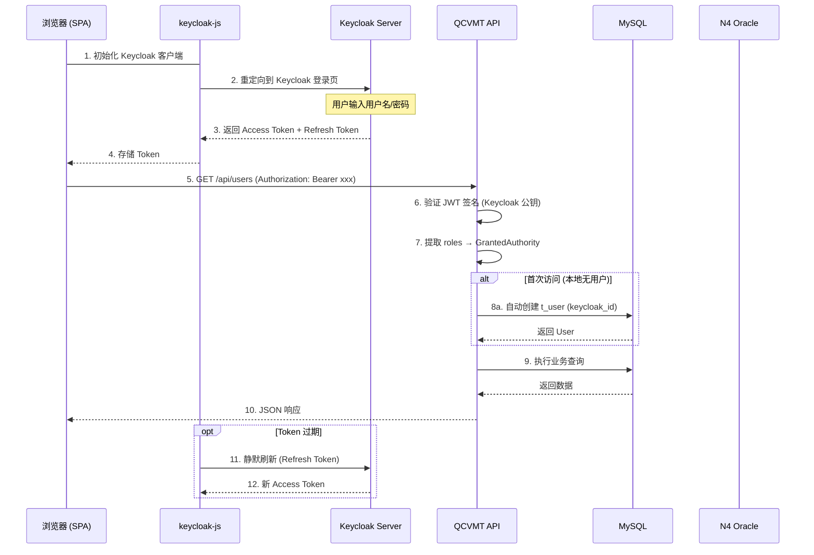
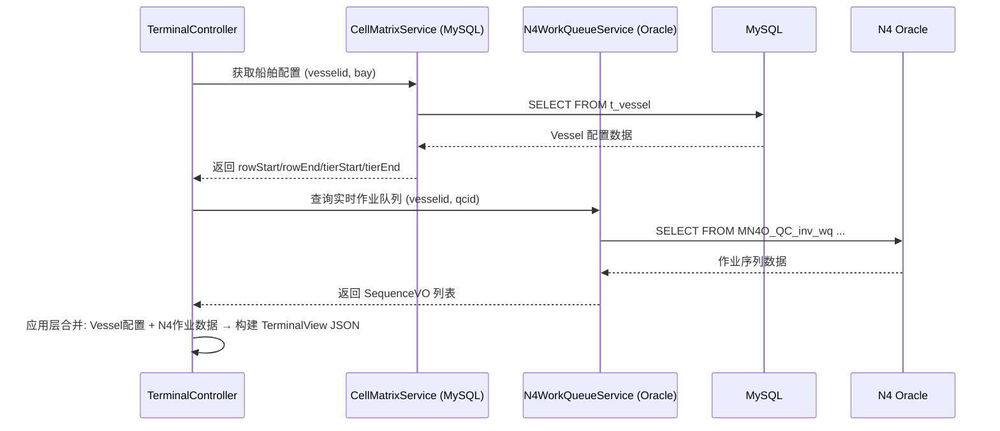

## 1. 项目概述
---
## 2. 目标技术栈
### 2.1 后端技术栈
### 2.2 前端技术栈（建议）
---
## 3. 系统部署架构
### 3.1 前后端分离部署拓扑
```mermaid
flowchart TB
subgraph browse
r ["浏览器"]
fe["前端 SPA；(Vue 3 / React)"]
end
subgraph gatewa
y ["反向代理 (Nginx)"]
nginx["Nginx"]
end
subgraph backen
d ["后端服务"]
app["QCVMT API Server；(Spring Boot 3.5.16)"]
end
subgraph aut
h ["认证服务"]
kc["Keycloak Server"]
end
subgraph d
b ["数据层"]
mysql[("MySQL 8.x；(QCVMT 本地)")]
oracle[("Oracle；(N4 TOS 只读)")]
end
fe -->|"/api/*"| nginx
fe -->|"/ 静态资源"| nginx
nginx -->|"/api/* 反向代理"| app
nginx -->|"/ 静态文件"| fe
fe -->|"OIDC 登录"| kc
app -->|"JWT 验证 (公钥)"| kc
app -->|"JPA/Hibernate"| mysql
app -->|"JdbcTemplate (只读)"| oracle
```
### 3.2 Nginx 配置示例
```nginx
server {
listen 80;
server_name qcvmt.example.com;
# 前端静态资源
location / {
root /usr/share/nginx/html;
index index.html;
try_files $uri/ /index.html; # SPA History 模式
}
# 后端 API 反向代理
location /api/ {
proxy_pass http://qcvmt-backend:8080/api/;
proxy_set_header Host $host;
proxy_set_header X-Real-IP $remote_addr;
proxy_set_header X-Forwarded-For $proxy_add_x_forwarded_for;
proxy_set_header X-Forwarded-Proto $scheme;
}
# Keycloak 反向代理 (可选)
location /auth/ {
proxy_pass http://keycloak:8180/;
proxy_set_header Host $host;
proxy_set_header X-Real-IP $remote_addr;
}
}
```
---
## 4. 项目结构
```
qcvmt/
├── build.gradle.kts
├── settings.gradle.kts
├── gradle/wrapper/
├── src/main/java/com/mtl/qcvmt/
│  ├── QcvmtApplication.java
│   ├── config/
│   │   ├── MysqlDataSourceConfig.java
│   │  ├── N4Oracle│   │  ├── SecurityConfig.java              ← Keycloak OIDC 资源服务器配置
│  │   ├── KeycloakConfig.java             ← Keycloak Admin Client 配置
│   │  ├── CorsConfig.java                 ← CORS 跨域配置（前后端分离必需）
│  │   ├── WebConfig.java
│   │  └── I18nConfig.java
│   ├── entity/
│   │   ├── User.java                        ← 移除 password，新增 keycloakId
│   │   ├── ShowLog.java
│  │   ├── Vessel.java
│   │   ├── VesselCol.java
│   │   ├── VesselRefuel.java
│   │  ├── ColSet.java
│   │   ├── CellMatrix.java
│  │   ├── BaySize.java
│   │  └── OperationLog.java
│  ├── repository/
│   │  ├── UserRepository.java
│   │  ├── ShowLogRepository.java
│  │   ├── VesselRepository.java
│   │  ├── VesselColRepository.java
│   │   ├── VesselRefuelRepository.java
│   │   ├── ColSetRepository.java
│   │   ├── CellMatrixRepository.java
│   │  └── OperationLogRepository.java
│   ├── n4/
│  │   ├── N4QueryRepository.java
│   │   └── N4TableConstants.java
│  ├── service/
│   │  ├── local/
│   │   ├── UserService.java
│  │   │  ├── VesselService.java
│  │   │  ├── VesselColorService.java
│   │   │   ├── VesselRefuelService.java
│   │   ├── ColorSetService.java
│   │   ├── CellMatrixService.java
│   │  └── OperationLogService.java
│   │   ├── keycloak/
│   │   ├── KeycloakUserSyncService.java
│  │   │  └── KeycloakRoleMappingService.java
│  │   └── n4/
│   │       ├── N4VesselQueryService.java
│  │       ├── N4WorkQueueService.java
│  │       ├── N4ContainerQueryService.java
│  │       └── N4FacilityQueryService.java
│   ├── controller/
│   │   ├── UserController.java
│   │   ├── VesselController.java
│   │   ├── ColorSetController.java
│   │   ├── VesselColorController.java
│  │   ├── VesselRefuelController.java
│  │   ├── BayConfigController.java
│   │  ├── TerminalController.java
│   │   ├── OperationLogController.java
│   │  └── ImportExportController.java
│   ├── dto/
│   │   ├── request/
│   │   ├── CreateUserRequest.java
│  │   │  ├── UpdateUserRequest.java
│  │   │  ├── CreateVesselRequest.java
│   │   │   ├── UpdateVesselRequest.java
│   │   ├── CreateColSetRequest.java
│   │   ├── UpdateColSetRequest.java
│  │   │  ├── SaveVesselColRequest.java
│  │   │  ├── SaveVesselRefuelRequest.java
│   │  └── UpdateBaySizeRequest.java
│   │  ├── response/
│   │   ├── UserResponse.java
│   │   │   ├── VesselResponse.java
│   │   │   ├── ColSetResponse.java
│   │   ├── VesselColResponse.java
│   │   ├── VesselRefuelResponse.java
│   │   │   ├── TerminalView.java
│   │   ├── WorkQueueResult.java
│   │  └── PageResponse.java
│  │   └── ApiResponse.java
│   ├── security/
│  │   ├── JwtAuthConverter.java
│   │  └── SecurityContextHelper.java
│   ├── exception/
│  │   ├── GlobalExceptionHandler.java
│   │   ├── BusinessException.java
│   │  └── N4ConnectionException.java
│   └── util/
│       ├── WebUtil.java
│       ├── ImportHandler.java
│      └── ExportHandler.java
├── src/main/resources/
│   ├── application.yml
│   ├── application-dev.yml
│   ├── application-sit.yml
│   ├── application-uat.yml
│   ├── application-prod.yml
│   ├── messages_en.properties
│   ├── messages_zh_CN.properties
│   └── messages_zh_TW.properties
└── src/test/java/com/mtl/qcvmt/
```
---
## 5. 构建配置
### settings.gradle.kts
```kotlin
rootProject.name = "qcvmt"
```
### build.gradle.kts
```kotlin
plugins {
java
id("org.springframework.boot") version "3.5.16"
id("io.spring.dependency-management") version "1.1.7"
}
group = "com.mtl"
version = "2.0.0"
java {
sourceCompatibility = JavaVersion.VERSION_17
targetCompatibility_17
}
repositories {
mavenCentral()
}
dependencies {
implementation("org.springframework.boot:spring-boot-starter-web")
implementation:spring-boot-starter-data-jpa:spring-boot-starter-jdbc")
implementation("pring-boot-starter-security")
.boot:spring-boot-starter-oauth2-resource-server")
implementation("pring-boot-starter-validation")
.boot:spring-boot-starter-actuator")
implementation("org.keycloak:keycloak-admin-client:26.0.0")
runtimeOnly("com.mysql:mysql-connector-j:8.4.0")
runtimeOnly("com.oracle.database.jdbc:ojdbc1:23.6.0.24.10")
implementation("org.apache.poi:poi-ooxml:5.3.0")
doc:springdoc-openapi-starter-webmvc-ui:2.7.0")
compileOnly("org.projectlombok:lombok")
annotationProcessor("org.projectlombok:lombok")
implementation("org.mapstruct:mapstruct:1.6.3")
org.mapstruct:mapstruct-processor:1.6.3")
testImplementation("pring-boot-starter-test")
testImplementation("org.springframework.security:spring-security-test")
com.h2database:h2")
}
tasks.withType<Test> {
useJUnitPlatform()
}
```
---
## 6. Keycloak 集成架构
### 6.1 前后端分离认证流程

### 6.2 Keycloak Realm 配置
**Admin Client（后端用户管理用）**：
### 6.3 Keycloak Role → 业务权限映射
### 6.4 用户同步策略
```mermaid
flowchart TD
subgraph k
c ["Keycloak"]
kcUser["Keycloak User；(username, email, roles)"]
end
subgraph syn
c ["同步机制"]
login["首次 API 请求触发"]
syncSvc["KeycloakUserSyncService"]
end
subgraph mysq
l ["MySQL t_user"]
localUser["本地 User；(keycloak_id, username, role, qcid)"]
end
kcUser -->|"Bearer Token 携带 sub (UUID)"| login
login --> syncSvc
syncSvc -->|"按 keycloak_id 查找"| localUser
syncSvc -->|"不存在则创建"| localUser
syncSvc -->|"已存在则更新 role"| localUser
```
---
## 7. 双数据源架构
### 7.1 架构总览
```mermaid
flowchart TB
subgraph ap
p ["QCVMT Application"]
subgraph mysql_sv
c ["MySQL Service 层 (local/)"]
userSvc["UserService"]
vesselSvc["VesselService"]
colorSvc["ColorSetService"]
vcSvc["VesselColorService"]
vrSvc["VesselRefuelService"]
cellSvc["CellMatrixService"]
logSvc["OperationLogService"]
end
subgraph kc_sv
c ["Keycloak Service 层 (keycloak/)"]
kcSync["KeycloakUserSyncService"]
kcRole["Key"]
end
subgraph n4_sv
c ["N4 Service 层 (n4/)"]
n4Vessel["N4VesselQueryService"]
n4Wq["N4WorkQueueService"]
n4Container["N"]
n4Facility["N4FacilityQueryService"]
end
subgraph mysql_rep
o ["MySQL Repository (JPA)"]
userRepo["UserRepository"]
vesselRepo["VesselRepository"]
colSetRepo["ColSetRepository"]
vesselColRepo["VesselColRepository"]
vesselRefuelRepo["VesselRefuelRepository"]
cellRepo["CellMatrixRepository"]
showLogRepo["ShowLogRepository"]
opLogRepo["OperationLogRepository"]
end
n4Repo["N4QueryRepository；(JdbcTemplate)"]
end
subgraph keycloa
k ["Keycloak Server"]
kcDb[("Keycloak DB；(用户/角色/凭证)")]
end
subgraph mysq
l ["MySQL 8.x (QCVMT 本地)"]
t_user[("t_user")]
t_vessel[("t_vessel")]
t_cell[("t_cell_matrix")]
t_colset[("t_col_set")]
t_vesselcol[("t_vessel_col")]
t_vesselrefuel[("t_vessel_refuel")]
t_showlog[("t_showlog")]
t_oplog[("t_operation_log")]
end
subgraph oracl
e ["Oracle (N4 TOS 只读)"]
n4_wq[("MN4O_QC_inv_wq")]
n4_wi[("MN4O_QC_inv_wi")]
n4_unit[("MN4O_QC_inv_unit")]
n4_ufv[("MN4O_QC_inv_unit_fcy_visit")]
n4_acv[("MN4O_QC_argo_carrier_visit")]
n4_xpow[("MN4O_QC_xps_pointofwork")]
n4_equip[("MN4O_QC_ref_equipment")]
n4_vsl[("MN4O_QC_vsl_vessels")]
end
mysql_svc --> mysql_repo
mysql_repo --> mysql
kc_svc --> keycloak
kc_svc --> mysql_repo
n4_svc --> n4Repo
n4Repo --> oracle
```
### 7.2 跨数据源调用场景

### 7.3 数据源配置类
### M
```java
@Configuration
@EnableTransactionManagement
@EnableJpaRepositories(
basePackages = "com.mtl.qcvmt.repository",
entityManagerFactoryRef = "mysqlEntityManagerFactory",
transactionManagerRef = "mysqlTransactionManager"
)
public class {
@Bean
@Primary
@ConfigurationProperties("qcvmt.datasource.mysql")
public DataSource mysqlDataSource() {
return DataSourceBuilder.create().build();
}
@Bean
@Primary
public LocalContainerEntityManagerFactoryBean mysqlEntityManagerFactory(
@Qualifier("mysqlDataSource") DataSource dataSource) {
Local em = new Local();
em.setDataSource(dataSource);
em.setPackagesToScan("com.mtl.qcvmt.entity");
em.setJpaVendorAdapter(new HibernateJpaVendorAdapter());
em.setJpaProperties(Map.of(
"hibernate.dialect", "org.hibernate.dialect.MySQLDialect",
"hibernate.show_sql", "false",
"hibernate.format_sql", "true",
"hibernate.hbm2ddl.auto", "none"
));
return em;
}
@Bean
@Primary
public PlatformTransactionManager mysqlTransactionManager(
@Qualifier("mysqlEntityManagerFactory") EntityManagerFactory emf) {
return new JpaTransactionManager(emf);
}
}
```
### N4OracleDataSourceConfig.java
```java
@Configuration
public class N4OracleDataSourceConfig {
@Bean
("qcvmt.datasource.n4")
public DataSource n4DataSource() {
returnbuild();
}
@Bean("n4JdbcTemplate")
public JdbcTemplate n4JdbcTemplate(@Qualifier("n4DataSource") DataSource dataSource) {
JdbcTemplate template = new JdbcTemplate(dataSource);
template.setQueryTimeout(30);
return template;
}
}
```
### 7.4 application.yml
```yaml
spring:
application:
name: qcvmt
messages:
basename: messages
encoding: UTF-8
servlet:
multipart:
max-file-size: 50MB
max-request-size: 50MB
security:
oauth2:
resourceserver:
jwt:
issuer-uri: ${KEYCLOAK_URL:http://localhost:8180}/realms/${KEYCLOAK_REALM:qcvmt}
jwk-set-uri: ${KEYCLOAK_URL:http://localhost:8180}/realms/${KEYCLOAK_REALM:qcvmt}/protocol/openid-connect/certs
server:
port: 8080
qcvmt:
cors:
allowed-origins: ${CORS_ORIGINS:http://localhost:5173,http://localhost:300}
allowed-methods: GET,POST,PUT,DELETE,OPTIONS
allowed-headers: "*"
max-age: 3600
datasource:
mysql:
url: jdbc:mysql://${MYSQL_HOST:localhost}:${MYSQL_PORT:3306}/${MYSQL_DB:qcvmt}?useSSL=false&serverTimezone=Asia/Shanghai&characterEncoding=utf8mb4
username: ${MYSQL_USER:root}
password: ${MYSQL_PASSWORD}
driver-class-name: com.mysql.cj.jdbc.Driver
hikari:
maximum-pool-size: 40
minimum-idle: 10
idle-timeout: 6000
connection-timeout: 1000
n4:
url: jdbc:oracle:thin:@${N4_HOST}:${N4_PORT:1661}/${N4_SERVICE}
username: ${N4_USER}
password: ${N4_PASSWORD}
driver-class-name: oracle.jdbc.OracleDriver
hikari:
maximum-pool-size: 50
minimum-idle: 10
read-only: true
keycloak:
server-url: ${KEYCLOAK:8180}
realm: ${KEYCLOAK_REALM:qcvmt}
client-id: ${KEYCLOAK_CLIENT_ID:qcvmt-admin-api}
client-secret: ${KEYCLOAK_CLIENT_SECRET}
n4:
company: ${N4_COMPANY:MTL}
retry-max-attempts: 3
retry-interval: 500
connection-timeout: 100
read-timeout: 300
```
---
## 8. 安全配置
### 8.1 SecurityConfig.java
@EnableWebSecurity
public class SecurityConfig {
private final JwtAuthConverter jwtAuthConverter;
public SecurityConfig(JwtAuthConverter jwtAuthConverter) {
this.jwtAuthConverter = jwtAuthConverter;
}
@Bean
public SecurityFilterChain securityFilterChain(HttpSecurity http) throws Exception {
http
.csrf(csrf -> csrf.disable())
.cors(Customizer.withDefaults())
.(oauth2 -> oauth2
.jwt(jwt -> jwt.jwtAuthenticationConverter(jwtAuthConverter))
)
.authorizeHttpRequests(auth -> auth
.requestMatchers(HttpMethod.OPTIONS, "/**").permitAll()
.requestMatchers("/actuator/health").permitAll()
.requestMatchers("/v3/api-docs/**", "/swagger-ui/**").permitAll()
.requestMatchers("/api/users/**", "/api/operation-logs/**",
"/api/import/**", "/api/export/**").hasRole("qcvmt-admin")
.requestMatchers("/api/vessels/**", "/api/color-sets/**",
"/api/vessel-colors/**", "/api/vessel-refuels/**",
"/api/bay-config/**").hasRole("qcvmt-admin")
.requestMatchers("/api/terminal/**").hasAnyRole("qcvmt-admin", "qcvmt-user")
.anyRequest().authenticated()
);
return http.build();
}
}
```
### 8.2 CorsConfig.java（前后端分离必需）
```java class CorsConfig implements WebMvcConfigurer {
@Value("${qcvmt.cors.allowed-origins}")
private String allowedOrigins;
@Override
public void addCorsMappings(CorsRegistry registry) {
registry.addMapping("/api/**")
.allowedOrigins(allowedOrigins.split(","))
.allowedMethods("GET", "POST", "PUT", "DELETE", "OPTIONS")
.allowedHeaders("*")
.allowCredentials(true)
.maxAge(3600);
}
}
```
### 8.3 JwtAuthConverter.java
```java
@Component
public class JwtAuthConverter implements Converter<Jwt, AbstractAuthenticationToken> {
@Override
public AbstractAuthenticationToken convert(Jwt jwt) {
Collection<GrantedAuthority> authorities = extractRoles(jwt);
return new JwtAuthenticationToken(jwt, authorities, jwt.getClaimAsString("preferred_username"));
}
private Collection<GrantedAuthority> extractRoles(Jwt jwt) {
List<GrantedAuthority> authorities = new ArrayList<>();
Map<String, Object> realmAccess = jwt.getClaimAsMap("realm_access");
if (realmAccess != null) {
@SuppressWarnings("unchecked")
List<String> roles = (List<String>) realmAccess.get("roles");
if (roles != null) {
roles.stream()
.filter(r -> r.startsWith("qcvmt-"))
.map(r -> new SimpleGrantedAuthority("ROLE_" + r))
.forEach(authorities::add);
}
}
return authorities;
}
}
```
### 8.4 SecurityContextHelper.java
```java
@Component
public class SecurityContextHelper {
public String getCurrentUsername() {
Jwt jwt = (Jwt) SecurityContextHolder.getContext()
.getAuthentication().getPrincipal();
return jwt.get_username");
}
public String getKeycloakSub() {
Jwt jwt = (.getContext()
getPrincipal();
return jwt.getSubject();
}
public boolean isAdmin() {
return SecurityAuthentication()
.getAuthorities().stream()
.anyMatch(a -> a.getAuthority().equals("ROLE_qcvmt-admin"));
}
}
```
---
## 9. 实体层设计 (MySQL)
### 9.1 关键变更
### 9.2 User
```java
@Entity
@Table(name = "t_user")
public class User {
@Id
@GeneratedValue(strategy = GenerationType.IDENTITY)
private Integer id;
@Column(name = "keycloak_id", length = 36, unique = true)
private String keycloakId;
@Column(name = "qcid", length = 20)
private String qcid;
@Column(name = "name", length = 20)
private String username;
@Column(name = "role", length = 10)
private String role;
@Column(name = "parent", length = 20)
private String parent;
@Column(name = "createtime")
private LocalDateTime createtime;
}
```
### 9.3 其他实体
Vessel, VesselCol, VesselRefuel, ColSet, CellMatrix, ShowLog, OperationLog, BaySize 均按相同模式：
- `GenerationType.IDENTITY` 替代 `SEQUENCE`
- `jakarta.persistence.*` 替代 `javax.persistence.*`
- `LocalDateTime` 替代 `String` 时间
- 添加 `@Version` 乐观锁
---
## 10. Repository 层 (MySQL)
```java
public interface UserRepository extends JpaRepository<User, Integer> {
Optional<User> findByKeycloakId(String keycloakId);
Optional<User> findByUsername(String username);
Page<User> findAllByOrderByUsernameAsc(Pageable pageable);
}
public interface VesselRepository extends JpaRepository<Vessel, Integer> {
List<Vessel> findByVesselidAndDeckHoldAndBay(String vesselid, String deckHold, String bay);
Page<Vessel> findAllByOrderByVesselidAscDeckHoldAscId);
Page<Vessel> findByVesselidContainingOrDeckHoldContainingOrBayContaining(
String vesselid, String deckHold, String bay, Pageable pageable);
List<Vessel> findByVesselid(String vesselid);
}
public interface VesselColRepositoryCol, Integer> {
Page<VesselCol> findAllByOrderByVesselidAscDeckHoldAscIdAsc
Page<VesselCol> findByVesselidContainingOrBayContaining(
String vesselid, String deckHold, String bay, Pageable pageable);
}
RefuelRepository extends JpaRepository<VesselRefuel, Integer> {
Page<VesselRefuel> findAllByOrderByVesselidAsc
Page<VesselRefuel> findByVesselidContainingOrIsRefuelContaining(
String vesselid, String isRefuel, Pageable pageable);
}
public interface ColSetRepository extends JpaRepository<ColSet, Integer> {
Optional<ColSet> findByBoxcase(String boxcase);
}
public interface CellMatrixRepository extends JpaRepository<CellMatrix, Integer> {
List<CellMatrix> findByTypeAndActiveOrderByIdDesc(String type, String active);
List<CellMatrix> findByTypeAndRowBetweenOrder, String rowStart, String rowEnd);
}
public interface ShowLog<ShowLog, Integer> {
Page<ShowLog> findByUseridAndLoginTimeBetweenOrderByLoginTimeDesc(
Integer userid, LocalDateTime start, LocalDateTime end, Pageable pageable);
List<ShowLog> findByQcidIsNotNullAndLoginTimeBetween(
LocalDateTime from, LocalDateTime to);
void deleteByUserid(Integer userid);
}
public interface OperationLogRepository extends JpaRepository<OperationLog, Integer> {
Page<OperationLog> findAllByOrderByTimestampDesc
}
```
---
## 11. Keycloak Service 层
### 11.1 KeycloakConfig.java
```java
KeycloakConfig {
@Bean
public Keycloak keycloakAdminClient(
@Value("${qcvmt.keycloak.server-url}") String serverUrl,
@Value("${qcvmt.keycloak.realm}") String realm,
@Value("${qcvmt.keycloak.client-id}") String clientId,
@Value("${qcvmt.keycloak.client-secret}") String clientSecret) {
return KeycloakBuilder.builder()
.serverUrl(serverUrl)
.realm(realm)
.grantType(OAuth2Constants.CLIENT_CREDENTIALS)
.clientId(clientId)
.clientSecret(clientSecret)
.build();
}
}
```
### 1.2 Key.java
```java
@Service
public class KeycloakUserSyncService {
private final UserRepository userRepository;
private final SecurityContextHelper securityContextHelper;
public User getOrCreateLocalUser() {
String keycloakId = securityContextHelper.getKeycloakSub();
String username.getCurrentUsername();
return userRepository.findByKeycloakId(keycloakId)
.orElseGet(() -> {
User newUser = new User();
newUser.setKeycloakId(keycloakId);
newUser.setUsername(username);
newUser.setRole(securityContextHelper.isAdmin() ? "ADMIN" : "USER");
newUser.setCreatetime(LocalDateTime.now());
return userRepository.save(newUser);
});
}
public void syncRoleFromKeycloak(String keycloakId) {
// 从 Keycloak Admin API 获取最新角色，同步到本地 t_user.role
}
}
```
### 1.3 Key.java
```java
@Service
public class KeycloakRoleMappingService {
private final Keycloak keycloak;
@Value("${qcvmt.keycloak.realm}")
private String realm;
public String createUserInKeycloak(String username, String password, String role) {
UserRepresentation user = new UserRepresentation();
user.setEnabled(true);
Response response = keycloak.realm(realm).users().create(user);
String userId = extractUserId(response);
CredentialRepresentation cred = new CredentialRepresentation();
cred.setType(CredentialRepresentation.PASSWORD);
cred.setValue(password);
cred.setTemporary(false);
keycloak.realm(realm).users().get(userId).resetPassword(cred);
assignRole(userId, role.equals("ADMIN") ? "qcvmt-admin" : "qcvmt-user");
return userId;
}
public void assignRole(String keycloakUserId, String roleName) {
RoleRepresentation role = keycloak.realm(realm)
.roles().get(roleName).toRepresentation();
keycloak.realm(realm).users().get(keycloakUserId)
.roles().realmLevel().add(List.of(role));
}
public void removeRole(String keycloakUserId, String roleName) {
RoleRepresentation role = keycloak.realm(realm)
.roles().get(roleName
keycloak.realm(realm).users().get(keycloakUserId)
.roles().realmLevel().remove(List.of(role));
}
public List<String> getUserRoles(String keycloakUserId) {
return keycloak.realm(realm).users().get(keycloakUserId)
.roles().realmLevel().listEffective().stream()
.map(RoleRepresentation::getName)
.toList();
}
private String extractUserId(Response response) {
String location = response.getHeaderString("Location");
return location.substring(location.lastIndexOf('/') + 1);
}
```
---
## 12. Service 层设计（按数据源拆分）
### 12.1 Service 分层架构
```mermaid
```mermaid
flowchart TB
subgraph ctr
l ["Controller 层"]
user["UserController"]
vessel["VesselController"]
color["ColorSetController"]
vc["]；vr["VesselRefuelController"]
bay["BayConfigController"]
terminal["TerminalController"]
log["OperationLogController"]
ie["ImportExportController"]
end
subgraph local_sv
c ["local/ (MySQL Service)"]
userSvc["UserService"]
vesselSvc["VesselService"]
colorSvc["ColorSetService"]
vcSvc["VesselColorService"]
vrSvc["VesselRefuelService"]
cellSvc["CellMatrixService"]
logSvc["OperationLogService"]
end
subgraph kc_sv
c ["keycloak/ (Keycloak Service)"]
kcSync["Key"]
kcRole["KeycloakRoleMappingService"]
end
subgraph n4_sv
c ["n4/ (Oracle Service)"]
n4Vessel["N4VesselQueryService"]
n4Wq["N4WorkQueueService"]
n4Container["N4ContainerQueryService"]
n4Facility["N4FacilityQueryService"]
end
user --> userSvc
user --> kcSync
user --> kcRole
vessel --> vesselSvc
color --> colorSvc
vc --> vcSvc
vr --> vrSvc
bay --> cellSvc
terminal --> cellSvc
terminal --> n4Wq
terminal --> n4Container
log --> logSvc
ie --> userSvc
ie --> vesselSvc
ie --> n4Vessel
kcSync --> userSvc
kcRole --> kcSync
```
```
### 12.2 UserService.java (MySQL — 不含认证)
```java
@Service
public class UserService {
private final ShowLogRepository showLogRepository;
public Page<User> findAll(Pageable pageable) {
return userRepository.findAllByable);
}
public User getByKeycloakId(String keycloakId) {
returnId(keycloakId).orElse(null);
}
public User save(User user) {.save(user);
}
public User updateQcId(Integer id, String qcid) {
User user = userRepository.findById(id)
.orElseThrow(() -> new BusinessException("user_not_found"));
user.setQcid(qcid);
return userRepository.save(user);
}
public void delete(Integer id) {
showLogRepository.deleteByUserid(id);
userRepository.deleteById(id);
}
public void recordLoginLog(User user, String qcid) {
ShowLog log = new ShowLog();
log.setUserid(user.getId());
log.setUsername(user.getUsername());
log.setQcid(qcid);
log.setLoginTime
log.setOperation("LOGIN");
showLogRepository.save(log);
}
public void recordLogoutLog(User user, String qcid) {
ShowLog log = new ShowLog();
log.setUserid(user.getId());
log.setUsername        log.setQcid(qcid);
log.setLoginTime(LocalDateTime.now());
log.setOperation("LOGOUT");
showLogRepository.save(log);
}
}
```
### 12.3 其他 MySQL Service
VesselService, ColorSetService, VesselColorService, VesselRefuelService, CellMatrixService, OperationLogService — 各自只操作对应 MySQL Repository。
### 12.4 N4 Service 层
N4WorkQueueService, N4VesselQueryService, N4FacilityQueryService — 只操作 N4 Oracle JdbcTemplate。
---
## 13. Controller 层
### 13.1 UserController
```java
@RestController
@RequestMapping("/api/users")
@PreAuthorize("hasRole('qcvmt-admin')")
public class UserController {
private final UserService userService;
private final Key kcSyncService;
private final KeycloakRoleMappingService kcRoleService;
@GetMapping
public ApiResponse> list(Pageable pageable) {
return ApiResponse.success(userService.findAll(pageable));
}
@PostMapping
public ApiResponse<User> create(@RequestBody @Valid CreateUserRequest request) {
String keycloakId = kcRoleService.createUserInKeycloak(
request.getUsername(), request.getPassword(), request.getRole());
User user = new User();
user.setKeycloakId(keycloakId);
user.setUsername(request.getUsername());
user.setRole(request.getRole());
user.setQcid(request.getQcid());
userDateTime.now());
(userService.save(user));
}
@PutMapping("/{id}")
public ApiResponse<User> update(@PathVariable Integer id,
@RequestBody @Valid UpdateUserRequest request) {
Service.updateQcId(id, request.getQcid()));
}
@DeleteMapping("/{id}")
public ApiResponse<Void> delete(@PathVariable Integer id) {
userService.delete(id);
(null);
}
@GetMapping("/me")
@PreAuthorize("isAuthenticated()")
> currentUser() {
User user = kcSyncService.getOrCreateLocalUser();
return ApiResponse.success(user);
}
```
### 13.2 TerminalController (跨数据源协调)
```terminal")
public class TerminalController {
private final CellMatrixService cellMatrixService;
private final ColorSetService colorSetService;
private final N4WorkQueueService n4WorkQueueService;
private final N4ContainerQueryService n4ContainerQueryService;
private final KeycloakUserSyncService kcSyncService;
@GetMapping("/query")
public ApiResponse<TerminalView> query(@RequestParam String qcNum) {
User currentUser = kcSyncUser();
WorkQueueResult workQueue = n4WorkQueueService.getCurrentWorkQueue(qcNum);
List<Vessel> vessels = cellMatrixService.findVesselConfig(
workQueue.getVesselId(), workQueue.getBay(), workQueue.getDeckHold());
List<ColSet> colorSets = colorSetService.findAllList();
List<RobContainer> robList = n4ContainerQueryService.getROBList(
workQueue.getVesselId(), workQueue.getMinBay());
TerminalView view = buildTerminalView(vessels, workQueue, colorSets, robList);
return ApiResponse.success(view);
}
private TerminalView buildTerminalView(List<Vessel> vessels, WorkQueueResult workQueue,
List<ColSet> colorSets, List<RobContainer> robList) {
// 应用层合并：原 Busihandler.returnResponse() 逻辑
// 返回结构化 JSON 而非 HTML 表格（前端负责渲染）
TerminalView view = new TerminalView();
view.setVessels(vessels);
view.setWorkQueue(workQueue);
view.setColorSets(colorSets);
view.setRobContainers(robList);
return view;
}
}
```
---
## 14. REST API 设计
### 14.1 统一响应格式
```java
public class ApiResponse<T> {
private int code;
private String message;
private T data;
private long timestamp;
public static <T> ApiResponse<T> success(T data) {
ApiResponse<T> response = new ApiResponse<>();
response.setCode(200);
response.setMessage("success");
response.setData(data);
response.setTimestamp(System.currentTimeMillis());
return response;
}
public static <T> ApiResponse<T> error(int code, String message) {
ApiResponse<T> response = new ApiResponse<>();
response.setCode(code);
response.setMessage(message);
return response;
}
```
### 14.2 API 端点清单
### 14.3 TerminalView 响应结构（替代原 HTML 表格）
```java
public class TerminalView {
private List<Vessel> vessels;
privateQueue;
private List<ColSet> colorSets;
private List<RobContainer> robContainers;
private String vesselId;
private String bay;
private String deckHold;
private String qType;
private int remainContainers;
}
public class WorkQueueResult {
;
private String qorder;
private String vesselId;
private String minBay;
private String maxBay;
private String deckHold;
private List<SequenceVO> sequences;
}
public class SequenceVO {
private String currentPosSlot;
private String plannedPosSlot;
private String qtype;
private String qdeck;
private String qrow;
private String status;
private String bay;
private String isOog;
private String isPowered;
private String isTank;
private String isDg;
private boolean isQuad;
private boolean isTandem;
private boolean isTwin;
private boolean isSingle;
}
```
---
## 15. MySQL 建表脚本
```sql
CREATE DATABASE IF NOT EXISTS qcvmt CHARACTER SET utf8mb4 COLLATE utf8mb4_unicode_ci;
CREATE TABLE t_user (
id INT AUTO_INCREMENT PRIMARY KEY,
keycloak_id VARCHAR(36) UNIQUE,
qcid VARCHAR(20),
name VARCHAR(20),
role VARCHAR(10),
parent VARCHAR(20),
createtime DATETIME,
UNIQUE KEY uk_username (name)
) ENGINE=InoDB;
CREATE TABLE t_vessel (
id KEY,
vesselid VARCHAR(10),
deck_hold VARCHAR(10),
bay VARCHAR(10),
row_start VARCHAR(10),
row_end VARCHAR(10),
tier_start VARCHAR(10),
tier_end VARCHAR(10),
version INT DEFAULT 0,
UNIQUE KEY uk_vessel (vesselid, deck_hold, bay)
) ENGINE=InnoDB;
CREATE TABLE t_col_set (
id INT AUTO
boxcase VARCHAR(20),
color VARCHAR(20),
version INT DEFAULT 0,
UNIQUE KEY uk_boxcase (boxcase)
) ENGINE=InnoDB;
CREATE TABLE t_vessel_col (
id INT AUTO
vesselid VARCHAR(10),
deck_hold VARCHAR(10),
bay VARCHAR(10),
row_start VARCHAR(10),
row_end VARCHAR(10),
tier_start VARCHAR(10),
tier_end VARCHAR(10),
version INT DEFAULT 0
) ENGINE=InnoDB;
CREATE TABLE t_vessel_refuel (
id KEY,
vesselid VARCHAR(10),
is_refuel VARCHAR(10),
version INT DEFAULT 0
) ENGINE=InnoDB;
CREATE TABLE t_cell_matrix (
PRIMARY KEY,
type VARCHAR(10),
row VARCHAR(10),
tier VARCHAR(10),
tier_start VARCHAR(10),
tier_end VARCHAR(10),
active VARCHAR(1) DEFAULT '1'
) ENGINE=InnoDB;
CREATE TABLE t_showlog (
PRIMARY KEY,
userid INT,
username VARCHAR(20),
qcid VARCHAR(20),
login_time DATETIME,
operation VARCHAR(20),
INDEX idx_userid_logintime (userid, login_time)
) ENGINE=InnoDB;
CREATE TABLE t_operation_log (
id INT,
userid INT,
username VARCHAR(20),
function_name VARCHAR(50),
action_type VARCHAR(20),
old_values TEXT,
new_values TEXT,
timestamp DATETIME,
INDEX idx_timestamp (timestamp)
) ENGINE=InnoDB;
```
---
## 16. 迁移映射表
---
## 17. 风险与缓解