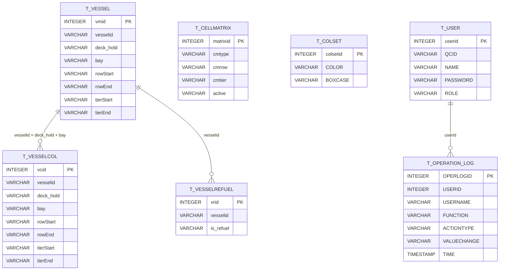
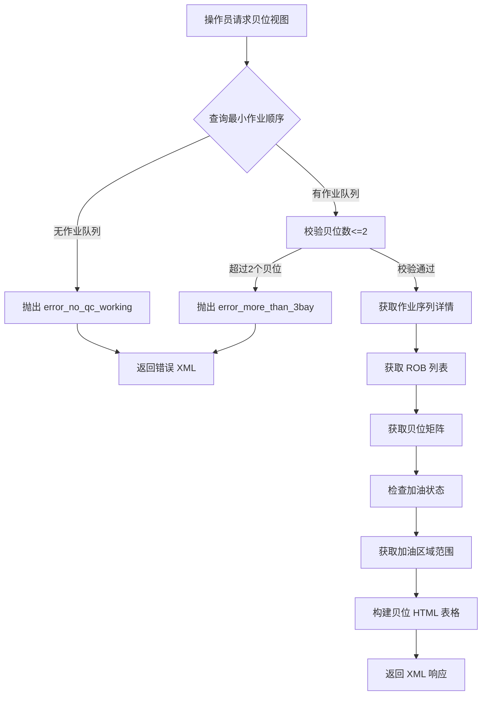

# 船舶作业上下文 Domain PRD

> 日期：2026-08-04
> 所属限界上下文：vessel-operations（核心域）
> 负责人：待产品确认

## 1. 领域定位与范围

### 1.1 领域定位
船舶作业上下文是岸桥集装箱装卸作业的核心业务能力，负责管理船舶贝位配置、集装箱单元格矩阵、颜色编码规则及加油状态。该域为岸桥操作员提供实时的贝位可视化界面，支持卸船（DISCH）和装船（LOAD）两种作业模式，通过查询外部 N4 系统获取作业队列信息，并结合本地配置的船舶贝位结构、加油区域、颜色规则等数据，生成动态的贝位网格视图。

**上下游关系**：
- **上游依赖**：N4 系统（MN4O_QC_* 系列表）提供作业队列、集装箱位置、设备信息等实时数据
- **下游服务**：岸桥操作终端通过 XML 接口获取贝位可视化数据
- **内部依赖**：用户管理域（User）、操作日志域（OperationLog）

### 1.2 业务目标
- **目标1**：为岸桥操作员提供准确的贝位可视化视图，支持卸船/装船作业的实时监控
- **目标2**：管理船舶贝位结构配置（甲板/舱内行列层范围），确保贝位网格与实际船舶匹配
- **目标3**：配置加油区域（Refuel Zone），在贝位视图中高亮显示需要加油的集装箱位置
- **目标4**：管理颜色编码规则（ColSet），根据箱型（boxcase）定义不同的显示颜色
- **目标5**：支持多吊具作业模式（单吊、双吊、 tandem、quad）的贝位展示
- **目标6**：记录关键配置变更的操作审计日志，满足合规要求

### 1.3 范围内 / 范围外 / TBD

| 范围内 | 范围外 |
|--------|--------|
| 船舶贝位配置管理（Vessel） | 船舶调度与靠泊计划 |
| 加油区域配置管理（VesselCol + VesselRefuel） | 集装箱配载优化算法 |
| 颜色编码规则管理（ColSet） | N4 系统作业队列生成逻辑 |
| 贝位矩阵模板管理（CellMatrix） | 岸桥设备控制与自动化 |
| 贝位尺寸配置（BaySize） | 集装箱库存管理 |
| 岸桥贝位查询接口（BusiQuery） | 码头堆场管理 |
| 操作审计日志记录 | 危险品申报与审批流程 |

**TBD（待确认）**：
- 危险品标识（is_dg）功能当前被注释禁用（FIR-TMT-000005），是否需要重新启用？
- Cell 实体中部分字段被注释（deck_hold, qcid, vesselid, createuser, createtime），这些字段是否仍在使用？
- BaySize 更新后是否需要通知其他系统或触发缓存刷新？

## 2. 角色、权限与使用场景

### 2.1 用户角色

| 角色 | 职责 | 主要场景 | 可执行动作 |
|------|------|----------|------------|
| 系统管理员 | 管理船舶贝位配置、加油区域、颜色规则 | 新船到港前配置贝位结构；调整加油区域；维护颜色编码 | 新增/修改/删除船舶配置；新增/修改/删除加油区域；新增/修改/删除颜色规则；更新贝位尺寸 |
| 岸桥操作员 | 查看贝位视图，执行装卸作业 | 卸船作业时查看待卸集装箱位置；装船作业时查看已装集装箱状态 | 通过 QC ID 查询贝位视图；查看剩余集装箱数量；查看加油状态 |
| 值班主管 | 监控作业进度，审核配置变更 | 检查作业队列是否正常；审核贝位配置变更 | 查看所有船舶配置；查看操作日志 |

### 2.2 权限模型
- **功能权限**：
  - 所有登录用户均可访问贝位查询接口（BusiQuery）
  - 船舶配置管理（Vessel Manager）：需登录且具有相应角色
  - 加油区域配置（Vessel Refuel Configuration）：需登录
  - 颜色配置（Color Configuration）：需登录
  - 贝位尺寸配置（Vessel Bay Configuration）：需登录
- **审批权限**：无审批流程，配置变更直接生效
- **数据可见性**：
  - 贝位查询：所有用户可见（基于 QC ID）
  - 配置管理：所有登录用户可见全部数据（无行级权限控制）
  - 操作日志：记录操作用户 ID 和用户名，但无专门的日志查询界面

**缺失或风险点**：
- 未实现细粒度的角色权限控制（User 实体有 role 字段但未在代码中使用）
- 配置删除操作无二次确认机制
- 操作日志仅记录增删改，未记录查询操作

## 3. 能力地图

| 能力域 | 能力 | 业务目的 | 用户入口 | 服务入口 | 关键数据 | 备注 |
|--------|------|----------|----------|----------|----------|------|
| 船舶贝位配置 | 新增船舶贝位配置 | 为新到港船舶定义贝位结构 | vesselDetail | POST /user/saveVessel | vesselid, deck_hold, bay, rowStart, rowEnd, tierStart, tierEnd | 校验 vesselid+deck_hold+bay 唯一性 |
| 船舶贝位配置 | 修改船舶贝位配置 | 调整现有船舶的贝位范围 | updateVessel | POST /user/updateVessel | id, vesselid, deck_hold, bay, rowStart, rowEnd, tierStart, tierEnd | 校验 vesselid+deck_hold+bay 唯一性（排除自身） |
| 船舶贝位配置 | 删除船舶贝位配置 | 移除无效或过期的配置 | vesselManage | GET /user/delVessel | id | 无级联删除保护 |
| 船舶贝位配置 | 查询船舶列表 | 浏览所有船舶配置 | vesselManage | GET /user/allVessel | offset, pager.offset | 分页查询，每页 10 条 |
| 船舶贝位配置 | 搜索船舶 | 按关键字搜索船舶配置 | vesselManage | GET /user/searchVessel | key, offset | 支持 vesselid/deck_hold/bay 模糊搜索 |
| 加油区域配置 | 新增加油区域 | 定义船舶特定贝位的加油范围 | vesselColorDetail | POST /user/saveVesselCol | vesselid, deck_hold, bay, rowStart, rowEnd, tierStart, tierEnd | tierStart/tierEnd 可为空，表示整列加油 |
| 加油区域配置 | 修改加油区域 | 调整加油区域范围 | vesselColorDetail | POST /user/saveVesselCol | id, vesselid, deck_hold, bay, rowStart, rowEnd, tierStart, tierEnd | 根据 id 判断新增或更新 |
| 加油区域配置 | 删除加油区域 | 移除无效的加油区域配置 | vesselColorManage | GET /user/delVesselCol | id | 记录操作日志 |
| 加油区域配置 | 查询加油区域列表 | 浏览所有加油区域配置 | vesselColorManage | GET /user/allVesselCol | offset | 分页查询 |
| 加油区域配置 | 搜索加油区域 | 按关键字搜索加油区域 | vesselColorManage | GET /user/searchVesselColor | key, offset | 支持 vesselid/deck_hold/bay 模糊搜索 |
| 加油状态管理 | 设置船舶加油状态 | 标记船舶是否需要加油 | vesselRefuelDetail | POST /user/updateVesselRefuelStatus | vesselid, is_refuel, id | is_refuel 值为 "Yes" 或 "No" |
| 加油状态管理 | 查询加油状态列表 | 浏览所有船舶加油状态 | vesselRefuelManage | GET /user/allVesselRefuel | offset | 分页查询 |
| 加油状态管理 | 搜索加油状态 | 按关键字搜索加油状态 | vesselRefuelManage | GET /user/searchVesselRefuel | key, offset | 支持 vesselid/is_refuel 模糊搜索 |
| 颜色编码管理 | 新增颜色规则 | 定义箱型对应的显示颜色 | colSetDetail | POST /user/saveColSet | boxcase, color | 校验 boxcase 唯一性 |
| 颜色编码管理 | 修改颜色规则 | 调整箱型的显示颜色 | updateColSet | POST /user/updateColSet | id, color | 仅允许修改 color 字段 |
| 颜色编码管理 | 删除颜色规则 | 移除无效的颜色规则 | colorManage | GET /user/delColSet | id | 无级联删除保护 |
| 颜色编码管理 | 查询颜色规则列表 | 浏览所有颜色规则 | colorManage | GET /user/allColSet | offset | 分页查询 |
| 贝位尺寸配置 | 查看贝位尺寸 | 查看当前甲板/舱内的最大行列数 | setbaysize | GET /user/setbay | — | 从 CellMatrix 聚合计算 |
| 贝位尺寸配置 | 更新贝位尺寸 | 调整贝位矩阵的激活范围 | setbaysize | POST /user/updateBay | deckRows, deckTiers, holdRows, holdTiers | 更新 CellMatrix 的 active 标志和 cmtier |
| 岸桥贝位查询 | 查询贝位视图 | 获取指定岸桥的实时贝位网格 | — | GET /user/BusiQuery | qcNum | 返回 XML 格式的贝位 HTML 表格 |

## 4. 数据模型

### 4.1 表字段说明

#### T_Vessel（船舶贝位配置）

| 字段 | 类型 | 约束 | 说明 | 业务影响 |
|------|------|------|------|----------|
| vmid | INTEGER | PK, SEQUENCE (vessel_seq) | 主键 ID | 唯一标识船舶贝位配置记录 |
| vesselid | VARCHAR(10) | NOT NULL | 船舶 ID | 与 N4 系统中的船舶名称关联，用于查询作业队列 |
| deck_hold | VARCHAR(10) | NOT NULL | 甲板/舱内标识 | "A" 表示甲板（Deck），"B" 表示舱内（Hold），决定贝位层的计算规则 |
| bay | VARCHAR(10) | NOT NULL | 贝位号 | 如 "17H"、"33"，与 deck_hold 组合唯一标识一个贝位区域 |
| rowStart | VARCHAR(10) | — | 起始行号 | 定义该贝位区域的行范围起点，如 "1" |
| rowEnd | VARCHAR(10) | — | 结束行号 | 定义该贝位区域的行范围终点，如 "19" |
| tierStart | VARCHAR(10) | — | 起始层号 | 定义该贝位区域的层范围起点，如 "82" |
| tierEnd | VARCHAR(10) | — | 结束层号 | 定义该贝位区域的层范围终点，如 "90" |

**业务规则**：
- vesselid + deck_hold + bay 组合必须唯一（在保存/更新时校验）
- rowStart/rowEnd/tierStart/tierEnd 定义贝位的有效范围，用于过滤 CellMatrix 数据

#### T_VESSELCOL（加油区域配置）

| 字段 | 类型 | 约束 | 说明 | 业务影响 |
|------|------|------|------|----------|
| vcid | INTEGER | PK, SEQUENCE (vesselCol_seq) | 主键 ID | 唯一标识加油区域配置记录 |
| vesselid | VARCHAR(10) | NOT NULL | 船舶 ID | 关联到 T_Vessel.vesselid |
| deck_hold | VARCHAR(10) | NOT NULL | 甲板/舱内标识 | "A" 或 "B"，与贝位配置一致 |
| bay | VARCHAR(10) | NOT NULL | 贝位号 | 如 "17H"、"33" |
| rowStart | VARCHAR(10) | NOT NULL | 起始行号 | 加油区域的行范围起点 |
| rowEnd | VARCHAR(10) | NOT NULL | 结束行号 | 加油区域的行范围终点 |
| tierStart | VARCHAR(10) | — | 起始层号 | 可选，为空时表示整列加油（blank+row） |
| tierEnd | VARCHAR(10) | — | 结束层号 | 可选，与 tierStart 配合定义层范围 |

**业务规则**：
- rowStart/rowEnd 必须为数字，且 rowStart <= rowEnd
- tierStart/tierEnd 可选，若存在则必须为数字，且 tierStart <= tierEnd
- 加油区域按行步长 2、层步长 2 生成具体单元格坐标（如 "0201" 表示层 02 行 01）

#### T_VesselRefuel（船舶加油状态）

| 字段 | 类型 | 约束 | 说明 | 业务影响 |
|------|------|------|------|----------|
| vrid | INTEGER | PK, SEQUENCE (vesselRefuel_seq) | 主键 ID | 唯一标识船舶加油状态记录 |
| vesselid | VARCHAR(10) | NOT NULL | 船舶 ID | 关联到 T_Vessel.vesselid |
| is_refuel | VARCHAR(5) | NOT NULL | 加油状态 | "Yes" 表示需要加油，"No" 表示不需要 |

**业务规则**：
- 同一 vesselid 可能存在多条记录，查询时只要有一条 is_refuel="Yes" 即判定为需要加油
- 在贝位视图中，若船舶需要加油，会显示 `<isRef>Yes</isRef>` 标签

#### CELL（单元格基础数据，疑似废弃）

| 字段 | 类型 | 约束 | 说明 | 业务影响 |
|------|------|------|------|----------|
| ID | INTEGER | PK, IDENTITY | 主键 ID | 唯一标识单元格记录 |
| bay | VARCHAR(10) | — | 贝位号 | 如 "17H" |
| row | VARCHAR(10) | — | 行号 | 如 "01"、"03" |
| tier | VARCHAR(10) | — | 层号 | 如 "82"、"84" |
| cellinfo | VARCHAR(10) | — | 单元格信息 | 存储单元格的特殊标识 |
| type | VARCHAR(10) | — | 类型 | 用途不明确 |

**注意**：该实体在代码中未被实际使用，大部分字段被注释，可能是历史遗留表。

#### T_CELLMATRIX（贝位矩阵模板）

| 字段 | 类型 | 约束 | 说明 | 业务影响 |
|------|------|------|------|----------|
| matrixid | INTEGER | PK, IDENTITY | 主键 ID | 唯一标识贝位矩阵记录 |
| cmtype | VARCHAR(4) | NOT NULL | 类型 | "A" 表示甲板，"B" 表示舱内 |
| cmrow | VARCHAR(4) | NOT NULL | 行号 | 如 "01"、"03"、"05" |
| cmtier | VARCHAR(4) | NOT NULL | 层号 | 如 "00"、"02"、"82" |
| active | VARCHAR(2) | NOT NULL | 激活标志 | "1" 表示激活，"0" 表示停用，控制贝位视图的显示范围 |
| tierStart | — | @Transient | 起始层号（非持久化） | 用于运行时计算，不存入数据库 |
| tierEnd | — | @Transient | 结束层号（非持久化） | 用于运行时计算，不存入数据库 |

**业务规则**：
- cmtype + cmrow + cmtier 组合唯一标识一个单元格位置
- active="1" 的记录才会出现在贝位视图中
- 通过 BaySize 配置批量更新 active 标志和 cmtier 值

#### T_COLSET（颜色编码规则）

| 字段 | 类型 | 约束 | 说明 | 业务影响 |
|------|------|------|------|----------|
| colsetid | INTEGER | PK, SEQUENCE (colset_seq) | 主键 ID | 唯一标识颜色规则记录 |
| COLOR | VARCHAR(15) | NOT NULL | 颜色值 | CSS 颜色值，如 "red"、"#FF0000" |
| BOXCASE | VARCHAR(10) | NOT NULL | 箱型标识 | 如 "20GP"、"40HC"，用于匹配集装箱类型 |

**业务规则**：
- BOXCASE 必须唯一，不允许重复
- 颜色值用于前端渲染不同箱型的显示颜色

#### BaySize（贝位尺寸，非持久化实体）

| 字段 | 类型 | 约束 | 说明 | 业务影响 |
|------|------|------|------|----------|
| deckRows | String | — | 甲板最大行数 | 从 T_CELLMATRIX 中 cmtype="A" 的最大 cmrow 计算得出 |
| deckTiers | String | — | 甲板最大层数 | 从 T_CELLMATRIX 中 cmtype="A" 的最大 cmtier 计算得出 |
| holdRows | String | — | 舱内最大行数 | 从 T_CELLMATRIX 中 cmtype="B" 的最大 cmrow 计算得出 |
| holdTiers | String | — | 舱内最大层数 | 从 T_CELLMATRIX 中 cmtype="B" 的最大 cmtier 计算得出 |

**业务规则**：
- 该实体仅用于前后端数据传输，不对应数据库表
- 更新 BaySize 时会批量更新 T_CELLMATRIX 的 active 标志

#### T_OPERATION_LOG（操作日志）

| 字段 | 类型 | 约束 | 说明 | 业务影响 |
|------|------|------|------|----------|
| OPERLOGID | INTEGER(7) | PK, SEQUENCE (operatorlog_seq) | 主键 ID | 唯一标识操作日志记录 |
| USERID | INTEGER(7) | NOT NULL | 用户 ID | 关联到 T_USER.userid |
| USERNAME | VARCHAR(20) | NOT NULL | 用户名 | 冗余存储，便于查询 |
| FUNCTION | VARCHAR(50) | NOT NULL | 功能模块 | 如 "Vessel Refuel Configuration"、"Color Configuration" |
| ACTIONTYPE | VARCHAR(10) | NOT NULL | 操作类型 | "Save"、"Update"、"Delete" |
| VALUECHANGE | VARCHAR(300) | — | 值变更 | 格式："旧值->新值"，删除时为 "旧值->null" |
| TIME | TIMESTAMP | NOT NULL | 操作时间 | 记录操作发生的时间戳 |

**业务规则**：
- 仅在删除加油区域、删除加油区域配置、新增/修改加油状态时记录日志
- 未记录船舶配置、颜色规则的变更日志

#### T_USER（用户）

| 字段 | 类型 | 约束 | 说明 | 业务影响 |
|------|------|------|------|----------|
| userid | INTEGER(7) | PK, SEQUENCE (user_seq) | 主键 ID | 唯一标识用户 |
| QCID | VARCHAR(20) | — | 岸桥 ID | 关联用户操作的岸桥编号 |
| NAME | VARCHAR(20) | NOT NULL | 用户名 | 登录用户名 |
| PASSWORD | VARCHAR(6) | NOT NULL | 密码 | 明文存储（安全风险） |
| ROLE | VARCHAR(10) | — | 角色 | 未在实际业务逻辑中使用 |
| PARENT | VARCHAR(10) | — | 创建者 | 记录创建该用户的用户 ID |
| CREATETIME | VARCHAR(14) | — | 创建时间 | 格式不明 |

### 4.2 数据模型关系图

### 4.3 关键数据约束

- **主键**：所有实体均使用序列（SEQUENCE）或自增（IDENTITY）生成主键
- **唯一约束**：
  - T_Vessel: vesselid + deck_hold + bay（应用层校验，非数据库约束）
  - T_COLSET: BOXCASE（应用层校验，非数据库约束）
- **外键或逻辑关联**：
  - T_VESSELCOL.vesselid → T_VESSEL.vesselid（逻辑关联，无外键约束）
  - T_VESSELREFUEL.vesselid → T_VESSEL.vesselid（逻辑关联，无外键约束）
  - T_OPERATION_LOG.USERID → T_USER.userid（逻辑关联，无外键约束）
- **默认值**：无显式默认值
- **状态字段**：
  - T_CELLMATRIX.active: "1" 激活 / "0" 停用
  - T_VESSELREFUEL.is_refuel: "Yes" / "No"
- **删除影响**：
  - 删除 T_Vessel 记录不会级联删除 T_VESSELCOL 或 T_VESSELREFUEL（可能导致孤儿数据）
  - 删除 T_COLSET 记录无级联保护
- **跨域引用影响**：
  - vesselid 作为关键关联字段，在多个表中出现，但无外键约束，需保证数据一致性由应用层维护

## 5. 核心业务流程

### 5.1 流程一：岸桥贝位查询（BusiQuery）

**触发条件**：岸桥操作员在终端输入 QC ID 或通过定时轮询触发
**参与角色**：岸桥操作员、系统

| 步骤 | 用户/系统动作 | 页面 | API / Service | 业务规则 | 数据变化 |
|------|---------------|------|---------------|----------|----------|
| 1 | 操作员请求贝位视图 | — | GET /user/BusiQuery?qcNum={qcNum} | qcNum 不能为空 | 无 |
| 2 | 系统查询最小作业顺序 | — | CellDao.getQorder(qcNum) | 同时查询卸船（DISCH）和装船（LOAD）的最小 qorder，选择较小的作为当前作业类型 | 无 |
| 3 | 系统校验作业队列 | — | CellDao.checkSequenceList(hm) | 检查作业队列涉及的贝位数不超过 2 个，否则抛出 error_more_than_3bay | 无 |
| 4 | 系统获取作业序列详情 | — | CellDao.getSequenceList(hm) | 根据 qorder 和 qcNum 查询作业队列中的集装箱信息，包括位置、类型、状态等 | 无 |
| 5 | 系统获取 ROB（Remaining On Board）列表 | — | CellDao.getROBList(hm) | 查询船上剩余集装箱，区分 LOAD 和 DISCH 模式 | 无 |
| 6 | 系统获取贝位矩阵 | — | CellDao.getCellMatrixFromnN4(vesselid, bay, qdeck) | 优先从 N4 系统查询船舶贝位配置，若无则从 T_CELLMATRIX 查询 | 无 |
| 7 | 系统检查加油状态 | — | CellDao.getVesselVisitRefuelStatus(vesselid) | 查询 T_VesselRefuel，若存在 is_refuel="Yes" 的记录则标记为需要加油 | 无 |
| 8 | 系统获取加油区域范围 | — | CellDao.getRefuelRangeListByVesselId(vesselid, deckHold, bay) | 根据 T_VESSELCOL 配置生成加油单元格坐标列表 | 无 |
| 9 | 系统构建贝位 HTML 表格 | — | CellDao.buildBay(cellMatrixistList, hm) | 遍历贝位矩阵，根据作业序列、加油区域、箱型等信息生成 HTML 表格字符串 | 无 |
| 10 | 系统返回 XML 响应 | — | Busihandler.returnResponse() | 组装 XML 格式响应，包含贝位 HTML 表格、剩余集装箱数、加油状态等 | 无 |

**异常场景**

| 场景 | 系统行为 | 用户影响 |
|------|----------|----------|
| 无作业队列（error_no_qc_working） | 返回错误 XML，显示红色错误信息 | 操作员看到 "No QC working" 提示 |
| 数据库查询超时（db_query_time_out） | 捕获 RecoverableDataAccessException，返回错误 XML | 操作员看到 "Database query timeout" 提示 |
| 无法获取数据库连接（cannot_get_connection） | 捕获 CannotGetJdbcConnectionException，返回错误 XML | 操作员看到 "Cannot get database connection" 提示 |
| 贝位数超过 2 个（error_more_than_3bay） | 抛出 GeneralException，返回错误 XML | 操作员看到 "More than 3 bays" 提示 |
| 贝位号非整数（error_bay_number_integer） | 抛出 GeneralException，返回错误 XML | 操作员看到 "Bay number is not integer" 提示 |

### 5.2 流程二：船舶贝位配置管理

**触发条件**：系统管理员需要为新到港船舶配置贝位结构
**参与角色**：系统管理员

| 步骤 | 用户/系统动作 | 页面 | API / Service | 业务规则 | 数据变化 |
|------|---------------|------|---------------|----------|----------|
| 1 | 管理员进入船舶配置列表 | vesselManage | GET /user/allVessel | 分页查询所有船舶配置，每页 10 条 | 无 |
| 2 | 管理员点击"新增"按钮 | vesselDetail | GET /user/addVessel | 显示空白表单 | 无 |
| 3 | 管理员填写船舶信息 | vesselDetail | — | 输入 vesselid、deck_hold、bay、rowStart、rowEnd、tierStart、tierEnd | 无 |
| 4 | 管理员提交表单 | — | POST /user/saveVessel | 校验 vesselid+deck_hold+bay 唯一性 | 新增 T_Vessel 记录 |
| 5 | 系统校验唯一性 | — | VesselDao.getVesselByCondition() | 若已存在相同 vesselid+deck_hold+bay 的记录，返回错误 | 无 |
| 6 | 系统保存配置 | — | VesselDao.saveOrUpdateVessel() | 调用 Hibernate saveOrUpdate | 插入 T_Vessel 记录 |
| 7 | 系统重定向到列表页 | vesselManage | redirect:/user/allVessel.html | — | 无 |

**修改流程**类似，区别在于：
- 步骤 2：点击"修改"按钮，传入 vessel id
- 步骤 4：POST /user/updateVessel
- 步骤 5：校验时需排除当前记录（通过 id 区分）

**删除流程**：
- GET /user/delVessel?id={id}
- 直接删除 T_Vessel 记录，无二次确认，无级联保护

### 5.3 流程三：加油区域配置管理

**触发条件**：系统管理员需要为船舶配置加油区域
**参与角色**：系统管理员

| 步骤 | 用户/系统动作 | 页面 | API / Service | 业务规则 | 数据变化 |
|------|---------------|------|---------------|----------|----------|
| 1 | 管理员进入加油区域列表 | vesselColorManage | GET /user/allVesselCol | 分页查询所有加油区域配置 | 无 |
| 2 | 管理员点击"新增"按钮 | vesselColorDetail | GET /user/addVesselCol | 显示空白表单 | 无 |
| 3 | 管理员填写加油区域信息 | vesselColorDetail | — | 输入 vesselid、deck_hold、bay、rowStart、rowEnd、tierStart（可选）、tierEnd（可选） | 无 |
| 4 | 管理员提交表单 | — | POST /user/saveVesselCol | 根据 id 参数判断新增或更新 | 新增或更新 T_VESSELCOL 记录 |
| 5 | 系统保存配置 | — | VesselDao.saveOrUpdateVesselCol() | 调用 Hibernate saveOrUpdate | 插入或更新 T_VESSELCOL 记录 |
| 6 | 系统记录操作日志 | — | VesselDao.saveOperationLog() | 记录 Function=VESSEL_REFUEL_BAY_ROW_CONFIGURATION, ActionType=SAVE/UPDATE | 新增 T_OPERATION_LOG 记录 |
| 7 | 系统重定向到列表页 | vesselColorManage | redirect:/user/allVesselCol.html | — | 无 |

**删除流程**：
- GET /user/delVesselCol?id={id}
- 删除 T_VESSELCOL 记录
- 记录操作日志（ActionType=DELETE）

### 5.4 流程四：加油状态管理

**触发条件**：系统管理员需要标记船舶是否需要加油
**参与角色**：系统管理员

| 步骤 | 用户/系统动作 | 页面 | API / Service | 业务规则 | 数据变化 |
|------|---------------|------|---------------|----------|----------|
| 1 | 管理员进入加油状态列表 | vesselRefuelManage | GET /user/allVesselRefuel | 分页查询所有船舶加油状态 | 无 |
| 2 | 管理员点击"新增"或"修改"按钮 | vesselRefuelDetail | GET /user/addVesselRefuel 或 /user/modifyVesselRefuel | 显示表单，修改时加载现有数据 | 无 |
| 3 | 管理员填写加油状态 | vesselRefuelDetail | — | 输入 vesselid、is_refuel（Yes/No） | 无 |
| 4 | 管理员提交表单 | — | POST /user/updateVesselRefuelStatus | 根据 id 参数判断新增或更新 | 新增或更新 T_VesselRefuel 记录 |
| 5 | 系统保存配置 | — | VesselDao.saveOrUpdateVesselRefuel() | 调用 Hibernate saveOrUpdate | 插入或更新 T_VesselRefuel 记录 |
| 6 | 系统记录操作日志 | — | VesselDao.saveOperationLog() | 记录 Function=VESSEL_REFUEL_CONFIGURATION, ActionType=SAVE/UPDATE | 新增 T_OPERATION_LOG 记录 |
| 7 | 系统重定向到列表页 | vesselRefuelManage | redirect:/user/allVesselRefuel.html | — | 无 |

**删除流程**：
- GET /user/delVesselRefuel?id={id}
- 删除 T_VesselRefuel 记录
- 记录操作日志（ActionType=DELETE）

### 5.5 流程五：颜色编码规则管理

**触发条件**：系统管理员需要定义箱型对应的显示颜色
**参与角色**：系统管理员

| 步骤 | 用户/系统动作 | 页面 | API / Service | 业务规则 | 数据变化 |
|------|---------------|------|---------------|----------|----------|
| 1 | 管理员进入颜色规则列表 | colorManage | GET /user/allColSet | 分页查询所有颜色规则 | 无 |
| 2 | 管理员点击"新增"按钮 | colSetDetail | GET /user/addColor | 显示空白表单 | 无 |
| 3 | 管理员填写颜色规则 | colSetDetail | — | 输入 boxcase、color | 无 |
| 4 | 管理员提交表单 | — | POST /user/saveColSet | 校验 boxcase 唯一性 | 新增 T_COLSET 记录 |
| 5 | 系统校验唯一性 | — | CellDao.getColSetByBoxcase() | 若已存在相同 boxcase 的记录，返回错误 | 无 |
| 6 | 系统保存配置 | — | CellDao.saveOrUpdateColSet() | 调用 Hibernate saveOrUpdate | 插入 T_COLSET 记录 |
| 7 | 系统重定向到列表页 | colorManage | redirect:/user/allColSet.html | — | 无 |

**修改流程**：
- GET /user/modifyColSet?id={id} 加载现有数据
- POST /user/updateColSet 仅允许修改 color 字段

**删除流程**：
- GET /user/delColSet?id={id}
- 直接删除 T_COLSET 记录，无二次确认，无操作日志

### 5.6 流程六：贝位尺寸配置

**触发条件**：系统管理员需要调整贝位矩阵的激活范围
**参与角色**：系统管理员

| 步骤 | 用户/系统动作 | 页面 | API / Service | 业务规则 | 数据变化 |
|------|---------------|------|---------------|----------|----------|
| 1 | 管理员进入贝位尺寸配置页 | setbaysize | GET /user/setbay | 从 T_CELLMATRIX 聚合计算当前 deckRows、deckTiers、holdRows、holdTiers | 无 |
| 2 | 管理员修改尺寸参数 | setbaysize | — | 输入 deckRows、deckTiers、holdRows、holdTiers | 无 |
| 3 | 管理员提交表单 | — | POST /user/updateBay | 校验参数合法性 | 无 |
| 4 | 系统更新贝位矩阵 | — | CellDao.updateCellMatrix(baySize) | 批量更新 T_CELLMATRIX 的 active 标志和 cmtier 值 | 更新 T_CELLMATRIX 记录 |
| 5 | 系统重定向到贝位列表页 | — | redirect:/user/all.html | — | 无 |

**更新逻辑**：
- 对于 cmtype="A"（甲板）：将 cmrow < deckRows 的记录设置为 active="1"，cmtier = deckTiers - 1；将 cmrow >= deckRows 的记录设置为 active="0"
- 对于 cmtype="B"（舱内）：将 cmrow < holdRows 的记录设置为 active="1"，cmtier = holdTiers - 1；将 cmrow >= holdRows 的记录设置为 active="0"

## 6. 后台机制

| 机制 | 业务作用 | 触发时机 | 影响 |
|------|----------|----------|------|
| 会话存储 | 维护登录状态和用户信息 | 用户登录时写入 HttpSession | 重启后丢失，无持久化会话 |
| 操作审计日志 | 记录关键配置变更 | 删除加油区域、删除加油区域配置、新增/修改加油状态时 | 写入 T_OPERATION_LOG 表，用于追溯操作历史 |
| 贝位矩阵缓存 | 缓存 CellMatrix 数据 | CellDaoImpl.cellMatrixHM 静态 HashMap | 应用重启后丢失，可能导致首次查询性能下降 |
| IP 地址解析 | 记录操作来源 IP | BusiQuery 接口检测到 log 变化时 | 多层代理环境下可能获取不到真实 IP |
| 事务管理 | 保证数据一致性 | 所有写操作（save/update/delete） | 使用 Spring @Transactional，传播级别为 REQUIRED 或 SUPPORTS |

**未发现以下机制**：
- 定时任务
- 异步事件队列
- 消息队列
- 分布式锁
- 文件处理
- 导入导出
- 外部回调

## 7. 集成与依赖

### 7.1 内部域依赖

| 对象 | 交互方式 | 依赖内容 | 失败影响 |
|------|----------|----------|----------|
| 用户管理域（User） | 会话读取 | 从 HttpSession 获取当前登录用户信息，用于记录操作日志 | 若用户未登录，操作日志中的 userid 和 username 为 null |
| 操作日志域（OperationLog） | DAO 调用 | VesselDao.saveOperationLog() 记录配置变更 | 日志记录失败不影响主业务流程，仅打印堆栈 |

### 7.2 外部系统依赖

| 对象 | 交互方式 | 依赖内容 | 失败影响 |
|------|----------|----------|----------|
| N4 系统（MN4O_QC_* 表） | JDBC 直接查询 | 查询作业队列（inv_wq、inv_wi）、集装箱位置（inv_unit_fcy_visit）、设备信息（ref_equipment）、船舶访问（argo_carrier_visit）等 | 查询超时返回 db_query_time_out 错误；连接失败返回 cannot_get_connection 错误；数据不存在返回 error_no_qc_working 错误 |

**N4 系统关键表**：
- MN4O_QC_inv_wq：作业队列
- MN4O_QC_inv_wi：作业项
- MN4O_QC_inv_unit_fcy_visit：集装箱设施访问记录
- MN4O_QC_inv_unit_yrd_visit：集装箱堆场访问记录
- MN4O_QC_inv_unit：集装箱单元
- MN4O_QC_xps_craneshift：岸桥移位
- MN4O_QC_xps_pointofwork：工作点
- MN4O_QC_ref_equipment：设备参考
- MN4O_QC_inv_goods：货物信息
- MN4O_QC_argo_carrier_visit：船舶访问
- MN4O_QC_vsl_vsl_visit_details：船舶访问详情
- MN4O_QC_vsl_vessels：船舶信息

### 7.3 基础设施依赖

| 对象 | 交互方式 | 依赖内容 | 失败影响 |
|------|----------|----------|----------|
| Oracle 数据库 | JDBC/Hibernate | 存储所有业务数据（T_Vessel、T_VESSELCOL、T_VesselRefuel、T_CELLMATRIX、T_COLSET、T_OPERATION_LOG、T_USER） | 连接失败导致所有读写操作失败，返回 cannot_get_connection 错误 |
| Hibernate ORM | 框架集成 | 对象关系映射、事务管理、查询封装 | 配置错误导致启动失败；HQL 语法错误导致运行时异常 |
| Spring Framework | 框架集成 | IoC 容器、事务管理、MVC 控制器 | 配置错误导致启动失败 |

## 8. 非功能要求

### 8.1 安全
- **密码存储**：T_USER.PASSWORD 字段长度为 6，疑似明文存储，存在严重安全风险
- **SQL 注入风险**：部分 SQL 拼接使用字符串拼接（如 `iq.qorder='" + qorder + "'`），存在 SQL 注入风险
- **权限控制缺失**：User 实体的 role 字段未在业务逻辑中使用，所有登录用户具有相同权限
- **操作审计不完整**：仅记录部分配置的增删改操作，未记录查询操作和船舶配置变更

### 8.2 可用性
- **单进程架构**：基于 Spring MVC + Hibernate 的传统单体应用，无集群部署支持
- **会话持久化**：使用 HttpSession 存储用户信息，应用重启后会话丢失
- **故障恢复**：数据库查询超时和连接失败有异常处理，返回友好错误信息，但无自动重试机制
- **缓存失效**：CellMatrix 数据缓存在静态 HashMap 中，应用重启后丢失，可能导致首次查询性能下降

### 8.3 数据一致性
- **事务管理**：使用 Spring @Transactional 注解，写操作传播级别为 REQUIRED，读操作为 SUPPORTS
- **级联操作**：删除 T_Vessel 记录不会级联删除 T_VESSELCOL 和 T_VESSELREFUEL，可能导致孤儿数据
- **并发控制**：无显式并发控制机制，依赖数据库行锁
- **唯一性校验**：vesselid+deck_hold+bay 和 boxcase 的唯一性在应用层校验，非数据库约束，存在竞态条件风险

### 8.4 审计
- **操作日志**：T_OPERATION_LOG 表记录关键配置变更，包含用户 ID、用户名、功能模块、操作类型、值变更、时间戳
- **日志覆盖范围**：仅覆盖加油区域配置的增删改、加油状态的增删改，未覆盖船舶配置、颜色规则的变更
- **日志查询**：无专门的日志查询界面，仅通过数据库直接查询

## 9. 风险与待确认

| 类型 | 描述 | 影响 | 建议 |
|------|------|------|------|
| 安全风险 | 密码明文存储（VARCHAR(6)） | 用户凭证泄露风险极高 | 立即实施密码加密存储（如 BCrypt），增加密码长度限制 |
| 安全风险 | SQL 注入风险（字符串拼接） | 可能被恶意利用执行任意 SQL | 改用参数化查询（PreparedStatement）或 Hibernate 命名参数 |
| 权限缺口 | role 字段未使用，无细粒度权限控制 | 所有登录用户具有相同权限，无法实现职责分离 | 基于 role 字段实现 RBAC 权限模型 |
| 数据一致性风险 | 唯一性校验在应用层，非数据库约束 | 并发场景下可能产生重复数据 | 在数据库层面添加 UNIQUE 约束 |
| 数据一致性风险 | 删除 T_Vessel 无级联保护 | 产生孤儿数据（T_VESSELCOL、T_VESSELREFUEL） | 添加级联删除或软删除机制 |
| 删除影响不明确 | 删除 T_COLSET 无二次确认和操作日志 | 误删除后无法追溯和恢复 | 添加二次确认机制和操作日志记录 |
| 代码缺陷 | Cell 实体大部分字段被注释，疑似废弃 | 可能造成混淆和维护困难 | 确认是否可删除该实体及相关代码 |
| 代码缺陷 | 危险品标识功能被注释禁用（FIR-TMT-000005） | 无法显示危险品集装箱标识 | 确认是否需要重新启用该功能 |
| 产品行为待确认 | BaySize 更新后是否需要通知其他系统 | 可能导致其他系统使用过期的贝位尺寸 | 确认是否需要发布事件或调用回调 |
| 产品行为待确认 | CellMatrix 缓存策略 | 静态 HashMap 缓存无失效机制，可能导致数据不一致 | 确认是否需要引入缓存失效策略或改用分布式缓存 |

## 10. 相关文档索引

| 类型 | 文档 | 说明 |
|------|------|------|
| Service | CellControl | 船舶作业相关的 Web 控制器，处理 HTTP 请求 |
| Service | CellDao / CellDaoImpl | 贝位矩阵、颜色规则、贝位尺寸的数据访问层 |
| Service | VesselDao / VesselDaoImpl | 船舶配置、加油区域、加油状态的数据访问层 |
| Service | Busihandler | 岸桥贝位查询的业务处理器，生成 XML 响应 |
| Entity | Vessel | 船舶贝位配置实体 |
| Entity | VesselCol | 加油区域配置实体 |
| Entity | VesselRefuel | 船舶加油状态实体 |
| Entity | CellMatrix | 贝位矩阵模板实体 |
| Entity | ColSet | 颜色编码规则实体 |
| Entity | BaySize | 贝位尺寸 DTO（非持久化） |
| Entity | OperationLog | 操作日志实体 |
| Entity | User | 用户实体 |
