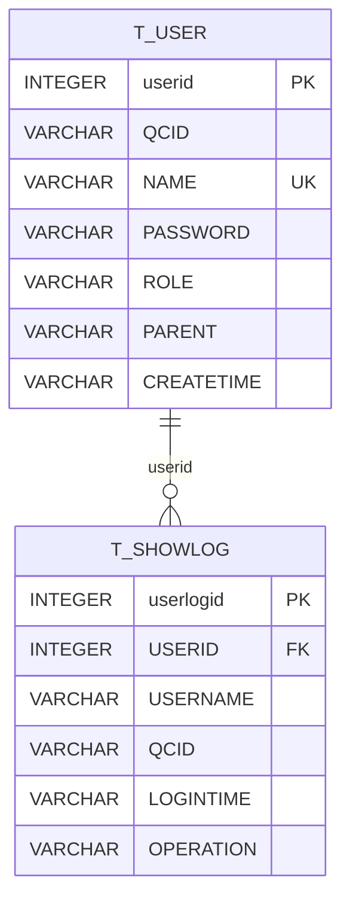
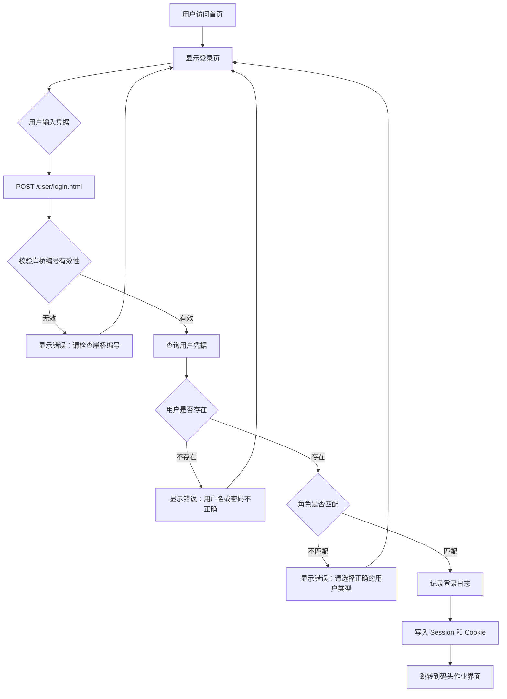
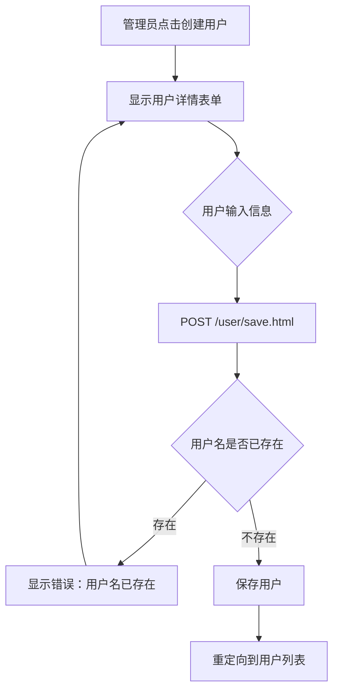
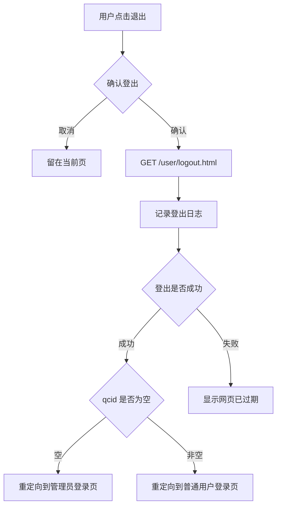

# 用户身份域 PRD

> 日期：2026-08-04
> 所属限界上下文：用户身份上下文（支撑域）
> 负责人：待产品确认

## 1. 领域定位与范围

### 1.1 领域定位
用户身份域负责管理系统的用户认证、授权和会话管理。作为码头操作系统（QCVMT）的支撑域，该域为所有业务模块提供统一的身份验证能力，确保只有合法用户才能访问系统功能。

**核心职责**：
- 用户注册与账户管理（由管理员创建）
- 用户登录认证（支持普通用户和管理员两种角色）
- 岸桥编号（QC/HC/C）分配与验证
- 会话管理与安全拦截
- 操作日志记录（登录/登出审计）
- 多语言支持（繁体中文、简体中文、英文）

**上下游关系**：
- **上游**：无外部依赖，作为系统入口层
- **下游**：为码头作业模块（tqcvmt）、船舶管理模块、颜色配置模块等提供用户身份信息和权限控制

### 1.2 业务目标
- **目标1**：确保只有经过认证的用户才能访问码头操作系统，防止未授权访问
- **目标2**：区分普通用户（USER）和管理员（ADMIN）角色，实现基于角色的权限控制
- **目标3**：为普通用户绑定岸桥设备编号（QC/HC/C），确保用户只能操作其被授权的岸桥
- **目标4**：记录用户登录/登出操作日志，满足审计追溯要求
- **目标5**：支持多语言界面切换，适应国际化作业环境
- **目标6**：通过 Cookie 记忆用户偏好的岸桥编号，提升重复登录效率

### 1.3 范围内 / 范围外 / TBD

| 范围内 | 范围外 |
|--------|--------|
| 用户登录认证（用户名+密码） | 用户自助注册（仅管理员可创建用户） |
| 用户账户增删改查（管理员操作） | 密码找回/重置功能 |
| 角色管理（USER/ADMIN） | 细粒度权限控制（如菜单级权限） |
| 岸桥编号分配与验证 | 多因素认证（MFA） |
| 会话管理与安全拦截 | OAuth/SAML 等第三方认证集成 |
| 登录/登出日志记录 | 用户个人资料管理（头像、联系方式等） |
| 操作日志导出（按时间范围） | 用户活跃度分析报表 |
| 多语言切换（zh_TW/zh_CN/en） | 单点登录（SSO） |

**TBD（待确认）**：
- 密码复杂度策略（当前代码中密码长度限制为6位，是否需加强？）
- 账户锁定策略（连续登录失败后是否锁定账户？）
- 会话超时时间配置（Cookie 有效期从配置文件读取，具体值待确认）
- 管理员账户是否有特殊保护机制（如默认 admin/admin 是否应禁用？）

## 2. 角色、权限与使用场景

### 2.1 用户角色

| 角色 | 职责 | 主要场景 | 可执行动作 |
|------|------|----------|------------|
| 普通用户（USER） | 码头作业人员，负责特定岸桥的作业操作 | 日常登录系统进行码头作业 | 1. 登录系统并选择岸桥编号（QC/HC/C） 2. 访问码头作业界面（tqcvmt） 3. 查看个人操作日志 4. 切换界面语言 |
| 管理员（ADMIN） | 系统管理人员，负责用户管理和系统配置 | 用户账户管理、系统配置、日志审计 | 1. 登录管理后台 2. 创建新用户账户 3. 查看所有用户列表 4. 修改/删除用户账户 5. 查看任意用户的操作日志 6. 导出操作日志（按时间范围） 7. 访问系统配置页面（船舶配置、颜色配置等） |

### 2.2 权限模型

**功能权限**：

| 功能模块 | 普通用户（USER） | 管理员（ADMIN） |
|----------|------------------|-----------------|
| 登录系统 | ✓ | ✓ |
| 访问码头作业界面 | ✓ | ✗ |
| 创建用户 | ✗ | ✓ |
| 查看用户列表 | ✗ | ✓ |
| 修改用户信息 | ✗ | ✓ |
| 删除用户 | ✗ | ✓ |
| 查看个人日志 | ✓ | ✓ |
| 查看所有用户日志 | ✗ | ✓ |
| 导出日志 | ✗ | ✓ |
| 系统配置（船舶、颜色等） | ✗ | ✓ |

**审批权限**：无审批流程

### 2.3 数据可见性

- **普通用户**：
  - 仅可查看自己的操作日志
  - 无法查看其他用户信息
  - 登录后仅能访问与其绑定的岸桥相关功能

- **管理员**：
  - 可查看所有用户列表及详细信息
  - 可查看任意用户的操作日志
  - 可导出全系统操作日志

**缺失或风险点**：
- 密码以明文存储（User 实体中 password 字段无加密处理）
- 管理员默认账户（admin/admin）存在安全风险
- 无密码强度校验机制
- 无账户锁定机制，可能遭受暴力破解攻击

## 3. 能力地图

| 能力域 | 能力 | 业务目的 | 用户入口 | 服务入口 | 关键数据 | 备注 |
|--------|------|----------|----------|----------|----------|------|
| 认证管理 | 用户登录 | 验证用户身份并建立会话 | login.jsp / loginAdmin.jsp | POST /user/login.html | username, password, role, qc/hc/c | 普通用户需输入岸桥编号，管理员无需 |
| 认证管理 | 语言切换 | 支持多语言界面 | 登录页语言下拉框 | POST /user/changeLan.html | local (zh_TW/zh_CN/en) | 切换后重定向到对应登录页 |
| 认证管理 | 用户登出 | 终止会话并记录登出日志 | 各页面右上角退出按钮 | GET /user/logout.html | session 中的 USERINFO | 登出后根据角色重定向到不同登录页 |
| 用户管理 | 创建用户 | 管理员为新员工创建账户 | userDetail.jsp | GET /user/add.html → POST /user/save.html | username, qcid, role, password, parent, createtime | 需校验用户名唯一性，parent 记录创建者 |
| 用户管理 | 查看用户列表 | 管理员浏览所有用户账户 | admin.jsp | GET /user/all.html | User 列表（分页，每页10条） | 支持分页导航 |
| 用户管理 | 修改用户 | 管理员更新用户信息 | update.jsp | GET /user/modify.html → POST /user/update.html | id, username(只读), qcid, role, password | 用户名不可修改，其他字段可更新 |
| 用户管理 | 删除用户 | 管理员删除离职员工账户 | admin.jsp 中的删除链接 | GET /user/del.html?id={id} | user id | 删除用户时级联删除其操作日志 |
| 日志管理 | 查看操作日志 | 查看用户登录/登出记录 | log.jsp | GET /user/log.html?userid={id} | ShowLog 列表（分页，最近一个月） | 普通用户仅可查看自己的日志 |
| 日志管理 | 导出操作日志 | 按时间范围导出日志用于审计 | exportPage.jsp | GET /user/exportLogs.html?fromTime=&toTime= | ShowLog 列表（指定时间段） | 仅管理员可用，导出格式由 ExportHandler 决定 |
| 会话管理 | 安全拦截 | 防止未登录用户访问受保护页面 | SecurityInterceptor | 拦截 /user/* 路径（排除 login/index/logout/changeLan） | session 中的 USERINFO | 未登录则重定向到 index.jsp |
| 偏好管理 | 记住岸桥编号 | 通过 Cookie 记忆用户上次使用的岸桥编号 | 登录表单中的 QC/HC/C 输入框 | CookiesUtil 读写 Cookie | defQCNUM, defHCNUM, defCNUM | 仅对普通用户生效，Cookie 有效期从配置读取 |

## 4. 数据模型

### 4.1 表字段说明

**T_USER（用户表）**

| 字段 | 类型 | 约束 | 说明 | 业务影响 |
|------|------|------|------|----------|
| userid | INTEGER | PK, SEQUENCE(user_seq), length=7 | 用户唯一标识 | 被 ShowLog 等下游数据引用，删除用户时需级联删除日志 |
| QCID | VARCHAR(20) | NULLABLE | 岸桥编号（如 QC01、HC02、C03） | 普通用户登录时必须输入有效的岸桥编号，管理员可为空 |
| NAME | VARCHAR(20) | NOT NULL | 用户名（登录账号） | 登录凭据之一，必须唯一，长度不超过20字符 |
| PASSWORD | VARCHAR(6) | NOT NULL | 密码 | 登录凭据之一，**明文存储**，长度限制为6位（存在安全风险） |
| ROLE | VARCHAR(10) | NOT NULL | 角色（USER/ADMIN） | 决定用户权限范围和登录后跳转页面 |
| PARENT | VARCHAR(10) | NULLABLE | 创建者用户名 | 记录哪个管理员创建了该用户，用于审计追溯 |
| CREATETIME | VARCHAR(14) | NULLABLE | 创建时间（格式：yyyyMMddHHmmss） | 记录用户账户创建时间 |

**T_SHOWLOG（操作日志表）**

| 字段 | 类型 | 约束 | 说明 | 业务影响 |
|------|------|------|------|----------|
| userlogid | INTEGER | PK, SEQUENCE(log_seq), length=7 | 日志唯一标识 | 自增主键 |
| USERID | INTEGER | NOT NULL, FK→T_USER.userid | 用户ID | 关联到具体用户，删除用户时级联删除 |
| USERNAME | VARCHAR(20) | NOT NULL | 用户名（冗余字段） | 便于查询时直接显示用户名，避免关联查询 |
| QCID | VARCHAR(20) | NULLABLE | 岸桥编号 | 记录操作时的岸桥编号，管理员登录时为空 |
| LOGINTIME | VARCHAR(20) | NOT NULL | 操作时间（格式：yyyyMMddHHmmss） | 用于日志排序和时间范围查询 |
| OPERATION | VARCHAR(15) | NOT NULL | 操作类型（LOGIN/LOGOUT） | 区分登录和登出操作 |

### 4.2 数据模型关系图

### 4.3 关键数据约束

- **主键**：
  - T_USER.userid：使用 Oracle 序列 user_seq 生成
  - T_SHOWLOG.userlogid：使用 Oracle 序列 log_seq 生成

- **唯一约束**：
  - T_USER.NAME：用户名必须唯一（通过 UserDao.getUserByName() 在应用层校验）

- **外键或逻辑关联**：
  - T_SHOWLOG.USERID → T_USER.userid：逻辑外键，删除用户时通过 UserDao.deleteById() 级联删除该用户的所有日志

- **默认值**：无数据库级默认值，由应用层设置

- **状态字段**：
  - T_USER.ROLE：枚举值 USER 或 ADMIN
  - T_SHOWLOG.OPERATION：枚举值 LOGIN 或 LOGOUT

- **删除影响**：
  - 删除用户时，UserDaoImpl.deleteById() 会先删除 T_USER 记录，再查询并删除该用户的所有 T_SHOWLOG 记录（级联删除）

- **跨域引用影响**：
  - T_USER 被其他业务模块间接引用（如通过 session 中的 USERINFO 获取当前用户信息）
  - T_SHOWLOG 仅在本域内使用，无跨域引用

## 5. 核心业务流程

### 5.1 流程一：普通用户登录

**触发条件**：用户在浏览器访问系统首页
**参与角色**：普通用户（USER）

| 步骤 | 用户/系统动作 | 页面 | API / Service | 业务规则 | 数据变化 |
|------|---------------|------|---------------|----------|----------|
| 1 | 用户访问系统首页 | index.jsp | GET /user/index.html | 初始化会话，设置默认语言为繁体中文，从 Cookie 读取上次使用的岸桥编号 | 无 |
| 2 | 用户输入用户名、密码、岸桥编号（QC/HC/C 三选一） | login.jsp | — | 前端校验：用户名、密码、岸桥编号不能为空；QC/HC/C 只能填一个 | 无 |
| 3 | 用户点击登录按钮 | login.jsp | POST /user/login.html | 1. 清除 session 中的旧登录信息 2. 校验角色标签是否为 USER 3. 调用 userDao.queryQcId() 从 N4 系统查询有效岸桥列表 4. 校验用户输入的岸桥编号是否在有效列表中 | 无 |
| 4 | 系统验证用户凭据 | — | UserDao.login(username, password) | HQL 查询：`from User WHERE username=? and password=?`，返回匹配的用户对象 | 无 |
| 5a | 登录成功且角色匹配 | — | — | 1. 创建 ShowLog 记录（operation=LOGIN） 2. 将用户对象存入 session（key=USERINFO） 3. 将岸桥编号存入 session（key=USER_QCID） 4. 更新 Cookie 中的岸桥编号偏好 5. 查询岸桥对应的设施名称 | 新增 T_SHOWLOG 记录；更新 Cookie |
| 5b | 登录失败（用户名或密码错误） | login.jsp | — | 显示错误消息："用户名或密码不正确" | 无 |
| 5c | 角色不匹配（用户选择 USER 但数据库中是 ADMIN） | login.jsp | — | 显示错误消息："请选择正确的用户类型" | 无 |
| 5d | 岸桥编号无效 | login.jsp | — | 显示错误消息："请检查岸桥编号" | 无 |
| 6 | 跳转到码头作业界面 | tqcvmt.jsp | — | 加载集装箱颜色配置和设施信息 | 无 |

**异常场景**

| 场景 | 系统行为 | 用户影响 |
|------|----------|----------|
| 数据库连接失败 | 捕获异常，显示"数据库未连接"错误消息 | 无法登录，需联系运维 |
| 岸桥编号查询失败（N4 系统不可用） | qcList 为空，显示"请检查岸桥编号" | 无法登录，需等待 N4 系统恢复 |
| 用户输入多个岸桥类型（如同时填 QC 和 HC） | 前端校验拦截，显示"QC 和 HC 不能同时输入" | 需重新输入 |

### 5.2 流程二：管理员登录

**触发条件**：用户访问 `/user/index.html?url=admin`
**参与角色**：管理员（ADMIN）

| 步骤 | 用户/系统动作 | 页面 | API / Service | 业务规则 | 数据变化 |
|------|---------------|------|---------------|----------|----------|
| 1 | 用户访问管理员登录页 | loginAdmin.jsp | GET /user/index.html?url=admin | 显示管理员专用登录界面（无岸桥编号输入框） | 无 |
| 2 | 用户输入用户名和密码 | loginAdmin.jsp | — | 前端校验：用户名和密码不能为空 | 无 |
| 3 | 用户点击登录按钮 | loginAdmin.jsp | POST /user/loginAdmin.html | 1. 角色标签固定为 ADMIN 2. 不调用岸桥编号校验 | 无 |
| 4 | 系统验证用户凭据 | — | UserDao.login(username, password) | 同普通用户登录 | 无 |
| 5a | 登录成功且角色为 ADMIN | — | — | 1. 创建 ShowLog 记录（qcid 为空，operation=LOGIN） 2. 将用户对象存入 session 3. 将空字符串存入 session 的 QC_ID | 新增 T_SHOWLOG 记录 |
| 5b | 登录失败或角色不匹配 | loginAdmin.jsp | — | 显示相应错误消息 | 无 |
| 6 | 重定向到用户管理页面 | admin.jsp | GET /user/all.html | 加载用户列表（分页） | 无 |

**异常场景**：同普通用户登录（除岸桥编号校验外）

### 5.3 流程三：管理员创建用户

**触发条件**：管理员在用户管理页面点击"创建用户"链接
**参与角色**：管理员（ADMIN）

| 步骤 | 用户/系统动作 | 页面 | API / Service | 业务规则 | 数据变化 |
|------|---------------|------|---------------|----------|----------|
| 1 | 管理员点击"创建用户" | admin.jsp | GET /user/add.html | 显示用户详情表单 | 无 |
| 2 | 管理员输入用户信息 | userDetail.jsp | — | 前端校验： - 用户名不能为空且长度≤10 - 密码不能为空且长度≤6 - 确认密码需与密码一致 - 岸桥编号长度≤6 | 无 |
| 3 | 管理员提交表单 | userDetail.jsp | POST /user/save.html | 1. 调用 userDao.getUserByName() 检查用户名唯一性 2. 从 session 获取当前管理员用户名作为 parent 3. 生成创建时间（WebUtil.getTime()） | 无 |
| 4a | 用户名已存在 | userDetail.jsp | — | 显示错误消息："用户名已存在" | 无 |
| 4b | 保存成功 | — | UserDao.save(user) | 插入 T_USER 记录 | 新增 T_USER 记录 |
| 5 | 重定向到用户列表页 | admin.jsp | GET /user/all.html | 刷新用户列表 | 无 |

**异常场景**

| 场景 | 系统行为 | 用户影响 |
|------|----------|----------|
| 数据库保存失败 | 捕获异常，显示"无法添加用户" | 需重试或联系运维 |
| 用户名超过10字符 | 前端校验拦截 | 需缩短用户名 |
| 密码超过6字符 | 前端校验拦截 | 需缩短密码 |

### 5.4 流程四：管理员修改用户

**触发条件**：管理员在用户列表中点击"修改"链接
**参与角色**：管理员（ADMIN）

| 步骤 | 用户/系统动作 | 页面 | API / Service | 业务规则 | 数据变化 |
|------|---------------|------|---------------|----------|----------|
| 1 | 管理员点击修改链接 | admin.jsp | GET /user/modify.html?id={id} | 查询用户信息并显示在表单中 | 无 |
| 2 | 管理员修改用户信息 | update.jsp | — | 前端校验：同创建用户（密码、确认密码、岸桥编号长度） | 无 |
| 3 | 管理员提交表单 | update.jsp | POST /user/update.html | 1. 解析用户 ID 2. 查询原用户对象 3. 更新 password、role、qcid 字段 4. 调用 saveOrUpdate 保存 | 无 |
| 4a | 更新成功 | — | UserDao.update(user) | 更新 T_USER 记录 | 更新 T_USER 记录 |
| 4b | 更新失败 | update.jsp | — | 显示错误消息："无法更新用户" | 无 |
| 5 | 重定向到用户列表页 | admin.jsp | GET /user/all.html | 刷新用户列表 | 无 |

**注意**：用户名（username）在修改页面为只读，不可修改

### 5.5 流程五：管理员删除用户

**触发条件**：管理员在用户列表中点击"删除"链接
**参与角色**：管理员（ADMIN）

| 步骤 | 用户/系统动作 | 页面 | API / Service | 业务规则 | 数据变化 |
|------|---------------|------|---------------|----------|----------|
| 1 | 管理员点击删除链接 | admin.jsp | GET /user/del.html?id={id} | 前端弹出确认对话框 | 无 |
| 2 | 管理员确认删除 | — | UserDao.deleteById(id) | 1. 删除 T_USER 记录 2. 查询该用户的所有 T_SHOWLOG 记录 3. 批量删除日志记录 | 删除 T_USER 和关联的 T_SHOWLOG 记录 |
| 3 | 重定向到用户列表页 | admin.jsp | GET /user/all.html | 刷新用户列表 | 无 |

**异常场景**：删除失败时捕获异常但不显示错误消息（代码中仅打印堆栈）

### 5.6 流程六：查看操作日志

**触发条件**：用户（普通用户或管理员）点击"日志"链接
**参与角色**：普通用户（查看自己的日志）、管理员（查看任意用户日志）

| 步骤 | 用户/系统动作 | 页面 | API / Service | 业务规则 | 数据变化 |
|------|---------------|------|---------------|----------|----------|
| 1 | 用户点击日志链接 | admin.jsp 或 log.jsp | GET /user/log.html?userid={id} | 解析用户 ID | 无 |
| 2 | 系统查询日志 | log.jsp | UserDao.getUserLog(userid, offset) | 1. 计算时间范围：最近一个月（WebUtil.getPreMonthTime() 到 WebUtil.getTime()） 2. HQL 查询：`from ShowLog where userid=? and (loginTime between ? and ?) order by loginTime desc` 3. 分页：每页10条 | 无 |
| 3 | 显示日志列表 | log.jsp | — | 格式化时间显示（yyyyMMddHHmmss → yyyy-MM-dd HH:mm:ss） | 无 |

**注意**：普通用户只能查看自己的日志（通过 session 中的用户 ID 传递），管理员可通过用户列表进入查看任意用户日志

### 5.7 流程七：导出操作日志

**触发条件**：管理员在用户管理页面点击"导出用户日志"链接
**参与角色**：管理员（ADMIN）

| 步骤 | 用户/系统动作 | 页面 | API / Service | 业务规则 | 数据变化 |
|------|---------------|------|---------------|----------|----------|
| 1 | 管理员点击导出链接 | admin.jsp | GET /user/export.html | 显示导出页面 | 无 |
| 2 | 管理员输入时间范围 | exportPage.jsp | — | 前端校验： - 开始时间和结束时间格式为 yyyy-mm-dd hh:mi:ss - 结束时间必须大于开始时间 | 无 |
| 3 | 管理员点击导出按钮 | exportPage.jsp | GET /user/exportLogs.html?fromTime=&toTime= | 1. 转换时间格式（WebUtil.DataFormatTransfer） 2. HQL 查询：`from ShowLog where qcid is not null and (loginTime between ? and ?) order by loginTime desc` 3. 调用 ExportHandler.exportQCLog() 导出 | 无 |
| 4 | 下载导出文件 | — | ExportHandler.exportQCLog(response, list) | 生成文件并写入 response | 无 |

**注意**：仅导出 qcid 不为空的日志（即普通用户的登录日志，排除管理员日志）

### 5.8 流程八：用户登出

**触发条件**：用户点击右上角退出按钮
**参与角色**：普通用户或管理员

| 步骤 | 用户/系统动作 | 页面 | API / Service | 业务规则 | 数据变化 |
|------|---------------|------|---------------|----------|----------|
| 1 | 用户点击退出按钮 | 任意页面 | GET /user/logout.html | 前端弹出确认对话框 | 无 |
| 2 | 用户确认登出 | — | UserDao.logout(request) | 1. 从 session 获取用户信息 2. 创建 ShowLog 记录（operation=LOGOUT） 3. 若为用户角色，从 session 获取 QC_ID 作为 qcid 4. 保存日志 | 新增 T_SHOWLOG 记录 |
| 3a | 登出成功（flag=yes） | — | — | 根据 qcid 是否为空判断角色： - 空：重定向到管理员登录页 - 非空：重定向到普通用户登录页 | 无 |
| 3b | 登出失败（session 已过期） | — | — | 显示"网页已过期"错误消息 | 无 |

### 5.9 流程九：安全拦截

**触发条件**：用户访问受保护的 URL（/user/* 路径，排除白名单）
**参与角色**：任何未登录用户

| 步骤 | 用户/系统动作 | 页面 | API / Service | 业务规则 | 数据变化 |
|------|---------------|------|---------------|----------|----------|
| 1 | 用户访问受保护 URL | — | SecurityInterceptor.preHandle() | 1. 检查请求 URI 是否在排除列表中（login/index/logout/changeLan） 2. 若在排除列表，放行 3. 否则检查 session 中是否有 USERINFO | 无 |
| 2a | 用户已登录 | — | — | 放行请求 | 无 |
| 2b | 用户未登录 | — | — | 1. 在 session 中设置 error="Please login first!" 2. 重定向到 /index.jsp | 无 |

**白名单 URL**：login、index、logout、changeLan

## 6. 后台机制

| 机制 | 业务作用 | 触发时机 | 影响 |
|------|----------|----------|------|
| 会话机制 | 维护用户登录状态 | 登录成功后写入 session，每次请求通过 SecurityInterceptor 校验 | session 中存储 USERINFO（用户对象）和 USER_QCID（岸桥编号）；重启后丢失 |
| Cookie 机制 | 记忆用户偏好的岸桥编号 | 登录成功后更新 Cookie，下次登录时预填充 | Cookie 键：defQCNUM/defHCNUM/defCNUM；有效期从 system.properties 的 cookieMaxAge 读取；路径为 / |
| 安全拦截器 | 防止未登录用户访问受保护页面 | 每次请求 /user/* 路径时触发（排除白名单） | 未登录则重定向到 index.jsp；白名单：login、index、logout、changeLan |
| 事务管理 | 保证用户操作的原子性 | UserDao 中标注 @Transactional 的方法 | save/deleteById/update/add 方法使用 REQUIRED 传播级别；getAllUser/getUserById 等查询方法使用 SUPPORTS |
| 审计日志 | 记录用户登录/登出操作 | 登录成功或登出时自动创建 ShowLog 记录 | 记录 userid、username、qcid、loginTime、operation；用于事后审计追溯 |
| 多语言支持 | 支持界面语言切换 | 用户选择语言后通过 SessionLocaleResolver 设置 | 支持 zh_TW（繁体中文）、zh_CN（简体中文）、en（英文）；语言包位于 messages_*.properties |
| 分页机制 | 分页展示用户列表和日志 | 查询用户列表或日志时传入 offset 参数 | 每页固定10条记录；使用 pager.offset 参数；通过 PageManage 封装分页数据 |

**未发现定时任务、异步事件队列、消息队列、分布式锁或缓存机制。**

## 7. 集成与依赖

### 7.1 内部域依赖

| 对象 | 交互方式 | 依赖内容 | 失败影响 |
|------|----------|----------|----------|
| 码头作业域（CellDao） | 注入依赖 | 登录后查询集装箱颜色配置（getColSet()） | 登录成功后无法加载颜色配置，但不影响登录本身 |
| 基础设施域（ExportHandler） | 注入依赖 | 导出操作日志时调用 exportQCLog() | 日志导出失败，用户无法下载日志文件 |
| 基础设施域（ImportHandler） | 注入依赖 | 导入船舶数据（importVessel()） | 船舶数据导入失败，但不影响用户管理功能 |

### 7.2 外部系统依赖

| 对象 | 交互方式 | 依赖内容 | 失败影响 |
|------|----------|----------|----------|
| N4 系统（Navis 4） | JDBC 查询 | 查询有效岸桥编号列表（queryQcId()）和设施名称（queryFacilityByQcId()） | 普通用户登录时无法校验岸桥编号有效性，导致登录失败；SQL 查询 MN4O_QC_xps_pointofwork、MN4O_QC_argo_yard、MN4O_QC_argo_facility 表 |

### 7.3 基础设施依赖

| 对象 | 交互方式 | 依赖内容 | 失败影响 |
|------|----------|----------|----------|
| Oracle 数据库 | Hibernate + C3P0 连接池 | 存储用户数据和操作日志；使用序列 user_seq 和 log_seq 生成主键 | 所有用户操作失败，系统不可用 |
| C3P0 连接池 | 配置化连接池管理 | 管理数据库连接；配置项包括 maxIdleTime、minPoolSize、maxPoolSize 等 | 连接池耗尽时新请求无法获取连接，导致超时 |
| Log4j | 日志框架 | 记录调试和错误日志 | 不影响业务功能，但无法排查问题 |

## 8. 非功能要求

### 8.1 安全

**已知安全风险**：
- **密码明文存储**：User 实体的 password 字段以明文存储，无加密处理（如 BCrypt、SHA-256）。若数据库泄露，所有用户密码将暴露。
- **弱密码策略**：密码长度限制为6位，无复杂度要求（大小写、数字、特殊字符），易被暴力破解。
- **默认管理员账户**：loginAdmin.jsp 中默认填充 admin/admin，若未及时修改，存在严重安全风险。
- **无账户锁定机制**：连续登录失败不会锁定账户，可能遭受暴力破解攻击。
- **无 HTTPS 强制**：代码中未体现 HTTPS 强制要求，密码可能在传输过程中被窃听。
- **Session 固定攻击风险**：登录时未重新生成 session ID，可能存在 session 固定攻击风险。

**现有安全措施**：
- SecurityInterceptor 拦截未登录请求，防止未授权访问
- 前端校验基本输入合法性（但不能替代后端校验）

**建议改进**：
- 实施密码加密存储（如 BCrypt）
- 增加密码复杂度策略（最小长度8位，包含大小写字母、数字、特殊字符）
- 移除或强制修改默认管理员账户
- 实施账户锁定策略（连续失败5次锁定15分钟）
- 强制使用 HTTPS
- 登录成功后重新生成 session ID

### 8.2 可用性

- **单进程架构**：基于 Spring MVC + Tomcat 的单进程部署，无集群支持
- **故障恢复**：session 存储在内存中，服务器重启后所有用户需重新登录
- **会话持久化**：无 session 持久化机制，依赖 Cookie 记忆岸桥编号偏好
- **自动刷新**：登录页每600秒（10分钟）自动刷新一次（login.jsp 中的 setInterval）

### 8.3 数据一致性

- **事务管理**：使用 Spring @Transactional 注解管理事务
  - 写操作（save、deleteById、update、add）使用 REQUIRED 传播级别
  - 读操作（getAllUser、getUserById、login）使用 SUPPORTS 传播级别
- **级联操作**：删除用户时手动级联删除操作日志（UserDaoImpl.deleteById()）
- **并发控制**：无显式并发控制机制，依赖数据库行锁
- **数据冗余**：ShowLog 表中冗余存储 username 字段，避免关联查询，但可能导致数据不一致（若用户名修改，历史日志中的用户名不会同步更新）

### 8.4 审计

- **操作日志**：自动记录登录和登出操作到 T_SHOWLOG 表
  - 记录内容：userid、username、qcid、loginTime、operation（LOGIN/LOGOUT）
  - 保留策略：代码中查询日志时仅显示最近一个月的记录，但数据库中永久保存
- **创建者追溯**：User 表的 parent 字段记录创建该用户的管理员用户名
- **日志导出**：管理员可按时间范围导出操作日志用于审计

**不足**：
- 未记录用户修改、删除操作的审计日志
- 未记录登录失败的审计日志（仅记录成功登录）
- 未记录 IP 地址、浏览器信息等安全审计所需字段

## 9. 风险与待确认

| 类型 | 描述 | 影响 | 建议 |
|------|------|------|------|
| 安全风险 | 密码明文存储 | 数据库泄露导致所有用户密码暴露 | 实施密码加密存储（BCrypt/SHA-256） |
| 安全风险 | 弱密码策略（6位长度） | 易被暴力破解 | 增加密码复杂度要求（最小8位，包含多种字符类型） |
| 安全风险 | 默认管理员账户（admin/admin） | 若未修改，攻击者可直接登录 | 首次启动时强制修改默认密码，或移除默认账户 |
| 安全风险 | 无账户锁定机制 | 可能遭受暴力破解攻击 | 实施账户锁定策略（连续失败N次锁定M分钟） |
| 安全风险 | 无 HTTPS 强制 | 密码可能在传输中被窃听 | 配置 Tomcat 强制 HTTPS，启用 HSTS |
| 数据一致性风险 | ShowLog.username 冗余字段 | 用户名修改后历史日志中的用户名不同步 | 考虑移除冗余字段，通过 userid 关联查询；或实施用户名不可修改策略 |
| 数据一致性风险 | 删除用户时级联删除日志 | 审计数据丢失，无法追溯历史操作 | 改为软删除用户，或保留日志记录（仅标记用户为已删除） |
| 权限缺口 | 普通用户可通过构造 URL 查看其他用户日志 | 隐私泄露 | 在后端校验当前用户权限，确保普通用户只能查看自己的日志 |
| 权限缺口 | 无细粒度权限控制 | 所有管理员拥有相同权限 | 实施基于角色的细粒度权限控制（如 RBAC） |
| 外部依赖风险 | 依赖 N4 系统查询岸桥编号 | N4 系统不可用时普通用户无法登录 | 增加本地缓存机制，或提供降级方案（允许登录但标记为离线模式） |
| 代码缺陷 | 删除用户时异常被吞掉（仅打印堆栈） | 删除失败时用户无感知，数据可能不一致 | 向用户显示明确的错误消息 |
| 代码缺陷 | 修改用户时异常处理后重定向到 modify.html 而非 update.jsp | 用户看到空白页面或错误 | 修正重定向路径 |
| 产品行为待确认 | Cookie 有效期配置值 | 不确定具体时长 | 查阅 system.properties 中的 cookieMaxAge 配置 |
| 产品行为待确认 | 会话超时时间 | 不确定 session 超时配置 | 查阅 web.xml 或 Tomcat 配置 |
| 产品行为待确认 | limitAccount 配置 | 不确定哪些账户受限 | 查阅 system.properties 中的 limitAccount 配置，理解其对管理员功能的影响 |

## 10. 相关文档索引

| 类型 | 文档 | 说明 |
|------|------|------|
| Service | user-service.md | 用户管理服务，涵盖登录、注册、CRUD、日志查询等接口 |
| Page | login-page.md | 普通用户登录页面 |
| Page | login-admin-page.md | 管理员登录页面 |
| Page | admin-page.md | 管理员用户管理页面 |
| Page | user-detail-page.md | 用户创建/编辑页面 |
| Page | log-page.md | 操作日志查看页面 |
| Page | export-page.md | 日志导出页面 |
