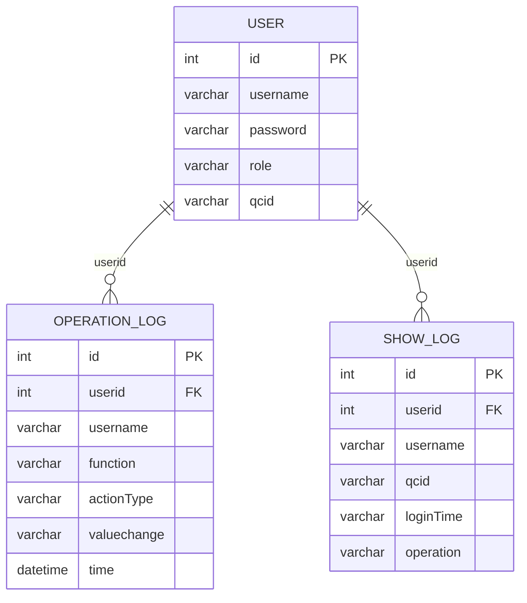
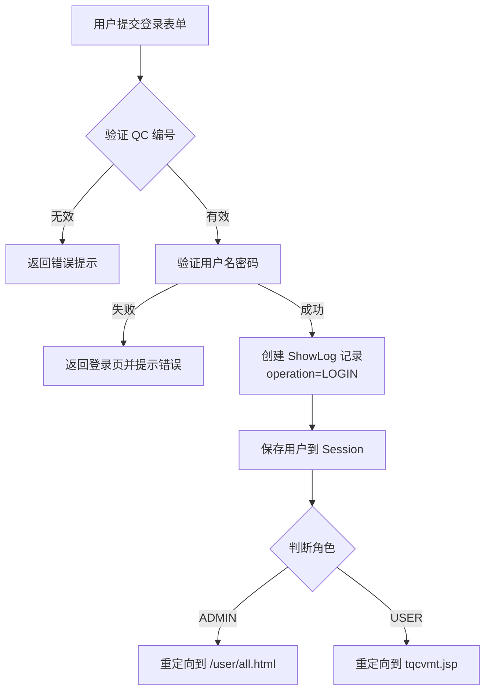
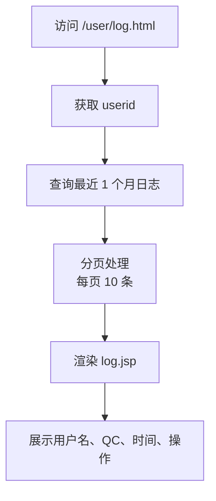
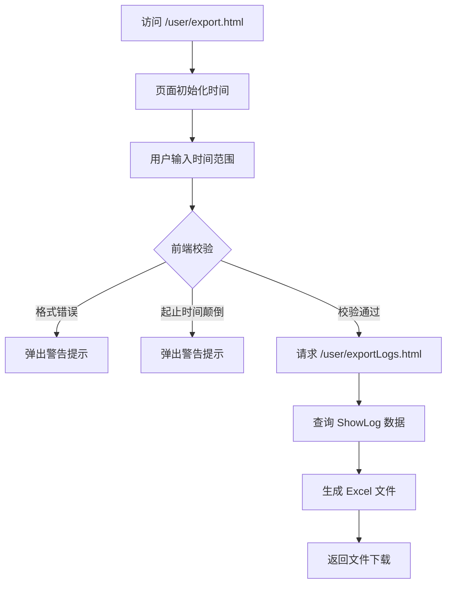
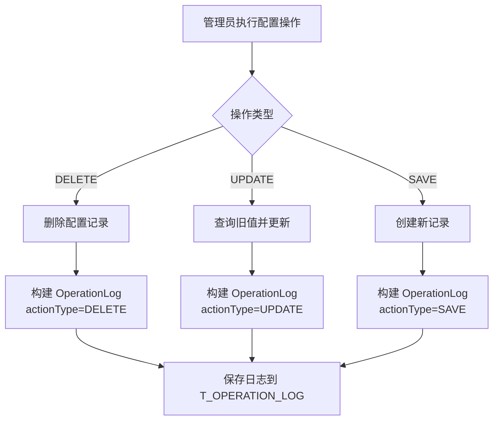

# 操作审计上下文 Domain PRD

> 日期：2026-08-04
> 所属限界上下文：operation-audit（通用域）
> 负责人：待产品确认

## 1. 领域定位与范围

### 1.1 领域定位
操作审计上下文提供统一的操作日志记录、查询和导出功能，用于追踪用户行为和支持系统审计。该上下文作为支撑域，为其他业务模块（用户管理、船舶配置、颜色配置等）提供操作审计能力，不直接参与核心业务流程，但记录所有关键业务操作的历史轨迹。

**上下游关系**：
- **上游依赖**：用户管理模块（UserControl）、船舶配置模块（CellControl）等业务模块调用日志记录接口
- **下游输出**：日志查询页面、Excel 导出文件供管理员审计使用
- **对系统整体的作用**：满足合规性要求，支持问题追溯、责任认定和操作回溯

### 1.2 业务目标
- **目标1**：完整记录用户在系统中的关键操作（登录、登出、增删改），确保所有变更可追溯
- **目标2**：提供按时间范围和用户的日志查询能力，支持管理员快速定位特定操作
- **目标3**：支持将日志数据导出为 Excel 格式，便于离线分析和归档
- **目标4**：区分两类日志体系——登录会话日志（ShowLog）和业务操作日志（OperationLog），满足不同审计粒度需求

### 1.3 范围内 / 范围外 / TBD

| 范围内 | 范围外 |
|--------|--------|
| 用户登录/登出日志记录（ShowLog） | 实时告警或异常检测机制 |
| 业务操作日志记录（OperationLog）：保存、更新、删除 | 日志数据的自动清理或归档策略 |
| 按用户和时间范围的日志查询 | 细粒度的字段级变更追踪（仅记录 toString() 摘要） |
| 日志数据导出为 Excel 文件 | 分布式日志聚合或多节点日志同步 |
| 支持 6 类业务功能的审计：用户管理、颜色配置、船舶舱位配置、船舶管理、船舶加油配置、船舶加油舱行列配置 | 基于角色的日志可见性控制（当前所有管理员可见全部日志） |

**TBD（待确认）**：
- 代码中定义了 6 类 Function 枚举，但实际仅使用了 VESSEL_REFUEL_CONFIGURATION 和 VESSEL_REFUEL_BAY_ROW_CONFIGURATION 两类，其余 4 类（USER_MANAGER、COLOR_CONFIGURATION、VESSEL_BAY_CONFIGURATION、VESSEL_MANAGER）是否在代码其他地方使用需确认
- OperationLog 的 valuechange 字段长度限制为 300 字符，对于复杂对象可能截断，是否需要扩展
- 登录日志（ShowLog）默认只保留最近 1 个月数据（getUserLog 方法中硬编码 getPreMonthTime()），是否有长期归档需求

## 2. 角色、权限与使用场景

### 2.1 用户角色

| 角色 | 职责 | 主要场景 | 可执行动作 |
|------|------|----------|------------|
| 普通用户（USER） | 执行日常业务操作，产生操作日志 | 登录系统、配置船舶加油参数、修改舱位颜色 | 触发日志记录（被动），查看个人登录日志 |
| 管理员（ADMIN） | 管理系统配置和用户，查看所有日志 | 用户管理、船舶配置管理、日志查询与导出 | 查看所有用户日志、导出日志报表、管理用户账户 |

### 2.2 权限模型

**功能权限**：
- **普通用户**：可查看个人登录日志（通过 `/user/log.html?userid={id}`），无法查看他人日志或业务操作日志
- **管理员**：可访问所有管理页面（`/user/all.html`），包括用户列表、日志查询入口、导出功能

**审批权限**：无审批流程

### 2.3 数据可见性

- **登录日志（ShowLog）**：
  - 普通用户：仅可见自己的登录记录（通过 userid 过滤）
  - 管理员：理论上可通过调整查询条件查看所有用户日志，但当前页面未提供全局查询入口
  
- **业务操作日志（OperationLog）**：
  - 当前代码中未发现专门的查询页面或 API，仅在后台记录
  - **风险点**：缺少业务操作日志的前端展示能力，管理员无法直接查看谁在何时修改了哪些配置

- **缺失或风险点**：
  - 业务操作日志（OperationLog）缺乏查询和展示界面，审计价值受限
  - 未实现基于角色的数据隔离，管理员可查看所有日志但普通用户只能看自己的登录日志

## 3. 能力地图

| 能力域 | 能力 | 业务目的 | 用户入口 | 服务入口 | 关键数据 | 备注 |
|--------|------|----------|----------|----------|----------|------|
| 登录审计 | 记录用户登录行为 | 追踪用户访问时间和设备（QC编号） | 登录页面提交 | UserDao.add(ShowLog) | userid, username, qcid, loginTime, operation="LOGIN" | 登录成功时自动记录 |
| 登录审计 | 记录用户登出行为 | 追踪会话结束时间 | 点击登出按钮 | UserDao.logout() → add(ShowLog) | userid, username, qcid, loginTime, operation="LOGOUT" | 登出时自动记录 |
| 登录审计 | 查看个人登录日志 | 用户自查登录历史 | GET /user/log.html | UserDao.getUserLog(userid, offset) | 最近 1 个月的登录记录，分页展示 | 仅显示当前用户数据 |
| 登录审计 | 导出登录日志报表 | 管理员批量分析登录行为 | GET /user/exportLogs.html | ExportHandler.exportQCLog() | 用户名、QC号码、操作、时间 | 按时间范围筛选，导出为 .xls 文件 |
| 业务操作审计 | 记录船舶加油配置变更 | 追踪加油配置的增删改历史 | 船舶加油配置页面操作 | CellControl.delVesselRefuel/updateVesselRefuelStatus | userid, username, function="Vessel Refuel Configuration", actionType, valuechange | 记录旧值→新值的变更摘要 |
| 业务操作审计 | 记录船舶加油舱行列配置变更 | 追踪舱位行列配置的增删改历史 | 船舶颜色配置页面操作 | CellControl.delVesselCol/saveVesselCol | userid, username, function="Vessel Refuel Bay Row Configuration", actionType, valuechange | 记录旧值→新值的变更摘要 |
| 业务操作审计 | 记录用户管理操作 | 追踪用户账户的增删改（待确认是否启用） | 用户管理页面 | 待确认 | function="User Manager" | LogUtil 中定义但未发现实际调用 |
| 业务操作审计 | 记录颜色配置操作 | 追踪箱况颜色配置的变更（待确认是否启用） | 颜色管理页面 | 待确认 | function="Color Configuration" | LogUtil 中定义但未发现实际调用 |
| 业务操作审计 | 记录船舶舱位配置操作 | 追踪船舶基础配置的变更（待确认是否启用） | 船舶管理页面 | 待确认 | function="Vessel Bay Configuration" | LogUtil 中定义但未发现实际调用 |
| 业务操作审计 | 记录船舶管理操作 | 追踪船舶信息的变更（待确认是否启用） | 船舶管理页面 | 待确认 | function="Vessel Manager" | LogUtil 中定义但未发现实际调用 |

## 4. 数据模型

### 4.1 表字段说明

#### 实体 1：OperationLog（业务操作日志）

| 字段 | 类型 | 约束 | 说明 | 业务影响 |
|------|------|------|------|----------|
| id | int | PK, SEQUENCE (operatorlog_seq), length=7 | 日志唯一标识 | 主键，自增生成 |
| userid | int | NOT NULL, length=7 | 操作用户 ID | 关联到 User 表，用于追溯责任人 |
| username | varchar | NOT NULL, length=20 | 操作用户名 | 冗余存储用户名，避免关联查询 |
| function | varchar | NOT NULL, length=50 | 业务功能模块名称 | 枚举值：User Manager、Color Configuration、Vessel Bay Configuration、Vessel Manager、Vessel Refuel Configuration、Vessel Refuel Bay Row Configuration |
| actionType | varchar | NOT NULL, length=10 | 操作类型 | 枚举值：Save、Update、Delete |
| valuechange | varchar | length=300 | 变更内容摘要 | 格式："旧值->新值"，null 表示新增或删除，受长度限制可能截断复杂对象 |
| time | datetime | NOT NULL | 操作时间 | 记录操作发生的精确时间，用于排序和筛选 |

#### 实体 2：ShowLog（登录会话日志）

| 字段 | 类型 | 约束 | 说明 | 业务影响 |
|------|------|------|------|----------|
| id | int | PK, SEQUENCE (log_seq), length=7 | 日志唯一标识 | 主键，自增生成 |
| userid | int | NOT NULL, length=7 | 用户 ID | 关联到 User 表 |
| username | varchar | NOT NULL, length=20 | 用户名 | 冗余存储，便于展示 |
| qcid | varchar | length=20 | QC/HC/C 设备编号 | 标识用户操作的终端设备，ADMIN 角色为空字符串 |
| loginTime | varchar | NOT NULL, length=20 | 登录/登出时间 | 格式：yyyyMMddHHmmss（如 20260804165231） |
| operation | varchar | NOT NULL, length=15 | 操作类型 | 固定值：LOGIN 或 LOGOUT |

### 4.2 数据模型关系图

### 4.3 关键数据约束

- **主键**：
  - OperationLog.id：使用 Oracle 序列 operatorlog_seq 生成
  - ShowLog.id：使用 Oracle 序列 log_seq 生成

- **唯一约束**：无显式唯一约束，允许同一用户多次操作产生多条日志

- **外键或逻辑关联**：
  - OperationLog.userid → User.id（逻辑关联，无数据库外键约束）
  - ShowLog.userid → User.id（逻辑关联，无数据库外键约束）

- **默认值**：
  - OperationLog.time：创建时自动设置为当前时间（new Date()）
  - ShowLog.loginTime：创建时通过 WebUtil.getTime() 生成 yyyyMMddHHmmss 格式字符串

- **状态字段**：
  - OperationLog.actionType：Save（新增）、Update（更新）、Delete（删除）
  - ShowLog.operation：LOGIN（登录）、LOGOUT（登出）

- **删除影响**：
  - 非级联删除：删除 User 记录不会自动删除关联的日志记录
  - **风险**：用户删除后，其历史日志仍保留但无法关联到有效用户

- **跨域引用影响**：
  - OperationLog.function 字段引用 LogUtil.Function 枚举，若枚举值变更需同步更新已有数据
  - valuechange 字段存储对象的 toString() 结果，若实体类的 toString() 方法变更，历史数据的可读性受影响

## 5. 核心业务流程

### 5.1 流程一：用户登录与会话日志记录

**触发条件**：用户在登录页面输入用户名、密码和角色（USER/ADMIN），提交登录请求

**参与角色**：普通用户、管理员

| 步骤 | 用户/系统动作 | 页面 | API / Service | 业务规则 | 数据变化 |
|------|---------------|------|---------------|----------|----------|
| 1 | 用户输入用户名、密码、角色和设备编号（QC/HC/C） | login.jsp | POST /user/login | 验证用户名和密码匹配，角色一致 | 无 |
| 2 | 系统校验 QC 编号有效性（仅 USER 角色） | — | UserDao.queryQcId() | QC 编号必须在系统中存在 | 无 |
| 3 | 系统验证用户凭据 | — | UserDao.login(user) | 用户名和密码必须匹配数据库记录 | 无 |
| 4 | 系统创建 ShowLog 记录 | — | UserDao.add(logs) | 记录 userid、username、qcid、当前时间、operation="LOGIN" | 新增 ShowLog 记录 |
| 5 | 系统将用户信息存入 Session | — | request.getSession().setAttribute() | 存储 Constants.USER_LOGIN 和 Constants.QC_ID | Session 中保存用户状态 |
| 6 | 系统重定向到对应页面 | tqcvmt.jsp 或 admin.jsp | — | ADMIN 跳转到 /user/all.html，USER 跳转到 tqcvmt | 无 |

**异常场景**

| 场景 | 系统行为 | 用户影响 |
|------|----------|----------|
| 数据库连接失败 | 捕获异常，返回错误消息 "error_db_not_connected" | 用户看到数据库连接错误，无法登录 |
| QC 编号不存在 | 返回错误消息 "error_check_qc_number" | 用户需检查输入的 QC 编号 |
| 用户名或密码错误 | 返回错误消息 "error_nampass_incorrect" | 用户需重新输入正确的凭据 |
| 角色不匹配 | 返回错误消息 "error_user_or_admin" | 用户需选择正确的角色（USER/ADMIN） |

### 5.2 流程二：用户登出与会话日志记录

**触发条件**：用户点击登出按钮

**参与角色**：普通用户、管理员

| 步骤 | 用户/系统动作 | 页面 | API / Service | 业务规则 | 数据变化 |
|------|---------------|------|---------------|----------|----------|
| 1 | 用户点击登出图标 | 任意页面 | GET /user/logout | 从 Session 获取当前用户信息 | 无 |
| 2 | 系统创建 ShowLog 记录 | — | UserDao.add(logs) | 记录 userid、username、qcid、当前时间、operation="LOGOUT" | 新增 ShowLog 记录 |
| 3 | 系统清除 Session | — | request.getSession().removeAttribute() | 移除 USER_LOGIN 和 QC_ID | Session 失效 |
| 4 | 系统重定向到登录页 | login.jsp 或 loginAdmin.jsp | — | 根据 qcid 是否为空判断返回管理员或普通用户登录页 | 无 |

**异常场景**

| 场景 | 系统行为 | 用户影响 |
|------|----------|----------|
| Session 已过期 | flag != "yes"，返回错误消息 "error_webpage_expired" | 用户看到会话过期提示，但仍能返回登录页 |

### 5.3 流程三：查看个人登录日志

**触发条件**：用户或管理员访问日志查询页面

**参与角色**：普通用户、管理员

| 步骤 | 用户/系统动作 | 页面 | API / Service | 业务规则 | 数据变化 |
|------|---------------|------|---------------|----------|----------|
| 1 | 用户访问日志页面 | log.jsp | GET /user/log.html?userid={id} | 从请求参数或 User 对象获取 userid | 无 |
| 2 | 系统查询最近 1 个月的登录日志 | — | UserDao.getUserLog(userid, offset) | 时间范围：getPreMonthTime() 到 getTime()，按 loginTime 降序排列 | 无 |
| 3 | 系统分页返回数据 | log.jsp | — | 每页 10 条记录，支持翻页 | 无 |
| 4 | 页面展示日志列表 | log.jsp | — | 显示用户名、QC 编号、时间（格式化）、操作类型 | 无 |

**异常场景**

| 场景 | 系统行为 | 用户影响 |
|------|----------|----------|
| userid 无效或缺失 | 捕获异常，返回空列表 | 用户看到空白日志列表 |
| 数据库查询失败 | 捕获异常并打印堆栈，返回空列表 | 用户看到空白日志列表，后台记录错误日志 |

### 5.4 流程四：导出登录日志报表

**触发条件**：管理员在导出页面输入时间范围，点击 Export 按钮

**参与角色**：管理员

| 步骤 | 用户/系统动作 | 页面 | API / Service | 业务规则 | 数据变化 |
|------|---------------|------|---------------|----------|----------|
| 1 | 管理员访问导出页面 | exportPage.jsp | GET /user/export.html | 页面加载时自动初始化时间为当天 00:00:00 到当前时间 | 无 |
| 2 | 管理员输入起始时间和结束时间 | exportPage.jsp | — | 格式必须为 yyyy-MM-dd HH:mm:ss，长度 19 位 | 无 |
| 3 | 管理员点击 Export 按钮 | exportPage.jsp | JavaScript exportLogs() | 前端校验时间格式和起止时间逻辑关系 | 无 |
| 4 | 系统查询指定时间范围的日志 | — | UserDao.getUserLogByPeriod(fromTime, toTime) | 筛选 qcid 不为空的记录，按 loginTime 降序排列 | 无 |
| 5 | 系统生成 Excel 文件 | — | ExportHandler.exportQCLog(response, list) | 使用 Apache POI 创建 .xls 文件，包含列：用户名、QC号码、操作、时间 | 无 |
| 6 | 系统返回文件下载响应 | — | response.getOutputStream() | Content-Type: bin，文件名：{当前时间}.xls | 无 |

**异常场景**

| 场景 | 系统行为 | 用户影响 |
|------|----------|----------|
| 时间格式不正确 | 前端 JavaScript 校验失败，弹出 alert | 用户需修正时间格式为 yyyy-MM-dd HH:mm:ss |
| 结束时间早于开始时间 | 前端 comptime() 返回 -1，弹出 alert | 用户需调整时间范围 |
| 查询结果为空 | 生成空 Excel 文件（仅表头） | 用户下载到空文件 |
| Excel 生成异常 | 捕获异常并打印堆栈，响应可能不完整 | 用户下载失败或文件损坏 |

### 5.5 流程五：记录业务操作日志（船舶加油配置）

**触发条件**：管理员在船舶加油配置页面执行新增、更新或删除操作

**参与角色**：管理员

| 步骤 | 用户/系统动作 | 页面 | API / Service | 业务规则 | 数据变化 |
|------|---------------|------|---------------|----------|----------|
| 1 | 管理员删除船舶加油配置 | vesselRefuelManage.jsp | GET /user/delVesselRefuel.html?id={id} | 根据 ID 删除记录 | 删除 VesselRefuel 记录 |
| 2 | 系统构建操作日志 | — | LogUtil.buildOperationLog(user, VESSEL_REFUEL_CONFIGURATION, DELETE, oldValue, null) | valuechange = "{vesselRefuel.toString()}->null" | 无 |
| 3 | 系统保存操作日志 | — | VesselDao.saveOperationLog(log) | 通过 HibernateTemplate.saveOrUpdate() 持久化 | 新增 OperationLog 记录 |
| 4 | 管理员更新船舶加油配置 | vesselRefuelDetail.jsp | POST /user/updateVesselRefuelStatus | 先查询旧值，更新后保存 | 更新 VesselRefuel 记录 |
| 5 | 系统构建操作日志 | — | LogUtil.buildOperationLog(user, VESSEL_REFUEL_CONFIGURATION, UPDATE, oldValue, newValue) | valuechange = "{oldValue}->{newValue}" | 无 |
| 6 | 系统保存操作日志 | — | VesselDao.saveOperationLog(log) | 持久化日志记录 | 新增 OperationLog 记录 |
| 7 | 管理员新增船舶加油配置 | vesselRefuelDetail.jsp | POST /user/updateVesselRefuelStatus | 创建新记录 | 新增 VesselRefuel 记录 |
| 8 | 系统构建操作日志 | — | LogUtil.buildOperationLog(user, VESSEL_REFUEL_CONFIGURATION, SAVE, null, newValue) | valuechange = "null->{newValue}" | 无 |
| 9 | 系统保存操作日志 | — | VesselDao.saveOperationLog(log) | 持久化日志记录 | 新增 OperationLog 记录 |

**异常场景**

| 场景 | 系统行为 | 用户影响 |
|------|----------|----------|
| 日志保存失败 | 捕获异常并打印堆栈，不影响主业务操作 | 用户完成配置操作，但日志未记录（审计缺口） |
| 用户 Session 失效 | user 为 null，buildOperationLog 抛出 NullPointerException | 后台报错，日志未记录 |

### 5.6 流程六：记录业务操作日志（船舶加油舱行列配置）

**触发条件**：管理员在船舶颜色配置页面执行新增、更新或删除操作

**参与角色**：管理员

| 步骤 | 用户/系统动作 | 页面 | API / Service | 业务规则 | 数据变化 |
|------|---------------|------|---------------|----------|----------|
| 1 | 管理员删除舱行列配置 | vesselColorManage.jsp | GET /user/delVesselCol.html?id={id} | 根据 ID 删除记录 | 删除 VesselCol 记录 |
| 2 | 系统构建操作日志 | — | LogUtil.buildOperationLog(user, VESSEL_REFUEL_BAY_ROW_CONFIGURATION, DELETE, oldValue, null) | valuechange = "{vesselCol.toString()}->null" | 无 |
| 3 | 系统保存操作日志 | — | VesselDao.saveOperationLog(log) | 持久化日志记录 | 新增 OperationLog 记录 |
| 4 | 管理员更新舱行列配置 | vesselColorDetail.jsp | POST /user/saveVesselCol | 查询旧值，更新后保存 | 更新 VesselCol 记录 |
| 5 | 系统构建操作日志 | — | LogUtil.buildOperationLog(user, VESSEL_REFUEL_BAY_ROW_CONFIGURATION, UPDATE, oldValue, newValue) | valuechange = "{oldValue}->{newValue}" | 无 |
| 6 | 系统保存操作日志 | — | VesselDao.saveOperationLog(log) | 持久化日志记录 | 新增 OperationLog 记录 |
| 7 | 管理员新增舱行列配置 | vesselColorDetail.jsp | POST /user/saveVesselCol | 创建新记录 | 新增 VesselCol 记录 |
| 8 | 系统构建操作日志 | — | LogUtil.buildOperationLog(user, VESSEL_REFUEL_BAY_ROW_CONFIGURATION, SAVE, null, newValue) | valuechange = "null->{newValue}" | 无 |
| 9 | 系统保存操作日志 | — | VesselDao.saveOperationLog(log) | 持久化日志记录 | 新增 OperationLog 记录 |

**异常场景**：同流程五

## 6. 后台机制

| 机制 | 业务作用 | 触发时机 | 影响 |
|------|----------|----------|------|
| 会话存储 | 维护用户登录状态和 QC 设备编号 | 每次请求通过 Session 获取用户信息 | 重启后丢失，用户需重新登录 |
| Cookie 存储 | 记住用户上次使用的 QC/HC/C 编号 | 登录成功后写入 Cookie | 浏览器关闭后仍保留，方便下次快速登录 |
| 日志时间范围限制 | 登录日志查询默认只返回最近 1 个月数据 | UserDao.getUserLog() 中硬编码 getPreMonthTime() | 超过 1 个月的登录历史无法通过页面查询 |
| 异步事件 | 未发现异步事件队列机制 | — | 所有日志记录均为同步操作，可能影响主业务性能 |
| 消息队列 | 未发现消息队列机制 | — | 日志记录失败时无重试机制 |
| 缓存 | 未发现缓存机制 | — | 每次日志查询都直接访问数据库 |
| 分布式锁 | 未发现分布式锁机制 | — | 单进程部署，无并发冲突风险 |
| 定时任务 | 未发现定时任务机制 | — | 无自动清理或归档日志的任务 |
| 外部回调 | 未发现外部回调机制 | — | 日志数据不推送到外部系统 |
| 导入导出 | 支持登录日志导出为 Excel | 管理员手动触发的导出操作 | 生成 .xls 文件供离线分析 |
| 审计日志 | 同步记录业务操作日志 | 每次增删改操作后立即记录 | 日志记录失败不影响主业务，但造成审计缺口 |

> 未发现定时任务、异步事件队列、缓存、分布式锁或消息队列机制。

## 7. 集成与依赖

### 7.1 内部域依赖

| 对象 | 交互方式 | 依赖内容 | 失败影响 |
|------|----------|----------|----------|
| 用户管理域（UserControl） | 同步调用 | 登录/登出时调用 UserDao.add(ShowLog) 记录会话日志 | 日志记录失败不影响登录流程，但丢失审计数据 |
| 船舶配置域（CellControl） | 同步调用 | 配置变更时调用 VesselDao.saveOperationLog() 记录业务操作日志 | 日志记录失败不影响配置操作，但丢失审计数据 |
| 用户实体（User） | 数据引用 | OperationLog 和 ShowLog 依赖 User.id 和 User.username | 用户删除后日志仍保留但无法关联有效用户 |

### 7.2 外部系统依赖

| 对象 | 交互方式 | 依赖内容 | 失败影响 |
|------|----------|----------|----------|
| Apache POI | 库依赖 | ExportHandler 使用 HSSFWorkbook 生成 Excel 文件 | 库缺失或版本不兼容导致导出功能失败 |
| Oracle 数据库 | 持久化存储 | 通过 Hibernate 操作 T_OPERATION_LOG 和 T_SHOWLOG 表 | 数据库连接失败导致日志记录或查询失败 |

### 7.3 基础设施依赖

| 对象 | 交互方式 | 依赖内容 | 失败影响 |
|------|----------|----------|----------|
| HttpSession | 会话管理 | 存储用户登录状态和 QC 编号 | Session 失效导致用户需重新登录 |
| Cookie | 客户端存储 | 记住用户上次使用的 QC/HC/C 编号 | Cookie 被禁用或清除后失去便捷登录体验 |
| 文件系统 | 文件上传 | ImportHandler.uploadFile() 将上传文件保存到服务器磁盘 | 磁盘空间不足或权限问题导致上传失败 |

## 8. 非功能要求

### 8.1 安全

- **日志篡改风险**：OperationLog 和 ShowLog 表无防篡改机制（如数字签名或区块链存证），管理员可直接修改数据库记录
- **敏感信息泄露**：valuechange 字段存储对象的 toString() 结果，若对象包含敏感数据（如密码哈希）可能被记录
- **访问控制不足**：业务操作日志（OperationLog）缺乏查询界面，管理员无法直接审计；登录日志仅按用户 ID 过滤，无基于角色的全局查询入口
- **建议**：增加 OperationLog 的管理界面，实现基于角色的日志可见性控制；对 valuechange 字段进行脱敏处理

### 8.2 可用性

- **单进程部署**：当前为单体应用，Session 存储在内存中，重启后丢失
- **故障恢复**：日志记录失败时捕获异常但不中断主业务流程，保证业务可用性但牺牲审计完整性
- **会话持久化**：依赖 HttpSession，无分布式 Session 共享机制，不支持多节点部署

### 8.3 数据一致性

- **事务管理**：日志记录与主业务操作在同一事务中（@Transactional），但 saveOperationLog 方法内部捕获异常后不回滚，可能导致主业务成功但日志丢失
- **级联操作**：删除 User 记录不会级联删除关联的日志记录，产生孤儿数据
- **并发控制**：无显式并发控制机制，高并发场景下可能出现日志顺序混乱

### 8.4 审计

- **操作日志**：记录用户登录/登出和业务操作（增删改），包含操作人、时间、功能模块、操作类型和变更摘要
- **变更记录**：valuechange 字段以 "旧值->新值" 格式记录变更，但受 300 字符限制可能截断
- **局限性**：仅记录对象级别的 toString() 摘要，无法追溯字段级变更；无操作日志的查询和展示界面

## 9. 风险与待确认

| 类型 | 描述 | 影响 | 建议 |
|------|------|------|------|
| 功能缺口 | OperationLog 缺乏查询和展示界面 | 管理员无法查看业务操作历史，审计价值受限 | 增加业务操作日志的管理页面，支持按用户、时间、功能模块筛选 |
| 功能缺口 | LogUtil.Function 枚举定义了 6 类功能，但实际仅使用 2 类 | 代码中存在未使用的审计能力，可能造成混淆 | 确认是否需要启用 USER_MANAGER、COLOR_CONFIGURATION 等其他 4 类功能的日志记录 |
| 数据一致性风险 | saveOperationLog 方法捕获异常后不回滚事务 | 主业务操作成功但日志记录失败，造成审计缺口 | 考虑将日志记录改为异步或通过消息队列解耦，确保最终一致性 |
| 数据完整性风险 | valuechange 字段长度限制为 300 字符 | 复杂对象的 toString() 结果可能被截断，丢失关键变更信息 | 扩展字段长度或改用 JSON 格式存储结构化变更数据 |
| 数据可见性风险 | 登录日志查询硬编码最近 1 个月时间范围 | 超过 1 个月的历史数据无法通过页面查询 | 增加时间范围选择器，支持自定义查询区间 |
| 安全风险 | 日志表无防篡改机制 | 管理员可直接修改数据库记录，破坏审计可信度 | 引入日志签名或只追加存储机制，防止事后篡改 |
| 外部依赖风险 | ExportHandler 依赖 Apache POI 生成 Excel | POI 库版本升级或兼容性问题可能导致导出失败 | 增加单元测试覆盖导出功能，监控 POI 版本兼容性 |
| 产品行为待确认 | 业务操作日志是否需要对所有 6 类功能启用 | 当前仅记录了船舶加油相关配置，其他功能可能缺少审计 | 与产品确认是否需要全面启用所有功能模块的日志记录 |
| 产品行为待确认 | 是否需要日志自动清理或归档策略 | 日志数据持续增长可能影响数据库性能 | 设计日志归档方案，将历史数据迁移到冷存储 |

## 10. 相关文档索引

| 类型 | 文档 | 说明 |
|------|------|------|
| Service | UserControl.java | 用户管理控制器，包含登录、登出、日志查询和导出功能 |
| Service | CellControl.java | 船舶配置控制器，记录业务操作日志 |
| Service | LogUtil.java | 日志工具类，定义 Function 和 ActionType 枚举，构建 OperationLog 对象 |
| Service | ExportHandler.java | 导出处理器，将登录日志导出为 Excel 文件 |
| Service | ImportHandler.java | 导入处理器，支持文件上传和数据导入（与日志无关但属于同一模块） |
| Page | log.jsp | 个人登录日志查询页面，展示最近 1 个月的登录记录 |
| Page | exportPage.jsp | 日志导出页面，支持按时间范围导出登录日志 |
| Entity | OperationLog.java | 业务操作日志实体，映射到 T_OPERATION_LOG 表 |
| Entity | ShowLog.java | 登录会话日志实体，映射到 T_SHOWLOG 表 |
