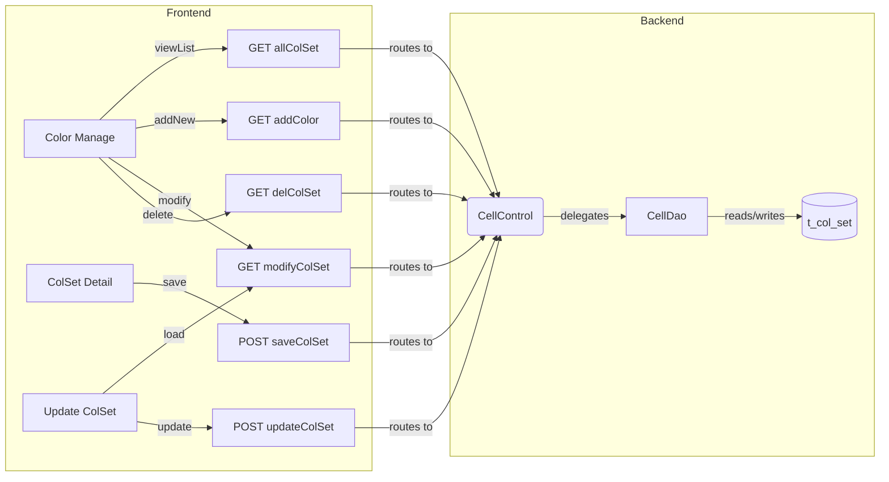
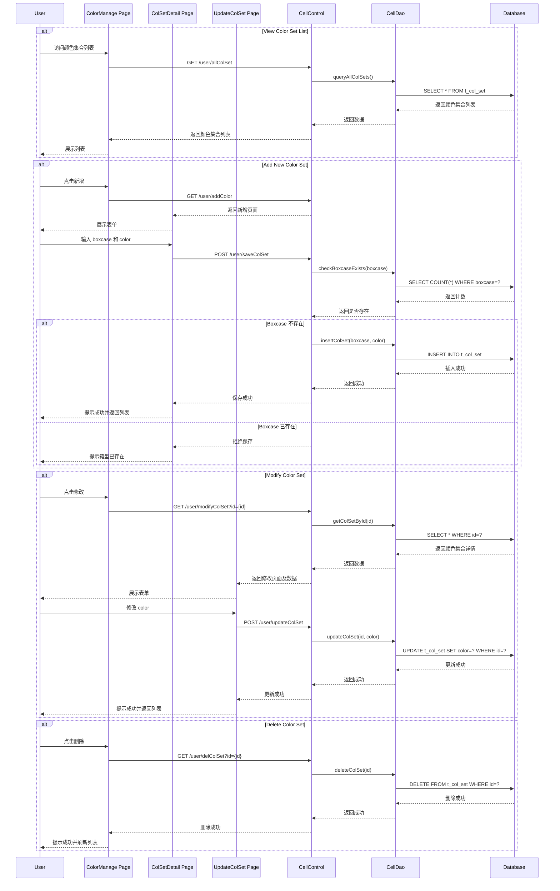

# Color Set Management for Container Types - PRD

[← Back to Overview](../overview.md)

## 概述

本链实现容器类型颜色集合（Color Set）的完整管理功能，包括颜色集合的查看、新增、修改和删除。用户可以在系统中维护不同箱型（boxcase）对应的颜色配置，用于后续业务流程中的颜色标识和管理。

**业务目标**：提供完整的颜色集合 CRUD 管理能力，确保每个箱型的颜色配置唯一且可追溯。

**范围**：
- 颜色集合列表查看
- 新增颜色集合（含箱型唯一性校验）
- 修改现有颜色集合
- 删除颜色集合

**相关模块**：[cell](../../services/cell.md)

**相关页面**：
- [color-manage](../../pages/color-manage.md) - 颜色集合列表页
- [colset-detail](../../pages/colset-detail.md) - 新增颜色集合详情页
- [update-colset](../../pages/update-colset.md) - 修改颜色集合页

## 流程步骤

| 步骤 | 步骤名称 | 顺序 | 参与模块 | 参与页面 | 触发条件 | 流转至 |
|------|----------|------|----------|----------|----------|--------|
| 1 | 查看颜色集合列表 | 1 | [cell](../../services/cell.md) | [color-manage](../../pages/color-manage.md) | GET /user/allColSet | 选择颜色集合操作 |
| 2 | 新增颜色集合 | 2 | [cell](../../services/cell.md) | [colset-detail](../../pages/colset-detail.md) | GET /user/addColor | 输入颜色集合详情 |
| 3 | 保存颜色集合 | 3 | [cell](../../services/cell.md) | - | POST /user/saveColSet with boxcase and color | 验证唯一性 |
| 4 | 验证箱型唯一性 | 4 | [cell](../../services/cell.md) | - | 检查箱型是否已存在 | 创建或拒绝 |
| 5 | 修改颜色集合 | 5 | [cell](../../services/cell.md) | [update-colset](../../pages/update-colset.md) | GET /user/modifyColSet?id={colsetId} | 更新颜色 |
| 6 | 更新颜色集合详情 | 6 | [cell](../../services/cell.md) | - | POST /user/updateColSet with id and color | 返回颜色集合列表 |
| 7 | 删除颜色集合 | 7 | [cell](../../services/cell.md) | - | GET /user/delColSet?id={colsetId} | 返回颜色集合列表 |

## 页面与交互

### color-manage（颜色集合列表页）

> 📎 Source: src/main/webapp/WEB-INF/jsp/colorManage.jsp

**业务交互**：
- 展示所有颜色集合列表
- 支持新增颜色集合入口（跳转至 colset-detail）
- 支持修改颜色集合（跳转至 update-colset）
- 支持删除颜色集合

**调用 API**：
- GET /user/allColSet - 获取颜色集合列表

### colset-detail（新增颜色集合页）

> 📎 Source: src/main/webapp/WEB-INF/jsp/colSetDetail.jsp

**业务交互**：
- 输入新颜色集合的箱型（boxcase）和颜色（color）信息
- 提交保存请求

**调用 API**：
- POST /user/saveColSet - 保存新颜色集合

### update-colset（修改颜色集合页）

> 📎 Source: src/main/webapp/WEB-INF/jsp/updateColSet.jsp

**业务交互**：
- 加载指定颜色集合的现有数据
- 允许修改颜色信息
- 提交更新请求

**调用 API**：
- GET /user/modifyColSet?id={colsetId} - 加载颜色集合详情
- POST /user/updateColSet - 更新颜色集合

## API 与数据

### GET /user/allColSet

> 📎 Source: src/main/java/com/springMVC/control/CellControl.java → getAllColSet()

**描述**：获取所有颜色集合列表

**请求参数**：无

**响应数据**：
- 颜色集合列表数组，包含每个颜色集合的 id、boxcase、color 等字段

**关联模块**：[cell](../../services/cell.md)

### GET /user/addColor

> 📎 Source: src/main/java/com/springMVC/control/CellControl.java → addUser()

**描述**：进入新增颜色集合页面

**请求参数**：无

**响应数据**：返回 colset-detail 页面视图

**关联模块**：[cell](../../services/cell.md)

### POST /user/saveColSet

> 📎 Source: src/main/java/com/springMVC/control/CellControl.java → saveColSet()

**描述**：保存新的颜色集合

**请求参数**：
- boxcase（必填）：箱型标识
- color（必填）：颜色值

**响应数据**：保存结果（成功/失败）

**业务规则**：需验证 boxcase 的唯一性

**关联模块**：[cell](../../services/cell.md)

### GET /user/modifyColSet

> 📎 Source: src/main/java/com/springMVC/control/CellControl.java → modUser()

**描述**：加载指定颜色集合的详情用于修改

**请求参数**：
- id（必填）：颜色集合 ID

**响应数据**：返回 update-colset 页面视图，携带颜色集合详情数据

**关联模块**：[cell](../../services/cell.md)

### POST /user/updateColSet

> 📎 Source: src/main/java/com/springMVC/control/CellControl.java → updateUser()

**描述**：更新现有颜色集合

**请求参数**：
- id（必填）：颜色集合 ID
- color（必填）：更新后的颜色值

**响应数据**：更新结果（成功/失败）

**关联模块**：[cell](../../services/cell.md)

### GET /user/delColSet

> 📎 Source: src/main/java/com/springMVC/control/CellControl.java → delUser()

**描述**：删除指定颜色集合

**请求参数**：
- id（必填）：颜色集合 ID

**响应数据**：删除结果（成功/失败）

**关联模块**：[cell](../../services/cell.md)

## E2E 数据流



## E2E 时序图



## 跨模块 ER 图

```erDiagram
  COL_SET ||--o{ CONTAINER : "defines colors for"
```

> 实体字段定义详见 [cell](../../services/cell.md) 模块文档

## 业务规则

1. **箱型唯一性约束**：每个箱型（boxcase）在系统中只能对应一个颜色集合，新增时需校验箱型是否已存在
2. **颜色集合必填字段**：boxcase 和 color 为必填字段
3. **删除操作**：删除颜色集合前需确认该颜色集合未被其他业务引用（TBD: 具体引用检查逻辑）
4. **修改限制**：修改颜色集合时仅允许修改 color 字段，boxcase 不可修改（基于 API 设计推断）

## 集成与依赖

### 共享服务

| 服务 | 用途 | 共享链 |
|------|------|--------|
| CellDao | 颜色集合数据访问层，提供 CRUD 操作 | color-set-management, container-cell-management |

### 外部系统

无

### 跨链依赖

| 依赖链 | 依赖内容 | 影响 |
|--------|----------|------|
| container-cell-management | 共享 CellDao 服务，可能共用颜色集合数据 | CellDao 变更会影响两条链的数据访问 |

## 假设与待确认问题

1. **TBD**: 颜色集合表（t_col_set）的具体字段结构，包括主键、索引、外键关系
2. **TBD**: 删除颜色集合时是否有级联检查逻辑，防止删除被引用的颜色集合
3. **TBD**: 颜色字段的格式约束（如是否为十六进制颜色码、预定义颜色枚举等）
4. **TBD**: CellDao 的具体实现方式（MyBatis/JDBC/Hibernate）
5. **TBD**: 是否有分页逻辑用于颜色集合列表查询
6. **TBD**: 是否有权限控制，哪些用户可以操作颜色集合