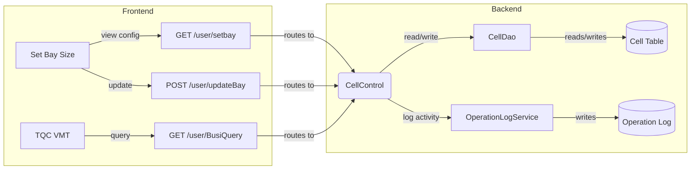
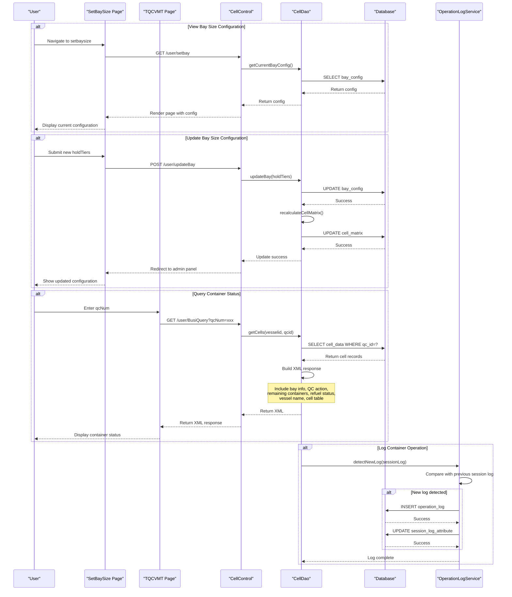

# Container Cell and Bay Size Management - PRD

[← Back to Overview](../overview.md)

## 概述 (Overview)

本链管理集装箱船舶的舱位（Bay）尺寸配置和单元格（Cell）矩阵管理。主要业务功能包括：

1. **查看当前 Bay 尺寸配置** - 管理员可以查看当前船舶的 Bay 尺寸设置
2. **更新 Bay 尺寸配置** - 根据业务需求调整 Bay 的尺寸参数，系统会自动重新计算单元格矩阵
3. **查询集装箱状态** - 通过 QC（岸桥）编号查询特定集装箱的状态信息，返回包含 Bay 信息、QC 操作、剩余集装箱数量、加油状态等详细信息的 XML 格式响应
4. **记录容器操作日志** - 当检测到新的操作日志时，系统会记录容器操作活动并更新会话日志属性

该链涉及 `cell` 模块的核心业务逻辑和 `operation-log` 模块的日志记录功能，与 `color-set-management` 链共享 `CellDao` 服务。

**业务范围**: 集装箱码头操作系统中的船舶配载管理子系统

**重要性**: [Core] Core Business — 直接影响船舶装卸作业效率和准确性

## 流程步骤 (Process Steps)

| 步骤 | 步骤名称 | 顺序 | 参与模块 | 参与页面 | 触发/转换条件 |
|------|----------|------|----------|----------|---------------|
| 1 | View Current Bay Size Configuration | 1 | [cell](../../services/cell.md) | [setbaysize](../../pages/setbaysize.md) | GET /user/setbay |
| 2 | Update Bay Size Configuration | 2 | [cell](../../services/cell.md) | [setbaysize](../../pages/setbaysize.md) | POST /user/updateBay with holdTiers |
| 3 | Update Cell Matrix | 3 | [cell](../../services/cell.md) | - | Bay size change triggers cell matrix recalculation |
| 4 | Query Container Status by QC Number | 4 | [cell](../../services/cell.md) | [tqcvmt](../../pages/tqcvmt.md) | GET /user/BusiQuery?qcNum={qcNum} |
| 5 | Retrieve Cell Data for QC | 5 | [cell](../../services/cell.md) | - | CellDao.getCells(vesselid, qcid) |
| 6 | Format XML Response with Container Info | 6 | [cell](../../services/cell.md) | - | Build XML with bay info, QC action, remaining containers, refuel status, vessel name, cell table |
| 7 | Log Container Operation Activity | 7 | [operation-log](../../services/operation-log.md) | - | New log detected in cell data (different from previous session log) |

## 页面与交互 (Pages & Interactions)

### setbaysize 页面

- **路径**: `src/main/webapp/WEB-INF/jsp/setbaysize.jsp`
- **主模块**: [cell](../../services/cell.md)
- **业务交互**:
  - 显示当前 Bay 尺寸配置
  - 提供表单用于更新 Bay 尺寸参数（holdTiers）
  - 提交后触发 Bay 尺寸更新和单元格矩阵重新计算
  - 重定向到管理面板

> 📎 Source: src/main/webapp/WEB-INF/jsp/setbaysize.jsp

### tqcvmt 页面

- **路径**: `src/main/webapp/WEB-INF/jsp/tqcvmt.jsp`
- **主模块**: [cell](../../services/cell.md)
- **业务交互**:
  - 输入 QC 编号进行集装箱状态查询
  - 显示查询结果（XML 格式解析后的数据）
  - 展示 Bay 信息、QC 操作状态、剩余集装箱数量等

> 📎 Source: src/main/webapp/WEB-INF/jsp/tqcvmt.jsp

## API 与数据 (API & Data)

### GET /user/setbay

- **Handler**: `CellControl.setBaySize()`
- **描述**: 获取当前 Bay 尺寸配置页面
- **请求参数**: 无
- **响应**: 渲染 setbaysize.jsp 页面，显示当前配置

> 📎 Source: src/main/java/com/springMVC/control/CellControl.java → setBaySize()

### POST /user/updateBay

- **Handler**: `CellControl.updateBay()`
- **描述**: 更新 Bay 尺寸配置
- **请求参数**: 
  - `holdTiers`: Bay 尺寸参数
- **响应**: 更新成功后重定向到管理面板
- **副作用**: 触发单元格矩阵重新计算

> 📎 Source: src/main/java/com/springMVC/control/CellControl.java → updateBay()

### GET /user/BusiQuery

- **Handler**: `CellControl.busiQuery()`
- **描述**: 通过 QC 编号查询集装箱状态
- **请求参数**: 
  - `qcNum`: QC（岸桥）编号
- **响应**: XML 格式的集装箱状态信息，包含：
  - Bay 信息
  - QC 操作状态
  - 剩余集装箱数量
  - 加油状态
  - 船舶名称
  - 单元格表格数据

> 📎 Source: src/main/java/com/springMVC/control/CellControl.java → busiQuery()

## E2E 数据流 (E2E Data Flow)



## E2E 时序图 (E2E Sequence)



## 跨模块 ER 图 (Cross-module ER)

```erDiagram
  CELL_CONFIG ||--o{ CELL_MATRIX : "defines"
  CELL_MATRIX ||--o{ CONTAINER_STATUS : "tracks"
  CELL_CONFIG ||--o{ OPERATION_LOG : "generates"
```

See [cell](../../services/cell.md) for entity field definitions.
See [operation-log](../../services/operation-log.md) for entity field definitions.

## 业务规则 (Business Rules)

1. **Bay 尺寸更新触发矩阵重算**: 当 Bay 尺寸配置发生变化时，系统必须自动重新计算单元格矩阵，确保数据结构的一致性
2. **QC 查询必须提供有效编号**: `/user/BusiQuery` 接口要求提供有效的 `qcNum` 参数，否则无法检索对应的集装箱数据
3. **XML 响应格式标准化**: 所有集装箱状态查询响应必须采用统一的 XML 格式，包含 Bay 信息、QC 操作、剩余集装箱数量、加油状态、船舶名称和单元格表格
4. **操作日志去重**: 仅当检测到新的操作日志（与会话中之前的日志不同）时才记录操作活动，避免重复记录
5. **会话日志属性更新**: 每次记录新操作日志后，必须更新会话日志属性以反映最新状态

## 集成与依赖 (Integration & Dependencies)

### 共享服务

| 服务 | 用途 | 共享链 |
|------|------|--------|
| CellDao | 提供单元格数据的 CRUD 操作，包括 Bay 配置读取、单元格矩阵更新、QC 数据查询 | container-cell-management, color-set-management |

### 外部系统

无

### 跨链依赖

| 依赖链 | 依赖内容 | 影响 |
|--------|----------|------|
| color-set-management | 共享 CellDao 服务，可能同时访问和修改单元格数据 | 并发访问可能导致数据不一致，需要适当的锁机制或事务隔离 |

## 假设与待确认问题 (Assumptions & TBDs)

### 假设

1. Bay 尺寸配置存储在数据库的专用表中，具有明确的 schema 定义
2. 单元格矩阵重算是原子操作，要么全部成功要么全部回滚
3. QC 编号与船舶 ID 之间存在映射关系，可以通过 `qcNum` 推导出 `vesselid` 和 `qcid`
4. XML 响应格式是固定的，客户端期望特定的字段结构

### 待确认问题

1. TBD: `holdTiers` 参数的具体数据结构和验证规则是什么？
2. TBD: 单元格矩阵重算的具体算法是什么？是否考虑性能优化？
3. TBD: 操作日志的记录频率和保留策略是什么？
4. TBD: `CellDao` 服务的具体实现细节，包括缓存策略和事务边界
5. TBD: 是否有权限控制机制限制谁可以更新 Bay 尺寸配置？
6. TBD: XML 响应的完整 schema 定义是什么？是否有版本控制？