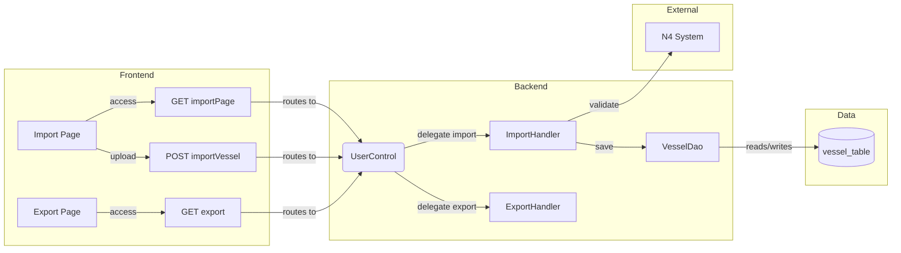
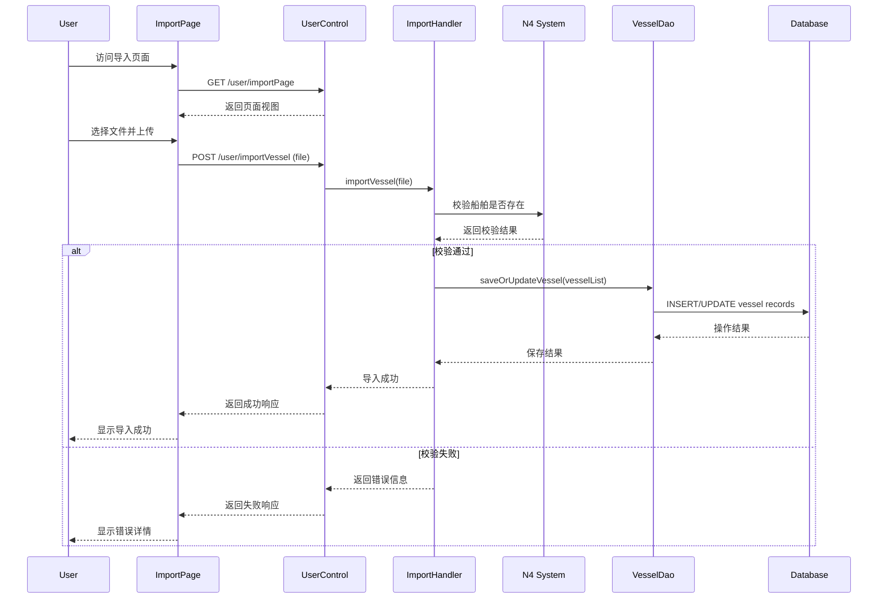

# 船舶数据导入导出链 - PRD

[← Back to Overview](../overview.md)

## 概述

本链实现船舶数据的批量导入和导出功能，支持用户通过 Web 界面上传 Excel/CSV 文件批量导入船舶数据到系统，并可将系统中的船舶数据导出为文件。导入过程中需与 N4 系统进行校验，确保船舶数据的准确性和一致性。

**业务目标**：
- 提供便捷的船舶数据批量导入能力，减少手工录入工作量
- 确保导入数据与 N4 系统保持一致性
- 支持船舶数据导出，便于数据备份和外部系统对接

**业务范围**：
- 前端页面：导入页面、导出页面
- 后端模块：user 模块（控制器层）、cell 模块（数据访问层）
- 外部系统：N4 系统（船舶数据校验）

## 流程步骤

| 步骤 | 步骤名称 | 顺序 | 参与模块 | 参与页面 | 触发/转换条件 |
|------|----------|------|----------|----------|---------------|
| 1 | 访问导入页面 | 1 | [user](../../services/user.md) | [import-page](../../pages/import-page.md) | GET /user/importPage |
| 2 | 上传船舶数据文件 | 2 | [user](../../services/user.md) | [import-page](../../pages/import-page.md) | POST /user/importVessel with file upload |
| 3 | 处理船舶导入文件 | 3 | [user](../../services/user.md) | - | ImportHandler.importVessel(returnFile) |
| 4 | 验证船舶数据与 N4 系统 | 4 | [cell](../../services/cell.md) | - | Check if vessels exist in N4 database |
| 5 | 保存导入的船舶数据 | 5 | [cell](../../services/cell.md) | - | VesselDao.saveOrUpdateVessel(vesselList) |
| 6 | 访问导出页面 | 6 | [user](../../services/user.md) | [export-page](../../pages/export-page.md) | GET /user/export |

## 页面与交互

### 导入页面 (import-page)

[import-page](../../pages/import-page.md)

- **主要功能**：提供文件上传界面，用户可选择本地 Excel/CSV 文件进行船舶数据批量导入
- **交互行为**：
  - 点击"选择文件"按钮上传文件
  - 提交后显示导入进度或结果反馈
  - 导入失败时显示错误信息

### 导出页面 (export-page)

[export-page](../../pages/export-page.md)

- **主要功能**：提供船舶数据导出界面，用户可选择导出参数并下载文件
- **交互行为**：
  - 选择导出范围或筛选条件
  - 点击"导出"按钮生成并下载文件

## API 与数据

### 导入相关 API

#### GET /user/importPage

- **描述**：访问导入页面
- **请求参数**：无
- **响应**：返回 importPage.jsp 视图
- **所属模块**：[user](../../services/user.md)

#### POST /user/importVessel

- **描述**：上传并处理船舶数据文件
- **请求参数**：multipart/form-data，包含文件字段
- **响应**：导入结果（成功/失败信息及详情）
- **所属模块**：[user](../../services/user.md)
- **下游服务**：ImportHandler → VesselDao → N4 System

### 导出相关 API

#### GET /user/export

- **描述**：访问导出页面
- **请求参数**：无（或可选的导出参数）
- **响应**：返回 exportPage.jsp 视图
- **所属模块**：[user](../../services/user.md)

## E2E 数据流



## E2E 时序图



## 跨模块 ER 图

```erDiagram
  VESSEL ||--o{ OPERATION : "has"
  VESSEL }|--|| N4_VESSEL : "validates against"
```

> 注：实体字段定义详见各模块级文档
> - 船舶实体字段定义见 [cell](../../services/cell.md)
> - 操作记录实体字段定义见 [operation-log-audit](../../services/operation-log-audit.md)

## 业务规则

1. **导入文件格式**：支持 Excel (.xlsx/.xls) 或 CSV 格式文件
2. **数据校验规则**：
   - 所有导入的船舶必须在 N4 系统中存在
   - 船舶标识符（如 IMO 编号、船名等）必须唯一
   - 必填字段不能为空
3. **导入处理策略**：
   - 若船舶已存在，则执行更新操作
   - 若船舶不存在但 N4 校验通过，则执行新增操作
   - 若 N4 校验失败，则拒绝该条记录并返回错误信息
4. **批量处理**：支持一次性上传多条船舶记录，系统逐条校验和处理
5. **错误处理**：部分记录失败不影响其他记录的处理，返回详细的成功/失败统计

## 集成与依赖

### 共享服务

| 服务 | 用途 | 共享链 |
|------|------|--------|
| ImportHandler | 处理文件导入逻辑，解析文件并调用下游服务 | data-import-export, vessel-configuration |
| ExportHandler | 处理数据导出逻辑，生成导出文件 | data-import-export |
| VesselDao | 船舶数据持久化操作 | data-import-export, vessel-configuration |

### 外部系统

| 系统 | 交互方式 | 依赖内容 | 失败影响 |
|------|----------|----------|----------|
| N4 System | API 调用或数据库查询 | 校验船舶是否存在于 N4 系统 | 导入操作无法完成，返回校验失败错误 |

### 跨链依赖

| 依赖链 | 依赖内容 | 影响 |
|--------|----------|------|
| vessel-configuration | 共享 VesselDao 和 ImportHandler 服务 | 若 vessel-configuration 修改了数据结构，可能影响导入逻辑 |
| operation-log-audit | 可能需要记录导入/导出操作日志 | 若日志服务不可用，可能无法追踪操作历史 |

## 假设与待确认问题

### 假设

1. 用户上传的文件格式符合预定义的模板要求
2. N4 系统在导入期间保持可用状态
3. 船舶数据量在单次导入的可处理范围内

### 待确认问题

1. TBD: 导入文件的具体格式规范（列定义、必填字段列表）
2. TBD: N4 系统校验的具体接口协议（REST API / 数据库直连 / 其他方式）
3. TBD: 导出功能的具体参数选项和文件格式
4. TBD: 单次导入的最大记录数限制
5. TBD: 导入失败时的重试机制或人工干预流程
6. TBD: 是否需要异步处理大规模导入任务
