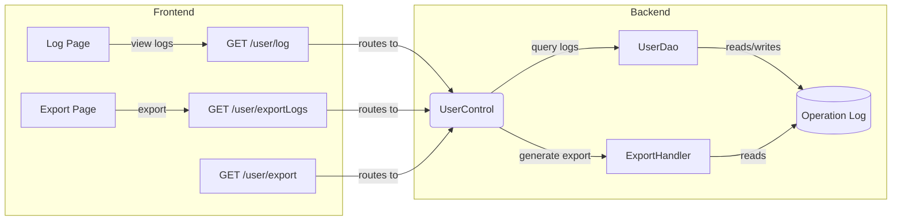
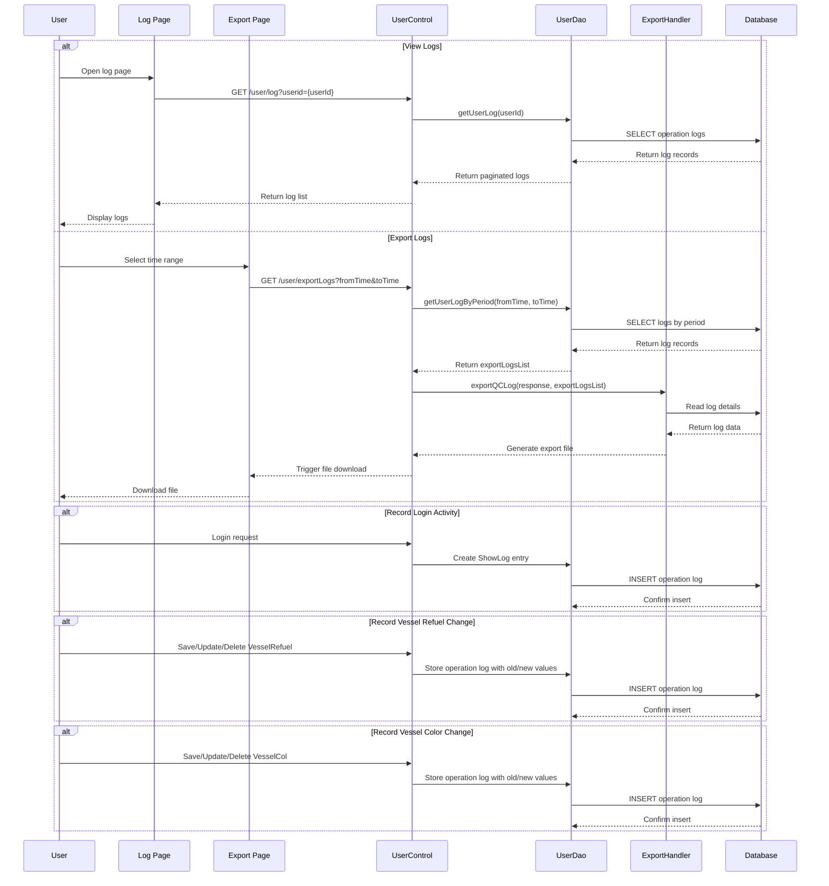

# Operation Log Audit and Export - PRD

[← Back to Overview](../overview.md)

## 概述

本链实现用户操作日志的审计与导出功能，支持查看用户操作日志、按时间段导出日志文件，并自动记录登录活动及船舶加油配置、船舶颜色配置的变更操作。该功能为系统管理员提供完整的操作追溯能力，满足合规审计需求。

**业务目标**：
- 提供用户操作日志的查询与展示功能
- 支持按时间范围导出操作日志为文件
- 自动记录关键业务操作（登录、配置变更）的操作日志
- 确保所有重要操作可追溯、可审计

**作用域**：
- 前端页面：日志查看页面、导出页面
- 后端模块：operation-log 模块
- 共享服务：UserDao（用户数据访问）、ExportHandler（导出处理）
- 跨链依赖：user-authentication、user-administration、vessel-refuel-configuration、vessel-color-configuration

## 流程步骤

| 步骤 | 步骤名称 | 顺序 | 参与模块 | 参与页面 | 触发/转换条件 |
|------|----------|------|----------|----------|---------------|
| 1 | View User Operation Logs | 1 | [operation-log](../../services/operation-log.md) | [log](../../pages/log.md) | GET /user/log?userid={userId} |
| 2 | Export Logs by Time Period | 2 | [operation-log](../../services/operation-log.md) | [export-page](../../pages/export-page.md) | GET /user/exportLogs?fromTime={from}&toTime={to} |
| 3 | Query Logs for Specified Period | 3 | [operation-log](../../services/operation-log.md) | - | UserDao.getUserLogByPeriod(fromTime, toTime) |
| 4 | Generate QC Log Export File | 4 | [operation-log](../../services/operation-log.md) | - | ExportHandler.exportQCLog(response, exportLogsList) |
| 5 | Record Login Activity | 5 | [operation-log](../../services/operation-log.md) | - | Successful login triggers ShowLog creation |
| 6 | Record Vessel Refuel Configuration Changes | 6 | [operation-log](../../services/operation-log.md) | - | SAVE/UPDATE/DELETE on VesselRefuel |
| 7 | Record Vessel Color Configuration Changes | 7 | [operation-log](../../services/operation-log.md) | - | SAVE/UPDATE/DELETE on VesselCol |

## 页面与交互

### log 页面

[log](../../pages/log.md)

- **业务交互**：展示用户操作日志列表，支持分页浏览
- **调用 API**：GET /user/log?userid={userId}
- **数据来源**：UserDao 查询用户操作日志

### export-page 页面

[export-page](../../pages/export-page.md)

- **业务交互**：提供时间范围选择器，触发日志导出功能
- **调用 API**：GET /user/exportLogs?fromTime={from}&toTime={to}
- **数据来源**：UserDao 按时间段查询日志，ExportHandler 生成导出文件

## API 与数据

### GET /user/log

> 📎 Source: src/main/java/com/springMVC/control/UserControl.java → showLog()

**请求参数**：
- userid (query): 用户ID，用于筛选特定用户的操作日志

**响应**：
- 分页的操作日志列表，包含操作时间、操作类型、操作内容等字段

**关联模块**：[operation-log](../../services/operation-log.md)

### GET /user/exportLogs

> 📎 Source: src/main/java/com/springMVC/control/UserControl.java → exportLogs()

**请求参数**：
- fromTime (query): 起始时间
- toTime (query): 结束时间

**响应**：
- 触发日志导出流程，返回导出文件下载链接或直接触发文件下载

**关联模块**：[operation-log](../../services/operation-log.md)

### GET /user/export

> 📎 Source: src/main/java/com/springMVC/control/UserControl.java → export()

**请求参数**：
- 根据具体实现确定

**响应**：
- 通用导出接口，可能用于其他类型的导出功能

**关联模块**：[operation-log](../../services/operation-log.md)

## E2E 数据流



## E2E 时序图



## 跨模块 ER 图

```erDiagram
  OPERATION_LOG ||--o{ USER : "records operations of"
  OPERATION_LOG ||--o{ VESSEL_REFUEL : "tracks changes to"
  OPERATION_LOG ||--o{ VESSEL_COL : "tracks changes to"
  
  USER ||--o{ OPERATION_LOG : "generates"
  VESSEL_REFUEL ||--o{ OPERATION_LOG : "triggers logging on change"
  VESSEL_COL ||--o{ OPERATION_LOG : "triggers logging on change"
```

> See [operation-log](../../services/operation-log.md) for entity field definitions

## 业务规则

1. **日志查询权限**：仅授权用户可查看操作日志，需验证用户身份
2. **日志导出范围**：导出功能仅允许按时间范围筛选，防止全量数据泄露
3. **自动记录规则**：
   - 用户成功登录时自动创建 ShowLog 记录
   - 对 VesselRefuel 实体进行 SAVE/UPDATE/DELETE 操作时，记录操作日志并保存旧值与新值
   - 对 VesselCol 实体进行 SAVE/UPDATE/DELETE 操作时，记录操作日志并保存旧值与新值
4. **分页限制**：日志查询结果需分页返回，避免大数据量影响性能
5. **导出文件格式**：导出的日志文件格式为 QC Log 格式，由 ExportHandler 负责生成

## 集成与依赖

### 共享服务

| 服务 | 用途 | 共享链 |
|------|------|--------|
| UserDao | 用户数据访问，包括操作日志查询与存储 | user-authentication, user-administration, operation-log-audit |
| ExportHandler | 导出文件生成处理，支持 QC Log 格式导出 | operation-log-audit |

### 外部系统

无

### 跨链依赖

| 依赖链 | 依赖内容 | 影响 |
|--------|----------|------|
| user-authentication | 用户登录时触发操作日志记录 | 若认证链异常，可能导致登录日志缺失 |
| user-administration | 用户管理操作可能产生操作日志 | 若用户管理链异常，相关操作日志可能不完整 |
| vessel-refuel-configuration | 船舶加油配置变更时记录操作日志 | 若配置链异常，变更日志可能丢失 |
| vessel-color-configuration | 船舶颜色配置变更时记录操作日志 | 若配置链异常，变更日志可能丢失 |

## 假设与待确认问题

**假设**：
1. 操作日志表结构包含操作时间、操作用户、操作类型、操作内容、旧值、新值等字段
2. ExportHandler 生成的 QC Log 格式符合业务要求的导出规范
3. 用户登录成功后会自动触发 ShowLog 创建逻辑

**待确认问题**：
1. TBD: UserDao.getUserLogByPeriod 的具体查询条件和返回数据结构
2. TBD: ExportHandler.exportQCLog 生成的文件格式细节（CSV/Excel/PDF？）
3. TBD: 操作日志的分页大小和最大导出记录数限制
4. TBD: 是否有日志保留策略或归档机制
5. TBD: 操作日志记录的权限控制粒度（是否区分不同角色的查看权限）
