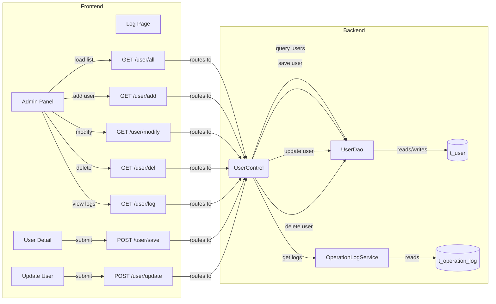
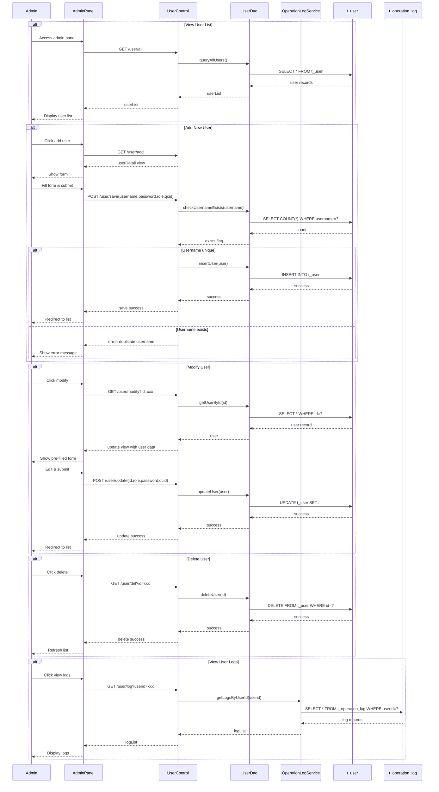

# User Administration and Management - PRD

[← Back to Overview](../overview.md)

## 概述

用户管理链提供完整的用户生命周期管理功能，包括用户列表查看、新增用户、修改用户信息、删除用户以及查看用户操作日志。该链是系统基础管理能力的核心组成部分，为管理员提供对用户账户的集中管控能力。

**业务范围**：
- 用户列表查询与展示
- 新用户创建（包含用户名唯一性校验）
- 现有用户信息修改（角色、密码、QCID）
- 用户删除
- 用户操作日志查看

**涉及模块**：
- [user](../../services/user.md) - 用户管理核心模块
- [operation-log](../../services/operation-log.md) - 操作日志模块

## 流程步骤

| 步骤 | 步骤名称 | 顺序 | 参与模块 | 参与页面 | 触发/转换条件 |
|------|----------|------|----------|----------|---------------|
| 1 | 查看用户列表 | 1 | [user](../../services/user.md) | [admin-panel](../../pages/admin-panel.md) | 管理员访问管理面板 |
| 2 | 添加新用户 | 2 | [user](../../services/user.md) | [user-detail](../../pages/user-detail.md) | 管理员点击添加用户按钮 |
| 3 | 保存用户 | 3 | [user](../../services/user.md) | - | POST /user/save，提交用户名、密码、角色、qcid |
| 4 | 验证用户名唯一性 | 4 | [user](../../services/user.md) | - | 检查用户名是否已存在 |
| 5 | 修改现有用户 | 5 | [user](../../services/user.md) | [update-user](../../pages/update-user.md) | GET /user/modify?id={userId} |
| 6 | 更新用户详情 | 6 | [user](../../services/user.md) | - | POST /user/update，提交角色、密码、qcid |
| 7 | 删除用户 | 7 | [user](../../services/user.md) | - | GET /user/del?id={userId} |
| 8 | 查看用户操作日志 | 8 | [operation-log](../../services/operation-log.md) | [log](../../pages/log.md) | GET /user/log?userid={userId} |

## 页面与交互

### admin-panel

[→ 查看页面 PRD](../../pages/admin-panel.md)

- **主要功能**：展示用户列表，提供用户管理的入口界面
- **关键交互**：
  - 加载时调用 `GET /user/all` 获取所有用户列表
  - 提供"添加用户"按钮，跳转至用户详情页面
  - 每行用户记录提供"修改"和"删除"操作入口
  - 提供查看用户操作日志的链接

### user-detail

[→ 查看页面 PRD](../../pages/user-detail.md)

- **主要功能**：新增用户的表单页面
- **关键交互**：
  - 通过 `GET /user/add` 进入页面
  - 表单字段：用户名、密码、角色、QCID
  - 提交时调用 `POST /user/save` 保存新用户
  - 前端或后端进行用户名唯一性校验

### update-user

[→ 查看页面 PRD](../../pages/update-user.md)

- **主要功能**：修改现有用户信息的表单页面
- **关键交互**：
  - 通过 `GET /user/modify?id={userId}` 加载指定用户信息
  - 可编辑字段：角色、密码、QCID
  - 提交时调用 `POST /user/update` 更新用户信息
  - 更新成功后返回用户列表

### log

[→ 查看页面 PRD](../../pages/log.md)

- **主要功能**：展示指定用户的操作日志记录
- **关键交互**：
  - 通过 `GET /user/log?userid={userId}` 加载日志数据
  - 以列表形式展示日志条目，包含操作时间、操作类型、操作内容等

## API 与数据

### 用户管理 API

#### GET /user/all

- **描述**：获取所有用户列表
- **请求参数**：无
- **响应数据**：用户列表数组，包含用户ID、用户名、角色、QCID等字段
- **关联模块**：[user](../../services/user.md)

#### GET /user/add

- **描述**：进入添加用户页面
- **请求参数**：无
- **响应数据**：返回 userDetail.jsp 视图
- **关联模块**：[user](../../services/user.md)

#### POST /user/save

- **描述**：保存新用户
- **请求参数**：
  - username: 用户名（必填，需唯一）
  - password: 密码（必填）
  - role: 角色（必填）
  - qcid: QCID（可选）
- **响应数据**：保存结果（成功/失败及原因）
- **业务规则**：
  - 用户名必须唯一，重复则拒绝创建
  - 密码需满足复杂度要求
- **关联模块**：[user](../../services/user.md)

#### GET /user/modify

- **描述**：进入修改用户页面，加载指定用户信息
- **请求参数**：
  - id: 用户ID（必填）
- **响应数据**：返回 update.jsp 视图，预填充用户信息
- **关联模块**：[user](../../services/user.md)

#### POST /user/update

- **描述**：更新用户信息
- **请求参数**：
  - id: 用户ID（必填）
  - role: 角色（可选）
  - password: 新密码（可选）
  - qcid: QCID（可选）
- **响应数据**：更新结果（成功/失败及原因）
- **关联模块**：[user](../../services/user.md)

#### GET /user/del

- **描述**：删除指定用户
- **请求参数**：
  - id: 用户ID（必填）
- **响应数据**：删除结果（成功/失败及原因）
- **关联模块**：[user](../../services/user.md)

#### GET /user/log

- **描述**：查看指定用户的操作日志
- **请求参数**：
  - userid: 用户ID（必填）
- **响应数据**：日志列表，包含操作时间、操作类型、操作内容等
- **关联模块**：[operation-log](../../services/operation-log.md)

## E2E 数据流



## E2E 时序图



## 跨模块 ER 图

```erDiagram
USER ||--o{ OPERATION_LOG : "generates"
```

> See [user](../../services/user.md) for entity field definitions  
> See [operation-log](../../services/operation-log.md) for entity field definitions

## 业务规则

1. **用户名唯一性**：系统中不允许存在重复的用户名，新增用户时必须校验用户名唯一性
2. **密码要求**：用户密码需满足系统定义的复杂度要求（具体规则待确认）
3. **角色分配**：用户必须分配有效角色，角色值需在系统预定义的角色范围内
4. **删除保护**：删除用户前需确认是否存在关联数据（如操作日志），避免数据孤岛
5. **日志记录**：用户的增删改操作应被记录到操作日志中，便于审计追踪

## 集成与依赖

### 共享服务

| 服务 | 用途 | 共享链 |
|------|------|--------|
| UserDao | 用户数据持久化操作 | user-administration, user-authentication, operation-log-audit |

### 外部系统

无

### 跨链依赖

| 依赖链 | 依赖内容 | 影响 |
|--------|----------|------|
| user-authentication | 共享 UserDao 服务，用于用户认证时的用户信息查询 | 用户数据结构变更会影响认证流程 |
| operation-log-audit | 共享 UserDao 服务，用于日志审计时关联用户信息 | 用户删除可能导致日志中的用户引用失效 |

## 假设与待确认问题

1. **TBD**: 密码复杂度具体要求是什么？是否有最小长度、特殊字符等限制？
2. **TBD**: 删除用户时是否需要级联处理相关数据（如操作日志）？还是仅做软删除？
3. **TBD**: 角色有哪些预定义值？是否有角色权限矩阵？
4. **TBD**: QCID 字段的业务含义是什么？是否为必填项？
5. **TBD**: 用户列表是否支持分页、搜索、排序功能？
6. **TBD**: 操作日志的记录时机和记录内容规范是什么？