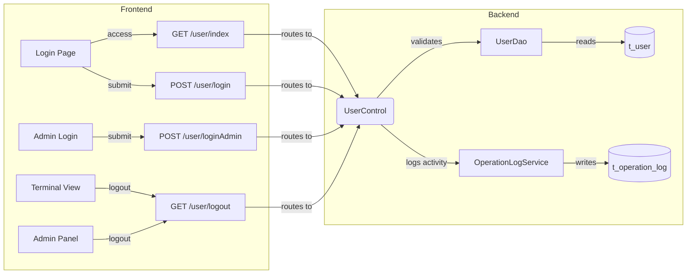
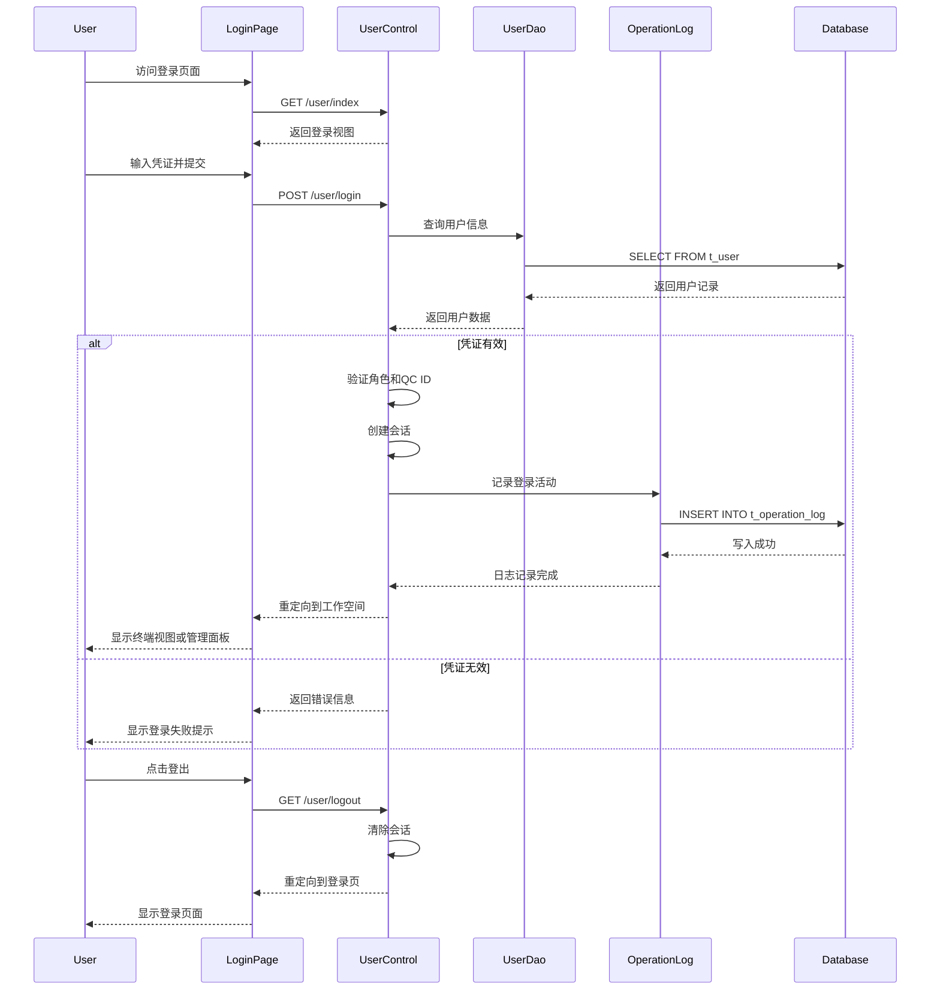

# User Authentication and Session Management - PRD

[← Back to Overview](../overview.md)

## 概述

本链实现用户认证和会话管理功能，支持普通用户和管理员两种角色的登录流程。系统通过验证用户名、密码、角色及QC/HC/C编号来创建用户会话，记录登录活动日志，并根据用户角色重定向到相应的工作空间（普通用户进入终端视图，管理员进入管理面板）。

**业务目标**：提供安全可靠的身份验证机制，确保只有授权用户能够访问系统资源，同时记录所有登录活动以供审计。

**范围**：
- 用户登录页面展示（普通用户和管理员）
- 凭证提交与验证
- 角色和QC ID校验
- 会话创建与管理
- 登录活动日志记录
- 基于角色的页面重定向
- 用户登出与会话清理

**相关模块**：
- [user](../../services/user.md) - 用户认证核心模块
- [operation-log](../../services/operation-log.md) - 操作日志记录模块

## 流程步骤

| 步骤 | 步骤名称 | 顺序 | 参与模块 | 参与页面 | 触发/转换条件 |
|------|----------|------|----------|----------|---------------|
| 1 | 访问登录页面 | 1 | [user](../../services/user.md) | [login](../../pages/login.md) | 用户访问系统入口 |
| 2 | 提交登录凭证 | 2 | [user](../../services/user.md) | [login](../../pages/login.md) | 用户输入用户名、密码、角色和QC/HC/C编号 |
| 3 | 验证用户凭证 | 3 | [user](../../services/user.md) | - | POST /user/login |
| 4 | 验证角色和QC ID | 4 | [user](../../services/user.md) | - | 角色验证和QC ID查找 |
| 5 | 创建用户会话 | 5 | [user](../../services/user.md) | - | 凭证有效且角色匹配 |
| 6 | 记录登录活动 | 6 | [operation-log](../../services/operation-log.md) | - | 登录成功 |
| 7 | 重定向到工作空间 | 7 | [user](../../services/user.md) | [tqcvmt](../../pages/tqcvmt.md) | USER角色重定向到终端视图；ADMIN角色重定向到管理面板 |
| 8 | 登出 | 8 | [user](../../services/user.md) | - | GET /user/logout |

## 页面与交互

### 登录页面 (login)

[login](../../pages/login.md)

- **用途**：普通用户登录入口
- **主要交互**：
  - 用户输入用户名、密码
  - 选择角色类型
  - 输入QC/HC/C编号
  - 提交登录表单
- **跳转逻辑**：登录成功后根据角色重定向

### 管理员登录页面 (login-admin)

[login-admin](../../pages/login-admin.md)

- **用途**：管理员专用登录入口
- **主要交互**：
  - 管理员输入用户名、密码
  - 提交登录表单
- **跳转逻辑**：登录成功后重定向到管理面板

### 终端视图页面 (tqcvmt)

[tqcvmt](../../pages/tqcvmt.md)

- **用途**：普通用户登录后进入的工作空间
- **访问条件**：USER角色认证成功后自动重定向

### 管理面板页面 (admin-panel)

[admin-panel](../../pages/admin-panel.md)

- **用途**：管理员登录后进入的管理界面
- **访问条件**：ADMIN角色认证成功后自动重定向

## API 与数据

### 用户控制器 API

#### GET /user/index

- **描述**：访问用户首页/登录页面
- **请求参数**：无
- **响应**：返回登录页面视图
- **关联模块**：[user](../../services/user.md)

#### POST /user/login

- **描述**：普通用户登录接口
- **请求参数**：
  - username: 用户名
  - password: 密码
  - role: 角色类型
  - qcId: QC/HC/C编号
- **响应**：
  - 成功：创建会话，返回重定向指令
  - 失败：返回错误信息
- **关联模块**：[user](../../services/user.md)

#### POST /user/loginAdmin

- **描述**：管理员登录接口
- **请求参数**：
  - username: 管理员用户名
  - password: 密码
- **响应**：
  - 成功：创建管理员会话，返回重定向指令
  - 失败：返回错误信息
- **关联模块**：[user](../../services/user.md)

#### GET /user/logout

- **描述**：用户登出接口
- **请求参数**：无
- **响应**：清除会话，重定向到登录页面
- **关联模块**：[user](../../services/user.md)

#### GET /user/changeLan

- **描述**：切换语言设置
- **请求参数**：
  - lang: 目标语言代码
- **响应**：更新语言设置，返回当前页面
- **关联模块**：[user](../../services/user.md)

## E2E 数据流



## E2E 时序图



## 跨模块 ER 图

```erDiagram
  USER ||--o{ OPERATION_LOG : "generates"
  USER {
  }
  OPERATION_LOG {
  }
```

> 实体字段定义详见：[user](../../services/user.md)、[operation-log](../../services/operation-log.md)

## 业务规则

1. **角色验证规则**：
   - 普通用户必须提供有效的QC/HC/C编号
   - 管理员无需QC编号，但需要特殊权限验证

2. **会话创建规则**：
   - 仅当用户名、密码、角色全部匹配时创建会话
   - 会话包含用户ID、角色、QC编号等关键信息

3. **重定向规则**：
   - USER角色认证成功后重定向到终端视图(tqcvmt)
   - ADMIN角色认证成功后重定向到管理面板(admin-panel)

4. **日志记录规则**：
   - 每次成功登录必须记录操作日志
   - 日志包含用户ID、登录时间、IP地址等信息

5. **登出规则**：
   - 登出时必须完全清除会话数据
   - 重定向回登录页面

## 集成与依赖

### 共享服务

| 服务 | 用途 | 共享链 |
|------|------|--------|
| UserDao | 用户数据访问，提供用户查询和验证功能 | user-authentication, user-administration, operation-log-audit |

### 外部系统

无

### 跨链依赖

| 依赖链 | 依赖内容 | 影响 |
|--------|----------|------|
| user-administration | 共享UserDao服务进行用户数据查询 | UserDao不可用将导致用户管理功能失效 |
| operation-log-audit | 共享UserDao和用户认证能力 | 用户认证失败将影响操作日志的用户关联 |

## 假设与待确认问题

### 假设

1. 系统使用传统的JSP + Spring MVC架构
2. 会话管理基于HTTP Session机制
3. 密码存储采用加密方式（具体算法待确认）
4. QC/HC/C编号是特定业务领域的标识符

### 待确认问题

1. TBD: 密码加密算法是什么？（MD5/SHA/Bcrypt等）
2. TBD: 会话超时时间配置是多少？
3. TBD: 是否支持记住我（Remember Me）功能？
4. TBD: 是否有登录失败次数限制和账户锁定机制？
5. TBD: QC/HC/C编号的具体业务含义和验证规则是什么？
6. TBD: 是否支持多语言切换的具体语言列表？
7. TBD: 操作日志记录的具体字段有哪些？
