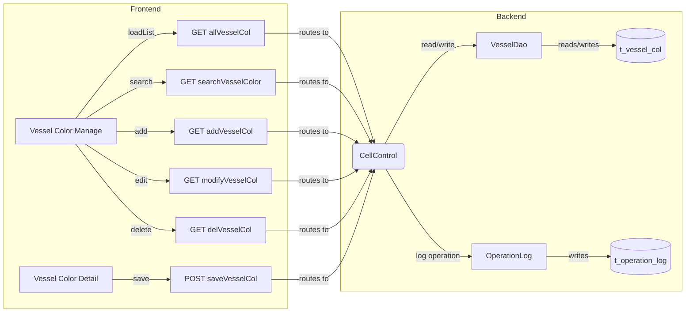
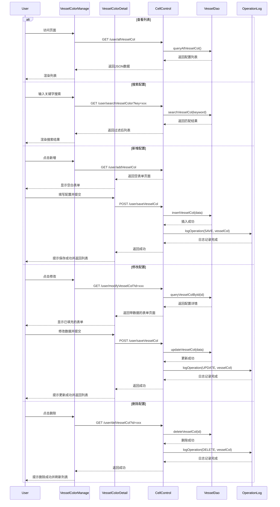

# Vessel Color and Bay/Row Configuration - PRD

[← Back to Overview](../overview.md)

## 概述

本链实现船舶颜色配置和舱位（Bay/Row）管理功能，允许用户查看、搜索、新增、修改和删除船舶的颜色配置信息。配置内容包括船舶ID、甲板/货舱、Bay编号、Row范围、Tier范围等空间位置信息，用于可视化展示船舶装载状态。

**业务目标**：为船舶装载管理提供可视化的颜色标识配置能力，支持按Bay/Row/Tier维度定义不同区域的颜色标记。

**涉及模块**：
- [cell](../../services/cell.md) - 核心业务模块，处理颜色配置的CRUD操作
- [operation-log](../../services/operation-log.md) - 操作日志模块，记录所有配置变更操作

**共享服务**：VesselDao（被 vessel-configuration、vessel-refuel-configuration 等链共享）

## 流程步骤

| 步骤 | 步骤名称 | 顺序 | 参与模块 | 参与页面 | 触发/转换条件 |
|------|----------|------|----------|----------|---------------|
| view-vessel-color-list | 查看船舶颜色配置列表 | 1 | [cell](../../services/cell.md) | [vessel-color-manage](../../pages/vessel-color-manage.md) | 进入页面时自动加载 |
| search-vessel-color | 搜索船舶颜色配置 | 2 | [cell](../../services/cell.md) | [vessel-color-manage](../../pages/vessel-color-manage.md) | GET /user/searchVesselColor?key={keyword} |
| add-vessel-color | 新增船舶颜色配置 | 3 | [cell](../../services/cell.md) | [vessel-color-detail](../../pages/vessel-color-detail.md) | GET /user/addVesselCol |
| modify-vessel-color | 修改船舶颜色配置 | 4 | [cell](../../services/cell.md) | [vessel-color-detail](../../pages/vessel-color-detail.md) | GET /user/modifyVesselCol?id={colId} |
| save-vessel-color | 保存船舶颜色配置 | 5 | [cell](../../services/cell.md) | - | POST /user/saveVesselCol（参数：vesselid, deck_hold, bay, rowStart/End, tierStart/End） |
| log-color-operation | 记录颜色配置操作日志 | 6 | [operation-log](../../services/operation-log.md) | - | SAVE/UPDATE/DELETE 操作触发 |
| delete-vessel-color | 删除船舶颜色配置 | 7 | [cell](../../services/cell.md) | - | GET /user/delVesselCol?id={colId} |

## 页面与交互

### vessel-color-manage

[vessel-color-manage](../../pages/vessel-color-manage.md) - 船舶颜色配置列表页

**主要交互**：
- 页面加载时调用 `GET /user/allVesselCol` 获取全部颜色配置列表
- 支持关键字搜索，调用 `GET /user/searchVesselColor?key={keyword}` 过滤结果
- 点击"新增"按钮跳转到 `GET /user/addVesselCol` 进入详情页
- 点击某条记录的"修改"按钮跳转到 `GET /user/modifyVesselCol?id={colId}` 进入编辑页
- 点击某条记录的"删除"按钮调用 `GET /user/delVesselCol?id={colId}` 执行删除

### vessel-color-detail

[vessel-color-detail](../../pages/vessel-color-detail.md) - 船舶颜色配置详情页（新增/编辑共用）

**主要交互**：
- 新增模式：通过 `GET /user/addVesselCol` 进入，表单为空
- 编辑模式：通过 `GET /user/modifyVesselCol?id={colId}` 进入，加载已有配置数据
- 填写字段：船舶ID（vesselid）、甲板/货舱（deck_hold）、Bay编号（bay）、Row起始/结束（rowStart/rowEnd）、Tier起始/结束（tierStart/tierEnd）
- 提交表单调用 `POST /user/saveVesselCol` 保存配置

## API 与数据

### CellControl 控制器 API

| API路径 | 方法 | 处理器 | 说明 | 关联模块PRD |
|---------|------|--------|------|-------------|
| /user/allVesselCol | GET | getVesselCol() | 获取全部船舶颜色配置列表 | [cell](../../services/cell.md) |
| /user/searchVesselColor | GET | searchVesselCol() | 按关键字搜索船舶颜色配置 | [cell](../../services/cell.md) |
| /user/addVesselCol | GET | addVesselBayColor() | 进入新增颜色配置页面 | [cell](../../services/cell.md) |
| /user/modifyVesselCol | GET | modVesselCol() | 进入修改颜色配置页面（加载已有数据） | [cell](../../services/cell.md) |
| /user/saveVesselCol | POST | saveOrUpdateVesselCol() | 保存或更新颜色配置 | [cell](../../services/cell.md) |
| /user/delVesselCol | GET | delVesselCol() | 删除指定颜色配置 | [cell](../../services/cell.md) |

### 请求/响应字段定义

**POST /user/saveVesselCol 请求参数**：
- vesselid: 船舶ID
- deck_hold: 甲板/货舱标识
- bay: Bay编号
- rowStart: Row起始位置
- rowEnd: Row结束位置
- tierStart: Tier起始位置
- tierEnd: Tier结束位置

> 📎 Source: src/main/java/com/springMVC/control/CellControl.java → saveOrUpdateVesselCol()

## E2E 数据流



## E2E 时序图



## 跨模块 ER 图

```erDiagram
  VESSEL_COL ||--o{ OPERATION_LOG : "triggers"
```

> 实体字段定义详见：[cell](../../services/cell.md)、[operation-log](../../services/operation-log.md)

## 业务规则

1. **唯一性约束**：同一船舶的同一Bay/Row/Tier组合不应存在重复的颜色配置
2. **范围有效性**：rowStart ≤ rowEnd，tierStart ≤ tierEnd
3. **必填字段**：vesselid、deck_hold、bay 为必填项
4. **操作日志**：所有SAVE、UPDATE、DELETE操作必须记录到操作日志模块
5. **删除保护**：删除前应确认该配置未被其他业务引用

## 集成与依赖

### 共享服务

| 服务 | 用途 | 共享链 |
|------|------|--------|
| VesselDao | 船舶数据访问层，提供船舶相关数据的CRUD操作 | vessel-configuration, vessel-refuel-configuration, vessel-color-configuration |

### 外部系统

无

### 跨链依赖

| 依赖链 | 依赖内容 | 影响 |
|--------|----------|------|
| vessel-configuration | 共享 VesselDao 服务，可能依赖相同的船舶基础数据表 | VesselDao 接口变更会影响本链 |
| vessel-refuel-configuration | 共享 VesselDao 服务 | VesselDao 接口变更会影响本链 |

## 假设与待确认问题

1. TBD: VesselDao 的具体实现细节（查询条件、排序规则等）需要阅读源码确认
2. TBD: t_vessel_col 表的具体字段定义和索引策略
3. TBD: 操作日志模块记录的具体字段格式和存储方式
4. TBD: 是否存在并发控制机制（如乐观锁）防止多人同时修改同一配置
5. TBD: 删除操作是否有软删除标记还是物理删除