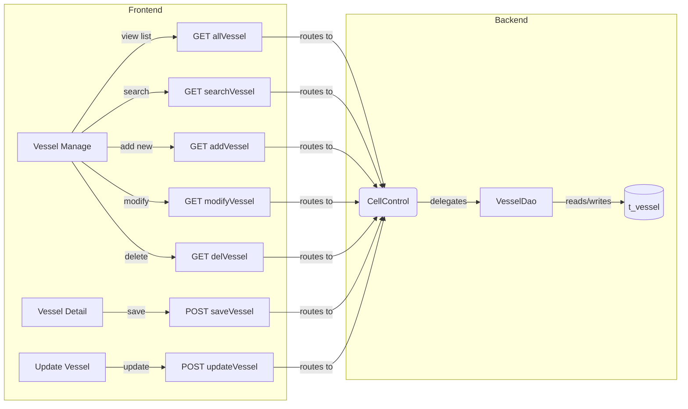
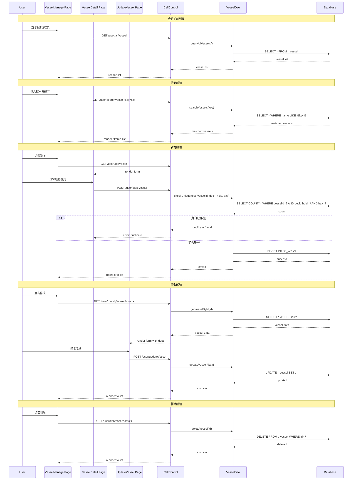

# 船舶配置管理 (Vessel Configuration Management)

[← Back to Overview](../overview.md)

## 概述

本链实现船舶配置的完整管理流程，包括船舶列表查看、搜索、新增、修改和删除功能。用户通过前端页面管理船舶的基本信息及其舱位结构（甲板/货舱、Bay、Row、Tier），系统确保船舶配置的唯一性约束（vesselid + deck_hold + bay 组合不可重复）。

**业务目标**：为集装箱码头作业提供准确的船舶舱位结构数据，支持后续的配载计划和装卸作业。

**范围**：
- 船舶基本信息管理（船名、编号等）
- 船舶舱位结构配置（deck_hold、bay、row、tier 范围）
- 船舶配置的唯一性校验
- 与加油配置链、颜色配置链共享 VesselDao 服务

## 流程步骤

| 步骤 | 步骤名称 | 顺序 | 参与模块 | 参与页面 | 触发/转换条件 |
|------|----------|------|----------|----------|---------------|
| 1 | 查看船舶列表 | 1 | [cell](../../services/cell.md) | [vessel-manage](../../pages/vessel-manage.md) | 进入船舶管理页面 |
| 2 | 搜索船舶 | 2 | [cell](../../services/cell.md) | [vessel-manage](../../pages/vessel-manage.md) | GET /user/searchVessel?key={keyword} |
| 3 | 新增船舶 | 3 | [cell](../../services/cell.md) | [vessel-detail](../../pages/vessel-detail.md) | GET /user/addVessel |
| 4 | 保存船舶配置 | 4 | [cell](../../services/cell.md) | - | POST /user/saveVessel with vesselid, deck_hold, bay, rowStart/End, tierStart/End |
| 5 | 验证船舶唯一性 | 5 | [cell](../../services/cell.md) | - | 检查 vesselid+deck_hold+bay 组合是否存在 |
| 6 | 修改船舶 | 6 | [cell](../../services/cell.md) | [update-vessel](../../pages/update-vessel.md) | GET /user/modifyVessel?id={vesselId} |
| 7 | 更新船舶详情 | 7 | [cell](../../services/cell.md) | - | POST /user/updateVessel |
| 8 | 删除船舶 | 8 | [cell](../../services/cell.md) | - | GET /user/delVessel?id={vesselId} |

## 页面与交互

### vessel-manage（船舶管理页）

[→ 查看详细 PRD](../../pages/vessel-manage.md)

**主要交互**：
- 展示船舶列表
- 支持按关键字搜索船舶
- 提供新增、修改、删除操作入口

### vessel-detail（船舶详情页）

[→ 查看详细 PRD](../../pages/vessel-detail.md)

**主要交互**：
- 新增船舶时填写船舶基本信息
- 配置舱位结构参数（deck_hold、bay、row 范围、tier 范围）

### update-vessel（更新船舶页）

[→ 查看详细 PRD](../../pages/update-vessel.md)

**主要交互**：
- 加载现有船舶数据进行编辑
- 更新船舶配置信息

## API 与数据

### GET /user/allVessel

获取所有船舶列表。

**请求参数**：无

**响应数据**：船舶列表数组

> 📎 Source: src/main/java/com/springMVC/control/CellControl.java → getVessel()

[→ 查看模块级 API 详情](../../services/cell.md)

### GET /user/searchVessel

按关键字搜索船舶。

**请求参数**：
- `key` (query): 搜索关键字

**响应数据**：匹配的船舶列表

> 📎 Source: src/main/java/com/springMVC/control/CellControl.java → searchCompanyTractor()

[→ 查看模块级 API 详情](../../services/cell.md)

### GET /user/addVessel

进入新增船舶页面。

**请求参数**：无

**响应数据**：返回 vessel-detail.jsp 视图

> 📎 Source: src/main/java/com/springMVC/control/CellControl.java → addVessel()

[→ 查看模块级 API 详情](../../services/cell.md)

### POST /user/saveVessel

保存新船舶配置。

**请求参数**：
- `vesselid`: 船舶编号
- `deck_hold`: 甲板/货舱标识
- `bay`: Bay 编号
- `rowStart`: Row 起始值
- `rowEnd`: Row 结束值
- `tierStart`: Tier 起始值
- `tierEnd`: Tier 结束值

**响应数据**：保存结果（成功/失败）

> 📎 Source: src/main/java/com/springMVC/control/CellControl.java → saveVessel()

[→ 查看模块级 API 详情](../../services/cell.md)

### GET /user/modifyVessel

进入修改船舶页面。

**请求参数**：
- `id` (query): 船舶 ID

**响应数据**：返回 update-vessel.jsp 视图，携带船舶数据

> 📎 Source: src/main/java/com/springMVC/control/CellControl.java → modVessel()

[→ 查看模块级 API 详情](../../services/cell.md)

### POST /user/updateVessel

更新船舶配置。

**请求参数**：船舶更新数据（同 saveVessel 参数结构）

**响应数据**：更新结果

> 📎 Source: src/main/java/com/springMVC/control/CellControl.java → updateVessel()

[→ 查看模块级 API 详情](../../services/cell.md)

### GET /user/delVessel

删除船舶配置。

**请求参数**：
- `id` (query): 船舶 ID

**响应数据**：删除结果

> 📎 Source: src/main/java/com/springMVC/control/CellControl.java → delVessel()

[→ 查看模块级 API 详情](../../services/cell.md)

## E2E 数据流



## E2E 时序图



## 跨模块 ER 图

```erDiagram
  VESSEL ||--o{ VESSEL_REFUEL : "has"
  VESSEL ||--o{ VESSEL_COLOR : "has"
```

> 实体字段定义详见 [cell](../../services/cell.md) 模块级文档

## 业务规则

1. **唯一性约束**：同一船舶的 vesselid + deck_hold + bay 组合必须唯一，不允许重复配置
2. **舱位范围有效性**：rowStart ≤ rowEnd，tierStart ≤ tierEnd
3. **删除前置检查**：删除船舶前应检查是否存在关联的加油配置或颜色配置（来自共享链依赖）
4. **搜索模糊匹配**：搜索关键字对船舶名称进行模糊匹配

## 集成与依赖

### 共享服务

| 服务 | 用途 | 共享链 |
|------|------|--------|
| VesselDao | 船舶数据访问层，提供 CRUD 操作 | vessel-configuration, vessel-refuel-configuration, vessel-color-configuration |

### 外部系统

无

### 跨链依赖

| 依赖链 | 依赖内容 | 影响 |
|--------|----------|------|
| vessel-refuel-configuration | 共享 VesselDao 服务，可能依赖本链创建的船舶基础数据 | 若船舶被删除，加油配置可能失效 |
| vessel-color-configuration | 共享 VesselDao 服务，可能依赖本链创建的船舶基础数据 | 若船舶被删除，颜色配置可能失效 |

## 假设与待确认问题

1. **TBD**: VesselDao 的具体实现细节（SQL 查询语句、表结构）需要阅读源代码确认
2. **TBD**: 删除船舶时是否有级联删除或前置校验逻辑（检查关联的加油/颜色配置）
3. **TBD**: 唯一性校验是在 Controller 层还是 Service/DAO 层执行
4. **TBD**: 错误处理机制（如重复保存时的具体错误提示）
5. **假设**: 船舶配置数据存储在关系型数据库中，表名为 t_vessel 或类似命名