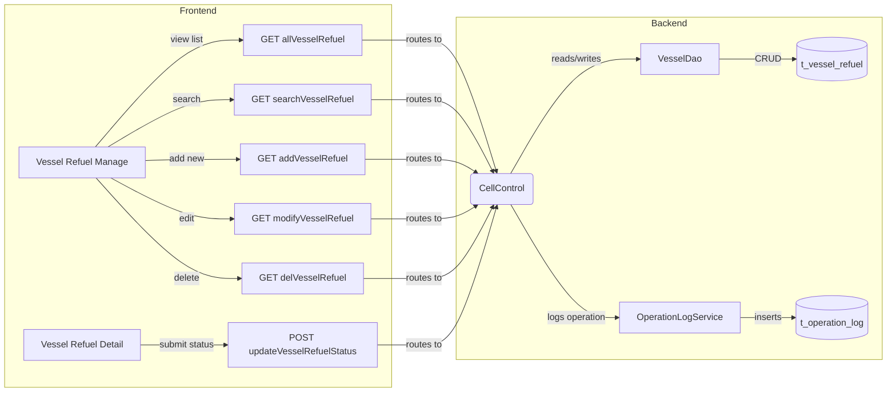
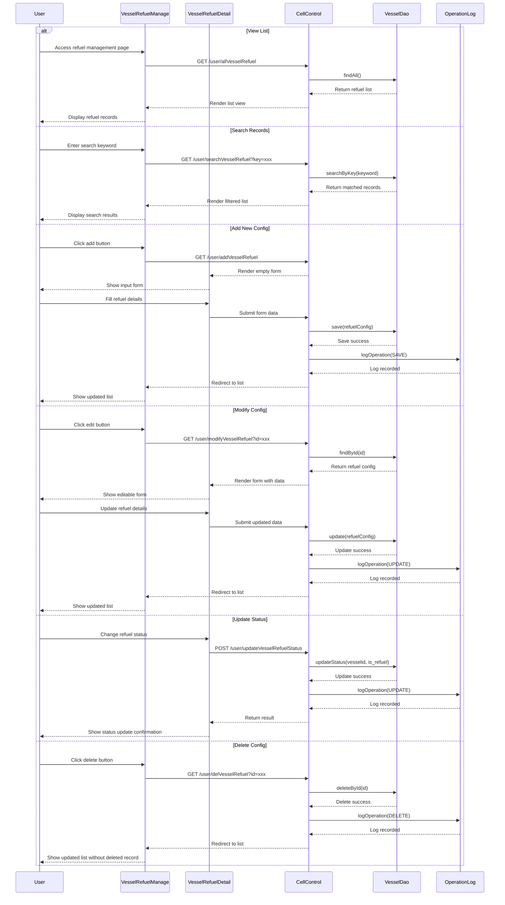
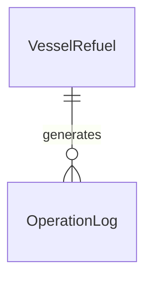

# Vessel Refuel Configuration - PRD

[← Back to Overview](../overview.md)

## 概述

船舶加油配置管理业务流程，用于管理船舶的加油配置信息。该流程支持查看加油记录列表、搜索加油记录、新增加油配置、修改加油配置、更新加油状态以及删除加油配置等操作。系统会自动记录所有操作日志以确保审计追踪。

**业务目标**：提供完整的船舶加油配置生命周期管理能力，包括配置的增删改查和状态管理。

**业务范围**：
- 船舶加油配置列表查看与搜索
- 加油配置的新增与修改
- 加油状态的更新
- 加油配置的删除
- 操作日志自动记录（通过 operation-log 模块）

**相关模块**：
- [cell](../../services/cell.md) - 核心业务模块，处理加油配置的 CRUD 操作
- [operation-log](../../services/operation-log.md) - 操作日志模块，记录所有配置变更

## 流程步骤

| 步骤 | 步骤名称 | 顺序 | 参与模块 | 参与页面 | 触发条件/转换条件 | 下一步 |
|------|----------|------|----------|----------|-------------------|--------|
| 1 | 查看船舶加油列表 | 1 | [cell](../../services/cell.md) | [vessel-refuel-manage](../../pages/vessel-refuel-manage.md) | 访问加油管理页面 | 选择加油操作 |
| 2 | 搜索加油记录 | 2 | [cell](../../services/cell.md) | [vessel-refuel-manage](../../pages/vessel-refuel-manage.md) | GET /user/searchVesselRefuel?key={keyword} | 显示过滤结果 |
| 3 | 新增加油配置 | 3 | [cell](../../services/cell.md) | [vessel-refuel-detail](../../pages/vessel-refuel-detail.md) | GET /user/addVesselRefuel | 输入加油详情 |
| 4 | 修改加油配置 | 4 | [cell](../../services/cell.md) | [vessel-refuel-detail](../../pages/vessel-refuel-detail.md) | GET /user/modifyVesselRefuel?id={refuelId} | 更新加油状态 |
| 5 | 保存加油状态 | 5 | [cell](../../services/cell.md) | - | POST /user/updateVesselRefuelStatus (vesselid, is_refuel) | 记录操作日志 |
| 6 | 记录加油操作 | 6 | [operation-log](../../services/operation-log.md) | - | 对 VesselRefuel 执行 SAVE/UPDATE/DELETE 操作 | 返回加油列表 |
| 7 | 删除加油配置 | 7 | [cell](../../services/cell.md) | - | GET /user/delVesselRefuel?id={refuelId} | 记录删除并返回列表 |

## 页面与交互

### vessel-refuel-manage（船舶加油管理页）

[→ 查看详细 PRD](../../pages/vessel-refuel-manage.md)

**主要功能**：
- 展示船舶加油配置列表
- 支持按关键字搜索加油记录
- 提供新增、修改、删除操作的入口

**用户交互**：
- 点击"新增"按钮 → 跳转到加油配置详情页（新增模式）
- 点击某条记录的"修改"按钮 → 跳转到加油配置详情页（编辑模式）
- 点击某条记录的"删除"按钮 → 确认删除后调用删除接口
- 在搜索框输入关键字 → 实时或点击搜索后过滤列表

### vessel-refuel-detail（船舶加油配置详情页）

[→ 查看详细 PRD](../../pages/vessel-refuel-detail.md)

**主要功能**：
- 新增模式下：展示空白表单供用户输入加油配置信息
- 编辑模式下：加载现有加油配置数据并允许修改

**用户交互**：
- 填写/修改加油配置字段
- 提交表单 → 调用相应的保存接口
- 取消操作 → 返回加油列表页

## API 与数据

### API 端点列表

| API 路径 | 方法 | 处理器 | 所属模块 | 说明 |
|----------|------|--------|----------|------|
| /user/allVesselRefuel | GET | getVesselRefuel() | [cell](../../services/cell.md) | 获取所有船舶加油配置列表 |
| /user/searchVesselRefuel | GET | searchVesselRefuel() | [cell](../../services/cell.md) | 按关键字搜索加油记录 |
| /user/addVesselRefuel | GET | addVesselRefuel() | [cell](../../services/cell.md) | 进入新增加油配置页面 |
| /user/modifyVesselRefuel | GET | updateVesselRefuel() | [cell](../../services/cell.md) | 进入修改加油配置页面 |
| /user/updateVesselRefuelStatus | POST | updateVesselRefuelStatus() | [cell](../../services/cell.md) | 更新加油状态 |
| /user/delVesselRefuel | GET | delVesselRefuel() | [cell](../../services/cell.md) | 删除加油配置 |

### 请求/响应定义

#### GET /user/allVesselRefuel

**请求参数**：无

**响应数据**：船舶加油配置列表

> 📎 Source: src/main/java/com/springMVC/control/CellControl.java → getVesselRefuel()

#### GET /user/searchVesselRefuel

**请求参数**：
- key (String): 搜索关键字

**响应数据**：匹配的加油配置列表

> 📎 Source: src/main/java/com/springMVC/control/CellControl.java → searchVesselRefuel()

#### GET /user/addVesselRefuel

**请求参数**：无

**响应数据**：新增页面视图

> 📎 Source: src/main/java/com/springMVC/control/CellControl.java → addVesselRefuel()

#### GET /user/modifyVesselRefuel

**请求参数**：
- id (Long/String): 加油配置ID

**响应数据**：编辑页面视图，包含现有配置数据

> 📎 Source: src/main/java/com/springMVC/control/CellControl.java → updateVesselRefuel()

#### POST /user/updateVesselRefuelStatus

**请求参数**：
- vesselid: 船舶ID
- is_refuel: 加油状态标识

**响应数据**：操作结果

> 📎 Source: src/main/java/com/springMVC/control/CellControl.java → updateVesselRefuelStatus()

#### GET /user/delVesselRefuel

**请求参数**：
- id: 加油配置ID

**响应数据**：删除操作结果

> 📎 Source: src/main/java/com/springMVC/control/CellControl.java → delVesselRefuel()

## E2E 数据流

## E2E 时序图

## 跨模块 ER 图

> See [cell](../../services/cell.md) for VesselRefuel entity field definitions
> See [operation-log](../../services/operation-log.md) for OperationLog entity field definitions

## 业务规则

1. **加油配置唯一性**：同一船舶在同一时间段内不应存在重复的加油配置记录
2. **状态更新权限**：只有授权用户可以更新船舶的加油状态
3. **操作日志完整性**：所有对加油配置的增删改操作必须自动记录到操作日志模块
4. **删除保护**：删除加油配置前需确认，删除后不可恢复
5. **搜索模糊匹配**：搜索功能应支持关键字的模糊匹配

## 集成与依赖

### 共享服务

| 服务 | 用途 | 共享链 |
|------|------|--------|
| VesselDao | 船舶数据访问层，提供加油配置的 CRUD 操作 | vessel-configuration, vessel-color-configuration, vessel-refuel-configuration |

### 外部系统

无

### 跨链依赖

| 依赖链 | 依赖内容 | 影响 |
|--------|----------|------|
| vessel-configuration | 共享 VesselDao 服务，可能依赖相同的船舶基础数据 | VesselDao 变更会影响所有使用该服务的链 |
| vessel-color-configuration | 共享 VesselDao 服务 | VesselDao 变更会影响所有使用该服务的链 |
| operation-log | 依赖操作日志记录能力 | operation-log 模块不可用时，配置操作将无法记录审计日志 |

## 假设与待确认问题

### 假设

1. VesselDao 提供了完整的 CRUD 方法来操作加油配置数据
2. operation-log 模块能够自动捕获并记录所有配置变更操作
3. 加油配置数据存储在关系型数据库中

### 待确认问题

1. TBD: 加油配置实体的具体字段结构是什么？需要查看 VesselRefuel 实体定义
2. TBD: updateVesselRefuelStatus 接口的具体业务逻辑是什么？is_refuel 字段的取值范围和业务含义
3. TBD: 搜索功能支持的搜索字段有哪些？是否支持多字段组合搜索？
4. TBD: 删除操作是否有级联影响？是否会删除相关的操作日志或其他关联数据？
5. TBD: 是否存在并发控制机制？多个用户同时修改同一加油配置时的处理方式
