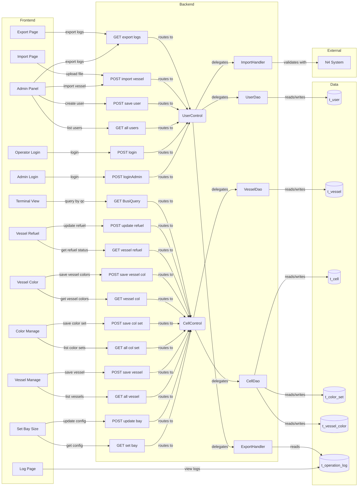
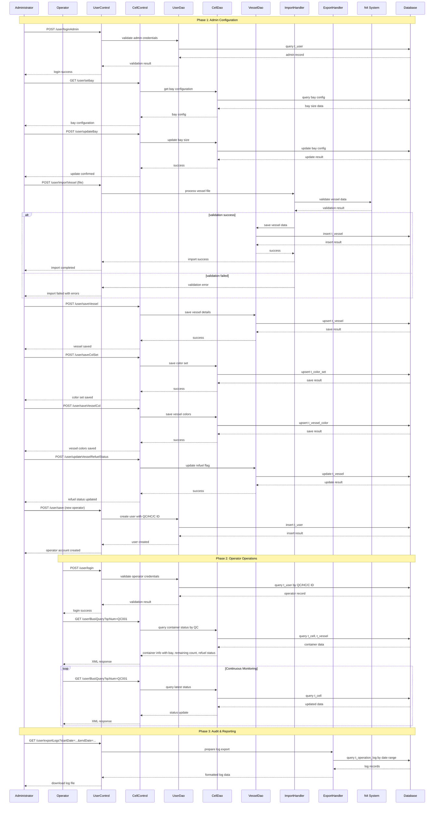
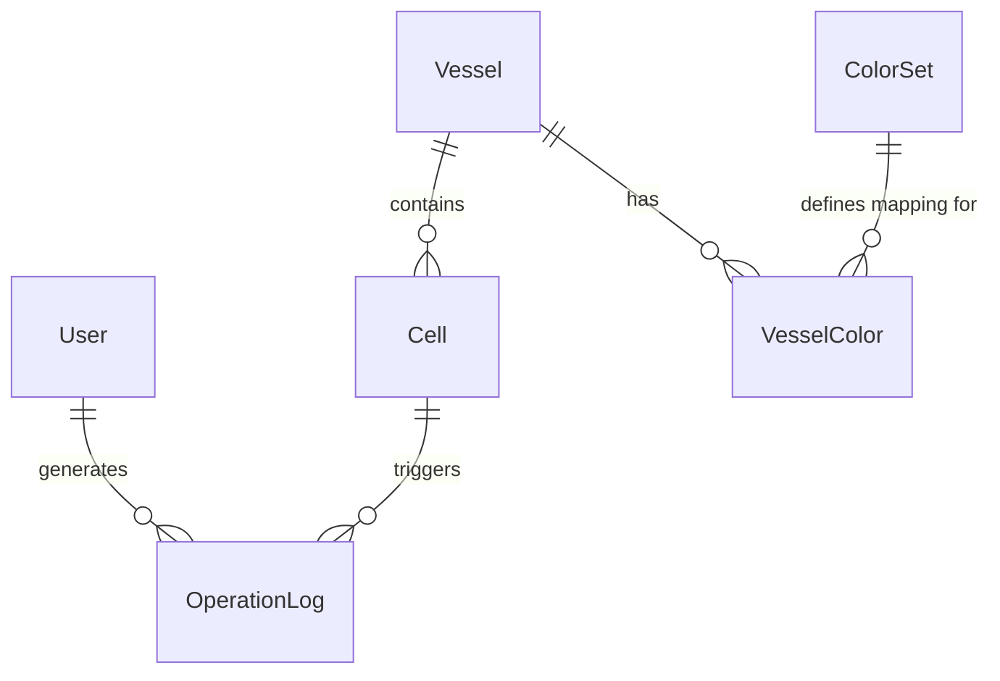

# Vessel Terminal Operations Lifecycle - PRD

[← Back to Overview](../overview.md)

## 概述 (Overview)

本业务链管理码头船舶集装箱操作的完整生命周期，从管理员配置终端参数、导入船舶数据、设置颜色编码方案，到操作员实时监控集装箱装卸作业。系统通过N4系统集成获取船舶基础数据，提供可视化的集装箱位置矩阵展示，支持按QC（岸桥）编号查询作业状态，并记录所有操作日志用于审计。

**业务目标：**
- 实现码头集装箱位置的可视化监控与管理
- 支持多角色（管理员/操作员）的权限分离与协作
- 通过颜色编码快速识别集装箱类型与状态
- 集成N4系统确保船舶数据准确性
- 提供完整的操作审计追踪能力

**业务范围：**
- 用户认证与权限管理（管理员/操作员）
- 终端Bay尺寸配置
- 船舶数据导入与配置（Bay/Row/Tier结构）
- 颜色集管理与船舶特定颜色配置
- 船舶加油状态管理
- 操作员账户创建与QC/HC/C编号分配
- 实时集装箱状态监控与查询
- 操作日志记录与导出

## 流程步骤 (Process Steps)

| 步骤 | 步骤名称 | 顺序 | 参与模块 | 参与页面 | 触发条件/转换条件 |
|------|----------|------|----------|----------|-------------------|
| 1 | 管理员登录 | 1 | [user](../../services/user.md) | [login-admin](../../pages/login-admin.md) | 管理员使用凭证登录系统 |
| 2 | 配置终端Bay尺寸 | 2 | [cell](../../services/cell.md) | [setbaysize](../../pages/setbaysize.md) | 设置Hold层的Cell矩阵尺寸 |
| 3 | 从N4导入船舶数据 | 3 | [user](../../services/user.md) | [import-page](../../pages/import-page.md) | 上传船舶文件并通过N4系统验证 |
| 4 | 配置船舶Bay/Row/Tier详情 | 4 | [cell](../../services/cell.md) | [vessel-manage](../../pages/vessel-manage.md) | 添加/修改船舶，设置deck_hold、bay、rowStart/End、tierStart/End |
| 5 | 配置集装箱类型颜色集 | 5 | [cell](../../services/cell.md) | [color-manage](../../pages/color-manage.md) | 定义boxcase到颜色的映射关系 |
| 6 | 配置船舶特定Bay/Row颜色 | 6 | [cell](../../services/cell.md) | [vessel-color-manage](../../pages/vessel-color-manage.md) | 为特定船舶的Bay/Row/Tier设置颜色编码 |
| 7 | 配置船舶加油状态 | 7 | [cell](../../services/cell.md) | [vessel-refuel-manage](../../pages/vessel-refuel-manage.md) | 设置需要加油的船舶is_refuel标志 |
| 8 | 创建QC/HC/C操作员账户 | 8 | [user](../../services/user.md) | [admin-panel](../../pages/admin-panel.md) | 添加USER角色用户并分配QC/HC/C编号 |
| 9 | 操作员使用QC/HC/C编号登录 | 9 | [user](../../services/user.md) | [login](../../pages/login.md) | USER角色用户使用有效的QC/HC/C编号登录 |
| 10 | 查看终端集装箱状态 | 10 | [cell](../../services/cell.md) | [tqcvmt](../../pages/tqcvmt.md) | 显示带颜色编码的Cell矩阵 |
| 11 | 按QC编号查询集装箱作业 | 11 | [cell](../../services/cell.md) | - | GET /user/BusiQuery?qcNum={qcNum}返回包含Bay信息、剩余集装箱、加油状态的XML |
| 12 | 监控实时集装箱作业 | 12 | [cell](../../services/cell.md) | - | 持续轮询获取集装箱状态更新 |
| 13 | 查看操作日志 | 13 | [operation-log](../../services/operation-log.md) | [log](../../pages/log.md) | 查看用户活动日志和配置变更记录 |
| 14 | 导出操作报告 | 14 | [operation-log](../../services/operation-log.md) | [export-page](../../pages/export-page.md) | 按时间段导出日志用于审计 |

## 页面与交互 (Pages & Interactions)

### 管理员相关页面

#### [login-admin](../../pages/login-admin.md) - 管理员登录页
- **主要模块**: [user](../../services/user.md)
- **业务交互**: 管理员输入用户名和密码进行身份验证
- **调用API**: POST /user/loginAdmin

#### [admin-panel](../../pages/admin-panel.md) - 管理员控制面板
- **主要模块**: [user](../../services/user.md)
- **业务交互**: 
  - 查看所有用户列表
  - 创建新用户（QC/HC/C操作员）
  - 导入船舶数据文件
  - 导出操作日志
- **调用API**: 
  - GET /user/all - 获取所有用户
  - POST /user/save - 保存新用户
  - POST /user/importVessel - 导入船舶数据
  - GET /user/exportLogs - 导出日志

#### [import-page](../../pages/import-page.md) - 船舶数据导入页
- **主要模块**: [user](../../services/user.md)
- **业务交互**: 上传船舶数据文件，系统验证并与N4系统对接
- **调用API**: POST /user/importVessel

### 终端配置页面

#### [setbaysize](../../pages/setbaysize.md) - Bay尺寸配置页
- **主要模块**: [cell](../../services/cell.md)
- **业务交互**: 设置终端Hold层的Bay尺寸配置
- **调用API**: 
  - GET /user/setbay - 获取当前Bay配置
  - POST /user/updateBay - 更新Bay尺寸

#### [vessel-manage](../../pages/vessel-manage.md) - 船舶管理页
- **主要模块**: [cell](../../services/cell.md)
- **业务交互**: 
  - 查看所有船舶列表
  - 添加新船舶或修改现有船舶
  - 配置船舶的deck_hold、bay数量、row起始/结束、tier起始/结束
- **调用API**: 
  - GET /user/allVessel - 获取所有船舶
  - POST /user/saveVessel - 保存船舶配置

#### [color-manage](../../pages/color-manage.md) - 颜色集管理页
- **主要模块**: [cell](../../services/cell.md)
- **业务交互**: 
  - 查看所有颜色集
  - 创建或修改颜色集，定义boxcase类型到颜色的映射
- **调用API**: 
  - GET /user/allColSet - 获取所有颜色集
  - POST /user/saveColSet - 保存颜色集配置

#### [vessel-color-manage](../../pages/vessel-color-manage.md) - 船舶颜色配置页
- **主要模块**: [cell](../../services/cell.md)
- **业务交互**: 
  - 查看船舶特定的颜色配置
  - 为特定船舶的Bay/Row/Tier设置颜色编码
- **调用API**: 
  - GET /user/allVesselCol - 获取船舶颜色配置
  - POST /user/saveVesselCol - 保存船舶颜色配置

#### [vessel-refuel-manage](../../pages/vessel-refuel-manage.md) - 船舶加油状态管理页
- **主要模块**: [cell](../../services/cell.md)
- **业务交互**: 
  - 查看所有船舶的加油状态
  - 更新船舶的加油状态标志
- **调用API**: 
  - GET /user/allVesselRefuel - 获取船舶加油状态
  - POST /user/updateVesselRefuelStatus - 更新加油状态

### 操作员相关页面

#### [login](../../pages/login.md) - 操作员登录页
- **主要模块**: [user](../../services/user.md)
- **业务交互**: 操作员使用QC/HC/C编号和密码登录
- **调用API**: POST /user/login

#### [tqcvmt](../../pages/tqcvmt.md) - 终端集装箱视图页
- **主要模块**: [cell](../../services/cell.md)
- **业务交互**: 
  - 显示带颜色编码的Cell矩阵，展示集装箱位置
  - 按QC编号查询集装箱作业信息
  - 实时监控集装箱状态变化
- **调用API**: 
  - GET /user/BusiQuery?qcNum={qcNum} - 查询集装箱作业信息

### 日志与审计页面

#### [log](../../pages/log.md) - 操作日志查看页
- **主要模块**: [operation-log](../../services/operation-log.md)
- **业务交互**: 查看用户活动日志和系统配置变更记录
- **调用API**: TBD — 需确认日志查询API端点

#### [export-page](../../pages/export-page.md) - 日志导出页
- **主要模块**: [operation-log](../../services/operation-log.md)
- **业务交互**: 选择时间范围导出操作日志
- **调用API**: GET /user/exportLogs

## API 与数据 (API & Data)

### User模块API

#### POST /user/login
- **描述**: 操作员登录
- **请求参数**: 
  - qcNum/hcNum/cNum: 操作员编号
  - password: 密码
- **响应**: 登录结果，包含用户信息和会话令牌
- **关联模块**: [user](../../services/user.md)

#### POST /user/loginAdmin
- **描述**: 管理员登录
- **请求参数**: 
  - username: 管理员用户名
  - password: 密码
- **响应**: 登录结果，包含管理员信息和会话令牌
- **关联模块**: [user](../../services/user.md)

#### GET /user/all
- **描述**: 获取所有用户列表
- **请求参数**: 无
- **响应**: 用户列表，包含用户ID、角色、QC/HC/C编号等信息
- **关联模块**: [user](../../services/user.md)

#### POST /user/save
- **描述**: 创建新用户
- **请求参数**: 
  - username: 用户名
  - password: 密码
  - role: 用户角色（USER/ADMIN）
  - qcNum/hcNum/cNum: 操作员编号（USER角色必需）
- **响应**: 创建结果
- **关联模块**: [user](../../services/user.md)

#### POST /user/importVessel
- **描述**: 导入船舶数据
- **请求参数**: 
  - file: 船舶数据文件
- **响应**: 导入结果，包含成功/失败记录
- **外部依赖**: N4 System
- **关联模块**: [user](../../services/user.md)

#### GET /user/exportLogs
- **描述**: 导出操作日志
- **请求参数**: 
  - startDate: 开始日期
  - endDate: 结束日期
  - format: 导出格式（Excel/CSV）
- **响应**: 日志文件下载
- **关联模块**: [user](../../services/user.md)

### Cell模块API

#### GET /user/setbay
- **描述**: 获取当前Bay尺寸配置
- **请求参数**: 无
- **响应**: Bay尺寸配置信息
- **关联模块**: [cell](../../services/cell.md)

#### POST /user/updateBay
- **描述**: 更新Bay尺寸配置
- **请求参数**: 
  - baySize: Bay尺寸值
- **响应**: 更新结果
- **关联模块**: [cell](../../services/cell.md)

#### GET /user/allVessel
- **描述**: 获取所有船舶列表
- **请求参数**: 无
- **响应**: 船舶列表，包含船舶ID、名称、Bay/Row/Tier配置等
- **关联模块**: [cell](../../services/cell.md)

#### POST /user/saveVessel
- **描述**: 保存船舶配置
- **请求参数**: 
  - vesselId: 船舶ID（更新时必需）
  - vesselName: 船舶名称
  - deckHold: 甲板/Hold层数
  - bayCount: Bay数量
  - rowStart: Row起始值
  - rowEnd: Row结束值
  - tierStart: Tier起始值
  - tierEnd: Tier结束值
- **响应**: 保存结果
- **关联模块**: [cell](../../services/cell.md)

#### GET /user/allColSet
- **描述**: 获取所有颜色集
- **请求参数**: 无
- **响应**: 颜色集列表，包含颜色集ID、名称、boxcase到颜色映射
- **关联模块**: [cell](../../services/cell.md)

#### POST /user/saveColSet
- **描述**: 保存颜色集配置
- **请求参数**: 
  - colSetId: 颜色集ID（更新时必需）
  - colSetName: 颜色集名称
  - mappings: boxcase类型到颜色的映射列表
- **响应**: 保存结果
- **关联模块**: [cell](../../services/cell.md)

#### GET /user/allVesselCol
- **描述**: 获取船舶特定颜色配置
- **请求参数**: 
  - vesselId: 船舶ID（可选）
- **响应**: 船舶颜色配置列表
- **关联模块**: [cell](../../services/cell.md)

#### POST /user/saveVesselCol
- **描述**: 保存船舶特定颜色配置
- **请求参数**: 
  - vesselId: 船舶ID
  - bayRowTierColors: Bay/Row/Tier到颜色的映射
- **响应**: 保存结果
- **关联模块**: [cell](../../services/cell.md)

#### GET /user/allVesselRefuel
- **描述**: 获取船舶加油状态
- **请求参数**: 无
- **响应**: 船舶加油状态列表，包含船舶ID和is_refuel标志
- **关联模块**: [cell](../../services/cell.md)

#### POST /user/updateVesselRefuelStatus
- **描述**: 更新船舶加油状态
- **请求参数**: 
  - vesselId: 船舶ID
  - isRefuel: 加油状态标志
- **响应**: 更新结果
- **关联模块**: [cell](../../services/cell.md)

#### GET /user/BusiQuery
- **描述**: 按QC编号查询集装箱作业信息
- **请求参数**: 
  - qcNum: QC编号
- **响应**: XML格式数据，包含Bay信息、剩余集装箱数量、加油状态等
- **关联模块**: [cell](../../services/cell.md)

## E2E 数据流 (E2E Data Flow)

## E2E 时序图 (E2E Sequence)

## 跨模块 ER 图 (Cross-module ER)

> 注：实体字段定义详见各模块PRD：
> - User实体字段：[user](../../services/user.md)
> - Vessel实体字段：[cell](../../services/cell.md)
> - Cell实体字段：[cell](../../services/cell.md)
> - ColorSet实体字段：[cell](../../services/cell.md)
> - VesselColor实体字段：[cell](../../services/cell.md)
> - OperationLog实体字段：[operation-log](../../services/operation-log.md)

## 业务规则 (Business Rules)

### BR-001: 管理员权限规则
- 只有ADMIN角色用户可以访问管理功能
- 管理员可以创建、修改、删除用户账户
- 管理员可以配置终端参数和船舶数据

### BR-002: 操作员登录规则
- USER角色用户必须具有有效的QC/HC/C编号才能登录
- 登录时需验证QC/HC/C编号与密码的匹配性
- 登录成功后获得终端视图访问权限

### BR-003: Bay尺寸配置规则
- Bay尺寸必须在导入船舶数据前配置完成
- Bay尺寸变更会影响现有船舶的Cell矩阵显示
- 系统应验证Bay尺寸的合理性（正整数范围）

### BR-004: 船舶数据导入规则
- 导入的船舶数据必须通过N4系统验证
- 验证失败的记录应被标记并允许重新导入
- 导入过程中应保持数据一致性，避免部分导入

### BR-005: 船舶配置完整性规则
- 船舶必须配置完整的deck_hold、bay、rowStart/End、tierStart/End参数
- 缺少必要配置的船舶无法在终端视图中显示
- Row和Tier的范围必须合理（start <= end）

### BR-006: 颜色集映射规则
- 每个boxcase类型必须映射到唯一的颜色
- 颜色集可以被多个船舶引用
- 修改颜色集会影响所有引用该集的船舶显示

### BR-007: 船舶特定颜色优先级规则
- 船舶特定颜色配置优先于通用颜色集
- 未配置特定颜色的Bay/Row/Tier使用通用颜色集
- 颜色配置变更应立即反映在终端视图中

### BR-008: 加油状态管理规则
- is_refuel标志用于标识需要加油的船舶
- 加油状态影响集装箱作业的优先级调度
- 加油状态变更应记录到操作日志

### BR-009: QC编号查询规则
- BusiQuery接口返回XML格式数据
- 查询结果包含Bay信息、剩余集装箱数量、加油状态
- 无效的QC编号应返回适当的错误提示

### BR-010: 操作日志记录规则
- 所有配置变更必须记录到操作日志
- 日志包含操作用户、操作时间、操作内容
- 日志支持按时间范围导出用于审计

## 集成与依赖 (Integration & Dependencies)

### 共享服务

| 服务 | 用途 | 共享链 |
|------|------|--------|
| UserDao | 用户数据访问，包括认证和CRUD操作 | user-authentication, user-administration |
| CellDao | Cell矩阵数据访问，包括颜色配置 | container-cell-management, color-set-management |
| VesselDao | 船舶数据访问，包括配置和加油状态 | vessel-configuration, vessel-refuel-configuration, vessel-color-configuration |
| ImportHandler | 处理船舶数据导入和N4系统验证 | data-import-export |
| ExportHandler | 处理操作日志导出 | operation-log-audit, data-import-export |

### 外部系统

| 系统 | 交互方式 | 依赖内容 | 失败影响 |
|------|----------|----------|----------|
| N4 System | 船舶数据验证API调用 | 验证导入的船舶数据有效性 | 导入失败，无法创建新船舶记录 |

### 跨链依赖

| 依赖链 | 依赖内容 | 影响 |
|--------|----------|------|
| user-authentication | 用户认证服务和会话管理 | 管理员和操作员无法登录系统 |
| user-administration | 用户CRUD操作和权限管理 | 无法创建操作员账户 |
| vessel-configuration | 船舶基础配置数据 | 终端视图无法显示船舶信息 |
| vessel-refuel-configuration | 船舶加油状态数据 | 无法正确标识需要加油的船舶 |
| vessel-color-configuration | 船舶特定颜色配置 | 终端视图颜色显示不正确 |
| container-cell-management | Cell矩阵数据和集装箱状态 | 无法查询和监控集装箱作业 |
| color-set-management | 通用颜色集定义 | 未配置特定颜色的区域无法显示 |
| operation-log-audit | 操作日志记录和查询 | 无法审计配置变更和用户操作 |
| data-import-export | 数据导入导出功能 | 无法导入船舶数据或导出日志 |

## 假设与待确认问题 (Assumptions & TBDs)

### 假设
1. N4系统提供稳定的船舶数据验证API
2. 操作员QC/HC/C编号在系统中唯一
3. Cell矩阵的显示性能能够支持实时轮询更新
4. 操作日志数据量在可接受范围内，无需特殊归档策略

### 待确认问题
1. TBD: BusiQuery接口返回的XML具体schema结构是什么？
2. TBD: 操作日志表(t_operation_log)的具体字段定义和索引策略
3. TBD: 用户密码的加密存储方式（MD5/SHA/Bcrypt等）
4. TBD: 会话管理的超时时间和刷新机制
5. TBD: 船舶数据导入文件格式规范（CSV/XML/Excel）
6. TBD: 颜色集与boxcase类型的映射关系是否可配置扩展
7. TBD: 终端视图的轮询间隔时间和并发连接限制
8. TBD: 操作日志导出的最大时间范围和文件大小限制
9. TBD: 是否有数据备份和恢复机制
10. TBD: 系统是否支持多终端同时操作同一船舶
