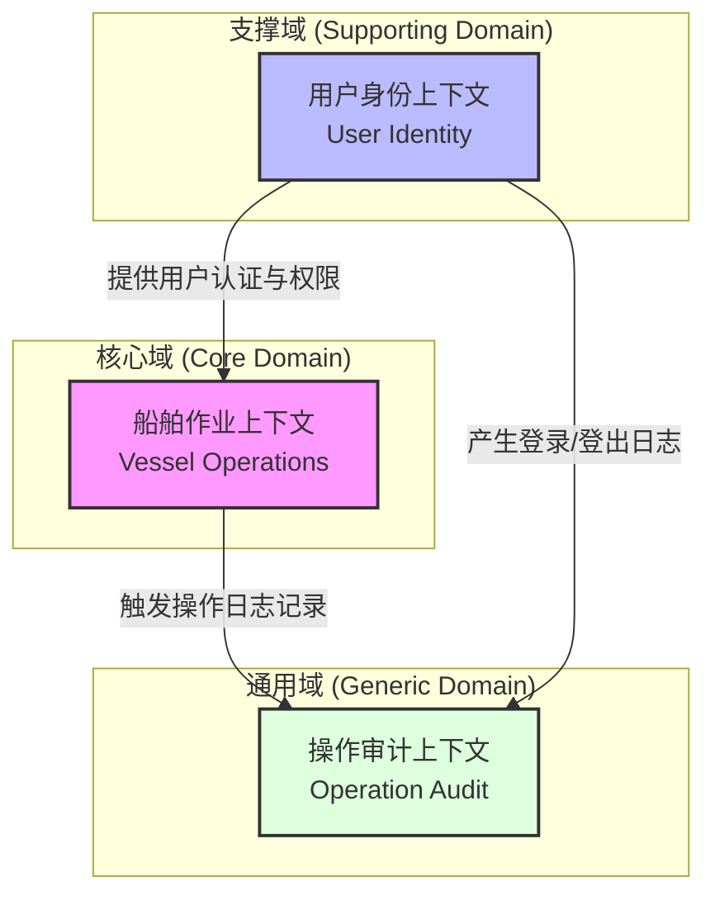
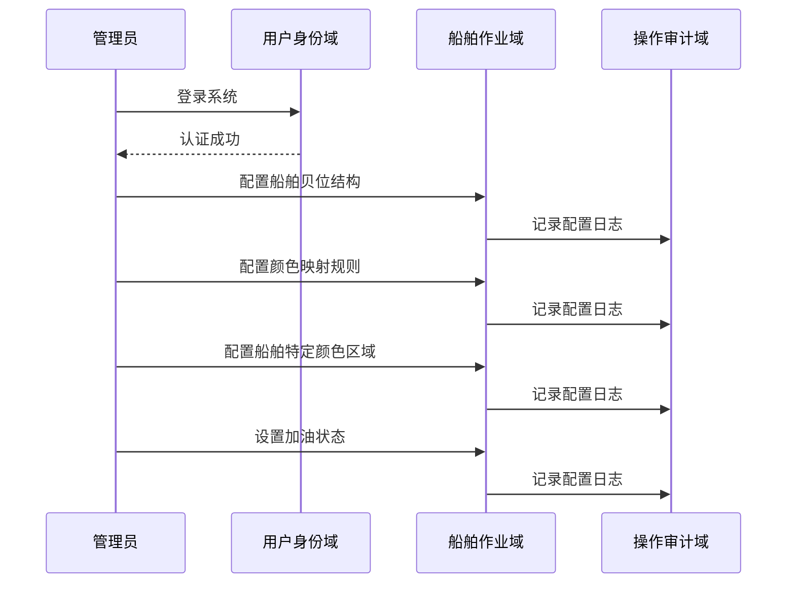

# QCVMT 码头岸桥集装箱作业管理系统 - 项目级 PRD 概览

> **生成日期**：2026-08-04  
> **文档类型**：项目级产品需求概览 (Project-Level PRD Overview)  
> **版本**：1.0

## 1. 项目概述与背景

QCVMT（Quay Crane Vessel Management Terminal）是一个面向集装箱码头的核心业务系统，旨在为岸桥操作员和管理员提供实时的船舶装卸作业监控与管理能力。该系统通过集成外部 N4 终端操作系统（TOS）获取实时作业队列数据，结合本地配置的船舶贝位结构、颜色编码规则及加油区域信息，生成可视化的集装箱位置矩阵，支持卸船（DISCH）和装船（LOAD）两种作业模式的实时监控。

从 **E2E 业务链路** 视角看，系统覆盖了从管理员配置终端参数、导入船舶数据、设置颜色与加油方案，到操作员登录并实时监控集装箱装卸作业的完整生命周期。从 **DDD 领域驱动设计** 视角看，系统划分为三个限界上下文：**船舶作业上下文**（核心域，负责贝位可视化与作业查询）、**用户身份上下文**（支撑域，负责认证与会话管理）以及 **操作审计上下文**（通用域，负责日志记录与导出）。系统采用传统的单体架构，基于 Spring MVC + Hibernate 技术栈，通过 JDBC 直连 N4 数据库获取实时生产数据，确保了作业数据的低延迟与高一致性。

## 2. 业务域全景

系统包含一个核心域、一个支撑域和一个通用域。核心域承载了码头作业最关键的贝位可视化与查询能力；支撑域确保系统的安全访问与用户管理；通用域提供跨业务的审计追踪能力。

| 领域名称 | 类型 | 核心职责 | 关键实体 |
|----------|------|----------|----------|
| [船舶作业上下文](domains/01-vessel-operations.md) | 核心域 | 船舶贝位配置、加油区域管理、颜色编码规则、岸桥贝位实时查询 | Vessel, VesselCol, VesselRefuel, CellMatrix, ColSet |
| [用户身份上下文](domains/02-user-identity.md) | 支撑域 | 用户认证、会话管理、角色权限控制、岸桥编号分配 | User, ShowLog |
| [操作审计上下文](domains/03-operation-audit.md) | 通用域 | 业务操作日志记录、登录日志查询与导出 | OperationLog, ShowLog |

## 3. 业务链路总览

以下是系统中所有端到端（E2E）业务链路的汇总，涵盖了从基础配置到核心作业的全流程。

| 链路名称 | 链路类型 | 涉及页面数 | 涉及控制器数 | 所属业务域 | 链接 |
|----------|----------|------------|--------------|------------|------|
| Color Set Management for Container Types | full-stack | 3 | 1 | 船舶作业上下文 | [color-set-management](journeys/color-set-management.md) |
| Container Cell and Bay Size Management | full-stack | 2 | 1 | 船舶作业上下文 | [container-cell-management](journeys/container-cell-management.md) |
| Vessel Data Import and Export | full-stack | 2 | 1 | 船舶作业上下文 | [data-import-export](journeys/data-import-export.md) |
| Operation Log Audit and Export | full-stack | 2 | 1 | 操作审计上下文 | [operation-log-audit](journeys/operation-log-audit.md) |
| User Administration and Management | full-stack | 4 | 1 | 用户身份上下文 | [user-administration](journeys/user-administration.md) |
| User Authentication and Session Management | full-stack | 4 | 1 | 用户身份上下文 | [user-authentication](journeys/user-authentication.md) |
| Vessel Color and Bay/Row Configuration | full-stack | 2 | 1 | 船舶作业上下文 | [vessel-color-configuration](journeys/vessel-color-configuration.md) |
| Vessel Configuration Management | full-stack | 3 | 1 | 船舶作业上下文 | [vessel-configuration](journeys/vessel-configuration.md) |
| Vessel Refuel Configuration | full-stack | 2 | 1 | 船舶作业上下文 | [vessel-refuel-configuration](journeys/vessel-refuel-configuration.md) |
| Vessel Terminal Operations Lifecycle | full-stack | 12 | 2 | 跨域综合链路 | [vessel-terminal-operations](journeys/vessel-terminal-operations.md) |

## 4. 跨域业务流程

以下描述了跨越多个限界上下文和业务链路的关键业务流程：

### 4.1 新船到港配置与作业准备流程
该流程涉及管理员在船舶到港前完成所有基础数据配置，确保操作员能够正常进行作业。
- **参与链路**：[Vessel Terminal Operations Lifecycle](journeys/vessel-terminal-operations.md), [Vessel Configuration Management](journeys/vessel-configuration.md), [Color Set Management](journeys/color-set-management.md), [Vessel Color and Bay/Row Configuration](journeys/vessel-color-configuration.md), [Vessel Refuel Configuration](journeys/vessel-refuel-configuration.md)
- **涉及领域**：船舶作业上下文（核心）、用户身份上下文（支撑）
- **流程描述**：
  1. 管理员登录系统（用户身份域）。
  2. 从 N4 系统导入或通过界面手动配置船舶基本贝位结构（船舶作业域）。
  3. 定义全局箱型颜色映射规则（船舶作业域）。
  4. 为该特定船舶配置特定的 Bay/Row/Tier 颜色高亮区域（船舶作业域）。
  5. 标记需要加油的船舶或特定贝位区域（船舶作业域）。
  6. 所有配置变更自动记录操作日志（操作审计域）。

### 4.2 岸桥实时作业监控流程
这是系统最核心的业务价值体现，操作员通过此流程实时监控集装箱装卸进度。
- **参与链路**：[Vessel Terminal Operations Lifecycle](journeys/vessel-terminal-operations.md), [Container Cell and Bay Size Management](journeys/container-cell-management.md), [User Authentication](journeys/user-authentication.md)
- **涉及领域**：船舶作业上下文（核心）、用户身份上下文（支撑）
- **流程描述**：
  1. 操作员使用分配的 QC/HC/C 编号登录（用户身份域）。
  2. 进入终端视图页面，系统根据 QC 编号查询 N4 实时作业队列（船舶作业域）。
  3. 系统结合本地配置的贝位矩阵、颜色规则和加油区域，生成可视化的 HTML 表格（船舶作业域）。
  4. 操作员通过轮询或手动刷新查看最新的集装箱位置和剩余数量。

### 4.3 用户管理与审计追溯流程
确保系统访问安全并提供事后审计能力。
- **参与链路**：[User Administration and Management](journeys/user-administration.md), [Operation Log Audit and Export](journeys/operation-log-audit.md), [User Authentication](journeys/user-authentication.md)
- **涉及领域**：用户身份上下文（支撑）、操作审计上下文（通用）
- **流程描述**：
  1. 管理员创建新用户并分配 QC 编号（用户身份域）。
  2. 用户登录/登出时自动记录会话日志（操作审计域）。
  3. 管理员可查询特定用户的操作日志或按时间范围导出全量日志用于合规审计（操作审计域）。

## 5. 前端页面覆盖

| 页面名称 | 所属域 | 关联链路 | 链接 |
|----------|--------|----------|------|
| login | 用户身份 | user-authentication, vessel-terminal-operations | [login](pages/login.md) |
| login-admin | 用户身份 | user-authentication, vessel-terminal-operations | [login-admin](pages/login-admin.md) |
| admin-panel | 用户身份 | user-administration, vessel-terminal-operations | [admin-panel](pages/admin-panel.md) |
| user-detail | 用户身份 | user-administration | [user-detail](pages/user-detail.md) |
| update-user | 用户身份 | user-administration | [update-user](pages/update-user.md) |
| log | 操作审计 | operation-log-audit, user-administration | [log](pages/log.md) |
| export-page | 操作审计 | operation-log-audit, data-import-export | [export-page](pages/export-page.md) |
| color-manage | 船舶作业 | color-set-management, vessel-terminal-operations | [color-manage](pages/color-manage.md) |
| colset-detail | 船舶作业 | color-set-management | [colset-detail](pages/colset-detail.md) |
| update-colset | 船舶作业 | color-set-management | [update-colset](pages/update-colset.md) |
| setbaysize | 船舶作业 | container-cell-management, vessel-terminal-operations | [setbaysize](pages/setbaysize.md) |
| tqcvmt | 船舶作业 | container-cell-management, user-authentication, vessel-terminal-operations | [tqcvmt](pages/tqcvmt.md) |
| import-page | 船舶作业 | data-import-export, vessel-terminal-operations | [import-page](pages/import-page.md) |
| vessel-manage | 船舶作业 | vessel-configuration, vessel-terminal-operations | [vessel-manage](pages/vessel-manage.md) |
| vessel-detail | 船舶作业 | vessel-configuration | [vessel-detail](pages/vessel-detail.md) |
| update-vessel | 船舶作业 | vessel-configuration | [update-vessel](pages/update-vessel.md) |
| vessel-color-manage | 船舶作业 | vessel-color-configuration, vessel-terminal-operations | [vessel-color-manage](pages/vessel-color-manage.md) |
| vessel-color-detail | 船舶作业 | vessel-color-configuration | [vessel-color-detail](pages/vessel-color-detail.md) |
| vessel-refuel-manage | 船舶作业 | vessel-refuel-configuration, vessel-terminal-operations | [vessel-refuel-manage](pages/vessel-refuel-manage.md) |
| vessel-refuel-detail | 船舶作业 | vessel-refuel-configuration | [vessel-refuel-detail](pages/vessel-refuel-detail.md) |

## 6. 后端服务覆盖

| 服务名称 | 所属域 | 关联链路 | 链接 |
|----------|--------|----------|------|
| UserControl | 用户身份 | user-administration, user-authentication, operation-log-audit, data-import-export | [user](services/user.md) |
| CellControl | 船舶作业 | color-set-management, container-cell-management, vessel-configuration, vessel-color-configuration, vessel-refuel-configuration, vessel-terminal-operations | [cell](services/cell.md) |
| Busihandler | 船舶作业 | container-cell-management, vessel-terminal-operations | [cell](services/cell.md) |
| UserDao | 用户身份 | user-administration, user-authentication, operation-log-audit | [user](services/user.md) |
| CellDao | 船舶作业 | color-set-management, container-cell-management | [cell](services/cell.md) |
| VesselDao | 船舶作业 | vessel-configuration, vessel-color-configuration, vessel-refuel-configuration, data-import-export | [cell](services/cell.md) |
| ImportHandler | 船舶作业 | data-import-export | [user](services/user.md) |
| ExportHandler | 操作审计 | operation-log-audit, data-import-export | [operation-log](services/operation-log.md) |
| SecurityInterceptor | 用户身份 | user-authentication | [user](services/user.md) |

## 7. 角色与权限

系统主要包含两类用户角色，权限边界清晰：

| 角色 | 职责 | 主要功能权限 | 数据可见性 |
|------|------|--------------|------------|
| **普通用户 (USER)** | 岸桥操作员 | 登录系统、查看个人操作日志、访问终端作业视图 (tqcvmt) | 仅可见与自己绑定的 QC/HC/C 编号相关的作业数据；仅可查看自己的登录日志 |
| **管理员 (ADMIN)** | 系统管理人员 | 用户管理（增删改查）、船舶配置管理、颜色/加油配置、导入/导出数据、查看所有日志 | 可见所有用户、所有船舶配置、所有操作日志；可导出全系统日志 |

**权限风险点**：
- 密码明文存储，存在安全风险。
- 无细粒度权限控制（如菜单级或按钮级），仅通过角色重定向不同页面实现粗略隔离。
- 删除操作缺乏二次确认和级联保护机制。

## 8. 架构概览

系统采用经典的 **单体分层架构**，详细架构设计请参考 [系统架构文档](architecture.md)。

- **技术栈**：Java 7, Spring MVC 3.0, Hibernate 3, Oracle Database, JSP/JSTL。
- **部署方式**：WAR 包部署于应用服务器（如 Tomcat/WebLogic）。
- **关键集成**：通过 JDBC 直连外部 **N4 系统 (Navis 4 TOS)** 数据库，实时获取岸桥作业队列、集装箱位置和船舶访问信息。
- **数据持久化**：核心业务数据（用户、船舶配置、日志）存储在本地 Oracle 数据库；N4 数据仅读取不写入。
- **安全机制**：基于 Session 的身份验证，通过 `SecurityInterceptor` 拦截未授权请求。

## 9. 假设与待确认问题

以下问题在各链路和领域文档中被标记为 TBD，需在后续迭代中确认：

### 业务规则与数据约束
1. **密码策略**：当前密码长度限制为 6 位且明文存储，是否需要加强复杂度要求和加密存储？
2. **账户锁定**：是否需引入连续登录失败后的账户锁定机制？
3. **危险品标识**：代码中危险品（DG）功能被注释禁用，是否需要重新启用？
4. **删除保护**：删除船舶、颜色配置或用户时，是否需检查关联数据（如操作日志、加油配置）并进行级联处理或阻止删除？
5. **日志保留策略**：登录日志默认只查询最近 1 个月，是否有长期归档需求？业务操作日志缺乏前端查询界面，是否需要补充？

### 技术实现细节
1. **N4 接口协议**：数据导入时与 N4 系统的校验具体是通过 API 还是数据库直连？
2. **并发控制**：多人同时修改同一船舶配置或颜色规则时，是否有乐观锁或悲观锁机制？
3. **CellDao 实现**：单元格矩阵重算的具体算法及性能优化策略待确认。
4. **导出格式**：操作日志导出的具体文件格式（Excel/CSV）及字段规范需明确。

### 用户体验
1. **分页与搜索**：用户列表、日志列表等是否需支持更灵活的分页、搜索和排序功能？
2. **错误提示**：部分操作失败时的错误提示不够友好，需统一优化。