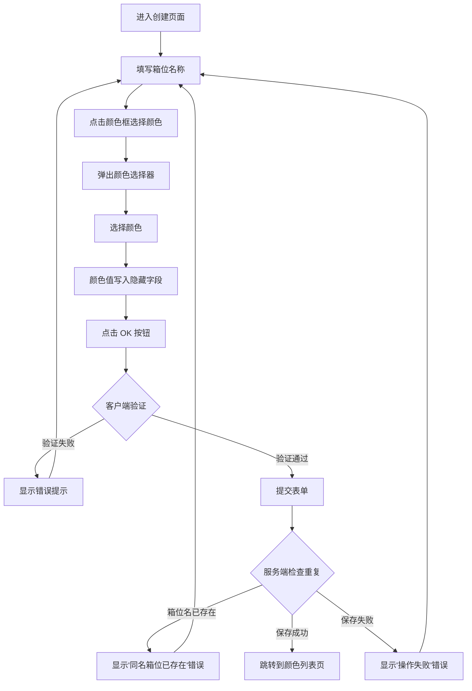
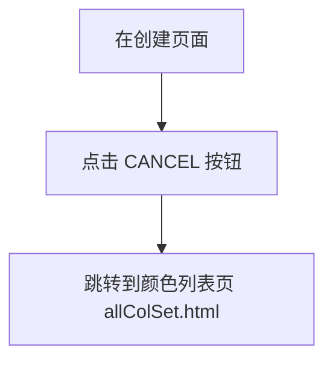

# 创建箱位颜色配置 (Create Box Case Color)

## 1. 概述 (Overview)

本页面用于创建新的箱位颜色配置记录。用户通过填写箱位名称（BOXCASE）和选择颜色值，将配置保存到系统中。该功能属于"箱位颜色管理"模块的一部分，用于为集装箱码头系统中的不同箱位分配可视化颜色标识。

**业务目的**：为箱位（Bay/Case）配置颜色标识，便于在可视化界面中区分不同的箱位区域。

**页面路径**：`/user/addColor.html` → `colSetDetail.jsp`

**提交接口**：`POST /user/saveColSet.html`

**取消导航**：点击取消按钮返回到箱位颜色列表页 (`allColSet.html`)

> 📎 Source: src/main/webapp/WEB-INF/jsp/colSetDetail.jsp; src/main/java/com/springMVC/control/CellControl.java → addColor(), saveColSet()

## 2. 用户角色 (User Roles)

| 角色 | 权限说明 |
|------|---------|
| 系统管理员 / 配置人员 | 可以访问此页面，创建新的箱位颜色配置记录 |

## 3. 页面布局 (Page Layout)

页面采用居中卡片式布局，整体结构如下：

```text
┌─────────────────────────────────────────────┐
│              MODERN TERMINALS                │  ← 标题栏（蓝色背景）
│                                    [Logout]  │  ← 右上角登出图标
├─────────────────────────────────────────────┤
│                                             │
│   BOXCASE :  [__________________________]   │  ← 箱位名称输入框
│                                             │
│   COLOR   :  [🎨 点击选择颜色]              │  ← 颜色选择器（只读文本框）
│                                             │
│         [  OK  ]        [ CANCEL ]          │  ← 提交/取消按钮
│                                             │
│   [错误提示信息 - 红色显示]                  │  ← 服务端验证错误
│   [客户端验证错误 - 红色显示]                │  ← 客户端验证错误
│                                             │
└─────────────────────────────────────────────┘
```

> 📎 Source: src/main/webapp/WEB-INF/jsp/colSetDetail.jsp → div#d1, div#d1_head, div#d1_body

## 4. 搜索字段 (Search Fields)

本页面为表单创建页，无搜索字段。

## 5. 表格列 (Table Columns)

本页面为表单创建页，无数据表格。

## 6. 交互组件 (Interaction Components)

### 6.1 颜色选择器 (Color Picker)

**触发条件**：点击颜色输入框（id="colors"）时弹出

**组件类型**：jQuery 插件 `soColorPacker`

**交互逻辑**：
- 点击颜色输入框后，在输入框下方弹出颜色选择面板
- 面板包含 216 种预设颜色（6×6×6 色盘）
- 鼠标悬停在颜色块上时，预览区显示当前颜色的背景色和十六进制值
- 点击颜色块后：
  - 隐藏的颜色输入框（id="color"）被赋值为选中的十六进制颜色值（如 `#FFCC00`）
  - 颜色选择面板自动关闭
- 点击面板上的 "close" 按钮可手动关闭面板

**配置参数**：
- `size: 2` — 中等尺寸
- `textChange: false` — 不将颜色值填入触发元素
- `colorChange: 2` — 改变触发元素的背景颜色
- `callback` — 选中颜色后调用 `process()` 函数，将颜色值写入隐藏的 `color` 输入框

> 📎 Source: src/main/webapp/WEB-INF/jsp/colSetDetail.jsp → jQuery('#colors').soColorPacker(); src/main/webapp/js/jquery.soColorPicker-1.0.js

### 6.2 登出确认对话框 (Logout Confirmation)

**触发条件**：点击右上角登出图标

**交互逻辑**：
- 弹出浏览器原生确认对话框，提示 "Are you sure to logout?"
- 点击确认后跳转到 `logout.html`
- 点击取消则不执行任何操作

> 📎 Source: src/main/webapp/WEB-INF/jsp/colSetDetail.jsp → sh()

### 6.3 取消按钮 (Cancel Button)

**触发条件**：点击 "CANCEL" 按钮

**交互逻辑**：
- 直接跳转到箱位颜色列表页 `allColSet.html`
- 不保存任何数据

> 📎 Source: src/main/webapp/WEB-INF/jsp/colSetDetail.jsp → back()

## 7. 用户流程 (User Flows)

### 流程 1：创建箱位颜色配置



### 流程 2：取消创建



## 8. 业务规则 (Business Rules)

### 8.1 校验规则 (Validation)

| 字段 | 规则 | 错误提示 |
|------|------|---------|
| 箱位名称 (boxcase) | 不能为空 | "The boxcase cannot be empty!" |
| 箱位名称 (boxcase) | 长度不超过 20 个字符 | "The boxcase is too long!" |
| 颜色 (color) | 不能为空 | "The color cannot be empty!" |
| 颜色 (color) | 长度不超过 12 个字符 | "The color is too long!" |

> 📎 Source: src/main/webapp/WEB-INF/jsp/colSetDetail.jsp → checkValue()

### 8.2 条件显示规则 (Conditional Display)

| 条件 | 显示内容 |
|------|---------|
| 服务端返回 `result` 属性非空 | 显示红色错误信息（id="ess"） |
| 客户端验证失败 | 显示红色错误信息（id="message"），同时隐藏服务端错误信息 |
| 获得输入框焦点 | 隐藏所有错误信息 |

> 📎 Source: src/main/webapp/WEB-INF/jsp/colSetDetail.jsp → c:if test="${!empty result }"; show()

### 8.3 数据转换规则 (Data Transformation)

| 字段 | 转换规则 |
|------|---------|
| 颜色值 | 从颜色选择器获取的十六进制格式（如 `#FFCC00`），存入隐藏输入框 `color` |
| 国际化文本 | 使用 Spring `<spring:message>` 标签加载多语言资源 |

> 📎 Source: src/main/webapp/WEB-INF/jsp/colSetDetail.jsp → process(); src/main/resources/messages_en.properties

### 8.4 权限控制规则 (Permission Control)

| 控制点 | 规则 |
|--------|------|
| 页面访问 | 需要登录认证（通过 Session 中的用户信息验证） |
| 登出功能 | 所有已登录用户均可使用 |

> 📎 Source: src/main/java/com/springMVC/control/CellControl.java → addColor()

### 8.5 唯一性约束 (Uniqueness Constraint)

| 字段 | 规则 | 错误提示 |
|------|------|---------|
| 箱位名称 (boxcase) | 系统中不能存在同名的箱位配置 | "A boxcase with the same name already exists!" |

> 📎 Source: src/main/java/com/springMVC/control/CellControl.java → saveColSet() → cellDao.getColSetByBoxcase()
