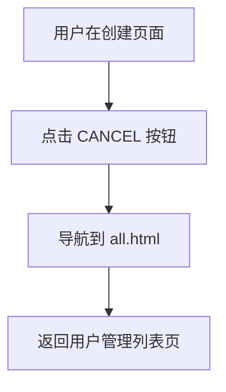

# 创建用户页面 PRD

## 1. 概述 (Overview)

本页面用于系统管理员创建新用户账户。管理员可以设置新用户的用户名、QC编号、角色（普通用户或管理员）以及密码。创建成功后，系统将自动跳转到用户管理列表页面。

**业务目的**: 为码头操作系统提供用户账户管理能力，支持多角色权限体系（USER/ADMIN）。

**页面路径**: `/user/add.html` → `userDetail.jsp`

> 📎 Source: src/main/java/com/springMVC/control/UserControl.java → addUser()

## 2. 用户角色 (User Roles)

| 角色 | 权限说明 |
|------|---------|
| ADMIN (管理员) | 可以访问此页面创建新用户，管理所有用户账户 |
| USER (普通用户) | 无权限访问此页面 |

> 📎 Source: src/main/webapp/WEB-INF/jsp/admin.jsp → limitAccountStr check

## 3. 页面布局 (Page Layout)

页面采用居中表单布局，整体结构如下：

```text
┌─────────────────────────────────────────────┐
│              MODERN TERMINALS                │
│                                    [Logout]  │
├─────────────────────────────────────────────┤
│                                             │
│   USERNAME      : [_______________]         │
│   QCNAME        : [______]                  │
│   ROLE          : (•) USER  ( ) ADMIN       │
│   PASSWORD      : [_______________]         │
│   CONFIRM PASS  : [_______________]         │
│                                             │
│            [OK]          [CANCEL]           │
│                                             │
│         [错误消息显示区域]                   │
│                                             │
└─────────────────────────────────────────────┘
```

> 📎 Source: src/main/webapp/WEB-INF/jsp/userDetail.jsp → template structure

## 4. 搜索字段 (Search Fields)

本页面为表单创建页面，无搜索功能。

## 5. 表格列 (Table Columns)

本页面为表单创建页面，无数据表格。

## 6. 交互组件 (Interaction Components)

### 6.1 用户创建表单

**触发条件**: 从用户管理列表页点击"CREATE USER"链接进入

**表单字段**:

| 字段名 | 标签 | 类型 | 必填 | 校验规则 |
|--------|------|------|------|---------|
| username | USERNAME | 文本输入 | 是 | 不能为空；长度≤10字符 |
| qcid | QCNAME | 文本输入 | 否 | 长度≤6字符 |
| role | ROLE | 单选按钮 | 是 | 默认选中USER，可选USER/ADMIN |
| password | PASSWORD | 密码输入 | 是 | 不能为空；长度≤6字符 |
| cpassword | CONFIRM PASSWORD | 密码输入 | 是 | 不能为空；长度≤6字符；必须与password一致 |

> 📎 Source: src/main/webapp/WEB-INF/jsp/userDetail.jsp → form fields; src/main/webapp/WEB-INF/jsp/userDetail.jsp → check() function

**提交逻辑**:
- 点击"OK"按钮触发表单提交
- 提交前执行前端校验函数 `check()`
- 后端调用 `/user/save.html` (POST) 接口
- 保存成功后重定向到 `/user/all.html` (用户管理列表页)
- 保存失败（如用户名已存在）则返回当前页面并显示错误消息

> 📎 Source: src/main/java/com/springMVC/control/UserControl.java → add()

**关闭条件**: 
- 点击"CANCEL"按钮返回用户管理列表页 (`all.html`)
- 表单提交成功后自动跳转

> 📎 Source: src/main/webapp/WEB-INF/jsp/userDetail.jsp → back() function

### 6.2 错误消息显示

**显示位置**: 表单底部红色文字区域

**显示内容**:
- 前端校验错误：用户名/密码为空、长度超限、密码不匹配等
- 后端业务错误：用户名已存在、数据库保存失败等

> 📎 Source: src/main/webapp/WEB-INF/jsp/userDetail.jsp → message row; src/main/java/com/springMVC/control/UserControl.java → result attribute

## 7. 用户流程 (User Flows)

### 流程1: 创建新用户

```mermaid
graph TD
    start["管理员进入创建用户页面"] --> fillForm["填写表单字段"]
    fillForm --> validate["前端校验 check()"]
    validate --> valid{"校验通过?"}
    valid -->|否| showError["显示错误消息"]
    showError --> fillForm
    valid -->|是| submit["提交表单 POST /user/save.html"]
    submit --> backendCheck["后端检查用户名是否已存在"]
    backendCheck --> exists{"用户名已存在?"}
    exists -->|是| showBackendError["显示'用户名已存在'错误"]
    showBackendError --> fillForm
    exists -->|否| saveDB["保存到数据库 T_USER"]
    saveDB --> saveSuccess{"保存成功?"}
    saveSuccess -->|否| showSaveError["显示'无法添加用户'错误"]
    showSaveError --> fillForm
    saveSuccess -->|是| redirect["重定向到用户管理列表页"]
    redirect --> end["完成"]
```

### 流程2: 取消创建



> 📎 Source: src/main/webapp/WEB-INF/jsp/userDetail.jsp → back() function

## 8. 业务规则 (Business Rules)

### 8.1 校验规则 (Validation)

| 规则ID | 字段 | 规则描述 | 错误消息 |
|--------|------|---------|---------|
| V001 | username | 不能为空 | The username cannot be empty! |
| V002 | username | 长度≤10字符 | Username is too long! |
| V003 | password | 不能为空 | The password cannot be empty! |
| V004 | password | 长度≤6字符 | Password is too long! |
| V005 | cpassword | 不能为空 | The confirm password cannot be empty! |
| V006 | cpassword | 长度≤6字符 | The confirm password is too long! |
| V007 | cpassword vs password | 两次密码必须一致 | Passwords do not match! |
| V008 | qcid | 长度≤6字符 | QCName is too long! |

> 📎 Source: src/main/webapp/WEB-INF/jsp/userDetail.jsp → check() function

### 8.2 条件显示规则 (Conditional Display)

| 规则ID | 条件 | 显示行为 |
|--------|------|---------|
| CD001 | 后端返回 result 属性非空 | 显示红色错误消息在表单底部 |
| CD002 | 前端校验失败 | 显示红色错误消息在 #message 区域 |
| CD003 | 用户聚焦任意输入框 | 隐藏之前的错误消息 (#ess 和 #message) |

> 📎 Source: src/main/webapp/WEB-INF/jsp/userDetail.jsp → show() function; JSP c:if test

### 8.3 数据转换规则 (Data Transformation)

| 规则ID | 字段 | 转换逻辑 |
|--------|------|---------|
| DT001 | role | 前端单选按钮值 "USER"/"ADMIN" 直接传递给后端 |
| DT002 | createtime | 后端自动生成当前时间字符串 (WebUtil.getTime()) |
| DT003 | parent | 后端自动设置为当前登录用户的用户名 |

> 📎 Source: src/main/java/com/springMVC/control/UserControl.java → add() method

### 8.4 权限控制规则 (Permission Control)

| 规则ID | 资源 | 权限要求 |
|--------|------|---------|
| PC001 | 创建用户页面 (/user/add.html) | 仅 ADMIN 角色可访问 |
| PC002 | 保存用户接口 (/user/save.html) | 需要有效会话，从 session 获取当前用户作为 parent |

> 📎 Source: src/main/java/com/springMVC/control/UserControl.java → Constants.USER_LOGIN session check
