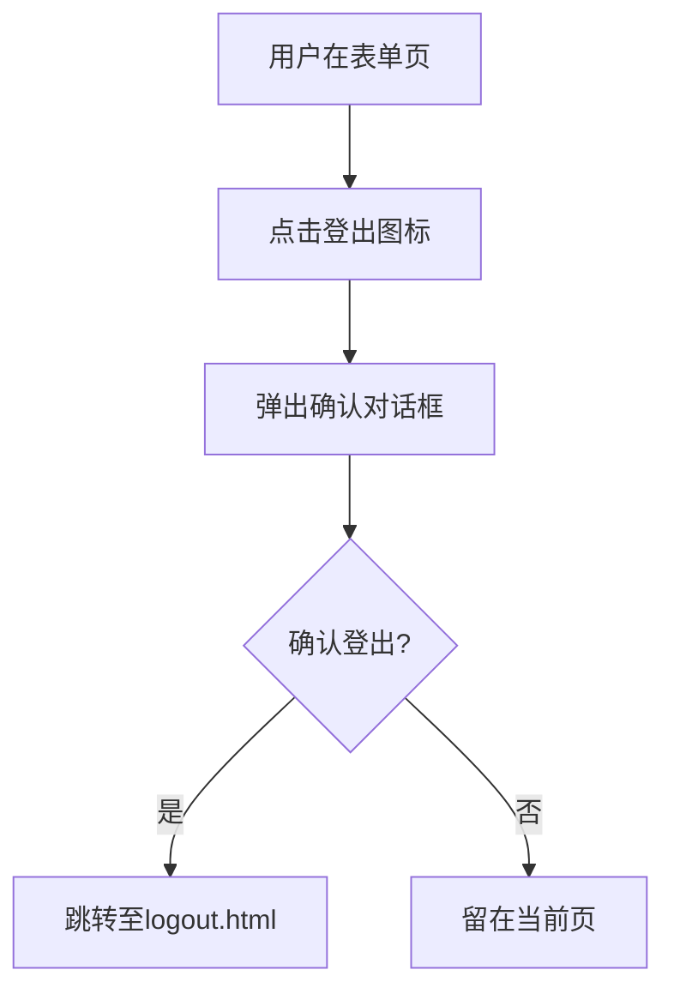

# Create Vessel - 产品需求文档 (PRD)

## 1. 概述 (Overview)

**页面名称**: Create Vessel (创建船舶配置)  
**页面路径**: `src/main/webapp/WEB-INF/jsp/vesselDetail.jsp`  
**业务模块**: vessel-configuration (船舶配置管理)  
**页面类型**: 表单录入页  

**业务目的**:  
本页面用于在系统中创建新的船舶舱位配置记录。用户通过填写船舶ID、甲板/舱位标识、Bay号、Row范围、Tier范围等参数，定义船舶的集装箱装载空间结构。提交后系统将校验数据唯一性并保存至数据库，成功后跳转至船舶管理列表页。

**业务范围**:  
- 创建单条船舶舱位配置记录
- 前端表单验证（必填项、长度限制、格式校验）
- 后端重复性校验（vesselid + deck_hold + bay 组合唯一）
- 保存成功后跳转至船舶管理列表

> 📎 Source: src/main/webapp/WEB-INF/jsp/vesselDetail.jsp → form; src/main/java/com/springMVC/control/CellControl.java → saveVessel()

---

## 2. 用户角色 (User Roles)

| 角色 | 权限说明 |
|------|----------|
| 已登录系统用户 | 可访问本页面，填写并提交船舶配置表单 |
| 未登录用户 | 被安全拦截器重定向至登录页 |

> 📎 Source: src/main/java/com/springMVC/filter/SecurityInterceptor.java → preHandle(); src/main/webapp/WEB-INF/springMVC-servlet.xml → mvc:interceptors

---

## 3. 页面布局 (Page Layout)

页面采用居中卡片式布局，整体结构如下：

```text
┌─────────────────────────────────────────────┐
│              MODERN TERMINALS                │  ← 标题栏 (蓝色背景)
├─────────────────────────────────────────────┤
│                                             │
│   Vessel name:          [____________]      │  ← 船舶ID输入框
│                                             │
│   Deck/Hold:            [A ▼]               │  ← 下拉选择 (A/B)
│                                             │
│   BAY:                  [___]               │  ← Bay号输入框
│                                             │
│   Rows:                 [__]  [___]         │  ← Row起始值  Row结束值
│                                             │
│   Tiers:                [__]  [__]          │  ← Tier起始值 Tier结束值
│                                             │
│         [OK]        [Cancel]                │  ← 提交/取消按钮
│                                             │
│   [错误提示信息 - 红色字体]                  │  ← 服务端返回的错误消息
│                                             │
└─────────────────────────────────────────────┘
```

**布局特点**:
- 顶部标题栏：显示 "MODERN TERMINALS"，右上角有登出图标
- 表单区域：6行表单项，采用左右对齐布局（标签右对齐，输入控件居中对齐）
- 操作按钮：OK（提交）和 Cancel（取消）水平排列，居中显示
- 错误提示区：默认隐藏，当服务端返回错误时显示红色文字

> 📎 Source: src/main/webapp/WEB-INF/jsp/vesselDetail.jsp → div#d1, div#d1_head, table

---

## 4. 搜索字段 (Search Fields)

本页面为表单录入页，无搜索功能。以下为表单输入字段：

| 字段名 | 标签 | 控件类型 | 必填 | 最大长度 | 说明 |
|--------|------|----------|------|----------|------|
| vesselid | Vessel name | 文本输入框 | 是 | 30字符 | 船舶唯一标识 |
| deck_hold | Deck/Hold | 下拉选择框 | 是 | 1字符 | 甲板/舱位标识，可选值：A、B |
| bay | BAY | 文本输入框 | 是 | 3字符（HTML maxlength），但JS校验允许10字符 | Bay号，必须为数字 |
| rowStart | Rows (起始) | 文本输入框 | 是 | 2字符 | Row范围起始值，必须为数字 |
| rowEnd | Rows (结束) | 文本输入框 | 是 | 3字符 | Row范围结束值，必须为数字 |
| tierStart | Tiers (起始) | 文本输入框 | 是 | 2字符 | Tier范围起始值，必须为数字 |
| tierEnd | Tiers (结束) | 文本输入框 | 是 | 2字符 | Tier范围结束值，必须为数字 |

> 📎 Source: src/main/webapp/WEB-INF/jsp/vesselDetail.jsp → input#vesselid, select#deck_hold, input#bay, input#rowStart, input#rowEnd, input#tierStart, input#tierEnd

---

## 5. 表格列 (Table Columns)

本页面为表单录入页，无数据表格展示。

---

## 6. 交互组件 (Interaction Components)

### 6.1 表单提交 (Form Submit)

**触发条件**: 点击 "OK" 按钮  
**表单动作**: POST 请求至 `/user/saveVessel.html`  
**前置校验**: 调用 `checkValue()` JavaScript 函数进行客户端验证  

**验证规则**:
1. **vesselid**: 
   - 不能为空
   - 长度不超过30字符
2. **deck_hold**: 
   - 不能为空
   - 长度不超过1字符
   - 值必须为 "A" 或 "B"
3. **bay**: 
   - 不能为空
   - 长度不超过10字符（JS校验），HTML maxlength为3
   - 必须为纯数字
4. **rowStart**: 
   - 不能为空
   - 长度不超过2字符
   - 必须为纯数字
5. **rowEnd**: 
   - 不能为空
   - 长度不超过3字符
   - 必须为纯数字
6. **tierStart**: 
   - 不能为空
   - 长度不超过2字符
   - 必须为纯数字
7. **tierEnd**: 
   - 不能为空
   - 长度不超过3字符（JS校验），HTML maxlength为2
   - 必须为纯数字

**提交逻辑**:
- 客户端验证通过后，表单提交至后端
- 后端校验 vesselid + deck_hold + bay 组合是否已存在
- 若已存在，返回错误消息："the vesselid,deck_hold,bay already exists!"
- 若不存在，保存至数据库，成功后重定向至 `/user/allVessel.html`
- 若保存失败，返回错误消息："The operation failed"

**关闭条件**: 
- 成功提交后自动跳转至船舶管理列表页
- 验证失败或保存失败时停留在当前页并显示错误信息

> 📎 Source: src/main/webapp/WEB-INF/jsp/vesselDetail.jsp → checkValue(), form:form; src/main/java/com/springMVC/control/CellControl.java → saveVessel()

### 6.2 取消操作 (Cancel Button)

**触发条件**: 点击 "Cancel" 按钮  
**行为**: 调用 `back()` 函数，跳转至 `allVessel.html`（船舶管理列表页）  

> 📎 Source: src/main/webapp/WEB-INF/jsp/vesselDetail.jsp → back()

### 6.3 登出操作 (Logout)

**触发条件**: 点击右上角登出图标  
**行为**: 弹出确认对话框，确认后跳转至 `logout.html`  

> 📎 Source: src/main/webapp/WEB-INF/jsp/vesselDetail.jsp → sh()

### 6.4 错误提示显示

**触发条件**: 
- 客户端验证失败：显示红色错误消息于 `#message` 区域
- 服务端返回错误：显示 `${result}` 内容于 `#ess` 区域

**显示规则**:
- 聚焦任意输入框时，隐藏所有错误提示（调用 `show()` 函数）
- 验证失败时，显示对应错误消息

> 📎 Source: src/main/webapp/WEB-INF/jsp/vesselDetail.jsp → show(), tr#message, tr#ess

---

## 7. 用户流程 (User Flows)

### 流程1: 创建船舶配置（成功）

```mermaid
graph TD
  start["用户访问创建页面"] --> fill["填写表单字段"]
  fill --> validate["点击OK触发客户端验证"]
  validate --> pass{"验证通过?"}
  pass -->|否| showError["显示错误提示"]
  showError --> fill
  pass -->|是| submit["提交POST请求至saveVessel.html"]
  submit --> backendCheck["后端校验唯一性"]
  backendCheck --> exists{"记录已存在?"}
  exists -->|是| returnError["返回错误: 记录已存在"]
  returnError --> showServerErr["显示服务端错误"]
  showServerErr --> fill
  exists -->|否| save["保存至数据库"]
  save --> success{"保存成功?"}
  success -->|是| redirect["重定向至allVessel.html"]
  redirect --> end["查看船舶列表"]
  success -->|否| failMsg["返回错误: 操作失败"]
  failMsg --> showServerErr
```

### 流程2: 取消创建

```mermaid
graph TD
  start["用户在表单页"] --> clickCancel["点击Cancel按钮"]
  clickCancel --> redirect["跳转至allVessel.html"]
  redirect --> end["查看船舶列表"]
```

### 流程3: 登出系统



---

## 8. 业务规则 (Business Rules)

### 8.1 校验规则 (Validation)

| 字段 | 规则类型 | 规则描述 | 错误消息 |
|------|----------|----------|----------|
| vesselid | 必填 | 不能为空字符串 | "The vesselid cannot be empty!" |
| vesselid | 长度限制 | 最大30字符 | "The vesselid is too long!" |
| deck_hold | 必填 | 不能为空字符串 | "The deck_hold cannot be empty!" |
| deck_hold | 长度限制 | 最大1字符 | "The deck_hold is too long!" |
| deck_hold | 枚举值 | 只能为 "A" 或 "B" | "The deck_hold should be 'A' or 'B' !" |
| bay | 必填 | 不能为空字符串 | "The bay cannot be empty!" |
| bay | 长度限制 | JS校验最大10字符，HTML maxlength为3 | "The bay is too long!" |
| bay | 格式校验 | 必须为纯数字 | "The bay should be number !" |
| rowStart | 必填 | 不能为空字符串 | "The rowStart cannot be empty!" |
| rowStart | 长度限制 | 最大2字符 | "The rowStart is too long!" |
| rowStart | 格式校验 | 必须为纯数字 | "The rowStart should be number !" |
| rowEnd | 必填 | 不能为空字符串 | "The rowEnd cannot be empty!" |
| rowEnd | 长度限制 | 最大3字符 | "The rowEnd is too long!" |
| rowEnd | 格式校验 | 必须为纯数字 | "The rowEnd should be number !" |
| tierStart | 必填 | 不能为空字符串 | "The tierStart cannot be empty!" |
| tierStart | 长度限制 | 最大2字符 | "The tierStart is too long!" |
| tierStart | 格式校验 | 必须为纯数字 | "The tierStart should be number !" |
| tierEnd | 必填 | 不能为空字符串 | "The tierEnd cannot be empty!" |
| tierEnd | 长度限制 | JS校验最大3字符，HTML maxlength为2 | "The tierEnd is too long!" |
| tierEnd | 格式校验 | 必须为纯数字 | "The tierEnd should be number !" |

> 📎 Source: src/main/webapp/WEB-INF/jsp/vesselDetail.jsp → checkValue()

### 8.2 条件显示规则 (Conditional Display)

| 条件 | 显示内容 | 隐藏内容 |
|------|----------|----------|
| 聚焦任意输入框 | - | 隐藏 `#ess` 和 `#message` 错误提示区 |
| 客户端验证失败 | 显示 `#message` 区域及对应错误消息 | - |
| 服务端返回错误 (`${result}` 非空) | 显示 `#ess` 区域及错误消息 | - |
| 默认状态 | - | `#message` 区域默认隐藏 (`display:none`) |

> 📎 Source: src/main/webapp/WEB-INF/jsp/vesselDetail.jsp → show(), tr#message style, c:if test="${!empty result}"

### 8.3 数据转换规则 (Data Transformation)

| 字段 | 转换规则 | 说明 |
|------|----------|------|
| deck_hold | 枚举映射 | 前端下拉选项值 "A"/"B" 直接作为字符串存储 |
| bay, rowStart, rowEnd, tierStart, tierEnd | 数字格式校验 | 前端JS校验确保为纯数字字符串，后端以String类型存储 |

> 📎 Source: src/main/java/com/springMVC/entity/Vessel.java → setDeck_hold(), setBay(), setRowStart(), setRowEnd(), setTierStart(), setTierEnd()

### 8.4 权限控制规则 (Permission Control)

| 资源 | 访问条件 | 控制机制 |
|------|----------|----------|
| /user/saveVessel.html | 用户已登录 | SecurityInterceptor 拦截 `/user/*` 路径，检查 session 中是否存在 `USER_LOGIN` 属性 |
| 未登录用户访问 | 重定向至登录页 | 设置 session 错误消息 "Please login first!"，重定向至 `/index.jsp` |

> 📎 Source: src/main/java/com/springMVC/filter/SecurityInterceptor.java → preHandle(); src/main/webapp/WEB-INF/springMVC-servlet.xml → mvc:interceptor

### 8.5 唯一性约束 (Uniqueness Constraint)

| 约束字段组合 | 校验时机 | 错误消息 |
|--------------|----------|----------|
| vesselid + deck_hold + bay | 后端保存前查询数据库 | "the vesselid,deck_hold,bay already exists!" |

> 📎 Source: src/main/java/com/springMVC/control/CellControl.java → saveVessel() → vesselDao.getVesselByCondition()
