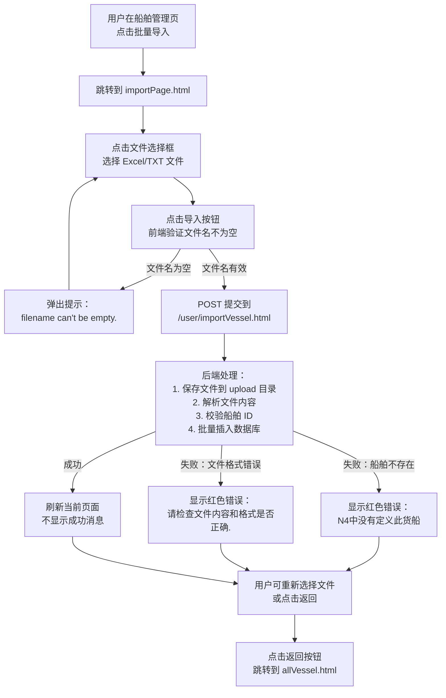
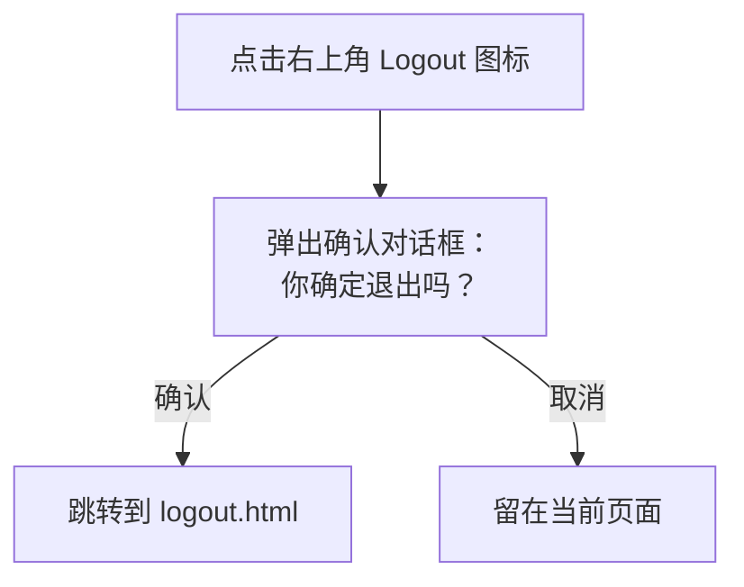

# 导入船舶数据 - 产品需求文档 (PRD)

## 1. 概述 (Overview)

本页面用于批量导入船舶配置数据到系统中。用户通过上传 Excel (.xls/.xlsx) 或文本 (.txt) 格式的文件，系统解析文件内容并将船舶的舱位配置信息（Bay、Row、Tier）批量保存到数据库。

**业务目的**：简化船舶配置的录入流程，支持从外部系统（如 N4 系统）导出的文件格式批量导入船舶舱位结构数据，避免手动逐条录入。

**功能范围**：
- 支持上传 .xls、.xlsx、.txt 三种格式的文件
- 自动解析文件中的船舶 ID、甲板/舱位标识、Bay 编号、Row 起止范围、Tier 起止范围
- 校验船舶 ID 是否在 N4 系统中存在
- 批量保存船舶配置数据到 T_Vessel 表
- 显示导入结果（成功或错误信息）

> 📎 Source: src/main/webapp/WEB-INF/jsp/importPage.jsp → template; src/main/java/com/springMVC/control/UserControl.java → importVessel()

## 2. 用户角色 (User Roles)

| 角色 | 权限说明 |
|------|---------|
| 系统管理员 / 船舶配置操作员 | 可以访问船舶管理页面，点击"批量导入"链接进入本页面，上传文件并执行导入操作 |

## 3. 页面布局 (Page Layout)

页面采用居中卡片式布局，整体结构如下：

```text
┌─────────────────────────────────────────────┐
│              MODERN TERMINALS                │  ← 蓝色标题栏
├─────────────────────────────────────────────┤
│                                             │
│         [右上角] Logout 图标按钮             │
│                                             │
│              文件: [选择文件] [导入]          │  ← 文件上传表单
│                                             │
│                  [返回]                      │  ← 返回按钮
│                                             │
│        [红色文字] 导入结果提示信息            │  ← 条件显示的错误/成功消息
│                                             │
└─────────────────────────────────────────────┘
```

**布局说明**：
- 顶部标题栏：显示 "MODERN TERMINALS"，蓝色背景，白色文字，居中对齐
- 右上角：Logout 图标，点击后弹出确认对话框，确认后跳转到 logout.html
- 主体区域：
  - 文件上传行：标签 "文件:" + 文件选择输入框 + "导入" 提交按钮
  - 返回按钮行：单独的 "返回" 按钮，点击后跳转到 allVessel.html
  - 结果提示行：仅在导入完成后显示，红色字体，居中显示导入结果消息

> 📎 Source: src/main/webapp/WEB-INF/jsp/importPage.jsp → div#d1, div#d1_head, div#d1_body

## 4. 搜索字段 (Search Fields)

本页面不包含搜索功能，仅提供文件上传表单。

## 5. 表格列 (Table Columns)

本页面不包含数据表格，仅显示导入结果文本提示。

导入文件中包含的数据字段（对应 T_Vessel 表结构）：

| 字段名 | 中文含义 | 说明 |
|--------|---------|------|
| vesselid | 船舶 ID | 从 N4 系统获取的船舶标识，用于关联船舶名称 |
| deck_hold | 甲板/舱位标识 | 标识是甲板 (Deck) 还是舱内 (Hold) |
| bay | Bay 编号 | 船舶横向舱位编号 |
| rowStart | Row 起始值 | 纵向行号起始值 |
| rowEnd | Row 结束值 | 纵向行号结束值 |
| tierStart | Tier 起始值 | 垂直层号起始值 |
| tierEnd | Tier 结束值 | 垂直层号结束值 |

> 📎 Source: src/main/java/com/springMVC/entity/Vessel.java → Vessel entity fields

## 6. 交互组件 (Interaction Components)

### 6.1 文件上传表单

**触发条件**：用户访问 importPage.html 时直接显示

**表单字段**：
- 文件选择框 (`<input type="file" id="filename" name="filename">`)
  - 接受任意文件格式，但后端仅处理 .xls、.xlsx、.txt 三种格式
  - 必填项

**提交逻辑**：
1. 点击 "导入" 按钮触发表单提交
2. 前端 JavaScript `check()` 函数验证文件名不为空
3. 表单以 POST 方法提交到 `/user/importVessel.html`，enctype 为 multipart/form-data
4. 后端接收文件并保存到服务器 upload 目录
5. 后端解析文件内容并批量插入数据库
6. 成功后刷新当前页面（不显示成功消息），失败后显示错误消息

**关闭条件**：无（页面级表单，非弹窗）

> 📎 Source: src/main/webapp/WEB-INF/jsp/importPage.jsp → form:form, check()

### 6.2 返回按钮

**触发条件**：用户点击 "返回" 按钮

**交互逻辑**：
- 调用 JavaScript `bback()` 函数
- 直接跳转到 `allVessel.html`（船舶列表页面）

> 📎 Source: src/main/webapp/WEB-INF/jsp/importPage.jsp → bback()

### 6.3 Logout 图标

**触发条件**：用户点击右上角 Logout 图标

**交互逻辑**：
1. 调用 JavaScript `sh()` 函数
2. 弹出确认对话框，显示国际化消息 "confirm_logout"（你确定退出吗？）
3. 用户确认后跳转到 `logout.html`

> 📎 Source: src/main/webapp/WEB-INF/jsp/importPage.jsp → sh()

### 6.4 导入结果提示

**触发条件**：后端导入操作完成后，通过 ModelMap 传递 `result` 属性到页面

**显示规则**：
- 仅当 `${result}` 不为空时显示
- 红色字体，15px 字号，居中对齐
- 显示内容为后端返回的错误消息

**可能的消息内容**：
- "N4中没有定义此货船"（error_no_vessel_found_in_n4）
- "请检查文件内容和格式是否正确."（import_vessel_file_empty）

> 📎 Source: src/main/webapp/WEB-INF/jsp/importPage.jsp → c:if test="${!empty result }"; src/main/java/com/springMVC/control/UserControl.java → importVessel() catch block

## 7. 用户流程 (User Flows)

### 流程 1：批量导入船舶数据



### 流程 2：退出登录



## 8. 业务规则 (Business Rules)

### 8.1 校验规则 (Validation)

| 规则类型 | 规则描述 | 实现位置 |
|---------|---------|---------|
| 前端必填校验 | 文件名不能为空，否则弹出 alert 提示 "filename can't be empty." 并阻止表单提交 | src/main/webapp/WEB-INF/jsp/importPage.jsp → check() |
| 文件格式校验 | 后端仅接受 .xls、.xlsx、.txt 三种格式，其他格式无法正确解析 | src/main/java/com/springMVC/util/ImportHandler.java → importVessel() |
| 船舶 ID 校验 | 导入的船舶 ID 必须在 N4 系统中存在，否则抛出异常并显示错误消息 | src/main/java/com/springMVC/util/ImportHandler.java → getTxtData() → vesselDao.getN4VesselNameById() |
| TXT 文件格式校验 | TXT 文件必须包含 *SHIP、*STACK、*TIER 等标记段，且必须包含 STAF BAY、LEVEL、ISO STACK、TOP TIER、BOTTOM TIER 列，否则抛出 "import_vessel_file_empty" 错误 | src/main/java/com/springMVC/util/ImportHandler.java → getTxtData() |

### 8.2 条件显示规则 (Conditional Display)

| 条件 | 显示内容 | 样式 |
|------|---------|------|
| `${result}` 不为空 | 显示导入结果消息 | 红色字体，15px，居中 |
| `${result}` 为空 | 不显示任何结果提示 | - |

> 📎 Source: src/main/webapp/WEB-INF/jsp/importPage.jsp → c:if test="${!empty result }"

### 8.3 数据转换规则 (Data Transformation)

**TXT 文件解析规则**：
1. 从 `*SHIP` 段提取船舶 ID
2. 从 `*STACK` 段解析 Bay Plan 数据，按 STAF BAY + LEVEL 组合去重
3. 对同一 Bay+Level 组合，取 ISO STACK 的最小值作为 rowStart，最大值作为 rowEnd；取 BOTTOM TIER 的最小值作为 tierStart，TOP TIER 的最大值作为 tierEnd
4. 如果存在 `*TIER` 段（自定义 Tier 配置），则用 CUSTOM TIER 覆盖原有的 tierStart/tierEnd
5. 通过 vesselDao.getN4VesselNameById() 将船舶 ID 转换为船舶名称
6. 所有数值字段转换为字符串存储

**Excel 文件解析规则**：
1. 跳过第 1 行（标题行），从第 2 行开始读取
2. 按列顺序映射：第 0 列→vesselid，第 1 列→deck_hold，第 2 列→bay，第 3 列→rowStart，第 4 列→rowEnd，第 5 列→tierStart，第 6 列→tierEnd
3. 数值单元格使用 DecimalFormat("0") 格式化，去除小数点
4. 公式单元格优先取字符串值，为空时取数值
5. 布尔值转换为 "Y"/"N"
6. 每行第一个单元格为空时跳过该行

> 📎 Source: src/main/java/com/springMVC/util/ImportHandler.java → getTxtData(), getExcelData()

### 8.4 权限控制规则 (Permission Control)

本页面未实现细粒度的权限控制，依赖 Spring Security 或容器级别的 URL 访问控制。

- 访问 `/user/importPage.html` 需要用户已登录
- 访问 `/user/importVessel.html` 需要用户已登录且具有相应权限

> 📎 Source: TBD — 需查看 Spring Security 配置或 web.xml 中的安全约束
