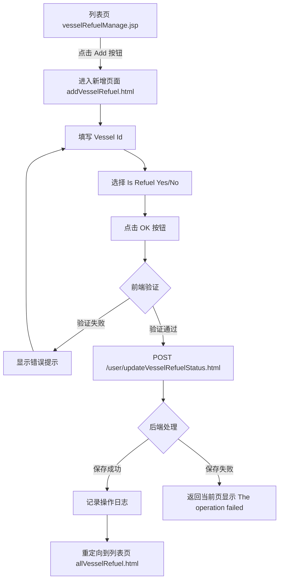

# 管理船舶加油状态 (Manage Vessel Refuel Status)

## 1. 概述 (Overview)

本页面用于管理船舶的加油状态信息。用户可以新增或修改船舶的加油状态记录，包括船舶访问ID（Vessel Visit Id）和是否加油（Is Refuel）两个核心字段。该页面支持两种操作模式：
- **新增模式**：从船舶加油管理列表页点击"Add"按钮进入，表单为空，用户填写新记录
- **修改模式**：从船舶加油管理列表页点击某条记录的"Modify"链接进入，表单预填充现有数据

提交成功后，系统自动跳转回船舶加油管理列表页（`allVesselRefuel.html`），并记录操作日志。

> 📎 Source: src/main/webapp/WEB-INF/jsp/vesselRefuelDetail.jsp → template; src/main/java/com/springMVC/control/CellControl.java → updateVesselRefuelStatus()

## 2. 用户角色 (User Roles)

| 角色 | 权限说明 |
|------|----------|
| 已登录用户 | 可以新增、修改船舶加油状态记录；需要登录后才能访问此页面 |

> 📎 Source: src/main/java/com/springMVC/filter/SecurityInterceptor.java → preHandle()

## 3. 页面布局 (Page Layout)

页面采用居中布局结构，整体分为以下区域：

```text
┌─────────────────────────────────────────────┐
│              MODERN TERMINALS                │  ← 标题栏（蓝色背景，白色文字）
├─────────────────────────────────────────────┤
│                                             │
│   Vessel Id: [____________]  Is Refuel: [▼] │  ← 表单区域
│                                             │
│           [OK]        [Cancel]              │  ← 操作按钮
│                                             │
│         [错误提示信息]                       │  ← 消息提示区（红色字体）
│                                             │
└─────────────────────────────────────────────┘
```

- **标题区域**：显示"MODERN TERMINALS"，右上角有登出图标
- **表单区域**：包含两个输入字段（Vessel Id 文本框、Is Refuel 下拉框）
- **操作按钮**：OK（提交）、Cancel（取消返回）
- **消息提示区**：显示验证错误或操作失败信息（红色字体，默认隐藏）

> 📎 Source: src/main/webapp/WEB-INF/jsp/vesselRefuelDetail.jsp → #d1, #d1_head, #d1_body

## 4. 搜索字段 (Search Fields)

本页面为表单详情页，不包含搜索功能。搜索功能位于上级列表页（vesselRefuelManage.jsp）。

## 5. 表格列 (Table Columns)

本页面为表单详情页，不包含表格展示。表格展示位于上级列表页（vesselRefuelManage.jsp），包含以下列：
- Vessel Visit Id
- Is Refuel
- Operation（删除、修改链接）

## 6. 交互组件 (Interaction Components)

### 6.1 主表单

**触发条件**：
- 新增模式：从列表页点击"Add"按钮，访问 `addVesselRefuel.html`
- 修改模式：从列表页点击某条记录的"Modify"链接，访问 `modifyVesselRefuel.html?id={id}`

**表单字段**：

| 字段名 | 控件类型 | 必填 | 最大长度 | 说明 |
|--------|----------|------|----------|------|
| vesselid | 文本输入框 | 是 | 30字符 | 船舶访问ID |
| is_refuel | 下拉选择框 | 是 | - | 是否加油，可选值：Yes / No |
| id | 隐藏字段 | - | - | 记录ID（修改模式下自动填充） |

**提交逻辑**：
1. 点击 OK 按钮触发表单提交
2. 执行前端验证函数 `checkValue()`
3. 验证通过后 POST 到 `/user/updateVesselRefuelStatus.html`
4. 后端根据是否存在 `id` 参数判断是新增还是修改操作
5. 成功则重定向到列表页，失败则返回当前页并显示错误信息

**关闭条件**：
- 点击 Cancel 按钮：调用 `back()` 函数，跳转到 `allVesselRefuel.html`
- 提交成功后自动跳转到列表页

> 📎 Source: src/main/webapp/WEB-INF/jsp/vesselRefuelDetail.jsp → checkValue(), back(); src/main/java/com/springMVC/control/CellControl.java → updateVesselRefuelStatus()

### 6.2 登出功能

**触发条件**：点击右上角登出图标

**交互流程**：
1. 弹出确认对话框（显示国际化消息 `confirm_logout`）
2. 用户确认后跳转到 `logout.html`

> 📎 Source: src/main/webapp/WEB-INF/jsp/vesselRefuelDetail.jsp → sh()

## 7. 用户流程 (User Flows)

### 流程1：新增船舶加油状态记录



### 流程2：修改船舶加油状态记录

```mermaid
graph TD
    A[列表页 vesselRefuelManage.jsp] -->|点击 Modify 链接| B[进入修改页面 modifyVesselRefuel.html?id={id}]
    B --> C[页面加载时预填充现有数据]
    C --> D[修改 Vessel Id 或 Is Refuel]
    D --> E[点击 OK 按钮]
    E --> F{前端验证}
    F -->|验证失败| G[显示错误提示]
    G --> D
    F -->|验证通过| H[POST /user/updateVesselRefuelStatus.html]
    H --> I{后端处理}
    I -->|更新成功| J[记录操作日志]
    J --> K[重定向到列表页 allVesselRefuel.html]
    I -->|更新失败| L[返回当前页显示 The operation failed]
```

### 流程3：取消操作

```mermaid
graph TD
    A[详情页面] -->|点击 Cancel 按钮| B[调用 back() 函数]
    B --> C[跳转到 allVesselRefuel.html]
```

## 8. 业务规则 (Business Rules)

### 8.1 校验规则 (Validation)

| 字段 | 规则 | 错误提示 |
|------|------|----------|
| vesselid | 不能为空 | "Vessel Visit Id cannot be empty!" |
| vesselid | 长度不超过30字符 | "Vessel Visit Id is too long!" |
| is_refuel | 不能为空 | "Is Refuel cannot be empty!" |
| is_refuel | 长度不超过3字符 | "Is Refuel is too long!" |
| is_refuel | 值必须为 "Yes" 或 "No" | "Is Refuel should be 'Yes' or 'No'!" |

> 📎 Source: src/main/webapp/WEB-INF/jsp/vesselRefuelDetail.jsp → checkValue()

### 8.2 条件显示规则 (Conditional Display)

| 条件 | 显示内容 |
|------|----------|
| `${!empty vesselRefuel}` 为真 | 表单字段预填充现有数据（修改模式） |
| `${!empty vesselRefuel}` 为假 | 表单字段为空（新增模式） |
| `${!empty result}` 为真 | 显示后端返回的错误信息（红色字体） |
| 前端验证失败 | 显示验证错误信息（红色字体，id="message" 区域） |

> 📎 Source: src/main/webapp/WEB-INF/jsp/vesselRefuelDetail.jsp → c:choose, c:if

### 8.3 数据转换规则 (Data Transformation)

| 字段 | 转换规则 |
|------|----------|
| is_refuel | 下拉框选项：根据现有值决定选中项（Yes 或 No） |
| id | 修改模式下从 URL 参数获取，作为隐藏字段提交 |

> 📎 Source: src/main/webapp/WEB-INF/jsp/vesselRefuelDetail.jsp → c:when test="${vesselRefuel.is_refuel =='Yes' }"

### 8.4 权限控制规则 (Permission Control)

| 规则 | 说明 |
|------|------|
| 登录拦截 | 所有请求需通过 SecurityInterceptor 检查，未登录用户重定向到登录页 |
| 操作日志 | 新增、修改、删除操作均记录操作日志，包含操作用户、功能模块、操作类型、变更前后的数据 |

> 📎 Source: src/main/java/com/springMVC/filter/SecurityInterceptor.java → preHandle(); src/main/java/com/springMVC/control/CellControl.java → saveOperationLog()
