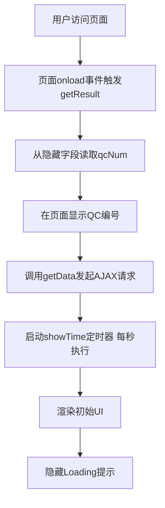
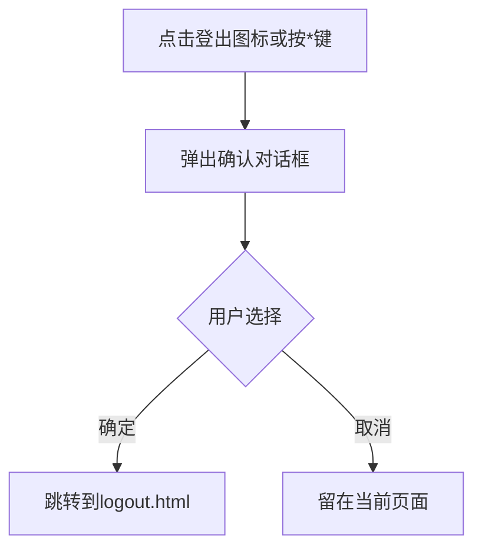

# QC Terminal Display - 产品需求文档 (PRD)

## 1. 概述 (Overview)

QC Terminal Display（岸桥终端显示页面）是一个实时监控页面，用于在港口码头操作现场展示特定岸桥（Quay Crane, QC）的集装箱装卸作业状态。该页面以可视化网格形式呈现船舶舱位（Bay）的实时占用情况，帮助操作人员监控装卸进度、识别特殊集装箱类型，并跟踪剩余待处理集装箱数量。

**业务目的：**
- 为岸桥操作员提供实时的装卸作业可视化界面
- 显示当前正在处理的舱位（Bay）、甲板/舱内（Deck/Hold）位置
- 标识特殊集装箱类型：超限箱（OOG）、冷藏箱（Reefer）、罐式箱（Tank）、危险品箱（DG）、20英尺箱等
- 显示多吊具作业状态：单吊（Single）、双吊（Twin）、串联吊（Tandem）、四吊（Quad）
- 跟踪剩余待处理集装箱数量
- 显示船舶加油状态（Refueling）

**技术特点：**
- 基于JSP + jQuery的传统Web应用
- 采用XML格式的数据交换协议
- 支持自适应刷新频率（根据网络状况动态调整轮询间隔）
- 使用颜色编码区分不同状态的舱位单元格

## 2. 用户角色 (User Roles)

| 角色 | 职责 | 权限 |
|------|------|------|
| 岸桥操作员 (QC Operator) | 监控当前岸桥的装卸作业进度，查看舱位占用状态 | 只读访问，可查看实时数据 |
| 码头调度员 (Terminal Dispatcher) | 监控多个岸桥的作业状态，协调资源分配 | 只读访问，可切换不同QC编号查看 |
| 系统管理员 (System Administrator) | 配置颜色方案、舱位矩阵尺寸、船舶加油范围 | 读写访问，可管理系统配置 |

## 3. 页面布局 (Page Layout)

页面整体分为三个主要区域：

### 3.1 顶部信息栏 (Header Info)
位于页面顶部，蓝色背景，包含两行信息：

**第一行：**
- 左侧：当前日期和时间（实时更新，每秒刷新）
- 中间偏左：信号指示灯（绿色/红色图片，表示网络连接状态）
- 中间：固定文本 "MODERN TERMINALS"
- 右侧：设施代码（Facility Code，从服务器端传入）

**第二行：**
- 左侧：QC编号（从URL参数qcNum获取）+ Bay信息（如 "BAY:35D" 表示35号舱位甲板层）
- 中间偏左：作业类型（LOAD/DISCH，装船或卸船）
- 中间：剩余集装箱数量（Remaining Container）
- 中间偏右：加油状态（Is Refueling: Yes/No）
- 右侧：船舶名称（Vessel Name）

### 3.2 登出按钮 (Logout Button)
位于页面右上角，点击后弹出确认对话框，确认后跳转到logout.html

### 3.3 数据表格区域 (Table List)
占据页面主体部分（约70%高度），以HTML表格形式展示舱位矩阵：
- **表头行**：显示 "Tier" 标签和各Row编号
- **数据行**：每行代表一个Tier层级，从左到右依次为Tier编号和各Row位置的单元格
- 单元格根据集装箱状态显示不同背景色和标识符

### 3.4 隐藏元素
- Loading提示：页面加载时显示 "Loading" 文字
- 调试消息框：仅在debugMode=true时显示，用于显示AJAX请求详情

> 📎 Source: src/main/webapp/WEB-INF/jsp/tqcvmt.jsp → body structure; src/main/webapp/js/vmt.js → callBack()

## 4. 搜索字段 (Search Fields)

本页面**无传统搜索功能**，但支持以下输入方式：

| 输入项 | 类型 | 说明 |
|--------|------|------|
| qcNum | URL参数/隐藏字段 | 岸桥编号，通过URL参数传递（如 `?qcNum=QC83`），存储在隐藏input中 |

> 📎 Source: src/main/webapp/WEB-INF/jsp/tqcvmt.jsp → `<input type="hidden" id="qcNum">`; src/main/webapp/js/vmt.js → getUrl()

## 5. 表格列 (Table Columns)

### 5.1 舱位矩阵表格结构

表格以二维网格形式展示船舶舱位，行列含义如下：

**列（Columns）- Row维度：**
- 第一列：固定显示 "Tier" 标签
- 后续各列：代表不同的Row编号（如01, 03, 05... 奇数行号）

**行（Rows）- Tier维度：**
- 第一列：显示Tier编号（如02, 04, 06... 偶数层号，或甲板层的78, 80, 82...）
- 后续单元格：对应特定Tier和Row组合的舱位状态

### 5.2 单元格显示内容

每个单元格可能显示以下标识符组合（按优先级叠加）：

| 标识符 | 含义 | 触发条件 |
|--------|------|----------|
| O | Out of Gauge (超限箱) | is_oog = '1' |
| R | Reefer (冷藏箱/插电箱) | is_powered = '1' |
| X | Tank (罐式箱) | istank = '1' |
| Q | Quad (四吊具作业) | isquad = '1' |
| W | Twin (双吊具作业) | istwin = '1' |
| T | Tandem (串联吊作业) | istandem = '1' |
| 20 | 20英尺集装箱 | twentyInd = 'Y'（仅卸船模式下偶数Bay） |
| * | Dangerous Goods (危险品) | is_dg = '1'，以黄色背景红色文字的角标形式显示 |
| Bay编号 | 跨Bay作业时的舱位号 | acrossBay='1' 且 issingle='1' 时显示（如"33"或"35"） |

> 📎 Source: src/main/java/com/springMVC/dao/CellDaoImpl.java → getCellInfo(); src/main/webapp/WEB-INF/jsp/tqcvmt.jsp → CSS classes

### 5.3 单元格背景色分类

| CSS类名 | 背景色 | 业务含义 |
|---------|--------|----------|
| load | 从服务器配置读取（load变量） | 正在装船的集装箱 |
| discharge | 从服务器配置读取（discharge变量） | 正在卸船的集装箱 |
| inactive | 从服务器配置读取（inactive变量） | 非活动状态（ROB - Remaining on Board，船上剩余集装箱） |
| empty | 从服务器配置读取（empty变量） | 空舱位 |
| complexunit | 从服务器配置读取（complexunit变量） | 复杂单元（两个相邻Bay的集装箱属性不一致，如一个OOG一个非OOG） |
| refuel | 红色背景，红色文字 | 加油区域（根据船舶加油配置标记的舱位） |
| twenty | 红色文字 + inactive背景色 | 20英尺集装箱标识 |

> 📎 Source: src/main/webapp/WEB-INF/jsp/tqcvmt.jsp → CSS definitions; src/main/java/com/springMVC/dao/CellDaoImpl.java → buildBay()

## 6. 交互组件 (Interaction Components)

### 6.1 登出确认对话框
- **触发条件**：点击右上角登出图标，或按下键盘 `*` 键（keyCode 106）
- **交互流程**：
  1. 弹出浏览器原生confirm对话框，显示国际化消息 "confirm_logout"
  2. 用户点击"确定"：跳转到 `logout.html`
  3. 用户点击"取消"：保持当前页面
- **关闭条件**：用户做出选择后自动关闭

> 📎 Source: src/main/webapp/WEB-INF/jsp/tqcvmt.jsp → sh() function

### 6.2 信号指示灯
- **显示位置**：顶部信息栏第二列
- **状态变化**：
  - 绿色图片（green.gif）：AJAX请求成功，数据正常同步
  - 红色图片（red.gif）：AJAX请求失败、超时、或检测到会话过期
- **更新时机**：每次AJAX请求完成后根据结果更新

> 📎 Source: src/main/webapp/js/vmt.js → ChangeSignalIndicator()

### 6.3 调试消息框
- **显示条件**：debugMode = true（硬编码为false，生产环境不显示）
- **显示内容**：AJAX请求的readyState、status、responseText等详细信息
- **位置**：绝对定位，距离顶部130px，宽300px，高300px，带滚动条

> 📎 Source: src/main/webapp/js/vmt.js → PrintMsg()

## 7. 用户流程 (User Flows)

### 7.1 页面初始化流程


### 7.2 数据轮询流程
```mermaid
graph TD
  getDataStart[getData被调用] --> checkProcessing{is_processing标志}
  checkProcessing -->|true| returnEarly[直接返回 避免并发请求]
  checkProcessing -->|false| setFlag[设置is_processing=true]
  setFlag --> buildUrl[构建URL: BusiQuery.html?qcNum=xxx]
  buildUrl --> ajaxCall[发起AJAX GET请求 timeout=9秒]
  ajaxCall --> successCheck{响应检查}
  successCheck -->|会话过期| redirectLogin[重定向到登录页]
  successCheck -->|成功| parseData[解析XML响应]
  successCheck -->|失败| handleError[错误处理 显示红色信号灯]
  parseData --> updateHeader[更新头部信息 Bay/QCAct/剩余数量等]
  updateHeader --> updateTable[更新tableList HTML内容]
  updateTable --> greenSignal[设置绿色信号灯]
  greenSignal --> clearFlag[清除is_processing标志]
  handleError --> clearFlag
  redirectLogin --> end[结束]
  clearFlag --> adjustInterval[根据refreshMode调整下次轮询间隔]
  adjustInterval --> end
```

### 7.3 自适应刷新机制
系统根据网络状况动态调整轮询间隔（FIR-TMT-000005特性）：

| refreshMode | 场景 | 轮询间隔 |
|-------------|------|----------|
| 1 | 模式1（快速刷新） | 10秒 |
| 2 | 模式2（分时段刷新） | 工作时间段（mode2StartTime~mode2EndTime）：20秒；其他时间：10秒 |
| 3 | 模式3（自适应刷新，默认） | 根据超时次数动态调整：<br/>- 无超时：15秒 → 20秒 → 25秒 → 30秒（逐步降低频率）<br/>- 第1次超时：20秒<br/>- 第2次超时：25秒<br/>- 第3次及以上：30秒 |

> 📎 Source: src/main/webapp/js/vmt.js → getData() finally block

### 7.4 登出流程


## 8. 业务规则 (Business Rules)

### 8.1 校验规则 (Validation)

| 规则ID | 规则描述 | 实现位置 |
|--------|----------|----------|
| V001 | qcNum参数不能为空 | 前端：从隐藏字段读取；后端：Busihandler接收参数 |
| V002 | 会话有效性检查 | 前端：检测响应中是否包含"<title>login"或"error_webpage_expired"，是则重定向到登录页 |
| V003 | Bay编号必须为整数 | 后端：CellDaoImpl.checkSequenceList() 中parseInt校验，失败抛出error_bay_number_integer异常 |

> 📎 Source: src/main/webapp/js/vmt.js → callBack() session check; src/main/java/com/springMVC/dao/CellDaoImpl.java → checkSequenceList()

### 8.2 条件显示规则 (Conditional Display)

| 规则ID | 条件 | 显示效果 |
|--------|------|----------|
| CD001 | isRefuel == 'Yes' | "reful"元素文字颜色变为红色 |
| CD002 | debugMode == true | 显示调试消息框（#msg） |
| CD003 | AJAX响应包含登录页面特征 | 重定向到登录页，不更新页面内容 |
| CD004 | qtype == 'DISCH' 且 Bay为偶数 | 检查相邻Bay是否有20英尺集装箱，有则在单元格显示"20"标识 |
| CD005 | complexunit == '1' | 单元格使用complexunit背景色（表示相邻Bay属性不一致） |
| CD006 | cellInfo包含"*"（危险品标识） | 根据cellInfo是否为空，使用dgind（大字号）或infodgind（小字号）样式显示黄色背景红色星号角标 |

> 📎 Source: src/main/webapp/js/vmt.js → callBack() isRefuel check; src/main/java/com/springMVC/dao/CellDaoImpl.java → buildBay()

### 8.3 数据转换规则 (Data Transformation)

| 规则ID | 源数据 | 转换逻辑 | 目标显示 |
|--------|--------|----------|----------|
| DT001 | DeckHold: 'A' | 转换为 'D'（Deck） | Bay显示如 "35D" |
| DT002 | DeckHold: 'B' | 转换为 'H'（Hold） | Bay显示如 "35H" |
| DT003 | QType: 'DISCH' | 通过messageUtil.getMessage()国际化 | 显示本地化的"DISCH"文本 |
| DT004 | QType: 'LOAD' | 通过messageUtil.getMessage()国际化 | 显示本地化的"LOAD"文本 |
| DT005 | isRefuel: 'Yes'/'No' | 通过messageUtil.getMessage()国际化 | 显示本地化的"Yes"/"No"文本 |
| DT006 | 服务器时间字符串 "yyyy-MM-dd HH:mm:ss" | 解析为Date对象，结合本地时间差计算当前服务器时间 | 前端显示实时更新的日期时间 |
| DT007 | Tier编号（Hold层） | j=0→"00", j=1→"02", j=2→"04", j=3→"06", j=4→"08", j>=5→j*2 | 符合船舶舱位标准的Tier编号 |
| DT008 | Tier编号（Deck层） | 78 + j*2 | 甲板层Tier编号从78开始递增 |
| DT009 | Row编号长度不足2位 | 前面补0 | 统一显示为两位数字（如"01"而非"1"） |

> 📎 Source: src/main/java/com/accenture/vmt/Busihandler.java → returnResponse(); src/main/java/com/springMVC/dao/CellDaoImpl.java → getTier(), getHoldTier(), getDeckTier()

### 8.4 权限控制规则 (Permission Control)

| 规则ID | 控制点 | 说明 |
|--------|--------|------|
| PC001 | 页面访问 | 需要有效会话，会话过期时自动重定向到登录页 |
| PC002 | 数据查询 | 仅能查询当前qcNum对应的岸桥数据，无法跨QC查看 |
| PC003 | 登出操作 | 所有用户均可执行登出，无需额外权限 |

> 📎 Source: src/main/webapp/js/vmt.js → callBack() session expiration check
