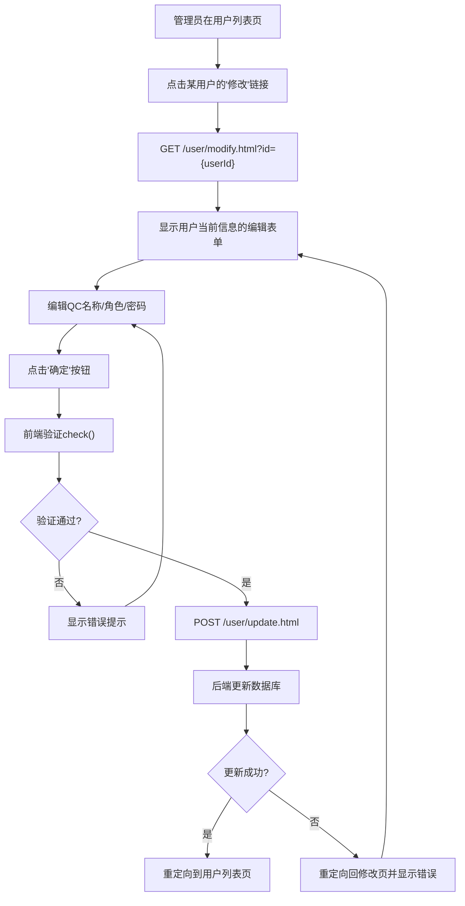
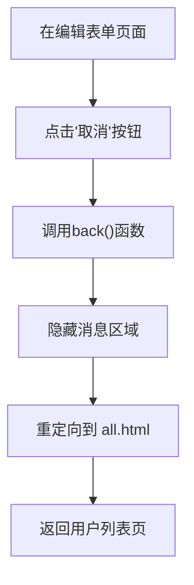
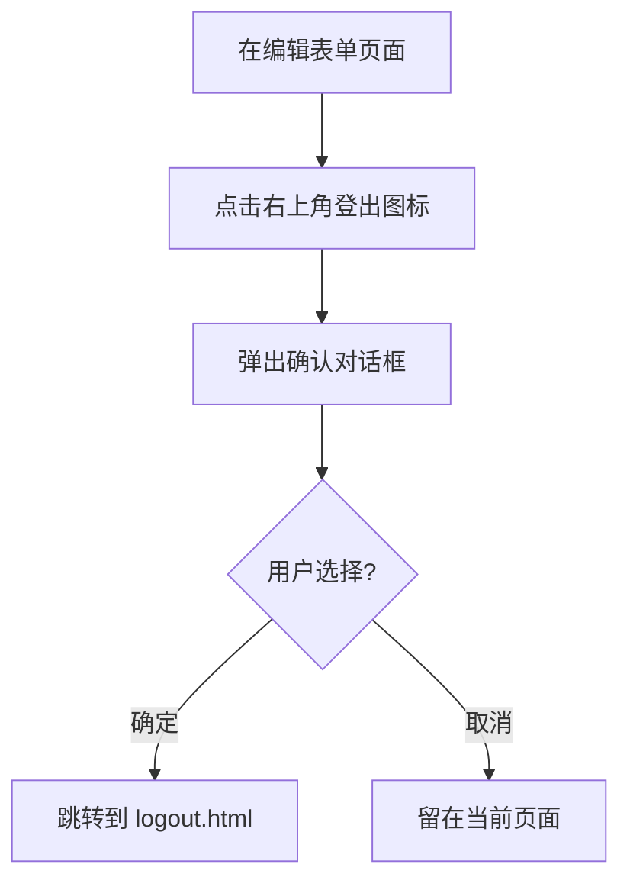

# 更新用户页面 PRD

## 1. 概述 (Overview)

本页面用于管理员修改现有用户的信息，包括用户名（只读）、QC名称、角色和密码。页面从用户管理列表页进入，加载指定用户的当前数据供编辑，提交后更新数据库并返回用户列表页。

**业务目的**：允许管理员修正或调整用户账户信息，确保系统用户数据的准确性和权限分配的正确性。

**范围**：单个用户记录的编辑操作，不涉及批量修改。

> 📎 Source: src/main/webapp/WEB-INF/jsp/update.jsp; src/main/java/com/springMVC/control/UserControl.java → modUser(), updateUser()

## 2. 用户角色 (User Roles)

| 角色 | 权限说明 |
|------|----------|
| 管理员 (ADMIN) | 可以访问用户管理列表页，点击"修改"链接进入本页面，编辑任意用户的信息 |
| 普通用户 (USER) | 无权限访问本页面，仅能通过管理员创建的账户登录系统 |

> 📎 Source: src/main/webapp/WEB-INF/jsp/admin.jsp → 仅管理员可见"modify"链接

## 3. 页面布局 (Page Layout)

页面采用居中卡片式布局，整体结构如下：

```text
┌─────────────────────────────────────────────┐
│              MODERN TERMINALS                │  ← 标题栏（蓝色背景，白色文字）
├─────────────────────────────────────────────┤
│                                             │
│   用户名 : [____________]  (只读)           │
│   QC名称 : [____________]                   │
│   角色   : ○ USER  ○ ADMIN                 │
│   密码   : [____________]                   │
│   确认密码: [____________]                  │
│                                             │
│            [确定]      [取消]               │
│                                             │
│         （错误提示信息区域）                  │
│                                             │
└─────────────────────────────────────────────┘
```

- **标题区**：显示"MODERN TERMINALS"，右上角有登出图标
- **表单区**：包含5个字段和2个操作按钮
- **消息区**：隐藏的错误提示区域，验证失败时显示红色文字

> 📎 Source: src/main/webapp/WEB-INF/jsp/update.jsp → div#d1, div#d1_head, form:form

## 4. 搜索字段 (Search Fields)

本页面为编辑表单，不包含搜索功能。

## 5. 表格列 (Table Columns)

本页面为单记录编辑表单，不包含表格。

## 6. 交互组件 (Interaction Components)

### 6.1 用户信息编辑表单

**触发条件**：从用户管理列表页（admin.jsp）点击某用户的"修改"链接，URL携带用户ID参数（`modify.html?id={userId}`）

**表单字段**：

| 字段名 | 标签 | 类型 | 必填 | 约束 | 说明 |
|--------|------|------|------|------|------|
| username | 用户名 | 文本输入 | - | 只读 | 显示当前用户名，不可编辑 |
| qcid | QC名称 | 文本输入 | 是 | 最大长度6字符 | 用户关联的QC标识 |
| role | 角色 | 单选按钮 | 是 | USER / ADMIN | 二选一，默认选中用户当前角色 |
| password | 密码 | 密码输入 | 是 | 最大长度6字符 | 新密码 |
| cpassword | 确认密码 | 密码输入 | 是 | 最大长度6字符 | 需与密码字段一致 |
| u_id | 用户ID | 隐藏字段 | - | - | 用于后端识别要更新的用户记录 |

**提交逻辑**：
1. 点击"确定"按钮触发表单提交
2. 执行前端JavaScript验证函数 `check()`
3. 验证通过后POST到 `/user/update.html`
4. 后端更新成功则重定向到用户列表页（`/user/all.html`）
5. 更新失败则重定向回修改页面并显示错误信息

**关闭条件**：
- 点击"取消"按钮：调用 `back()` 函数，隐藏消息区域并重定向到 `all.html`（用户列表页）
- 表单提交成功后自动跳转

> 📎 Source: src/main/webapp/WEB-INF/jsp/update.jsp → form:form, check(), back(); src/main/java/com/springMVC/control/UserControl.java → updateUser()

### 6.2 登出确认对话框

**触发条件**：点击右上角登出图标

**交互流程**：
1. 弹出浏览器原生确认对话框，显示"你确定退出吗？"
2. 用户点击"确定"：跳转到 `logout.html`
3. 用户点击"取消"：无操作

> 📎 Source: src/main/webapp/WEB-INF/jsp/update.jsp → sh()

## 7. 用户流程 (User Flows)

### 流程1：修改用户信息



### 流程2：取消编辑



### 流程3：登出系统



## 8. 业务规则 (Business Rules)

### 8.1 校验规则 (Validation)

| 规则ID | 字段 | 规则描述 | 错误提示 |
|--------|------|----------|----------|
| V001 | password | 不能为空 | "密码不能为空" |
| V002 | password | 长度不能超过6字符 | "密码太长" |
| V003 | cpassword | 不能为空 | "确认密码不能为空" |
| V004 | cpassword | 长度不能超过6字符 | "确认密码太长" |
| V005 | password vs cpassword | 两次输入的密码必须一致 | "密码不匹配" |
| V006 | qcid | 长度不能超过6字符 | "QC姓名太长" |

> 📎 Source: src/main/webapp/WEB-INF/jsp/update.jsp → check(); src/main/resources/messages_zh_CN.properties

### 8.2 条件显示规则 (Conditional Display)

| 规则ID | 条件 | 显示内容 |
|--------|------|----------|
| D001 | `${!empty result}` 为真 | 显示服务器返回的错误结果（红色文字） |
| D002 | 用户当前角色为USER | USER单选按钮默认选中 |
| D003 | 用户当前角色为ADMIN | ADMIN单选按钮默认选中 |

> 📎 Source: src/main/webapp/WEB-INF/jsp/update.jsp → c:if, c:when

### 8.3 数据转换规则 (Data Transformation)

| 规则ID | 字段 | 转换逻辑 |
|--------|------|----------|
| T001 | role | 后端存储为字符串"USER"或"ADMIN"，前端以单选按钮形式展示 |
| T002 | u_id | 隐藏字段，从后端传入的用户对象中提取id值 |

### 8.4 权限控制规则 (Permission Control)

| 规则ID | 控制点 | 规则描述 |
|--------|--------|----------|
| P001 | 页面访问 | 仅管理员可通过用户列表页的"修改"链接进入本页面 |
| P002 | 用户名编辑 | 用户名设为只读，不允许修改 |
| P003 | 登出功能 | 所有登录用户均可使用右上角登出功能 |

> 📎 Source: src/main/webapp/WEB-INF/jsp/admin.jsp → 仅非limit模式下显示modify链接; src/main/webapp/WEB-INF/jsp/update.jsp → username readonly
