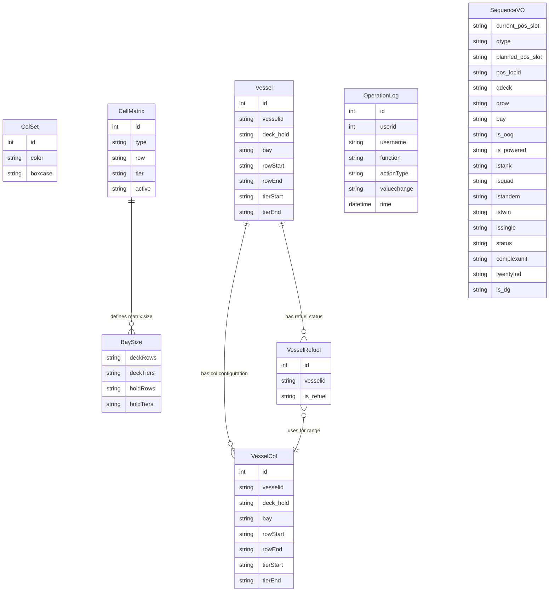

# Bay Configuration Module - PRD

## 1. 概述 (Overview)

Bay Configuration 模块是集装箱码头管理系统中的核心配置模块，负责管理船舶舱位（Bay）的布局配置、颜色方案、加油区域以及实时作业监控。该模块为码头操作人员提供可视化的船舶舱位矩阵展示，支持装卸作业过程中的实时监控和配置管理。

**业务范围：**
- 船舶舱位矩阵配置（甲板/舱内行列数设置）
- 集装箱颜色方案管理（按箱型分类显示）
- 船舶加油区域配置
- 船舶舱位行列范围配置
- 实时装卸作业监控（通过QC编号查询）

**目标用户：** 码头操作人员、调度员、系统管理员

## 2. 业务能力 (Business Capabilities)

### 2.1 舱位矩阵配置能力
- 查询当前系统的舱位矩阵尺寸（甲板行数/层数、舱内行数/层数）
- 更新舱位矩阵的激活状态，控制哪些行列在系统中可见

### 2.2 颜色方案管理能力
- 管理集装箱颜色方案，根据箱型（Boxcase）分配显示颜色
- 支持颜色方案的增删改查操作
- 确保箱型名称的唯一性约束

### 2.3 船舶基础配置能力
- 管理船舶基本信息（船名、甲板/舱内标识、Bay号）
- 配置船舶的行列范围（Row Start/End, Tier Start/End）
- 支持船舶信息的搜索和分页查询
- 防止重复配置（船名+甲板/舱内+Bay号的唯一性校验）

### 2.4 加油区域配置能力
- 配置船舶的加油状态（是否加油中）
- 配置加油区域的行列范围（VesselCol）
- 记录加油配置的变更日志
- 支持加油配置的增删改查

### 2.5 实时作业监控能力
- 根据岸桥（QC）编号实时查询当前作业状态
- 展示当前作业的Bay位置、作业类型（装/卸）、剩余集装箱数量
- 可视化展示舱位占用情况（包括特殊箱标识：超限箱、冷藏箱、油罐箱、危险品箱等）
- 支持多吊具作业识别（单吊、双吊、 tandem、四吊）

## 3. API 能力 (API Capabilities)

### 3.1 舱位矩阵配置接口

| 接口路径 | 方法 | 功能描述 |
|---------|------|---------|
| /user/setbay | GET | 查询当前舱位矩阵尺寸，返回甲板和舱内的行列数配置 |
| /user/updateBay | POST | 更新舱位矩阵配置，激活指定范围内的行列 |

### 3.2 颜色方案管理接口

| 接口路径 | 方法 | 功能描述 |
|---------|------|---------|
| /user/allColSet | GET | 分页查询所有颜色方案列表（每页10条） |
| /user/addColor | GET | 打开新增颜色方案页面 |
| /user/saveColSet | POST | 保存新的颜色方案，校验箱型名称唯一性 |
| /user/modifyColSet | GET | 根据ID查询颜色方案详情，用于编辑 |
| /user/updateColSet | POST | 更新颜色方案的颜色值 |
| /user/delColSet | GET | 删除指定的颜色方案 |

### 3.3 船舶基础配置接口

| 接口路径 | 方法 | 功能描述 |
|---------|------|---------|
| /user/allVessel | GET | 分页查询所有船舶配置列表（每页10条） |
| /user/searchVessel | GET | 按关键字搜索船舶（支持船名、甲板/舱内、Bay号模糊查询） |
| /user/addVessel | GET | 打开新增船舶配置页面 |
| /user/saveVessel | POST | 保存新的船舶配置，校验唯一性 |
| /user/modifyVessel | GET | 根据ID查询船舶详情，用于编辑 |
| /user/updateVessel | POST | 更新船舶配置信息 |
| /user/delVessel | GET | 删除指定的船舶配置 |

### 3.4 加油配置接口

| 接口路径 | 方法 | 功能描述 |
|---------|------|---------|
| /user/allVesselRefuel | GET | 分页查询所有船舶加油状态列表 |
| /user/searchVesselRefuel | GET | 按关键字搜索加油配置 |
| /user/addVesselRefuel | GET | 打开新增加油配置页面 |
| /user/modifyVesselRefuel | GET | 根据ID查询加油配置详情 |
| /user/updateVesselRefuelStatus | POST | 保存或更新船舶加油状态（新增或修改） |
| /user/delVesselRefuel | GET | 删除加油配置并记录操作日志 |

### 3.5 船舶舱位行列配置接口

| 接口路径 | 方法 | 功能描述 |
|---------|------|---------|
| /user/allVesselCol | GET | 分页查询所有船舶舱位行列配置列表 |
| /user/searchVesselColor | GET | 按关键字搜索舱位行列配置 |
| /user/addVesselCol | GET | 打开新增舱位行列配置页面 |
| /user/modifyVesselCol | GET | 根据ID查询舱位行列配置详情 |
| /user/saveVesselCol | POST | 保存或更新舱位行列配置（新增或修改） |
| /user/delVesselCol | GET | 删除舱位行列配置并记录操作日志 |

### 3.6 实时业务查询接口

| 接口路径 | 方法 | 功能描述 |
|---------|------|---------|
| /user/BusiQuery | GET | 根据QC编号实时查询作业状态，返回XML格式的舱位占用信息和作业数据 |

## 4. 数据实体 (Data Entities)

**实体说明：**

| 实体 | 业务含义 | 关键字段 |
|-----|---------|---------|
| BaySize | 舱位矩阵尺寸配置 | deckRows（甲板行数）、deckTiers（甲板层数）、holdRows（舱内行数）、holdTiers（舱内层数） |
| ColSet | 颜色方案配置 | boxcase（箱型名称，唯一）、color（显示颜色） |
| Vessel | 船舶基础配置 | vesselid（船名）、deck_hold（A=甲板/B=舱内）、bay（Bay号）、rowStart/End（行范围）、tierStart/End（层范围） |
| VesselRefuel | 船舶加油状态 | vesselid（船名）、is_refuel（Yes/No） |
| VesselCol | 船舶舱位行列配置 | vesselid、deck_hold、bay、rowStart/End、tierStart/End（定义加油区域的行列范围） |
| CellMatrix | 舱位矩阵基础数据 | type（A=甲板/B=舱内）、row（行号）、tier（层号）、active（是否激活） |
| SequenceVO | 作业序列视图对象 | 包含当前作业位置、作业类型、特殊箱标识等实时数据 |
| OperationLog | 操作日志 | 记录用户对加油配置和舱位行列配置的变更操作 |

## 5. 业务规则 (Business Rules)

### 5.1 校验规则 (Validation)

**颜色方案校验：**
- 箱型名称（boxcase）必须唯一，保存时检查是否存在同名记录
- 箱型名称长度限制为10字符
- 颜色值长度限制为15字符

**船舶配置校验：**
- 船名（vesselid）+ 甲板/舱内标识（deck_hold）+ Bay号（bay）的组合必须唯一
- 船名长度限制为10字符
- 行列范围和层范围字段长度限制为10字符

**舱位矩阵校验：**
- 更新舱位矩阵时，输入的行数和层数必须为正整数
- 甲板类型（A）和舱内类型（B）分别独立配置

**加油配置校验：**
- 加油状态（is_refuel）值为"Yes"或"No"
- 船名长度限制为10字符
- 加油状态字段长度限制为5字符

### 5.2 查询与过滤规则 (Query & Filter)

**分页查询规则：**
- 所有列表查询默认每页显示10条记录
- 分页参数通过`pager.offset`传递，默认为0
- 排序规则：
  - 船舶列表：按 vesselid, deck_hold, id 排序
  - 船舶加油列表：按 vesselid 排序
  - 船舶舱位行列列表：按 vesselid, deck_hold, id 排序
  - 颜色方案列表：无特定排序

**模糊搜索规则：**
- 船舶搜索支持对 vesselid、deck_hold、bay 三个字段的模糊匹配（LIKE '%key%'）
- 加油配置搜索支持对 vesselid、is_refuel 的模糊匹配
- 舱位行列配置搜索支持对 vesselid、deck_hold、bay 的模糊匹配

**实时作业查询过滤：**
- 仅查询作业阶段为'PLANNED'或'NONE'的卸船作业（DISCH）
- 仅查询作业阶段为'COMPLETE'的装船作业（LOAD）
- 排除已离开、已关闭、已取消、已归档的船舶访问记录（phase not in '60DEPARTED', '70CLOSED', '80CANCELED', '90ARCHIVED'）
- 仅查询甲板（A）和舱内（B）的作业，排除G层
- 仅查询蓝色标记的作业（is_blue = '1'）
- 排除场内移动（move_kind != 'YARD'）和移位操作（move_kind != 'SHFT'）

**舱位矩阵查询规则：**
- 查询激活状态为'1'的舱位矩阵记录
- 按ID降序排列

### 5.3 计算与派生规则 (Calculation & Derivation)

**舱位矩阵尺寸计算：**
- 从T_CELLMATRIX表中查询最大行号和最大层号
- 实际尺寸 = 最大值 + 1（因为索引从0开始）
- 分别计算甲板（type='A'）和舱内（type='B'）的尺寸

**层号转换规则：**
- 舱内层号转换：j>=5时，tier=j*2；j=4时tier=08；j=3时tier=06；j=2时tier=04；j=1时tier=02；j=0时tier=00
- 甲板层号转换：tier = 78 + j * 2

**作业类型判断：**
- 比较卸船作业和装船作业的最小订单号（qorder）
- 订单号较小的优先执行
- 如果只有卸船作业，则QType='DISCH'；如果只有装船作业，则QType='LOAD'

**剩余集装箱数量计算：**
- 卸船作业：剩余数量 = 当前待作业集装箱数量
- 装船作业：剩余数量 = 总装船数量 - 已完成数量

**多吊具作业识别：**
- 四吊（Quad）：twin_with为PREV/NEXT且twin_int_fetch=1且is_tandem_with_next或is_tandem_with_previous为1
- Tandem：twin_with为NONE且twin_int_fetch=0且is_tandem_with_next或is_tandem_with_previous为1
- 双吊（Twin）：twin_with为PREV/NEXT且twin_int_fetch=1且is_tandem均为0
- 单吊（Single）：twin_with为NONE且twin_int_fetch=0且is_tandem均为0或为空

**跨Bay作业处理：**
- 当最小Bay和最大Bay不同时，视为跨Bay作业（AcrossBay='1'）
- Bay显示格式为"minBay/maxBay"（如"33/35"）
- 跨Bay作业时，如果前后Bay的特殊箱属性不同，取更严格的标识（OOG、冷藏、油罐、危险品任一为1则标记为1）

**20英尺集装箱标识：**
- 当Bay号为偶数且为单Bay作业时，检查相邻Bay是否有20英尺集装箱
- 如果有，则在对应位置标记"20"标识

**危险品箱标识：**
- 通过查询MN4O_QC_inv_hazards和MN4O_QC_INV_HAZARD_ITEMS表判断是否为危险品箱
- 当前该功能被临时屏蔽（FIR-TMT-000005），始终不显示危险品标识

### 5.4 状态转换规则 (State Transition)

**作业阶段状态：**
- 卸船作业允许的阶段：'PLANNED'（计划中）、'NONE'（未开始）
- 装船作业允许的阶段：'COMPLETE'（已完成）
- 作业完成后，move_stage从'PLANNED'/'NONE'转换为'COMPLETE'

**船舶访问阶段：**
- 有效阶段：排除'60DEPARTED'（已离开）、'70CLOSED'（已关闭）、'80CANCELED'（已取消）、'90ARCHIVED'（已归档）
- 仅查询处于活跃状态的船舶访问记录

**舱位矩阵激活状态：**
- active='1'表示该行列在系统中可见
- active='0'表示该行列被禁用
- 更新舱位矩阵时，将指定范围内的行列设置为active='1'，范围外的设置为active='0'

### 5.5 数据权限规则 (Data Permission)

**操作日志记录：**
- 删除加油配置时，记录操作用户、操作类型（DELETE）、操作对象信息
- 新增/更新加油配置时，记录操作用户、操作类型（SAVE/UPDATE）、变更前后的值
- 删除舱位行列配置时，记录操作用户、操作类型（DELETE）、操作对象信息
- 新增/更新舱位行列配置时，记录操作用户、操作类型（SAVE/UPDATE）、变更前后的值

**用户会话管理：**
- 从会话中获取当前登录用户信息（Constants.USER_LOGIN）
- 操作日志关联用户ID和用户名

### 5.6 集成规则 (Integration)

**N4系统集成：**
- 查询N4系统的船舶访问信息（MN4O_QC_argo_carrier_visit）
- 查询N4系统的船舶详细信息（MN4O_QC_vsl_vsl_visit_details、MN4O_QC_vsl_vessels）
- 查询N4系统的作业队列信息（MN4O_QC_inv_wq、MN4O_QC_inv_wi）
- 查询N4系统的集装箱单元信息（MN4O_QC_inv_unit、MN4O_QC_inv_unit_fcy_visit、MN4O_QC_inv_unit_yrd_visit）
- 查询N4系统的设备信息（MN4O_QC_ref_equipment）
- 查询N4系统的货物信息（MN4O_QC_inv_goods）
- 查询N4系统的岸桥移位信息（MN4O_QC_xps_craneshift、MN4O_QC_xps_pointofwork）

**数据同步规则：**
- 实时查询N4系统数据，不进行本地缓存
- 查询超时或连接失败时抛出GeneralException异常

### 5.7 批量与异步规则 (Batch & Async)

本模块无批量处理或异步任务。

### 5.8 默认值与自动填充规则 (Defaults & Auto-fill)

**分页默认值：**
- offset解析失败时，默认为0

**SequenceVO默认值：**
- 所有字符串字段初始化为空字符串""
- sequence初始化为0

**舱位矩阵默认查询：**
- 当N4系统查询无结果时，回退到查询本地T_CELLMATRIX表

## 6. 外部系统集成 (External System Integration)

### 6.1 N4 Terminal Operating System集成

**集成目的：** 获取实时的船舶作业数据和集装箱位置信息

**集成方式：** 直接数据库查询（JDBC）

**查询的N4表：**
- MN4O_QC_argo_carrier_visit：船舶访问记录
- MN4O_QC_vsl_vsl_visit_details：船舶访问详情
- MN4O_QC_vsl_vessels：船舶主数据
- MN4O_QC_inv_wq：作业队列
- MN4O_QC_inv_wi：作业指令
- MN4O_QC_inv_unit：集装箱单元
- MN4O_QC_inv_unit_fcy_visit：集装箱场站访问记录
- MN4O_QC_inv_unit_yrd_visit：集装箱堆场访问记录
- MN4O_QC_ref_equipment：设备参考数据
- MN4O_QC_inv_goods：货物信息
- MN4O_QC_xps_craneshift：岸桥移位记录
- MN4O_QC_xps_pointofwork：工作点信息
- MN4O_QC_inv_hazards：危险品信息（当前已屏蔽）
- MN4O_QC_INV_HAZARD_ITEMS：危险品项目（当前已屏蔽）
- MN4O_REF_EQUIP_TYPE：设备类型参考数据

**失败处理：**
- 查询超时时抛出"db_query_time_out"异常
- 连接失败时抛出"cannot_get_connection"异常
- 其他数据库错误时抛出"error_query_db_error"异常

**业务影响：**
- N4系统不可用时，实时作业监控功能无法使用
- 舱位矩阵配置和船舶配置功能不受影响（使用本地数据库）

## 7. 定时任务 (Scheduled Jobs)

本模块无定时任务。

## 8. 用户场景 (User Scenarios)

### 场景1：配置船舶舱位矩阵

**前置条件：** 系统管理员登录系统

**流程：**
1. 访问 /user/setbay 页面，查看当前舱位矩阵尺寸
2. 输入新的甲板行数、甲板层数、舱内行数、舱内层数
3. 提交表单调用 /user/updateBay 接口
4. 系统更新T_CELLMATRIX表中对应范围的active标志
5. 重定向到 /user/all.html 页面

**异常处理：**
- 数据库连接失败：显示"error_db_not_connected"错误消息
- 更新失败：显示"error_can_not_update_bay_size"错误消息

### 场景2：管理集装箱颜色方案

**前置条件：** 系统管理员登录系统

**流程：**
1. 访问 /user/allColSet 页面，查看现有颜色方案列表
2. 点击"新增"按钮，进入 /user/addColor 页面
3. 输入箱型名称和颜色值
4. 提交表单调用 /user/saveColSet 接口
5. 系统检查箱型名称是否已存在
   - 如果存在：显示"A boxcase with the same name already exists!"错误，停留在当前页面
   - 如果不存在：保存成功，重定向到列表页面
6. 如需修改，点击"编辑"进入 /user/modifyColSet 页面，修改后提交到 /user/updateColSet
7. 如需删除，点击"删除"调用 /user/delColSet 接口

**边界情况：**
- 箱型名称为空：由前端校验
- 颜色值为空：允许保存（显示默认颜色）

### 场景3：配置船舶加油区域

**前置条件：** 系统管理员登录系统，已配置船舶基础信息

**流程：**
1. 访问 /user/allVesselRefuel 页面，查看船舶加油状态列表
2. 点击"新增"或"编辑"进入配置页面
3. 选择船名，设置加油状态（Yes/No）
4. 如需配置加油区域，访问 /user/allVesselCol 页面
5. 配置加油区域的船名、甲板/舱内、Bay号、行范围、层范围
6. 提交后系统保存配置并记录操作日志

**业务规则：**
- 加油状态为"Yes"时，系统在实时作业监控中高亮显示加油区域
- 操作日志记录变更前的值和变更后的值

### 场景4：实时监控岸桥作业

**前置条件：** 操作人员登录系统，岸桥正在作业

**流程：**
1. 系统定期调用 /user/BusiQuery?qcNum={qcNum} 接口
2. 系统查询N4系统获取当前作业信息
3. 返回XML格式数据，包含：
   - 当前时间
   - Bay位置（如"Bay:17H"）
   - 作业类型（LOAD/DISCH）
   - 剩余集装箱数量
   - 加油状态
   - 船名
   - 舱位占用表格HTML
4. 前端解析XML并更新显示

**异常情况：**
- 无作业进行中：显示"error_no_qc_working"错误
- 数据库查询超时：显示"db_query_time_out"错误
- 数据库连接失败：显示"cannot_get_connection"错误
- 其他错误：显示"error_query_db_error"错误

**特殊场景：**
- 跨Bay作业：显示"33/35"格式的Bay号
- 多吊具作业：在单元格中标识Q（四吊）、T（Tandem）、W（双吊）
- 特殊箱：O（超限箱）、R（冷藏箱）、X（油罐箱）、*（危险品箱，当前已屏蔽）
- 20英尺集装箱：在偶数Bay显示"20"标识

### 场景5：搜索船舶配置

**前置条件：** 系统管理员登录系统

**流程：**
1. 在船舶列表页面输入搜索关键字
2. 调用 /user/searchVessel?key={keyword} 接口
3. 系统模糊匹配船名、甲板/舱内标识、Bay号
4. 返回分页结果

**边界情况：**
- 搜索关键字为空：返回所有记录
- 无匹配结果：返回空列表

## 9. 术语表 (Glossary)

| 术语 | 定义 |
|-----|------|
| Bay | 船舶舱位，沿船长方向划分的区域，用数字标识（如01、03、05...） |
| Row | 行，沿船宽方向的位置，用两位数字标识（如01、03、05...） |
| Tier | 层，垂直方向的位置，用两位数字标识（如02、04、06...） |
| Deck (A) | 甲板，船舶上层装载区域，层号从78开始递增 |
| Hold (B) | 舱内，船舶下层装载区域，层号从00开始递增 |
| QC (Quay Crane) | 岸桥，码头用于装卸集装箱的大型起重机 |
| LOAD | 装船作业，将集装箱从堆场装载到船舶上 |
| DISCH | 卸船作业，将集装箱从船舶卸载到堆场 |
| OOG (Out of Gauge) | 超限箱，尺寸超出标准集装箱的货物 |
| Reefer | 冷藏箱，需要供电保持温度的集装箱 |
| Tank Container | 油罐箱，用于运输液体货物的集装箱 |
| DG (Dangerous Goods) | 危险品箱，装载危险货物的集装箱（当前功能已屏蔽） |
| Twin Lift | 双吊作业，一次吊装两个20英尺集装箱 |
| Tandem Lift | Tandem作业，一次吊装两个40英尺集装箱 |
| Quad Lift | 四吊作业，一次吊装四个20英尺集装箱或两个40英尺集装箱 |
| ROB (Remaining on Board) | 船上剩余集装箱，指未被卸载的集装箱 |
| Boxcase | 箱型，集装箱的类型分类 |
| Vessel Visit | 船舶访问，船舶在码头的停靠记录 |
| Phase | 船舶访问阶段，标识船舶当前状态（如DEPARTED、CLOSED等） |
| Move Stage | 作业阶段，标识集装箱移动的状态（PLANNED、COMPLETE等） |
| is_blue | 蓝色标记，标识作业是否为当前优先处理的作业 |
