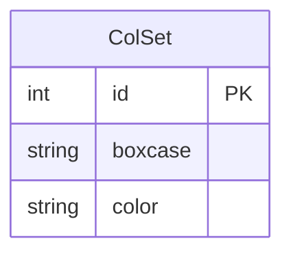

# Color Set Management - PRD

## 1. 概述 (Overview)

Color Set Management 模块用于管理集装箱颜色配置规则。该模块允许用户定义不同箱型（boxcase）对应的显示颜色，以便在集装箱码头可视化系统中以不同颜色区分不同类型的集装箱。

**业务范围：**
- 颜色配置的增删改查
- 基于箱型的颜色映射管理
- 分页列表展示

**业务目的：**
为码头操作人员提供可视化的集装箱分类标识，通过颜色快速识别不同箱型或特殊类型的集装箱，提升作业效率和准确性。

## 2. 业务能力 (Business Capabilities)

| 能力编号 | 能力名称 | 描述 |
|---------|---------|------|
| BC-001 | 颜色配置查询 | 分页查询所有已配置的颜色规则 |
| BC-002 | 新增颜色配置 | 创建新的箱型-颜色映射关系 |
| BC-003 | 修改颜色配置 | 更新已有颜色配置的颜色值 |
| BC-004 | 删除颜色配置 | 移除不再需要的颜色配置规则 |
| BC-005 | 唯一性校验 | 确保同一箱型不会重复配置 |

## 3. API 能力 (API Capabilities)

| API 路径 | HTTP 方法 | 业务功能 | 请求参数 | 响应说明 |
|---------|----------|---------|---------|---------|
| `/user/allColSet` | GET | 查询颜色配置列表 | `pager.offset`: 分页偏移量 | 返回分页后的颜色配置列表，包含总记录数、当前页数据 |
| `/user/addColor` | GET | 打开新增颜色配置页面 | 无 | 返回新增页面视图 |
| `/user/saveColSet` | POST | 保存新颜色配置 | `boxcase`: 箱型代码 `color`: 颜色值 | 保存成功后跳转到列表页；若箱型已存在则提示错误 |
| `/user/modifyColSet` | GET | 打开修改颜色配置页面 | `id`: 配置ID | 返回修改页面视图，携带现有配置数据 |
| `/user/updateColSet` | POST | 更新颜色配置 | `id`: 配置ID `color`: 新颜色值 | 更新成功后跳转到列表页；失败则返回错误提示 |
| `/user/delColSet` | GET | 删除颜色配置 | `id`: 配置ID（通过模型绑定） | 删除成功后重定向到列表页 |

## 4. 数据实体 (Data Entities)

### 4.1 颜色配置实体 (ColSet)

| 字段名 | 类型 | 约束 | 业务含义 |
|-------|------|------|---------|
| id | Integer | 主键，自增 | 配置唯一标识 |
| boxcase | String(10) | 非空，唯一 | 箱型代码，如"20GP"、"40HC"等 |
| color | String(15) | 非空 | 显示颜色值，如"red"、"#FF0000"等 |

### 4.2 ER 图

**说明：**
- ColSet 为独立实体，不与其他业务实体建立外键关系
- boxcase 字段具有业务唯一性约束（同一箱型只能配置一种颜色）

## 5. 业务规则 (Business Rules)

### 5.1 校验规则 (Validation)

| 规则编号 | 规则描述 | 触发场景 | 错误提示 |
|---------|---------|---------|---------|
| VR-001 | 箱型唯一性校验 | 新增颜色配置时 | "A boxcase with the same name already exists!" |
| VR-002 | 箱型非空校验 | 新增/修改时 | 由前端或数据库约束保证 |
| VR-003 | 颜色值非空校验 | 新增/修改时 | 由前端或数据库约束保证 |
| VR-004 | 箱型长度限制 | 新增/修改时 | 最大长度10字符 |
| VR-005 | 颜色值长度限制 | 新增/修改时 | 最大长度15字符 |

### 5.2 查询与过滤规则 (Query & Filter)

| 规则编号 | 规则描述 | 实现方式 |
|---------|---------|---------|
| QR-001 | 分页查询 | 每页固定10条记录，通过 offset 参数控制分页位置 |
| QR-002 | 全量查询 | 不按任何条件过滤，返回所有颜色配置记录 |
| QR-003 | 按ID精确查询 | 根据主键ID查询单条记录，用于修改前数据加载 |
| QR-004 | 按箱型精确查询 | 根据boxcase字段查询，用于唯一性校验 |

**分页逻辑：**
- 默认每页显示 10 条记录
- 通过请求参数 `pager.offset` 指定起始位置
- 若 offset 参数缺失或格式错误，默认为 0（第一页）

### 5.3 计算与派生规则 (Calculation & Derivation)

本模块不涉及复杂的计算逻辑。

### 5.4 状态转换规则 (State Transition)

本模块不涉及状态机或审批流程。

### 5.5 数据权限规则 (Data Permission)

| 规则编号 | 规则描述 |
|---------|---------|
| DP-001 | 无行级数据权限控制，所有登录用户可查看和修改全部颜色配置 |
| DP-002 | 无租户隔离机制 |

### 5.6 集成规则 (Integration)

本模块不依赖外部系统集成。

### 5.7 批量与异步规则 (Batch & Async)

本模块不支持批量操作，所有操作均为同步执行。

### 5.8 默认值与自动填充规则 (Defaults & Auto-fill)

| 字段 | 默认值来源 | 说明 |
|-----|-----------|------|
| id | 数据库序列 colset_seq | 由 Hibernate 自动生成 |

## 6. 外部系统集成 (External System Integration)

本模块不与任何外部系统进行数据交互。

## 7. 定时任务 (Scheduled Jobs)

本模块不包含定时任务。

## 8. 用户场景 (User Scenarios)

### 场景 1：查看颜色配置列表

**前置条件：** 用户已登录系统

**操作流程：**
1. 用户访问 `/user/allColSet` 页面
2. 系统查询所有颜色配置，按每页10条分页展示
3. 用户可通过翻页查看其他页数据

**异常处理：**
- 若数据库查询失败，页面不显示具体错误信息（异常被捕获但未向前端传递）

### 场景 2：新增颜色配置

**前置条件：** 用户已登录系统

**操作流程：**
1. 用户点击"新增"按钮，访问 `/user/addColor`
2. 系统展示新增表单页面
3. 用户输入箱型代码和颜色值
4. 用户提交表单，系统调用 `/user/saveColSet`
5. 系统校验箱型是否已存在
   - 若已存在：返回错误提示 "A boxcase with the same name already exists!"，停留在新增页面
   - 若不存在：保存配置，重定向到列表页

**异常处理：**
- 若保存失败（如数据库异常），返回错误提示 "The operation failed"，停留在新增页面

### 场景 3：修改颜色配置

**前置条件：** 用户已登录系统，存在待修改的配置记录

**操作流程：**
1. 用户在列表中点击某条记录的"修改"链接
2. 系统访问 `/user/modifyColSet?id={id}`，加载现有数据
3. 用户修改颜色值
4. 用户提交表单，系统调用 `/user/updateColSet`
5. 系统更新记录
   - 若成功：重定向到列表页
   - 若失败：返回错误提示 "The operation failed"，停留在修改页面

**异常处理：**
- 若 ID 不存在或格式错误，可能抛出 NumberFormatException（未做容错处理）

### 场景 4：删除颜色配置

**前置条件：** 用户已登录系统，存在待删除的配置记录

**操作流程：**
1. 用户在列表中点击某条记录的"删除"链接
2. 系统访问 `/user/delColSet?id={id}`
3. 系统删除对应记录
4. 重定向到列表页

**异常处理：**
- 若删除失败（如数据库异常），异常被捕获但未向前端传递明确错误信息
- 无二次确认机制，用户误点击即直接删除

### 边缘场景与错误处理

| 场景 | 当前处理方式 | 业务影响 |
|-----|-------------|---------|
| 分页参数非法 | 默认 offset=0，展示第一页 | 用户体验良好 |
| 箱型重复新增 | 返回错误提示，阻止保存 | 符合预期 |
| 数据库连接失败 | 异常堆栈打印到日志，前端无明确提示 | 用户无法得知失败原因 |
| 删除不存在的记录 | Hibernate 可能抛出异常，但被捕获 | 用户可能误以为删除成功 |

## 9. 术语表 (Glossary)

| 术语 | 英文 | 定义 |
|-----|------|------|
| 箱型 | Boxcase | 集装箱的类型代码，如 20GP（20英尺普通柜）、40HC（40英尺高柜）等 |
| 颜色配置 | Color Set | 将箱型与显示颜色关联的配置规则 |
| 分页偏移量 | Offset | 分页查询中跳过的前 N 条记录数，用于定位当前页的起始位置 |
