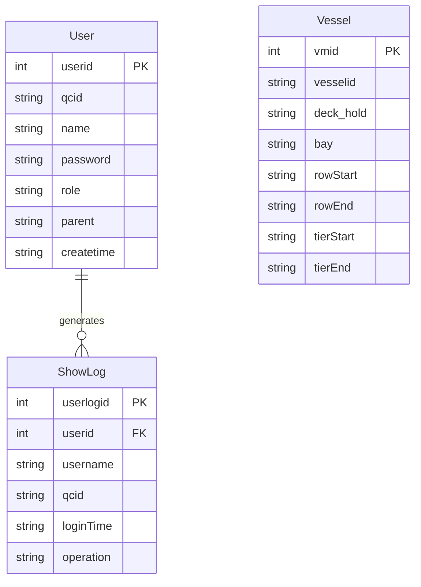

# 操作日志与导入导出模块 PRD

## 1. 概述 (Overview)

本模块提供用户操作日志管理、数据导出和船舶数据导入功能。主要业务目标包括：

- **操作审计**：记录用户登录/登出行为，支持按用户和时间范围查询操作日志
- **数据导出**：将操作日志导出为 Excel 文件，便于离线分析和存档
- **船舶数据导入**：支持从外部系统（N4）获取船舶信息，并通过上传文件批量导入船舶舱位配置数据

模块服务于港口集装箱码头管理系统，面向管理员和普通用户两类角色。

## 2. 业务能力 (Business Capabilities)

| 能力编号 | 能力名称 | 描述 |
|---------|---------|------|
| BC-01 | 操作日志查看 | 查看指定用户的操作日志，默认显示最近一个月的记录 |
| BC-02 | 操作日志导出 | 按时间范围导出操作日志为 Excel 文件 |
| BC-03 | 船舶数据导入页面访问 | 访问船舶数据导入功能入口页面 |
| BC-04 | 船舶数据文件导入 | 上传 Excel 或 TXT 格式文件，解析并导入船舶舱位配置数据 |

## 3. API 能力 (API Capabilities)

| API 路径 | HTTP 方法 | 业务功能 | 请求参数 | 响应内容 |
|---------|----------|---------|---------|---------|
| `/user/log` | GET | 查看用户操作日志 | `userid`（可选，用户ID）、`pager.offset`（分页偏移量） | 返回日志列表页面，包含用户名、QC号码、操作类型、时间等信息 |
| `/user/exportLogs` | GET | 导出操作日志 | `fromTime`（起始时间）、`toTime`（结束时间） | 下载 Excel 文件，文件名格式为 `yyyyMMddHHmmss.xls` |
| `/user/export` | GET | 访问导出页面 | 无 | 返回导出功能入口页面 |
| `/user/importVessel` | POST | 导入船舶数据 | 文件上传（multipart/form-data） | 导入成功后返回导入页面；失败时显示错误提示 |
| `/user/importPage` | GET | 访问导入页面 | 无 | 返回船舶数据导入页面 |

## 4. 数据实体 (Data Entities)

### 4.1 核心业务实体

**ShowLog（操作日志）**
- 记录用户登录和登出操作
- 关键字段：用户ID、用户名、QC号码、操作类型（LOGIN/LOGOUT）、操作时间

**User（用户）**
- 系统用户账户信息
- 关键字段：用户名、密码、角色（ADMIN/USER）、QC号码、创建人、创建时间

**Vessel（船舶）**
- 船舶舱位配置数据
- 关键字段：船舶ID、甲板/舱位标识、Bay号、Row起始/结束、Tier起始/结束

### 4.2 ER 图

## 5. 业务规则 (Business Rules)

### 5.1 校验规则 (Validation)

| 规则编号 | 规则描述 | 适用场景 |
|---------|---------|---------|
| VR-01 | 用户名唯一性检查 | 新增用户时，检查用户名是否已存在 |
| VR-02 | QC号码有效性验证 | USER角色登录时，需验证QC号码是否在系统中注册 |
| VR-03 | 角色匹配验证 | 登录时选择的角色必须与数据库中存储的角色一致 |
| VR-04 | 导入文件格式校验 | 仅支持 `.xls`、`.xlsx`、`.txt` 格式文件 |
| VR-05 | 船舶ID存在性验证 | 导入TXT文件时，需验证船舶ID在N4系统中存在 |

### 5.2 查询与过滤规则 (Query & Filter)

| 规则编号 | 规则描述 | 实现方式 |
|---------|---------|---------|
| QR-01 | 日志时间范围限制 | 查看用户日志时，默认只查询最近一个月的记录（从当前时间往前推一个月） |
| QR-02 | 日志排序规则 | 按操作时间降序排列 |
| QR-03 | 分页规则 | 每页显示10条记录，通过 `pager.offset` 参数控制分页偏移量 |
| QR-04 | 导出日志过滤条件 | 导出时仅包含 `qcid` 不为空的日志记录 |
| QR-05 | 用户列表排序 | 按用户名升序排列 |

### 5.3 计算与派生规则 (Calculation & Derivation)

| 规则编号 | 规则描述 | 计算公式/逻辑 |
|---------|---------|--------------|
| CR-01 | QC号码拼接规则 | 根据输入参数自动拼接：优先使用 `qc` 参数生成 `QC{qc}`，其次使用 `hc` 参数生成 `HC{hc}`，最后使用 `c` 参数生成 `C{c}` |
| CR-02 | 时间格式转换 | 导出时将内部存储的 `yyyyMMddHHmmss` 格式转换为 `yyyy-MM-dd HH:mm:ss` 格式显示 |
| CR-03 | 船舶舱位范围聚合 | 导入TXT文件时，对相同 Bay+Level 组合的记录，取 Row 的最小值作为 rowStart、最大值作为 rowEnd，取 Tier 的最小值作为 tierStart、最大值作为 tierEnd |

### 5.4 状态转换规则 (State Transition)

| 规则编号 | 状态转换 | 触发条件 | 前置条件 |
|---------|---------|---------|---------|
| SR-01 | 未登录 → 已登录 | 用户提交登录表单 | 用户名和密码正确，角色匹配 |
| SR-02 | 已登录 → 已登出 | 用户点击登出或会话过期 | 会话中存在有效的用户信息 |

### 5.5 数据权限规则 (Data Permission)

| 规则编号 | 规则描述 | 适用范围 |
|---------|---------|---------|
| PR-01 | ADMIN角色无QC限制 | ADMIN角色登录时，QC号码为空字符串，可访问所有数据 |
| PR-02 | USER角色QC绑定 | USER角色登录时需绑定有效的QC号码，后续操作与该QC关联 |
| PR-03 | 日志查看权限 | 可查看任意用户的操作日志（通过传入 userid 参数） |

### 5.6 集成规则 (Integration)

| 规则编号 | 集成对象 | 集成方式 | 数据流向 | 失败处理 |
|---------|---------|---------|---------|---------|
| IR-01 | N4系统（MN4O_QC_vsl_vessels表） | JDBC直接查询 | 读取船舶名称 | 抛出 `error_no_vessel_found_in_n4` 异常 |
| IR-02 | N4系统（MN4O_QC_xps_pointofwork等表） | JDBC直接查询 | 读取QC号码列表和Facility信息 | 返回空列表或空字符串 |

### 5.7 批量与异步规则 (Batch & Async)

本模块无定时任务或异步处理逻辑。

### 5.8 默认值与自动填充规则 (Defaults & Auto-fill)

| 规则编号 | 字段 | 默认值/自动填充逻辑 | 触发时机 |
|---------|------|-------------------|---------|
| DR-01 | ShowLog.operation | "LOGIN" 或 "LOGOUT" | 用户登录/登出时自动记录 |
| DR-02 | ShowLog.loginTime | 当前时间（yyyyMMddHHmmss格式） | 记录日志时自动生成 |
| DR-03 | User.createtime | 当前时间 | 新增用户时自动填充 |
| DR-04 | User.parent | 当前登录用户的用户名 | 新增用户时记录创建人 |

## 6. 外部系统集成 (External System Integration)

### 6.1 N4 系统集成

| 集成项 | 说明 |
|-------|------|
| 集成系统 | N4 Terminal Operating System |
| 集成方式 | 通过 JDBC 直接查询 N4 数据库表 |
| 涉及表 | `MN4O_QC_vsl_vessels`（船舶主数据）、`MN4O_QC_xps_pointofwork`（QC工作点）、`MN4O_QC_argo_yard`（堆场）、`MN4O_QC_argo_facility`（设施） |
| 同步频率 | 实时查询，非定时同步 |
| 业务影响 | 船舶导入依赖N4中的船舶主数据，若N4中不存在对应船舶ID则导入失败 |

## 7. 定时任务 (Scheduled Jobs)

本模块无定时任务。

## 8. 用户场景 (User Scenarios)

### 场景1：管理员查看用户操作日志

1. 管理员登录系统
2. 访问 `/user/log?userid={用户ID}` 查看指定用户的操作日志
3. 系统显示该用户最近一个月的登录/登出记录
4. 可通过分页查看更多历史记录

**边界情况**：
- 若用户ID无效，系统仍返回空列表而非报错
- 若数据库连接失败，页面显示错误提示

### 场景2：导出操作日志

1. 管理员访问 `/user/exportLogs?fromTime={起始时间}&toTime={结束时间}`
2. 系统查询指定时间范围内的所有操作日志（仅包含有QC号码的记录）
3. 生成 Excel 文件并触发浏览器下载
4. 文件名格式为当前时间戳 `.xls`

**边界情况**：
- 若时间范围内无数据，生成空表格的Excel文件
- 若时间格式不正确，可能抛出 ParseException

### 场景3：导入船舶舱位数据（TXT格式）

1. 用户访问 `/user/importPage` 进入导入页面
2. 用户上传符合格式的 TXT 文件
3. 系统解析文件内容：
   - 提取船舶ID（从 `*SHIP` 段落）
   - 解析舱位计划数据（从 `*STACK` 段落）
   - 解析自定义舱位数据（从 `*TIER` 段落，可选）
4. 验证船舶ID在N4系统中存在
5. 聚合相同 Bay+Level 的舱位数据，计算 Row/Tier 的范围
6. 批量保存到数据库

**边界情况**：
- 若文件中缺少必需字段（STAF BAY、LEVEL、ISO STACK、TOP TIER、BOTTOM TIER），提示 `import_vessel_file_empty`
- 若船舶ID在N4中不存在，提示 `error_no_vessel_found_in_n4`
- 若TXT格式解析失败，提示 `error_query_db_error`

### 场景4：导入船舶舱位数据（Excel格式）

1. 用户上传 `.xls` 或 `.xlsx` 文件
2. 系统读取第一个工作表，跳过第一行标题
3. 逐行解析数据，映射到 Vessel 实体的7个字段
4. 调用 VesselDao.save() 保存（若记录已存在则更新）

**边界情况**：
- 若Excel文件为空或格式错误，抛出异常
- 若单元格为公式类型，尝试获取计算结果

## 9. 术语表 (Glossary)

| 术语 | 定义 |
|-----|------|
| QC (Quay Crane) | 岸桥，港口用于装卸集装箱的大型起重机 |
| HC (Handheld Crane) | 手持设备编号，用于现场操作终端 |
| C (Container) | 集装箱编号 |
| Bay | 船舶横向舱位编号，表示集装箱在船上的横向位置 |
| Row | 船舶纵向排号，表示集装箱在船上的纵向位置 |
| Tier | 船舶层号，表示集装箱在船上的垂直层数 |
| Deck/Hold | 甲板/舱内标识，区分集装箱位于甲板上还是舱内 |
| N4 | Navis N4，一种广泛使用的码头操作系统（Terminal Operating System） |
| Facility | 设施，指码头的基础设施单元 |
| Yard | 堆场，集装箱临时存放区域 |
| LOGIN | 登录操作，记录用户成功登录系统的行为 |
| LOGOUT | 登出操作，记录用户退出系统的行为 |