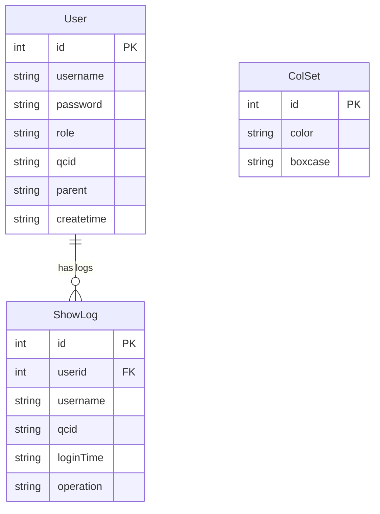

# 用户管理模块 (User Management) - PRD

## 1. 概述 (Overview)

用户管理模块是系统的核心身份认证与用户管理组件，负责处理用户登录、登出、用户账户的增删改查以及操作日志记录。该模块支持两种角色类型：普通用户（USER）和管理员（ADMIN），并提供多语言界面切换功能（简体中文、繁体中文、英文）。

**业务目的：**
- 提供安全的用户身份验证机制
- 管理用户账户生命周期（创建、修改、删除）
- 记录用户登录/登出操作日志用于审计
- 支持基于角色的访问控制（普通用户 vs 管理员）
- 为普通用户提供 QC（岸桥）编号验证和设施信息加载

**模块范围：**
- 用户登录/登出（包括普通用户和管理员）
- 用户账户管理（CRUD 操作）
- 操作日志查询与导出
- 多语言支持
- 与外部系统 N4 集成进行 QC 编号验证

> 📎 Source: src/main/java/com/springMVC/control/UserControl.java → UserControl

## 2. 业务能力 (Business Capabilities)

### 2.1 身份认证能力
- **用户登录**：支持用户名/密码验证，区分普通用户和管理员角色
- **QC 编号验证**：普通用户登录时需验证 QC 编号是否存在于 N4 系统中
- **会话管理**：登录后建立用户会话，存储用户信息和 QC ID
- **登出处理**：记录登出日志并清除会话

### 2.2 用户管理能力
- **创建用户**：管理员可创建新用户，指定用户名、密码、角色和 QC 编号
- **查询用户列表**：分页展示所有用户，支持限制特定账户的操作权限
- **修改用户**：更新用户的角色、密码和 QC 编号
- **删除用户**：删除用户及其关联的操作日志

### 2.3 日志审计能力
- **登录日志**：自动记录每次登录操作（用户名、QC 编号、时间）
- **登出日志**：自动记录每次登出操作
- **日志查询**：按用户 ID 查询最近一个月的操作日志，支持分页
- **日志导出**：按时间段导出操作日志为 Excel 文件

### 2.4 多语言能力
- **语言切换**：支持简体中文、繁体中文、英文三种语言
- **Cookie 记忆**：记住用户上次选择的 QC 编号偏好

### 2.5 数据导入能力
- **船舶信息导入**：支持从 Excel 或 TXT 文件导入船舶箱位配置信息

## 3. API 能力 (API Capabilities)

| API 路径 | HTTP 方法 | 业务功能 | 适用角色 |
|---------|----------|---------|---------|
| `/user/index` | GET | 显示登录页面，读取 Cookie 中的默认 QC 编号 | 所有用户 |
| `/user/changeLan` | GET | 切换界面语言（zh_CN/zh_TW/en） | 所有用户 |
| `/user/login` | GET | 显示登录页面（GET 方式） | 所有用户 |
| `/user/login` | POST | 执行用户登录验证 | 所有用户 |
| `/user/loginAdmin` | POST | 执行管理员登录验证 | 管理员 |
| `/user/add` | GET | 显示创建用户表单页面 | 管理员 |
| `/user/save` | POST | 保存新用户 | 管理员 |
| `/user/all` | GET | 分页查询所有用户列表 | 管理员 |
| `/user/del` | GET | 删除指定用户 | 管理员 |
| `/user/modify` | GET | 显示修改用户表单页面 | 管理员 |
| `/user/update` | POST | 更新用户信息 | 管理员 |
| `/user/logout` | GET | 执行登出操作 | 所有用户 |
| `/user/log` | GET | 查询指定用户的操作日志 | 管理员 |
| `/user/exportLogs` | GET | 导出指定时间段的日志为 Excel | 管理员 |
| `/user/export` | GET | 显示导出页面 | 管理员 |
| `/user/importPage` | GET | 显示导入页面 | 管理员 |
| `/user/importVessel` | POST | 导入船舶箱位配置信息 | 管理员 |

> 📎 Source: src/main/java/com/springMVC/control/UserControl.java → index(), login(), loginAdmin(), addUser(), add(), listAllUser(), delUser(), modUser(), updateUser(), logout(), showLog(), exportLogs(), importVessel()

## 4. 数据实体 (Data Entities)

### 4.1 实体关系图

### 4.2 实体说明

#### User（用户表 T_USER）
- **id**：用户唯一标识，自增序列
- **username**：用户名，长度 20
- **password**：密码，长度 6（⚠️ 密码长度限制过短，存在安全风险）
- **role**：角色，取值 USER 或 ADMIN，长度 10
- **qcid**：QC 编号，普通用户关联的岸桥编号，长度 20
- **parent**：创建者用户名，记录是谁创建了该用户，长度 10
- **createtime**：创建时间，格式 yyyyMMddHHmmss，长度 14

> 📎 Source: src/main/java/com/springMVC/entity/User.java → User

#### ShowLog（操作日志表 T_SHOWLOG）
- **id**：日志唯一标识，自增序列
- **userid**：关联的用户 ID
- **username**：用户名（冗余字段）
- **qcid**：QC 编号
- **loginTime**：操作时间，格式 yyyyMMddHHmmss，长度 20
- **operation**：操作类型，取值 LOGIN 或 LOGOUT，长度 15

> 📎 Source: src/main/java/com/springMVC/entity/ShowLog.java → ShowLog

#### ColSet（颜色配置表 T_COLSET）
- **id**：配置唯一标识，自增序列
- **color**：颜色值，长度 15
- **boxcase**：箱型代码，长度 10

> 📎 Source: src/main/java/com/springMVC/entity/ColSet.java → ColSet

## 5. 业务规则 (Business Rules)

### 5.1 校验规则 (Validation)

#### 登录验证
- **用户名和密码不能为空**：前端验证，错误消息 `error_username_empty` / `error_password_empty`
- **QC 编号验证（仅普通用户）**：登录时提交的 QC 编号必须在 N4 系统中存在，否则提示 `error_check_qc_number`
- **角色匹配验证**：登录时选择的角色必须与数据库中存储的角色一致，否则提示 `error_user_or_admin`
- **密码长度限制**：密码最大长度为 6 个字符（数据库字段限制）

> 📎 Source: src/main/java/com/springMVC/control/UserControl.java → login()

#### 用户创建验证
- **用户名唯一性**：创建用户前检查用户名是否已存在，存在则提示 `error_username_exists`
- **必填字段**：用户名、密码、角色、QC 编号均为必填

> 📎 Source: src/main/java/com/springMVC/control/UserControl.java → add()

#### 用户更新验证
- **ID 有效性**：更新时必须提供有效的用户 ID，无效 ID 默认为 0

> 📎 Source: src/main/java/com/springMVC/control/UserControl.java → updateUser()

### 5.2 查询与过滤规则 (Query & Filter)

#### 用户列表查询
- **排序规则**：按用户名升序排列
- **分页规则**：每页 10 条记录，通过 `pager.offset` 参数控制偏移量
- **权限过滤**：检查当前登录用户是否在 `limitAccount` 配置的限制账户列表中，若是则标记 `limit=Yes`

> 📎 Source: src/main/java/com/springMVC/dao/UserDaoImpl.java → getAllUser()

#### 操作日志查询
- **时间范围过滤**：仅查询最近一个月的日志（从当前时间往前推一个月）
- **用户过滤**：按用户 ID 过滤
- **排序规则**：按登录时间降序排列
- **分页规则**：每页 10 条记录

> 📎 Source: src/main/java/com/springMVC/dao/UserDaoImpl.java → getUserLog()

#### 日志导出查询
- **时间范围过滤**：按指定的起始时间和结束时间过滤
- **QC 编号过滤**：仅导出 QC 编号不为空的日志记录
- **排序规则**：按登录时间降序排列
- **无分页**：导出全部符合条件的记录

> 📎 Source: src/main/java/com/springMVC/dao/UserDaoImpl.java → getUserLogByPeriod()

#### QC 编号查询
- **数据来源**：从 N4 系统的 `MN4O_QC_xps_pointofwork` 表查询
- **过滤条件**：仅查询属于当前公司（由 `company` 配置项指定）的 QC 编号
- **去重**：使用 DISTINCT 去重

> 📎 Source: src/main/java/com/springMVC/dao/UserDaoImpl.java → queryQcId()

### 5.3 计算与派生规则 (Calculation & Derivation)

#### QC 编号拼接规则
- 登录时根据传入的参数拼接 QC 编号：
  - 如果提供了 `qc` 参数：`QC` + `qc`
  - 如果未提供 `qc` 但提供了 `hc` 参数：`HC` + `hc`
  - 如果都未提供但提供了 `c` 参数：`C` + `c`
- 管理员登录时 QC 编号为空字符串

> 📎 Source: src/main/java/com/springMVC/control/UserControl.java → login()

#### 时间格式化
- 系统内部时间格式：`yyyyMMddHHmmss`（14 位数字）
- 导出 Excel 时转换为：`yyyy-MM-dd HH:mm:ss`

> 📎 Source: src/main/java/com/springMVC/util/WebUtil.java → getTime(), DataFormatTransfer()

### 5.4 状态转换规则 (State Transition)

#### 登录流程
1. 清除会话中的用户信息和错误消息
2. 验证用户名和密码
3. 验证角色匹配
4. （普通用户）验证 QC 编号有效性
5. 记录登录日志
6. 设置会话属性（USER_LOGIN, QC_ID）
7. 加载颜色配置（普通用户）
8. 查询设施信息（普通用户）
9. 更新 Cookie 中的默认 QC 编号（普通用户）
10. 跳转到相应页面（管理员跳转到用户列表，普通用户跳转到主页面）

> 📎 Source: src/main/java/com/springMVC/control/UserControl.java → login()

#### 登出流程
1. 获取会话中的用户信息
2. 记录登出日志（包含 QC 编号）
3. 返回成功标志
4. 根据 QC 编号判断跳转到管理员登录页还是普通用户登录页

> 📎 Source: src/main/java/com/springMVC/dao/UserDaoImpl.java → logout()

### 5.5 数据权限规则 (Data Permission)

#### 角色权限
- **ADMIN（管理员）**：
  - 可以查看所有用户
  - 可以创建、修改、删除用户
  - 可以查看和导出操作日志
  - 可以导入船舶信息
  - 登录时无需 QC 编号验证
  
- **USER（普通用户）**：
  - 只能登录系统
  - 登录时必须提供有效的 QC 编号
  - 无法访问用户管理功能

#### 限制账户
- 通过配置文件 `limitAccount` 指定受限账户列表
- 受限账户在用户列表页面会被标记，可能限制某些操作

> 📎 Source: src/main/java/com/springMVC/control/UserControl.java → listAllUser()

### 5.6 集成规则 (Integration)

#### N4 系统集成
- **QC 编号验证**：登录时调用 N4 系统验证 QC 编号是否存在
- **设施信息查询**：根据 QC 编号查询所属设施名称
- **数据源**：直接查询 N4 数据库表（`MN4O_QC_xps_pointofwork`, `MN4O_QC_argo_yard`, `MN4O_QC_argo_facility`）

> 📎 Source: src/main/java/com/springMVC/dao/UserDaoImpl.java → queryQcId(), queryFacilityByQcId()

#### 颜色配置模块集成
- 普通用户登录时从 `CellDao` 加载颜色配置（`T_COLSET` 表）
- 用于前端界面显示定制

> 📎 Source: src/main/java/com/springMVC/control/UserControl.java → login()

### 5.7 批量与异步规则 (Batch & Async)

本模块暂无定时任务或批量处理逻辑。

### 5.8 默认值与自动填充规则 (Defaults & Auto-fill)

#### 用户创建
- **createtime**：自动填充为当前时间（格式 yyyyMMddHHmmss）
- **parent**：自动填充为当前登录用户的用户名（记录创建者）

> 📎 Source: src/main/java/com/springMVC/control/UserControl.java → add()

#### Cookie 管理
- **defQCNUM**：普通用户登录时自动保存或更新默认 QC 编号到 Cookie
- **defHCNUM**：同上，保存 HC 编号
- **defCNUM**：同上，保存 C 编号
- Cookie 有效期由配置项 `cookieMaxAge` 决定

> 📎 Source: src/main/java/com/springMVC/control/UserControl.java → login()

## 6. 外部系统集成 (External System Integration)

### 6.1 N4 系统

**集成目的**：验证 QC 编号有效性和查询设施信息

**集成方式**：直接数据库查询（JdbcTemplate）

**查询内容**：
1. **QC 编号列表**：从 `MN4O_QC_xps_pointofwork` 表查询属于当前公司的所有 QC 编号
2. **设施名称**：根据 QC 编号联表查询所属设施名称

**失败处理**：
- QC 编号不存在时提示 `error_check_qc_number`
- 数据库连接失败时提示 `error_db_not_connected`

> 📎 Source: src/main/java/com/springMVC/dao/UserDaoImpl.java → queryQcId(), queryFacilityByQcId()

### 6.2 颜色配置模块（color-set）

**集成目的**：加载用户界面的颜色配置

**集成方式**：调用 `CellDao.getColSet()` 方法

**触发时机**：普通用户登录成功后

**数据用途**：将箱型（boxcase）与颜色（color）的映射关系传递给前端视图

> 📎 Source: src/main/java/com/springMVC/control/UserControl.java → login()

## 7. 定时任务 (Scheduled Jobs)

本模块暂无定时任务。

## 8. 用户场景 (User Scenarios)

### 场景 1：普通用户登录

**前置条件**：用户已在系统中创建，角色为 USER

**流程**：
1. 用户访问 `/user/index`，看到登录页面
2. 用户输入用户名、密码，选择角色为 USER，输入 QC 编号
3. 系统验证用户名和密码
4. 系统验证 QC 编号是否在 N4 系统中存在
5. 系统验证用户角色是否为 USER
6. 验证通过后，记录登录日志
7. 系统加载颜色配置和设施信息
8. 系统将 QC 编号保存到 Cookie
9. 用户跳转到主页面（tqcvmt）

**异常处理**：
- 用户名或密码错误：提示 `error_nampass_incorrect`
- QC 编号不存在：提示 `error_check_qc_number`
- 角色不匹配：提示 `error_user_or_admin`
- 数据库连接失败：提示 `error_db_not_connected`

> 📎 Source: src/main/java/com/springMVC/control/UserControl.java → login()

### 场景 2：管理员登录

**前置条件**：用户已在系统中创建，角色为 ADMIN

**流程**：
1. 用户访问 `/user/index?url=admin`，看到管理员登录页面
2. 用户输入用户名、密码，选择角色为 ADMIN
3. 系统验证用户名和密码
4. 系统验证用户角色是否为 ADMIN
5. 验证通过后，记录登录日志（QC 编号为空）
6. 用户跳转到用户列表页面（/user/all.html）

**异常处理**：同普通用户登录

> 📎 Source: src/main/java/com/springMVC/control/UserControl.java → loginAdmin()

### 场景 3：管理员创建新用户

**前置条件**：管理员已登录

**流程**：
1. 管理员访问 `/user/add`，看到用户创建表单
2. 管理员输入用户名、密码、选择角色、输入 QC 编号
3. 系统检查用户名是否已存在
4. 若不存在，创建用户，自动填充创建时间和创建者
5. 跳转到用户列表页面

**异常处理**：
- 用户名已存在：提示 `error_username_exists`
- 创建失败：提示 `error_can_not_add_user`

> 📎 Source: src/main/java/com/springMVC/control/UserControl.java → add()

### 场景 4：管理员删除用户

**前置条件**：管理员已登录

**流程**：
1. 管理员在用户列表页面点击删除按钮
2. 系统删除指定用户
3. 系统同时删除该用户的所有操作日志
4. 跳转回用户列表页面

**异常处理**：删除失败时静默处理（仅打印堆栈）

> 📎 Source: src/main/java/com/springMVC/control/UserControl.java → delUser()

### 场景 5：导出操作日志

**前置条件**：管理员已登录

**流程**：
1. 管理员访问 `/user/exportLogs?fromTime=xxx&toTime=xxx`
2. 系统查询指定时间段内的所有操作日志（QC 编号不为空）
3. 生成 Excel 文件，包含列：用户名、QC 号码、操作、时间
4. 浏览器下载文件，文件名格式为 `yyyyMMddHHmmss.xls`

**异常处理**：导出失败时静默处理（仅打印堆栈）

> 📎 Source: src/main/java/com/springMVC/util/ExportHandler.java → exportQCLog()

### 场景 6：导入船舶信息

**前置条件**：管理员已登录

**流程**：
1. 管理员访问 `/user/importPage`，看到导入页面
2. 管理员上传 Excel 或 TXT 文件
3. 系统解析文件内容，提取船舶箱位配置
4. 系统验证船舶是否在 N4 系统中存在
5. 验证通过后，保存船舶信息到数据库
6. 显示导入结果

**异常处理**：
- 船舶在 N4 中不存在：提示 `error_no_vessel_found_in_n4`
- 文件格式错误或内容为空：提示 `import_vessel_file_empty`

> 📎 Source: src/main/java/com/springMVC/util/ImportHandler.java → importVessel()

### 场景 7：切换语言

**前置条件**：用户在登录页面

**流程**：
1. 用户点击语言切换链接，传入 `local` 参数（zh_CN/zh_TW/en）
2. 系统设置会话的语言属性
3. 刷新登录页面，界面文字变为对应语言

> 📎 Source: src/main/java/com/springMVC/control/UserControl.java → changeLan()

## 9. 术语表 (Glossary)

| 术语 | 定义 | 来源 |
|------|------|------|
| USER | 普通用户角色，需要 QC 编号才能登录 | 代码常量 |
| ADMIN | 管理员角色，拥有用户管理权限 | 代码常量 |
| QC | Quay Crane，岸桥，港口装卸设备 | 业务领域 |
| QCID | QC 编号，标识特定的岸桥设备 | 数据库字段 |
| HC | Harbor Crane，港桥（另一种起重机类型） | 业务领域 |
| C | Container，集装箱相关编号 | 业务领域 |
| LOGIN | 登录操作，记录在操作日志中 | ShowLog.operation |
| LOGOUT | 登出操作，记录在操作日志中 | ShowLog.operation |
| N4 | 外部码头操作系统，提供 QC 和船舶数据 | 集成系统 |
| BoxCase | 箱型代码，用于颜色配置映射 | ColSet.boxcase |
| Facility | 设施名称，QC 所属的码头设施 | 业务领域 |
| limitAccount | 限制账户列表，配置在 properties 文件中 | 配置项 |
| cookieMaxAge | Cookie 有效期（秒），配置在 properties 文件中 | 配置项 |
| company | 公司名称，用于过滤 N4 系统中的 QC 数据 | 配置项 |
| uploadFolder | 文件上传目录，用于导入功能 | 配置项 |
