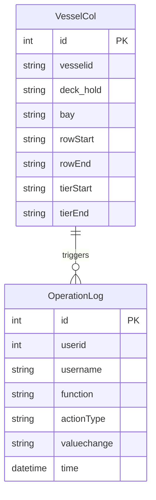

# 船舶颜色配置模块 (Vessel Color Configuration)

## 1. 概述 (Overview)

本模块提供船舶舱位颜色配置管理功能，用于定义和管理不同船舶的甲板/舱内（deck/hold）、贝位（bay）、行（row）和层（tier）范围的颜色标识。该配置主要用于集装箱码头作业系统中对船舶不同区域的可视化标识，帮助操作人员快速识别特定舱位区域。

**业务范围：**
- 船舶舱位颜色配置的增删改查
- 支持按船舶ID、甲板/舱内、贝位等条件搜索
- 操作审计日志记录

**业务价值：**
通过为船舶的不同舱位区域配置颜色标识，提升码头作业人员在配载计划、装卸作业时的视觉识别效率，减少操作错误。

## 2. 业务能力 (Business Capabilities)

| 编号 | 业务能力 | 描述 |
|------|----------|------|
| BC-01 | 查询船舶颜色配置列表 | 分页展示所有船舶颜色配置记录，默认每页10条 |
| BC-02 | 搜索船舶颜色配置 | 支持按船舶ID、甲板/舱内、贝位进行模糊搜索 |
| BC-03 | 新增船舶颜色配置 | 创建新的船舶舱位颜色配置记录 |
| BC-04 | 修改船舶颜色配置 | 更新已有配置记录的舱位范围信息 |
| BC-05 | 删除船舶颜色配置 | 删除指定的船舶颜色配置记录 |
| BC-06 | 保存或更新船舶颜色配置 | 统一的保存接口，根据是否存在ID判断新增或更新 |
| BC-07 | 操作审计日志 | 记录用户对船舶颜色配置的增删改操作 |

## 3. API 能力 (API Capabilities)

| API路径 | HTTP方法 | 业务功能 | 请求参数 | 返回内容 |
|---------|----------|----------|----------|----------|
| `/user/allVesselCol` | GET | 查询船舶颜色配置列表（分页） | `pager.offset`: 分页偏移量 | 分页数据列表，包含总记录数、当前页数据 |
| `/user/searchVesselColor` | GET | 搜索船舶颜色配置 | `key`: 搜索关键词；`pager.offset`: 分页偏移量 | 匹配的分页数据列表 |
| `/user/addVesselCol` | GET | 打开新增船舶颜色配置页面 | 无 | 返回新增页面视图 |
| `/user/modifyVesselCol` | GET | 打开修改船舶颜色配置页面 | `id`: 配置记录ID | 返回修改页面视图，携带现有数据 |
| `/user/delVesselCol` | GET | 删除船舶颜色配置 | `id`: 配置记录ID | 重定向到列表页面 |
| `/user/saveVesselCol` | POST | 保存或更新船舶颜色配置 | `id`(可选): 记录ID；`vesselid`: 船舶ID；`deck_hold`: 甲板/舱内；`bay`: 贝位；`rowStart`: 起始行；`rowEnd`: 结束行；`tierStart`: 起始层；`tierEnd`: 结束层 | 成功则重定向到列表页面，失败则返回错误提示 |

## 4. 数据实体 (Data Entities)

### 4.1 核心实体

**VesselCol（船舶颜色配置）**

存储船舶舱位颜色配置的核心实体，定义了特定船舶在特定甲板/舱内、贝位范围内的行和层的起止位置。

| 字段名 | 类型 | 说明 | 约束 |
|--------|------|------|------|
| id | Integer | 主键ID | 自增序列 vesselCol_seq |
| vesselid | String(10) | 船舶ID | 非空 |
| deck_hold | String(10) | 甲板/舱内标识 | D=甲板, H=舱内 |
| bay | String(10) | 贝位号 | 如 "01", "03" 等 |
| rowStart | String(10) | 起始行号 | 如 "01", "05" 等 |
| rowEnd | String(10) | 结束行号 | 如 "10", "20" 等 |
| tierStart | String(10) | 起始层号 | 如 "01", "02" 等 |
| tierEnd | String(10) | 结束层号 | 如 "05", "10" 等 |

### 4.2 关联实体

**OperationLog（操作日志）**

记录用户对船舶颜色配置的操作历史。

| 字段名 | 类型 | 说明 |
|--------|------|------|
| id | int | 主键ID |
| userid | int | 操作用户ID |
| username | String(20) | 操作用户名 |
| function | String(50) | 功能模块名称 |
| actionType | String(10) | 操作类型：Save/Update/Delete |
| valuechange | String(300) | 值变更内容（旧值->新值） |
| time | Date | 操作时间 |

### 4.3 ER图

## 5. 业务规则 (Business Rules)

### 5.1 校验规则 (Validation)

| 规则编号 | 规则描述 | 实现位置 |
|----------|----------|----------|
| VR-01 | 船舶ID长度不超过10个字符 | 数据库字段长度约束 |
| VR-02 | 甲板/舱内标识长度不超过10个字符 | 数据库字段长度约束 |
| VR-03 | 贝位号长度不超过10个字符 | 数据库字段长度约束 |
| VR-04 | 行号、层号字段长度均不超过10个字符 | 数据库字段长度约束 |

> 📎 Source: src/main/java/com/springMVC/entity/VesselCol.java → VesselCol

### 5.2 查询与过滤规则 (Query & Filter)

| 规则编号 | 规则描述 | 实现逻辑 |
|----------|----------|----------|
| QR-01 | 列表查询按 vesselid、deck_hold、id 排序 | ORDER BY vesselid, deck_hold, id |
| QR-02 | 分页大小固定为10条/页 | setMaxResults(10) |
| QR-03 | 搜索支持 vesselid、deck_hold、bay 三个字段的模糊匹配 | LIKE '%keyword%' OR 条件组合 |
| QR-04 | 搜索时三个字段使用相同的关键词 | 同一 key 参数应用于三个字段 |

> 📎 Source: src/main/java/com/springMVC/dao/VesselDaoImpl.java → getAllVesselCol(), searchVesselCol()

### 5.3 计算与派生规则 (Calculation & Derivation)

本模块不涉及复杂的计算逻辑，主要是数据的直接存储和检索。

### 5.4 状态转换规则 (State Transition)

本模块无状态机概念，配置记录只有存在/不存在两种状态。

### 5.5 数据权限规则 (Data Permission)

| 规则编号 | 规则描述 | 实现方式 |
|----------|----------|----------|
| DP-01 | 操作日志记录当前登录用户 | 从 Session 中获取 User 对象 |

> 📎 Source: src/main/java/com/springMVC/control/CellControl.java → saveOrUpdateVesselCol(), delVesselCol()

### 5.6 集成规则 (Integration)

本模块不依赖外部系统集成。

### 5.7 批量与异步规则 (Batch & Async)

本模块不支持批量操作，所有操作均为单条记录处理。

### 5.8 默认值与自动填充规则 (Defaults & Auto-fill)

| 规则编号 | 规则描述 | 实现方式 |
|----------|----------|----------|
| DF-01 | 操作日志的时间字段自动填充为当前时间 | new Date() |
| DF-02 | 操作日志的值变更记录格式为 "旧值->新值" | oldValue + "->" + newValue |

> 📎 Source: src/main/java/com/springMVC/util/LogUtil.java → buildOperationLog()

## 6. 外部系统集成 (External System Integration)

本模块不依赖任何外部系统。

## 7. 定时任务 (Scheduled Jobs)

本模块不包含定时任务。

## 8. 用户场景 (User Scenarios)

### 场景1：查看船舶颜色配置列表

**前置条件：** 用户已登录系统

**操作流程：**
1. 用户访问 `/user/allVesselCol` 页面
2. 系统加载第一页（offset=0）的10条配置记录
3. 用户可通过分页控件浏览其他页

**异常处理：**
- 数据库查询失败时，异常被捕获并打印堆栈，但页面无明确错误提示

### 场景2：搜索船舶颜色配置

**前置条件：** 用户已登录系统

**操作流程：**
1. 用户在搜索框输入关键词（如船舶ID "COSCO"）
2. 系统调用 `/user/searchVesselColor?key=COSCO`
3. 返回匹配 vesselid、deck_hold 或 bay 中包含 "COSCO" 的记录

**边界情况：**
- 关键词为空时，可能返回全部记录（取决于前端传参）
- 特殊字符未做转义处理

### 场景3：新增船舶颜色配置

**前置条件：** 用户已登录系统，具有配置权限

**操作流程：**
1. 用户点击"新增"按钮，访问 `/user/addVesselCol`
2. 填写表单：船舶ID、甲板/舱内、贝位、起始行、结束行、起始层、结束层
3. 提交表单到 `/user/saveVesselCol`（POST）
4. 系统保存记录并记录操作日志
5. 成功后重定向到列表页面

**异常处理：**
- 保存失败时，返回错误提示 "The operation failed"

### 场景4：修改船舶颜色配置

**前置条件：** 用户已登录系统，存在待修改的配置记录

**操作流程：**
1. 用户点击某条记录的"修改"按钮
2. 系统加载该记录详情到 `/user/modifyVesselCol?id=xxx`
3. 用户修改字段值后提交
4. 系统更新记录并记录操作日志（包含旧值和新值）
5. 成功后重定向到列表页面

**异常处理：**
- 更新失败时，返回错误提示 "The operation failed"

### 场景5：删除船舶颜色配置

**前置条件：** 用户已登录系统，存在待删除的配置记录

**操作流程：**
1. 用户点击某条记录的"删除"按钮
2. 系统调用 `/user/delVesselCol?id=xxx`
3. 系统删除记录并记录操作日志
4. 重定向到列表页面

**风险点：**
- 删除操作无二次确认机制
- 删除前未检查是否有其他业务数据引用该配置

## 9. 术语表 (Glossary)

| 术语 | 英文 | 定义 |
|------|------|------|
| 船舶ID | Vessel ID | 船舶的唯一标识符，通常为IMO编号或公司内部编码 |
| 甲板/舱内 | Deck/Hold | D表示甲板（Deck），H表示舱内（Hold），用于区分集装箱装载位置 |
| 贝位 | Bay | 船舶横向划分的区域，通常用两位数字表示，如01、03、05等 |
| 行 | Row | 船舶纵向划分的行号，通常用两位数字表示 |
| 层 | Tier | 船舶垂直方向的层号，通常用两位数字表示 |
| 操作日志 | Operation Log | 记录用户对系统数据进行增删改操作的审计日志 |
| Save | Save | 新增操作，对应 ActionType.SAVE |
| Update | Update | 更新操作，对应 ActionType.UPDATE |
| Delete | Delete | 删除操作，对应 ActionType.DELETE |
| VESSEL_REFUEL_BAY_ROW_CONFIGURATION | - | 操作日志中的功能模块名称，实际用于船舶颜色配置模块 |
