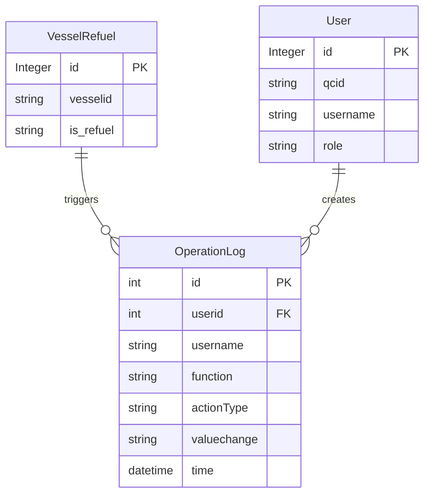

# 船舶加油配置模块 (Vessel Refuel Configuration) - PRD

## 1. 概述 (Overview)

本模块提供船舶加油配置的维护功能，允许用户管理哪些船舶需要加油（is_refuel 标识）。该模块是港口码头管理系统的一部分，用于配置船舶的加油状态，支持查询、新增、修改、删除和状态更新操作。所有操作均记录审计日志，确保操作可追溯。

**业务范围：**
- 船舶加油配置的增删改查
- 按关键字搜索船舶加油配置
- 操作审计日志记录

**非业务范围：**
- 不管理船舶基础信息（由 Vessel Manager 模块负责）
- 不执行实际的加油操作
- 不涉及加油量计算或费用结算

## 2. 业务能力 (Business Capabilities)

| 编号 | 业务能力 | 描述 |
|------|----------|------|
| BC-01 | 查看船舶加油配置列表 | 分页展示所有船舶加油配置记录，每页10条 |
| BC-02 | 搜索船舶加油配置 | 按船舶ID或加油状态关键字模糊搜索 |
| BC-03 | 新增船舶加油配置 | 为指定船舶创建加油配置记录 |
| BC-04 | 修改船舶加油配置 | 更新现有船舶加油配置的船舶ID和加油状态 |
| BC-05 | 删除船舶加油配置 | 删除指定的船舶加油配置记录 |
| BC-06 | 更新加油状态 | 单独更新船舶的加油状态标识 |
| BC-07 | 操作审计 | 记录所有增删改操作的详细日志 |

## 3. API 能力 (API Capabilities)

| API路径 | HTTP方法 | 业务功能 | 请求参数 | 返回内容 |
|---------|----------|----------|----------|----------|
| `/user/allVesselRefuel` | GET | 获取船舶加油配置列表（分页） | pager.offset（页码偏移量） | 分页数据（包含10条记录和总数） |
| `/user/searchVesselRefuel` | GET | 搜索船舶加油配置 | key（搜索关键字），pager.offset | 匹配的分页数据 |
| `/user/addVesselRefuel` | GET | 打开新增船舶加油配置页面 | 无 | 新增表单页面 |
| `/user/modifyVesselRefuel` | GET | 打开修改船舶加油配置页面 | id（配置ID） | 包含现有数据的编辑页面 |
| `/user/delVesselRefuel` | GET | 删除船舶加油配置 | id（配置ID） | 重定向到列表页 |
| `/user/updateVesselRefuelStatus` | POST | 更新或新增船舶加油状态 | vesselid（船舶ID），is_refuel（加油状态），id（可选，配置ID） | 重定向到列表页或错误页面 |

## 4. 数据实体 (Data Entities)

### 4.1 核心实体

**VesselRefuel（船舶加油配置）**

| 字段名 | 类型 | 说明 | 约束 |
|--------|------|------|------|
| id (vrid) | Integer | 主键，自增序列 | 非空，唯一 |
| vesselid | String(10) | 船舶ID | 非空 |
| is_refuel | String(5) | 加油状态标识 | 非空 |

**OperationLog（操作日志）**

| 字段名 | 类型 | 说明 | 约束 |
|--------|------|------|------|
| id (OPERLOGID) | int | 主键，自增序列 | 非空，唯一 |
| userid | int | 操作用户ID | 非空 |
| username | String(20) | 操作用户名 | 非空 |
| function | String(50) | 功能模块名称 | 非空 |
| actionType | String(10) | 操作类型（Save/Update/Delete） | 非空 |
| valuechange | String(300) | 值变更详情（旧值->新值） | 可为空 |
| time | Date | 操作时间 | 非空 |

**User（用户）**

| 字段名 | 类型 | 说明 | 约束 |
|--------|------|------|------|
| id (userid) | Integer | 主键，自增序列 | 非空，唯一 |
| qcid | String(20) | QC ID | 可为空 |
| username | String(20) | 用户名 | 非空 |
| password | String(6) | 密码 | 非空 |
| role | String(10) | 角色 | 可为空 |
| parent | String(10) | 创建者 | 可为空 |
| createtime | String(14) | 创建时间 | 可为空 |

### 4.2 ER 图

## 5. 业务规则 (Business Rules)

### 5.1 校验规则 (Validation)

| 规则编号 | 规则描述 | 适用场景 |
|----------|----------|----------|
| VR-01 | vesselid 长度不超过10个字符 | 新增/修改时 |
| VR-02 | is_refuel 长度不超过5个字符 | 新增/修改时 |
| VR-03 | id 必须为正整数 | 修改/删除/查询详情时 |

### 5.2 查询与过滤规则 (Query & Filter)

| 规则编号 | 规则描述 | 实现方式 |
|----------|----------|----------|
| QR-01 | 列表按 vesselid 升序排序 | HQL: `order by vesselid` |
| QR-02 | 每页固定显示10条记录 | setMaxResults(10) |
| QR-03 | 搜索支持 vesselid 和 is_refuel 字段的模糊匹配 | LIKE '%key%' |
| QR-04 | 分页偏移量默认为0 | 解析失败时 offset=0 |

### 5.3 计算与派生规则 (Calculation & Derivation)

本模块不涉及复杂的计算逻辑。

### 5.4 状态转换规则 (State Transition)

| 规则编号 | 规则描述 |
|----------|----------|
| SR-01 | updateVesselRefuelStatus 接口根据是否存在 id 参数决定是新增还是更新：若 id 存在则更新现有记录，否则新增记录 |

### 5.5 数据权限规则 (Data Permission)

| 规则编号 | 规则描述 |
|----------|----------|
| DP-01 | 所有操作需要从会话中获取当前登录用户（USERINFO）用于审计日志 |
| DP-02 | 未提供显式的行级数据权限控制，所有登录用户均可访问全部记录 |

### 5.6 集成规则 (Integration)

本模块不直接调用外部系统。

### 5.7 批量与异步规则 (Batch & Async)

本模块不支持批量操作，所有操作均为同步执行。

### 5.8 默认值与自动填充规则 (Defaults & Auto-fill)

| 规则编号 | 规则描述 |
|----------|----------|
| DF-01 | 操作日志的 time 字段自动填充为当前系统时间 |
| DF-02 | 操作日志的 userid 和 username 从会话中的当前用户自动填充 |
| DF-03 | 操作日志的 function 固定为 "Vessel Refuel Configuration" |
| DF-04 | 操作日志的 valuechange 格式为 "旧值->新值"，若旧值为空则显示 "null->新值" |

## 6. 外部系统集成 (External System Integration)

本模块不直接调用外部系统。

## 7. 定时任务 (Scheduled Jobs)

本模块不包含定时任务。

## 8. 用户场景 (User Scenarios)

### 场景1：查看所有船舶加油配置

**前置条件：** 用户已登录系统

**流程：**
1. 用户访问 `/user/allVesselRefuel` 页面
2. 系统返回第一页（offset=0）的10条记录
3. 用户可通过翻页参数查看其他页

**异常处理：**
- 数据库查询失败：记录异常堆栈，页面显示空数据

### 场景2：搜索船舶加油配置

**前置条件：** 用户已登录系统

**流程：**
1. 用户在搜索框输入关键字（如船舶ID或部分加油状态）
2. 系统执行模糊搜索，匹配 vesselid 或 is_refuel 字段
3. 返回匹配的分页结果

**边界情况：**
- 搜索关键字为空：返回所有记录
- 无匹配结果：返回空列表

### 场景3：新增船舶加油配置

**前置条件：** 用户已登录系统

**流程：**
1. 用户访问 `/user/addVesselRefuel` 进入新增页面
2. 用户填写 vesselid 和 is_refuel
3. 提交后调用 `/user/updateVesselRefuelStatus`（POST，无id参数）
4. 系统创建新记录并记录审计日志
5. 重定向到列表页

**异常处理：**
- 保存失败：显示 "The operation failed"，停留在编辑页面

### 场景4：修改船舶加油配置

**前置条件：** 用户已登录系统，存在待修改的记录

**流程：**
1. 用户点击某条记录的修改按钮，访问 `/user/modifyVesselRefuel?id=X`
2. 系统加载现有数据到编辑页面
3. 用户修改 vesselid 或 is_refuel
4. 提交后调用 `/user/updateVesselRefuelStatus`（POST，带id参数）
5. 系统更新记录并记录审计日志（包含旧值和新值）
6. 重定向到列表页

**异常处理：**
- 记录不存在：可能抛出异常（代码未做显式检查）
- 保存失败：显示 "The operation failed"

### 场景5：删除船舶加油配置

**前置条件：** 用户已登录系统，存在待删除的记录

**流程：**
1. 用户点击删除按钮，访问 `/user/delVesselRefuel?vesselRefuel.id=X`
2. 系统删除记录
3. 系统记录审计日志（旧值为记录详情，新值为null）
4. 重定向到列表页

**异常处理：**
- 记录不存在：Hibernate 可能抛出异常

### 场景6：更新加油状态（新增或更新）

**前置条件：** 用户已登录系统

**流程：**
1. 用户提交表单到 `/user/updateVesselRefuelStatus`
2. 若请求中包含 id 参数：
   - 系统查找现有记录
   - 更新 vesselid 和 is_refuel
   - 记录 UPDATE 类型的审计日志
3. 若请求中不包含 id 参数：
   - 系统创建新记录
   - 记录 SAVE 类型的审计日志
4. 成功后重定向到列表页

**异常处理：**
- 保存失败：显示 "The operation failed"，停留在编辑页面

## 9. 术语表 (Glossary)

| 术语 | 定义 |
|------|------|
| VesselRefuel | 船舶加油配置实体，记录船舶ID和加油状态标识 |
| is_refuel | 加油状态标识字段，长度为5的字符串，具体取值含义需参考业务文档 |
| vesselid | 船舶唯一标识，长度为10的字符串 |
| OperationLog | 操作日志实体，记录用户对系统的增删改操作 |
| Function.VESSEL_REFUEL_CONFIGURATION | 审计日志中的功能模块标识，值为 "Vessel Refuel Configuration" |
| ActionType.SAVE | 审计日志中的操作类型，表示新增操作 |
| ActionType.UPDATE | 审计日志中的操作类型，表示更新操作 |
| ActionType.DELETE | 审计日志中的操作类型，表示删除操作 |
| PageManage | 分页数据结构，包含数据列表、总数、页大小和偏移量 |
| USERINFO | 会话中存储当前登录用户的属性键 |
