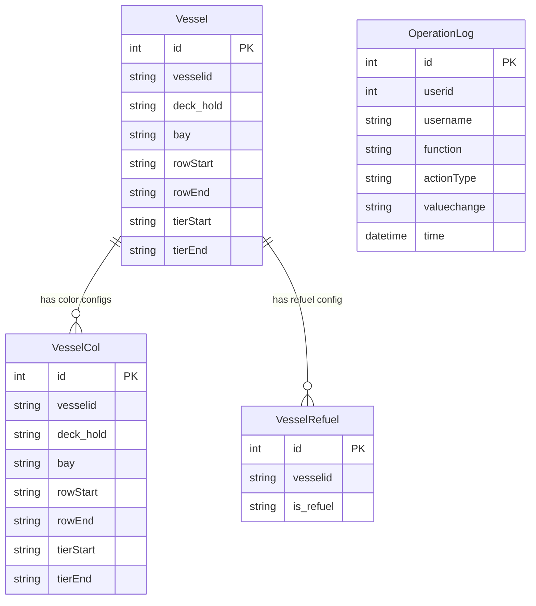

# 船舶管理模块 (Vessel Management) - PRD

## 1. 概述 (Overview)

船舶管理模块是集装箱码头操作系统中的核心配置模块，负责维护船舶的基础信息、加油状态以及舱位颜色配置。该模块为码头作业提供船舶维度的基础数据支撑，包括船舶的舱位结构（Bay/Row/Tier）、加油标识以及可视化颜色配置。

**业务范围：**
- 船舶基础信息管理：维护船舶ID、甲板/舱内标识、Bay号及对应的Row/Tier范围
- 船舶加油配置：标记船舶是否需要加油服务
- 船舶舱位颜色配置：为特定船舶的舱位区域配置显示颜色，用于可视化展示

**业务价值：**
- 为码头装卸作业提供准确的船舶舱位结构数据
- 支持船舶加油服务的识别与管理
- 通过颜色配置提升船舶舱位可视化管理效率

## 2. 业务能力 (Business Capabilities)

| 能力编号 | 能力名称 | 能力描述 |
|---------|---------|---------|
| BC-001 | 船舶基础信息管理 | 支持船舶的增删改查，维护船舶ID、甲板/舱内标识、Bay号及Row/Tier范围 |
| BC-002 | 船舶加油配置管理 | 支持为船舶配置加油标识（是/否），记录操作日志 |
| BC-003 | 船舶舱位颜色配置管理 | 支持为特定船舶的舱位区域配置显示颜色，记录操作日志 |
| BC-004 | 船舶信息查询与搜索 | 支持按船舶ID、甲板/舱内标识、Bay号进行模糊搜索 |

## 3. API 能力 (API Capabilities)

### 3.1 船舶基础管理 API

| API路径 | 方法 | 功能描述 | 业务用途 |
|--------|------|---------|---------|
| /user/allVessel | GET | 获取船舶列表（分页） | 查看所有已配置的船舶基础信息，每页10条 |
| /user/delVessel | GET | 删除船舶 | 删除指定ID的船舶记录 |
| /user/addVessel | GET | 打开新增船舶页面 | 进入新增船舶表单页面 |
| /user/modifyVessel | GET | 打开编辑船舶页面 | 根据ID加载船舶详情，进入编辑页面 |
| /user/updateVessel | POST | 更新船舶信息 | 提交修改后的船舶信息，校验唯一性 |
| /user/saveVessel | POST | 保存新船舶 | 提交新增船舶信息，校验唯一性 |
| /user/searchVessel | GET | 搜索船舶 | 按关键字模糊搜索船舶（匹配vesselid/deck_hold/bay） |

### 3.2 船舶加油配置 API

| API路径 | 方法 | 功能描述 | 业务用途 |
|--------|------|---------|---------|
| /user/allVesselRefuel | GET | 获取船舶加油配置列表（分页） | 查看所有船舶的加油配置状态，每页10条 |
| /user/searchVesselRefuel | GET | 搜索船舶加油配置 | 按关键字模糊搜索（匹配vesselid/is_refuel） |
| /user/addVesselRefuel | GET | 打开新增加油配置页面 | 进入新增加油配置表单页面 |
| /user/modifyVesselRefuel | GET | 打开编辑加油配置页面 | 根据ID加载加油配置详情 |
| /user/delVesselRefuel | GET | 删除加油配置 | 删除指定ID的加油配置记录，记录操作日志 |
| /user/updateVesselRefuelStatus | POST | 保存/更新加油配置 | 提交加油配置信息（新增或更新），记录操作日志 |

### 3.3 船舶舱位颜色配置 API

| API路径 | 方法 | 功能描述 | 业务用途 |
|--------|------|---------|---------|
| /user/allVesselCol | GET | 获取船舶舱位颜色配置列表（分页） | 查看所有船舶的舱位颜色配置，每页10条 |
| /user/searchVesselColor | GET | 搜索船舶舱位颜色配置 | 按关键字模糊搜索（匹配vesselid/deck_hold/bay） |
| /user/addVesselCol | GET | 打开新增舱位颜色配置页面 | 进入新增表单页面 |
| /user/modifyVesselCol | GET | 打开编辑舱位颜色配置页面 | 根据ID加载配置详情 |
| /user/delVesselCol | GET | 删除舱位颜色配置 | 删除指定ID的配置记录，记录操作日志 |
| /user/saveVesselCol | POST | 保存/更新舱位颜色配置 | 提交配置信息（新增或更新），记录操作日志 |

## 4. 数据实体 (Data Entities)

### 4.1 实体关系图

### 4.2 实体说明

**Vessel（船舶基础信息）**
- 主键：vmid（自增序列 vessel_seq）
- 业务唯一键：vesselid + deck_hold + bay 组合唯一
- 字段说明：
  - vesselid：船舶ID，长度10
  - deck_hold：甲板/舱内标识，长度10（如"DECK"或"HOLD"）
  - bay：Bay号，长度10
  - rowStart/rowEnd：行起始/结束位置，长度10
  - tierStart/tierEnd：层起始/结束位置，长度10

**VesselCol（船舶舱位颜色配置）**
- 主键：vcid（自增序列 vesselCol_seq）
- 关联字段：vesselid 关联船舶
- 字段结构与Vessel类似，用于定义特定舱位区域的显示颜色配置

**VesselRefuel（船舶加油配置）**
- 主键：vrid（自增序列 vesselRefuel_seq）
- 关联字段：vesselid 关联船舶
- 字段说明：
  - is_refuel：加油标识，长度5（如"Y"/"N"或"是"/"否"）

**OperationLog（操作日志）**
- 主键：OPERLOGID（自增序列 operatorlog_seq）
- 记录用户操作行为，包括功能模块、操作类型、值变更前后对比

## 5. 业务规则 (Business Rules)

### 5.1 校验规则 (Validation)

| 规则编号 | 规则描述 | 适用场景 |
|---------|---------|---------|
| VR-001 | 船舶基础信息中，vesselid + deck_hold + bay 组合必须唯一 | 新增/更新船舶时校验 |
| VR-002 | 所有字符串字段长度限制为10字符（is_refuel为5字符） | 所有保存操作 |
| VR-003 | ID字段为整数类型，由数据库序列自动生成 | 所有实体 |

### 5.2 查询与过滤规则 (Query & Filter)

| 规则编号 | 规则描述 | 实现方式 |
|---------|---------|---------|
| QR-001 | 列表查询默认按 vesselid, deck_hold, id 排序 | 所有列表查询 |
| QR-002 | 分页大小固定为10条/页 | 所有列表查询 |
| QR-003 | 搜索支持模糊匹配，关键字同时匹配 vesselid、deck_hold、bay 三个字段 | 船舶搜索 |
| QR-004 | 加油配置搜索支持模糊匹配 vesselid 和 is_refuel | 加油配置搜索 |
| QR-005 | 舱位颜色配置搜索支持模糊匹配 vesselid、deck_hold、bay | 舱位颜色配置搜索 |

### 5.3 计算与派生规则 (Calculation & Derivation)

本模块无复杂计算逻辑。

### 5.4 状态转换规则 (State Transition)

本模块无状态机流转。

### 5.5 数据权限规则 (Data Permission)

- 操作日志记录当前登录用户的userid和username
- 未实现行级数据权限控制，所有登录用户可访问全部船舶数据

### 5.6 集成规则 (Integration)

| 规则编号 | 集成对象 | 集成方式 | 业务影响 |
|---------|---------|---------|---------|
| IR-001 | MN4O_QC_vsl_vessels（外部船舶主数据表） | JDBC直接查询 | 获取船舶名称（getN4VesselNameById方法） |

### 5.7 批量与异步规则 (Batch & Async)

本模块无批量处理或异步任务。

### 5.8 默认值与自动填充规则 (Defaults & Auto-fill)

| 字段 | 默认值/自动填充规则 |
|-----|-------------------|
| OperationLog.time | 自动填充为当前时间 |
| OperationLog.userid/username | 从Session中获取当前登录用户 |
| OperationLog.valuechange | 格式为 "旧值->新值"，空值显示为"null" |

## 6. 外部系统集成 (External System Integration)

| 集成系统 | 集成内容 | 集成方式 | 同步频率 | 业务影响 |
|---------|---------|---------|---------|---------|
| MN4O_QC_vsl_vessels | 船舶名称查询 | JDBC直接SQL查询 | 按需实时查询 | 用于获取外部系统中的船舶名称信息 |

## 7. 定时任务 (Scheduled Jobs)

本模块无定时任务。

## 8. 用户场景 (User Scenarios)

### 场景1：新增船舶基础信息
1. 用户点击"新增船舶"进入表单页面
2. 填写船舶ID、甲板/舱内标识、Bay号、Row/Tier范围
3. 提交后系统校验 vesselid+deck_hold+bay 组合是否已存在
4. 若已存在，提示"the vesselid,deck_hold,bay already exists!"并返回表单
5. 若不存在，保存成功并重定向到列表页

### 场景2：编辑船舶信息
1. 用户在列表中点击某船舶的编辑按钮
2. 系统根据ID加载船舶详情
3. 用户修改字段后提交
4. 系统校验唯一性（排除当前记录）
5. 保存成功则返回列表页，失败则显示"The operation failed"

### 场景3：删除船舶
1. 用户点击删除按钮
2. 系统根据ID删除记录
3. 重定向到列表页（无二次确认）

### 场景4：配置船舶加油状态
1. 用户进入加油配置页面
2. 填写船舶ID和加油标识
3. 若ID已存在则更新，否则新增
4. 系统记录操作日志（包含操作人、操作类型、值变更）
5. 保存成功后返回列表页

### 场景5：配置船舶舱位颜色
1. 用户进入舱位颜色配置页面
2. 填写船舶ID、deck_hold、bay及Row/Tier范围
3. 若ID已存在则更新，否则新增
4. 系统记录操作日志
5. 保存成功后返回列表页

### 异常场景
- **数据库连接失败**：查询时捕获SQLException，显示"error_db_not_connected"
- **保存失败**：捕获异常后打印堆栈，返回"The operation failed"
- **重复数据**：新增时校验唯一性，提示已存在

## 9. 术语表 (Glossary)

| 术语 | 定义 |
|-----|------|
| Vessel | 船舶，码头作业的基本单位 |
| Vessel ID | 船舶唯一标识符 |
| Deck/Hold | 甲板/舱内，标识集装箱装载位置是在甲板上还是舱内 |
| Bay | 船舶横向位置编号，通常以奇数表示20英尺箱位，偶数表示40英尺箱位 |
| Row | 船舶纵向行号，从船中向两侧编号 |
| Tier | 船舶垂直层号，从底部向上编号 |
| Vessel Refuel | 船舶加油配置，标识该船舶是否需要加油服务 |
| Vessel Col | 船舶舱位颜色配置，用于可视化展示特定舱位区域 |
| Operation Log | 操作日志，记录用户对配置数据的增删改操作 |
