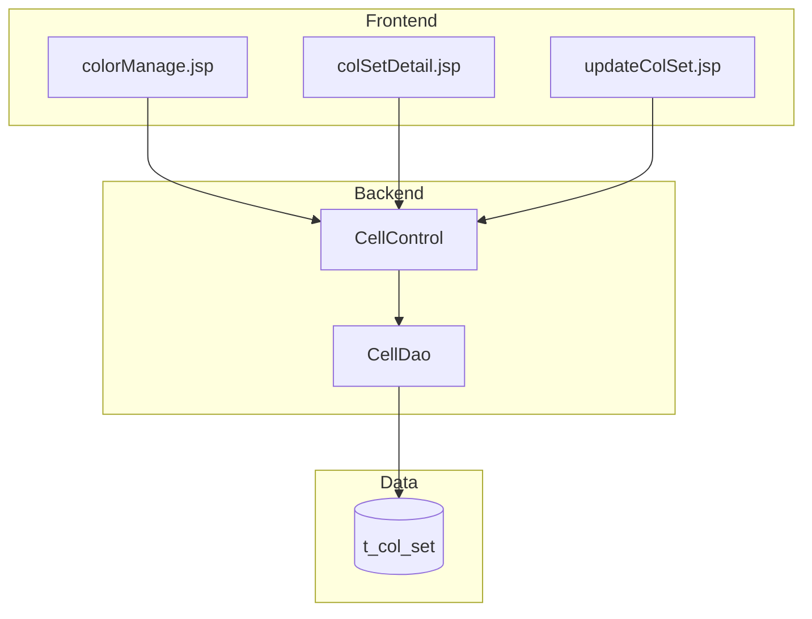

# Color Set Management for Container Types - Spec

[← Back to Overview](../overview.md)

## Architecture

### Service Layer

```text
Frontend (JSP Pages)
    ↓
CellControl (Controller)
    ↓
CellDao (Data Access Layer)
    ↓
Database (t_col_set)
```

**组件说明**：
- **CellControl**: Spring MVC 控制器，处理所有颜色集合相关的 HTTP 请求
- **CellDao**: 数据访问层，负责颜色集合的持久化操作
- **共享服务**: CellDao 被 color-set-management 和 container-cell-management 两条链共享

### 依赖关系



## API Contracts

### GET /user/allColSet

> 📎 Source: src/main/java/com/springMVC/control/CellControl.java → getAllColSet()

**描述**: 获取所有颜色集合列表

**请求**:
```json
{}
```

**响应**:
```json
{
  "code": 200,
  "data": [
    {
      "id": "number",
      "boxcase": "string",
      "color": "string"
    }
  ]
}
```

**状态码**:
- 200: 成功返回颜色集合列表
- 500: 服务器内部错误

**关联模块 Spec**: [cell](../../services/cell.md)

### GET /user/addColor

> 📎 Source: src/main/java/com/springMVC/control/CellControl.java → addUser()

**描述**: 进入新增颜色集合页面

**请求**: 无参数

**响应**: 返回 colSetDetail.jsp 视图

**状态码**:
- 200: 成功返回页面
- 500: 服务器内部错误

**关联模块 Spec**: [cell](../../services/cell.md)

### POST /user/saveColSet

> 📎 Source: src/main/java/com/springMVC/control/CellControl.java → saveColSet()

**描述**: 保存新的颜色集合

**请求**:
```json
{
  "boxcase": "string (required)",
  "color": "string (required)"
}
```

**响应**:
```json
{
  "code": 200,
  "message": "保存成功"
}
```

**验证规则**:
- boxcase: 必填，字符串类型，需唯一
- color: 必填，字符串类型

**状态码**:
- 200: 保存成功
- 400: 箱型已存在或参数缺失
- 500: 服务器内部错误

**关联模块 Spec**: [cell](../../services/cell.md)

### GET /user/modifyColSet

> 📎 Source: src/main/java/com/springMVC/control/CellControl.java → modUser()

**描述**: 加载指定颜色集合详情用于修改

**请求参数**:
- id: 颜色集合 ID（query parameter）

**响应**: 返回 updateColSet.jsp 视图，携带颜色集合数据

**状态码**:
- 200: 成功返回页面及数据
- 404: 颜色集合不存在
- 500: 服务器内部错误

**关联模块 Spec**: [cell](../../services/cell.md)

### POST /user/updateColSet

> 📎 Source: src/main/java/com/springMVC/control/CellControl.java → updateUser()

**描述**: 更新现有颜色集合

**请求**:
```json
{
  "id": "number (required)",
  "color": "string (required)"
}
```

**响应**:
```json
{
  "code": 200,
  "message": "更新成功"
}
```

**验证规则**:
- id: 必填，数字类型，必须存在
- color: 必填，字符串类型

**状态码**:
- 200: 更新成功
- 400: 参数缺失或颜色集合不存在
- 500: 服务器内部错误

**关联模块 Spec**: [cell](../../services/cell.md)

### GET /user/delColSet

> 📎 Source: src/main/java/com/springMVC/control/CellControl.java → delUser()

**描述**: 删除指定颜色集合

**请求参数**:
- id: 颜色集合 ID（query parameter）

**响应**:
```json
{
  "code": 200,
  "message": "删除成功"
}
```

**状态码**:
- 200: 删除成功
- 404: 颜色集合不存在
- 500: 服务器内部错误

**关联模块 Spec**: [cell](../../services/cell.md)

## Data Model

### 实体关系

```erDiagram
  COL_SET ||--o{ CONTAINER : "defines colors for"
```

> 实体字段定义详见 [cell](../../services/cell.md) 模块 Spec

### 表结构推断

基于 API 设计，t_col_set 表应包含以下字段：

| 字段名 | 类型 | 约束 | 说明 |
|--------|------|------|------|
| id | BIGINT | PRIMARY KEY, AUTO_INCREMENT | 主键 |
| boxcase | VARCHAR | UNIQUE, NOT NULL | 箱型标识 |
| color | VARCHAR | NOT NULL | 颜色值 |

> 📎 Source: TBD — 需要查看 CellDao 实现确认具体表结构和字段定义

## Integration Specs

### 共享服务集成

**CellDao 服务边界**:
- CellDao 被 color-set-management 和 container-cell-management 两条链共享
- 两条链通过同一数据访问层操作 t_col_set 表

⚠️ [PERF:bottleneck] CellDao 作为共享服务，在高并发场景下可能成为性能瓶颈，建议监控查询性能并考虑添加缓存机制。
> 📎 Source: src/main/java/com/springMVC/control/CellControl.java → downstreamServices: ["CellDao"]

⚠️ [ERR:no-conflict-resolution] 两条链共享 CellDao 和 t_col_set 表，可能存在并发写入冲突风险，需确认是否有事务隔离或乐观锁机制。
> 📎 Source: sharedAcross: ["container-cell-management"]

### 外部系统集成

无外部系统集成

## Error Handling

### 错误场景

| 错误场景 | 触发条件 | 处理方式 | 影响 |
|----------|----------|----------|------|
| 箱型重复 | POST /user/saveColSet 时 boxcase 已存在 | 返回 400 错误，提示用户 | 阻止重复数据创建 |
| 颜色集合不存在 | GET /user/modifyColSet 或 GET /user/delColSet 时 id 无效 | 返回 404 错误 | 防止无效操作 |
| 参数缺失 | POST 请求缺少必填字段 | 返回 400 错误 | 保证数据完整性 |
| 数据库异常 | 数据库连接失败或 SQL 执行错误 | 返回 500 错误 | 系统级错误，需日志记录 |

⚠️ [ERR:no-timeout] CellControl 调用 CellDao 时未明确配置超时策略，若 CellDao 执行慢查询可能导致请求挂起。
> 📎 Source: src/main/java/com/springMVC/control/CellControl.java → downstreamServices: ["CellDao"]

⚠️ [ERR:cascade-failure] CellDao 作为共享服务，其故障会影响 color-set-management 和 container-cell-management 两条链。
> 📎 Source: sharedServices: ["CellDao"], sharedAcross: ["container-cell-management"]

### 异常处理策略

- **业务异常**: 返回明确的错误码和消息给用户
- **系统异常**: 记录日志，返回通用错误提示
- **数据一致性**: 保存操作前进行唯一性校验，避免脏数据

## Security

### 认证与授权

⚠️ [OWASP:A01] 当前 API 设计未明确显示权限检查逻辑，需确认是否所有用户都可以操作颜色集合，还是仅限特定角色。
> 📎 Source: src/main/java/com/springMVC/control/CellControl.java → 所有 API 端点均未显示 @PreAuthorize 或类似权限注解

### 数据安全

- **输入验证**: 所有 POST 请求需验证必填字段
- **SQL 注入防护**: CellDao 应使用参数化查询或 ORM 框架防止 SQL 注入
- **XSS 防护**: JSP 页面应对输出数据进行转义

⚠️ [OWASP:A02] 颜色值（color）字段未明确格式约束，需确认是否允许任意字符串输入，防止存储恶意脚本。
> 📎 Source: POST /user/saveColSet → color 字段无明确格式验证规则

## Performance

### 性能考量

| 关注点 | 现状 | 建议 |
|--------|------|------|
| 列表查询 | GET /user/allColSet 返回全部数据 | 若数据量大，建议添加分页支持 |
| 唯一性校验 | 保存时需查询 boxcase 是否存在 | 建议在 boxcase 字段上建立唯一索引 |
| 共享服务 | CellDao 被两条链共享 | 监控 CellDao 调用频率，必要时添加缓存 |

⚠️ [PERF:no-cache] 颜色集合列表可能被频繁查询，但未发现缓存机制，建议考虑添加应用层或数据库层缓存。
> 📎 Source: GET /user/allColSet → 每次请求都直接查询数据库

⚠️ [PERF:cascade-call] CellControl 同步调用 CellDao，若 CellDao 执行复杂查询或涉及多表关联，可能影响响应时间。
> 📎 Source: src/main/java/com/springMVC/control/CellControl.java → cellControl --> cellDao

### 优化建议

1. **索引优化**: 在 t_col_set.boxcase 上建立唯一索引，加速唯一性校验
2. **分页支持**: 为 GET /user/allColSet 添加分页参数，避免一次性加载大量数据
3. **缓存策略**: 对颜色集合列表添加短期缓存（如 5 分钟），减少数据库查询频率