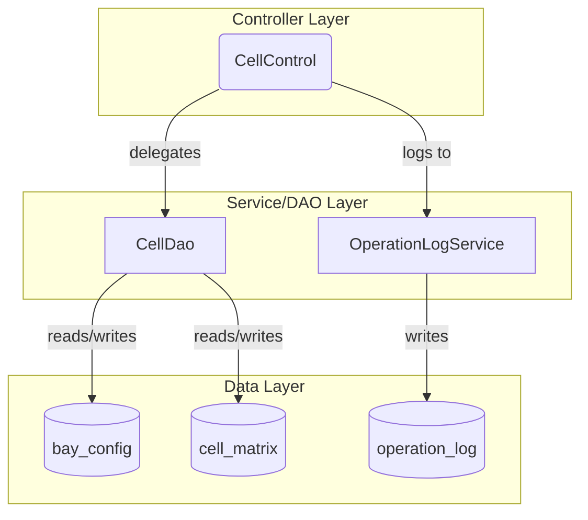

# Container Cell and Bay Size Management - Spec

[← Back to Overview](../overview.md)

## Architecture

### Service Layer

The chain follows a traditional Spring MVC architecture with three main layers:

1. **Controller Layer**: `CellControl` handles HTTP requests and delegates to services
2. **Service/DAO Layer**: `CellDao` provides data access operations for cell and bay configurations
3. **Data Layer**: Database tables storing bay configurations, cell matrices, and operation logs



### Dependency Graph

- **CellControl** depends on:
  - `CellDao` (shared service)
  - `OperationLogService` (from operation-log module)

- **CellDao** is shared across:
  - `container-cell-management` chain
  - `color-set-management` chain

### Shared Services

| Service | Module | Access Pattern | Notes |
|---------|--------|----------------|-------|
| CellDao | cell | Read/Write | Shared with color-set-management; potential concurrency concerns |

## API Contracts

### GET /user/setbay

**Handler**: `CellControl.setBaySize()`

**Request**:
- Method: GET
- Parameters: None
- Headers: Standard HTTP headers

**Response**:
- Content-Type: text/html (JSP rendering)
- Body: Rendered setbaysize.jsp page with current bay configuration

**Status Codes**:
- 200: Success, page rendered
- 401: Unauthorized (if authentication required)
- 500: Internal server error

> 📎 Source: src/main/java/com/springMVC/control/CellControl.java → setBaySize()

### POST /user/updateBay

**Handler**: `CellControl.updateBay()`

**Request**:
- Method: POST
- Content-Type: application/x-www-form-urlencoded or multipart/form-data
- Parameters:
  - `holdTiers`: Bay size configuration parameters (structure TBD)

**Validation Rules**:
- `holdTiers` must be provided and valid
- Bay size values must be within acceptable ranges (specific ranges TBD)

**Response**:
- Redirect to admin panel on success
- Error page or message on failure

**Status Codes**:
- 302: Redirect to admin panel (success)
- 400: Bad request (invalid parameters)
- 401: Unauthorized
- 500: Internal server error

**Side Effects**:
- Updates bay configuration in database
- Triggers cell matrix recalculation
- May log operation activity

> 📎 Source: src/main/java/com/springMVC/control/CellControl.java → updateBay()

### GET /user/BusiQuery

**Handler**: `CellControl.busiQuery()`

**Request**:
- Method: GET
- Parameters:
  - `qcNum`: QC (quay crane) number (required)

**Validation Rules**:
- `qcNum` must be provided and non-empty
- `qcNum` must correspond to a valid QC in the system

**Response**:
- Content-Type: application/xml or text/xml
- Body: XML document containing:
  - Bay information
  - QC action status
  - Remaining container count
  - Refuel status
  - Vessel name
  - Cell table data

**XML Schema** (TBD - exact structure needs verification):
```xml
<!-- Placeholder - actual schema TBD -->
<response>
  <vesselName>...</vesselName>
  <bayInfo>...</bayInfo>
  <qcAction>...</qcAction>
  <remainingContainers>...</remainingContainers>
  <refuelStatus>...</refuelStatus>
  <cellTable>...</cellTable>
</response>
```

**Status Codes**:
- 200: Success, XML returned
- 400: Bad request (missing or invalid qcNum)
- 404: Not found (no data for given qcNum)
- 500: Internal server error

> 📎 Source: src/main/java/com/springMVC/control/CellControl.java → busiQuery()

## Data Model

### Entity Relationships

```erDiagram
  BAY_CONFIG ||--o{ CELL_MATRIX : "defines"
  CELL_MATRIX ||--o{ CONTAINER_STATUS : "tracks"
  BAY_CONFIG ||--o{ OPERATION_LOG : "generates"
  CELL_MATRIX ||--o{ OPERATION_LOG : "records changes to"
```

See [cell](../../services/cell.md) for entity field definitions.
See [operation-log](../../services/operation-log.md) for entity field definitions.

### Table Schemas

**Note**: Exact table schemas are defined at the module level. Key tables include:

- `bay_config`: Stores Bay size configurations
- `cell_matrix`: Stores calculated cell matrix data
- `operation_log`: Stores container operation activity logs

See [cell](../../services/cell.md) for detailed table schemas.
See [operation-log](../../services/operation-log.md) for detailed table schemas.

## Integration Specs

### Shared Service: CellDao

**Access Pattern**: Direct method calls from CellControl

**Methods** (inferred from usage):
- `getCurrentBayConfig()`: Retrieve current bay configuration
- `updateBay(holdTiers)`: Update bay size configuration
- `recalculateCellMatrix()`: Recalculate cell matrix after bay size change
- `getCells(vesselid, qcid)`: Retrieve cell data for specific vessel and QC

**Concurrency Considerations**:
⚠️ [PERF:no-locking] CellDao is shared between container-cell-management and color-set-management chains without explicit locking mechanism documented. Concurrent updates to cell matrix may cause data inconsistency.

> 📎 Source: TBD — Need to verify CellDao implementation for concurrency control mechanisms

**Transaction Boundaries**:
⚠️ [ERR:no-rollback] Bay size update and cell matrix recalculation should be atomic, but transaction boundary is not explicitly documented. Failure during matrix recalculation may leave bay config updated but matrix stale.

> 📎 Source: TBD — Need to verify transaction management in CellControl.updateBay()

### External Systems

No external system integrations identified in this chain.

## Error Handling

### Error Scenarios

| Scenario | Error Code | Fallback Logic |
|----------|-----------|----------------|
| Missing qcNum parameter | 400 | Return error message requesting valid qcNum |
| Invalid qcNum (not found) | 404 | Return empty or error XML response |
| Bay size update failure | 500 | Rollback transaction, return error page |
| Cell matrix recalculation failure | 500 | Rollback bay update, log error, notify admin |
| Database connection failure | 500 | Return generic error page, log exception |

### Exception Handling

⚠️ [ERR:no-timeout] No explicit timeout configuration documented for CellDao operations. Long-running cell matrix recalculation may block request threads indefinitely.

> 📎 Source: TBD — Need to verify timeout settings in CellDao or database connection pool

⚠️ [ERR:cascade-failure] CellDao is a shared service; failures in CellDao will impact both container-cell-management and color-set-management chains simultaneously.

> 📎 Source: TBD — Need to verify if there is any circuit breaker or fallback mechanism for CellDao

### Logging

- Operation logs are recorded when new activity is detected (different from previous session log)
- Session log attributes are updated after each logged operation
- Error logging strategy TBD

## Security

### Authentication & Authorization

⚠️ [OWASP:A01] No explicit authentication or authorization checks documented for Bay size update endpoint. Unauthorized users may be able to modify critical bay configurations.

> 📎 Source: TBD — Need to verify if Spring Security or custom interceptors are configured for /user/updateBay

### Data Access Scope

- Bay configuration data: Should be restricted to authorized administrators
- Container status data: May be accessible to operational staff with appropriate permissions
- Operation logs: Should be auditable and tamper-resistant

⚠️ [OWASP:A01] No permission checks documented at chain boundary entry points. All three API endpoints may lack proper access control.

> 📎 Source: TBD — Need to verify security configuration in Spring MVC context

### Data Sensitivity

- Bay configurations: Operational data, moderate sensitivity
- Container status: Operational data, may include cargo information
- Operation logs: Audit trail, high integrity requirement

## Performance

### Latency Concerns

⚠️ [PERF:cascade-call] Cell matrix recalculation triggered by Bay size update may involve complex computations across large datasets. This synchronous operation blocks the request thread until completion.

> 📎 Source: TBD — Need to verify complexity of recalculateCellMatrix() algorithm

⚠️ [PERF:bottleneck] CellDao is a shared service accessed by multiple chains. High load on CellDao may become a bottleneck affecting both container-cell-management and color-set-management.

> 📎 Source: TBD — Need to verify CellDao connection pool size and query optimization

### Caching Strategy

No explicit caching strategy documented for:
- Bay configuration reads
- Cell matrix queries
- Container status lookups

⚠️ [PERF:no-cache] Repeated queries for the same QC number or bay configuration may hit the database unnecessarily without caching layer.

> 📎 Source: TBD — Need to verify if any caching (e.g., Ehcache, Redis) is configured for CellDao

### Optimization Recommendations

1. Consider asynchronous cell matrix recalculation for large vessels
2. Implement read-through caching for frequently accessed bay configurations
3. Add database indexes on qcNum and vesselid columns for faster lookups
4. Monitor CellDao query performance and optimize slow queries

## Assumptions & TBDs

### Technical Assumptions

1. Spring MVC framework is properly configured with view resolver for JSP pages
2. Database connection pooling is configured with appropriate pool size
3. Transaction management is handled by Spring's declarative transaction support
4. XML serialization is handled by a standard library (e.g., JAXB, DOM)

### Open Questions

1. TBD: What is the exact data structure of `holdTiers` parameter?
2. TBD: What is the algorithm for cell matrix recalculation and its time complexity?
3. TBD: What is the complete XML schema for BusiQuery response?
4. TBD: Are there any rate limiting or throttling mechanisms for the APIs?
5. TBD: What is the retention policy for operation logs?
6. TBD: Is there any audit trail for Bay configuration changes?
7. TBD: How are concurrent updates to CellDao handled (locking, optimistic concurrency)?
8. TBD: What monitoring and alerting is in place for this chain?