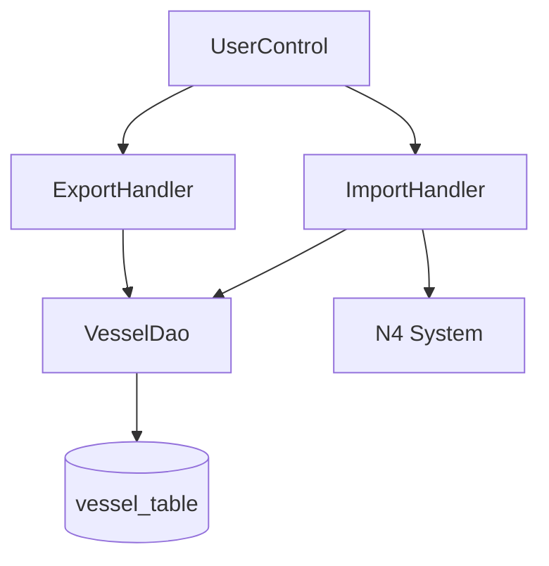

# Vessel Data Import and Export Chain - Spec

[← Back to Overview](../overview.md)

## Architecture

### Service Layer

```text
Frontend (JSP Pages)
    ↓
UserControl (Controller Layer - user module)
    ↓
ImportHandler / ExportHandler (Business Logic - shared services)
    ↓
VesselDao (Data Access Layer - cell module)
    ↓
Database + N4 System (External)
```

**Layer Responsibilities**:
- **UserControl**: HTTP request handling, view routing, file upload processing
- **ImportHandler**: File parsing, data validation orchestration, N4 system integration
- **ExportHandler**: Data query, file generation, response streaming
- **VesselDao**: CRUD operations for vessel entities, database interaction

### Dependency Graph



### Shared Services

| Service | Scope | Shared With |
|---------|-------|-------------|
| ImportHandler | File import processing | vessel-configuration chain |
| ExportHandler | Data export processing | data-import-export chain only |
| VesselDao | Vessel data persistence | vessel-configuration chain |

## API Contracts

### GET /user/importPage

- **Purpose**: Render import page view
- **Request**: No parameters
- **Response**: HTML view (importPage.jsp)
- **Status Codes**: 200 OK, 403 Forbidden (if not authenticated)
- **Module**: [user](../../services/user.md)

### POST /user/importVessel

- **Purpose**: Upload and process vessel data file
- **Request**:
  - Content-Type: `multipart/form-data`
  - Body: File field containing Excel/CSV file
- **Response**:
  - Success: JSON with import result summary
  - Failure: JSON with error details
- **Status Codes**: 200 OK, 400 Bad Request (invalid file), 500 Internal Server Error
- **Validation Rules**:
  - File must be non-empty
  - File format must be .xlsx, .xls, or .csv
  - File size within configured limit
- **Module**: [user](../../services/user.md)

### GET /user/export

- **Purpose**: Render export page view or trigger export
- **Request**: Optional query parameters for export filters
- **Response**: HTML view (exportPage.jsp) or file download
- **Status Codes**: 200 OK, 403 Forbidden
- **Module**: [user](../../services/user.md)

## Data Model

### Entity Relationships

```erDiagram
  VESSEL ||--o{ OPERATION_LOG : "generates"
  VESSEL }|--|| N4_VESSEL_REF : "references"
```

> Entity field definitions see module-level specs:
> - Vessel entity fields: [cell](../../services/cell.md)
> - Operation log entity fields: [operation-log-audit](../../services/operation-log-audit.md)

### Table Schemas

**Primary Tables**:
- `vessel_table` (or equivalent): Stores vessel master data
  - See [cell](../../services/cell.md) for complete schema

**Referenced Tables**:
- N4 system vessel reference table (external)

## Integration Specs

### N4 System Integration

- **Integration Type**: Validation service call
- **Protocol**: TBD — requires code inspection to determine (REST API / JDBC / SOAP)
- **Purpose**: Verify vessel existence before import
- **Retry Strategy**: TBD — no retry configuration visible in chain data
- **Timeout Config**: TBD — no timeout settings specified

> 📎 Source: TBD — Need to locate N4 client implementation code

⚠️ [PERF:no-circuit-breaker] N4 system calls during import lack circuit breaker configuration, which may cause import failures to cascade if N4 is unavailable.

⚠️ [ERR:no-timeout] Cross-system validation calls to N4 may hang indefinitely without explicit timeout configuration.

### File Processing

- **Supported Formats**: Excel (.xlsx, .xls), CSV
- **Parsing Library**: TBD — likely Apache POI for Excel, standard CSV parser
- **Max File Size**: TBD — needs configuration review
- **Encoding**: UTF-8 recommended for CSV files

## Error Handling

### Error Scenarios

| Scenario | Error Code | Handling |
|----------|-----------|----------|
| Invalid file format | 400 | Return error message, reject upload |
| File parsing failure | 400 | Return detailed parse error location |
| N4 validation failure | 422 | Return list of failed records with reasons |
| Database write failure | 500 | Rollback transaction, return generic error |
| N4 system unavailable | 503 | Return service unavailable error |

### Fallback Logic

- **Partial Success**: If some records pass validation and others fail, successfully validated records are still processed
- **Transaction Management**: Each record should be processed independently to avoid full batch rollback on single failure

⚠️ [ERR:no-rollback] Distributed operation between N4 validation and local database save lacks coordinated rollback mechanism. If N4 validation passes but database save fails, there is no way to revert the N4-side state.

⚠️ [ERR:context-loss] Error propagation from N4 system through ImportHandler to UserControl may lose detailed error context, making debugging difficult.

## Security

### Authentication & Authorization

- **Access Control**: Import/export pages require user authentication
- **Permission Checks**: TBD — need to verify if specific roles are required for import/export operations

⚠️ [OWASP:A01] File upload endpoint (/user/importVessel) must validate file type beyond extension checking to prevent malicious file uploads. Implementation should verify file content/magic bytes.

> 📎 Source: TBD — Need to locate file upload validation code in ImportHandler

### Data Protection

- **File Storage**: Uploaded files should be stored temporarily and cleaned up after processing
- **Sensitive Data**: Vessel data may contain operational information; ensure access logs are maintained

⚠️ [OWASP:A02] If N4 system communication uses unencrypted protocols (HTTP instead of HTTPS), vessel data in transit may be exposed.

## Performance

### Latency Concerns

- **Synchronous Processing**: Current design processes imports synchronously, which may cause timeouts for large files
- **N4 Call Overhead**: Each vessel record requires a separate N4 validation call, creating O(n) external calls

⚠️ [PERF:cascade-call] ImportHandler makes individual N4 validation calls per vessel record, creating linear scaling issues. For 1000 vessels, this results in 1000 external calls.

⚠️ [PERF:bottleneck] VesselDao serves both import and export chains plus vessel-configuration chain, potentially becoming a contention point under concurrent load.

### Optimization Recommendations

1. **Batch N4 Validation**: Implement batch validation API to reduce round-trips to N4 system
2. **Async Processing**: Consider moving large imports to background job processing
3. **Caching**: Cache N4 validation results for frequently imported vessels
4. **Connection Pooling**: Ensure VesselDao uses connection pooling for database access

> 📎 Source: TBD — Need to verify current N4 call pattern in ImportHandler implementation
