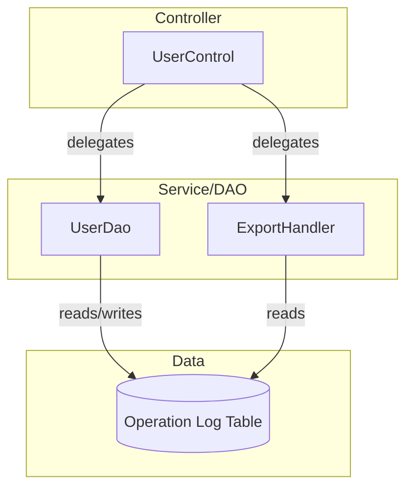

# Operation Log Audit and Export - Spec

[← Back to Overview](../overview.md)

## Architecture

### Service Layer

The operation log audit chain follows a typical Spring MVC architecture:

- **Controller Layer**: `UserControl` handles HTTP requests for log viewing and export
- **Service/DAO Layer**: `UserDao` provides data access for user operation logs
- **Handler Layer**: `ExportHandler` handles export file generation logic

### Dependency Graph



### Shared Services

| Service | Scope | Usage Pattern |
|---------|-------|---------------|
| UserDao | Cross-chain | Used by user-authentication, user-administration, and operation-log-audit chains for user-related data operations |
| ExportHandler | Chain-specific | Dedicated to operation log export functionality |

## API Contracts

### GET /user/log

> 📎 Source: src/main/java/com/springMVC/control/UserControl.java → showLog()

**Request Schema**:
```json
{
  "method": "GET",
  "path": "/user/log",
  "queryParams": {
    "userid": "string (required) - User ID to filter logs"
  }
}
```

**Response Schema**:
- Paginated list of operation log records
- Each record contains: operation timestamp, user ID, operation type, operation content

**Validation Rules**:
- userid parameter is required
- User must have permission to view logs

**Status Codes**:
- 200: Success, returns paginated log list
- 401: Unauthorized, user not authenticated
- 403: Forbidden, user lacks permission to view logs

**关联模块 Spec**: [operation-log](../../services/operation-log.md)

### GET /user/exportLogs

> 📎 Source: src/main/java/com/springMVC/control/UserControl.java → exportLogs()

**Request Schema**:
```json
{
  "method": "GET",
  "path": "/user/exportLogs",
  "queryParams": {
    "fromTime": "string (required) - Start time in ISO format or timestamp",
    "toTime": "string (required) - End time in ISO format or timestamp"
  }
}
```

**Response Schema**:
- Triggers file download response with QC Log format file
- Content-Type: application/octet-stream or appropriate file type

**Validation Rules**:
- fromTime and toTime are required
- fromTime must be before toTime
- Time range should not exceed maximum allowed period (TBD)

**Status Codes**:
- 200: Success, triggers file download
- 400: Bad request, invalid time parameters
- 401: Unauthorized
- 403: Forbidden

**关联模块 Spec**: [operation-log](../../services/operation-log.md)

### GET /user/export

> 📎 Source: src/main/java/com/springMVC/control/UserControl.java → export()

**Request Schema**:
```json
{
  "method": "GET",
  "path": "/user/export",
  "queryParams": {
    "TBD": "Parameters depend on specific export type"
  }
}
```

**Response Schema**:
- Generic export endpoint, behavior depends on implementation

**关联模块 Spec**: [operation-log](../../services/operation-log.md)

## Data Model

### Entity Relationships

```erDiagram
  OPERATION_LOG ||--o{ USER : "records operations of"
  OPERATION_LOG ||--o{ VESSEL_REFUEL : "tracks changes to"
  OPERATION_LOG ||--o{ VESSEL_COL : "tracks changes to"
  
  USER ||--o{ OPERATION_LOG : "generates"
  VESSEL_REFUEL ||--o{ OPERATION_LOG : "triggers logging on change"
  VESSEL_COL ||--o{ OPERATION_LOG : "triggers logging on change"
```

> See [operation-log](../../services/operation-log.md) for entity field definitions

### Table Schemas

**Operation Log Table** (inferred from usage patterns):
- Primary key for log entry identification
- User ID reference (foreign key to user table)
- Operation timestamp
- Operation type (LOGIN, CREATE, UPDATE, DELETE, etc.)
- Operation content/description
- Old values (for UPDATE/DELETE operations)
- New values (for CREATE/UPDATE operations)
- Related entity reference (VesselRefuel ID, VesselCol ID, etc.)

> See [operation-log](../../services/operation-log.md) for complete table schema definitions

## Integration Specs

### Internal Service Integration

**UserDao Integration**:
- Method: `getUserLogByPeriod(fromTime, toTime)`
- Purpose: Query operation logs within specified time range
- Return: List of log records for export

> 📎 Source: TBD — Need to locate UserDao implementation file

**ExportHandler Integration**:
- Method: `exportQCLog(response, exportLogsList)`
- Purpose: Generate QC Log format export file from log records
- Parameters: HTTP response object, list of log records to export

> 📎 Source: TBD — Need to locate ExportHandler implementation file

### External System Integration

No external system integrations identified for this chain.

### Risk Annotations

⚠️ [ERR:no-timeout] UserDao queries for large time ranges may cause performance issues without query timeout configuration
> 📎 Source: TBD — Need to verify UserDao query timeout settings

⚠️ [PERF:bottleneck] ExportHandler processing large log datasets synchronously may block HTTP response
> 📎 Source: TBD — Need to verify ExportHandler implementation for async processing support

⚠️ [ERR:idempotent-retry] Multiple concurrent export requests for same time range may cause redundant processing
> 📎 Source: TBD — Need to verify if export requests include deduplication mechanism

## Error Handling

### Error Scenarios

1. **Invalid Time Range**: fromTime after toTime or time range exceeds maximum allowed period
   - Response: 400 Bad Request with error message
   - Fallback: Return validation error to frontend

2. **No Logs Found**: Query returns empty result set
   - Response: 200 with empty list or appropriate message
   - Fallback: Display "No logs found for selected period"

3. **Export Generation Failure**: ExportHandler fails to generate file
   - Response: 500 Internal Server Error
   - Fallback: Log error details, return generic error message to user

4. **Database Connection Failure**: UserDao cannot access database
   - Response: 500 Internal Server Error
   - Fallback: Retry mechanism (if configured), otherwise return error

### Risk Annotations

⚠️ [ERR:cascade-failure] UserDao failure affects both log viewing and export functionality across multiple chains
> 📎 Source: TBD — Need to verify UserDao error handling and fallback mechanisms

⚠️ [ERR:no-rollback] Export operation does not have transactional rollback if partial failure occurs during file generation
> 📎 Source: TBD — Need to verify ExportHandler transaction management

## Security

### Authentication Requirements

- All API endpoints require user authentication
- Session-based or token-based authentication expected

### Permission Checks

- Log viewing requires appropriate role/permission
- Log export may require elevated permissions (admin role)

### Data Access Scope

- Users can only view their own logs or logs within their organizational scope (TBD)
- Export functionality may be restricted to admin users only

### Risk Annotations

⚠️ [OWASP:A01] Missing explicit permission checks at API entry points for log export functionality
> 📎 Source: src/main/java/com/springMVC/control/UserControl.java → exportLogs() — Need to verify authorization logic

⚠️ [OWASP:A02] Operation logs may contain sensitive data (old/new values) that should be masked based on user role
> 📎 Source: TBD — Need to verify if data masking is implemented in UserDao or ExportHandler

⚠️ [OWASP:A01] Cross-service calls to UserDao do not propagate authentication context explicitly
> 📎 Source: TBD — Need to verify authentication context propagation in service layer

## Performance

### Latency Concerns

- **Log Query**: Large time ranges may result in slow database queries
  - Mitigation: Implement query pagination and time range limits
  
- **Export Generation**: Processing large datasets synchronously blocks HTTP response
  - Mitigation: Consider async export with notification mechanism

### Caching Strategy

- No caching identified for operation log queries (logs are real-time data)
- Export results are not cached (each export generates fresh file)

### Risk Annotations

⚠️ [PERF:cascade-call] Synchronous call chain: UserControl → UserDao → Database → ExportHandler → File Generation may cause high latency for large datasets
> 📎 Source: src/main/java/com/springMVC/control/UserControl.java → exportLogs() — Entire export process is synchronous

⚠️ [PERF:no-cache] No caching mechanism for frequently accessed log queries within short time windows
> 📎 Source: TBD — Need to verify if any caching layer exists for log queries

⚠️ [PERF:no-circuit-breaker] External dependencies (database) lack circuit breaker pattern, failures may cascade
> 📎 Source: TBD — Need to verify if circuit breaker or retry mechanisms are configured for database access
