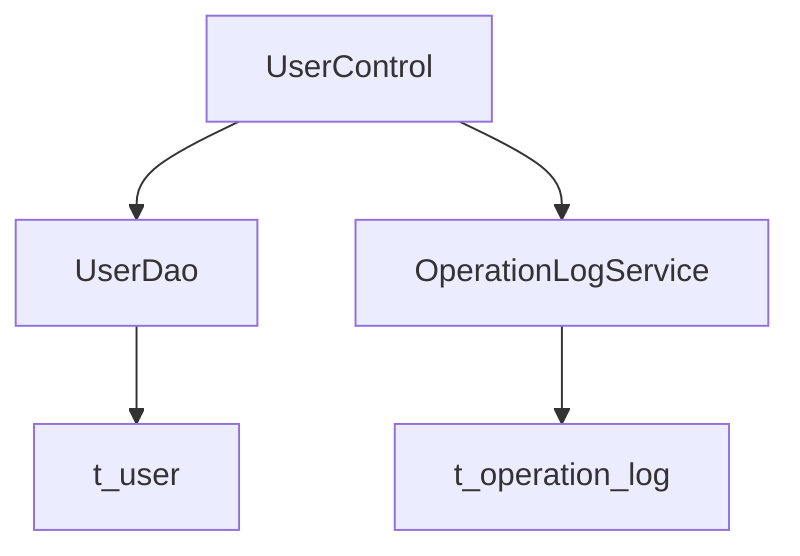

# User Administration and Management - Spec

[← Back to Overview](../overview.md)

## Architecture

### Service Layer

The user administration chain follows a traditional Spring MVC architecture:

```
UserControl (Controller) → UserDao (Data Access) → Database
                         → OperationLogService (Shared Service) → Database
```

**Components**:
- **UserControl**: HTTP request handler, maps REST endpoints to business operations
- **UserDao**: Data access object for user entity persistence operations
- **OperationLogService**: Shared service for retrieving operation logs (from operation-log module)

### Dependency Graph



### Shared Services

| Service | Scope | Used By Chains |
|---------|-------|----------------|
| UserDao | Cross-chain data access | user-administration, user-authentication, operation-log-audit |

⚠️ [PERF:bottleneck] UserDao is shared across three chains (user-administration, user-authentication, operation-log-audit), creating a potential bottleneck under high concurrent load. No caching layer identified between controller and DAO.

## API Contracts

### GET /user/all

- **Handler**: `UserControl.listAllUser()`
- **Request**: No parameters
- **Response**: JSON array of user objects
- **Status Codes**: 200 (success), 500 (server error)

### GET /user/add

- **Handler**: `UserControl.addUser()`
- **Request**: No parameters
- **Response**: View name "userDetail" (renders userDetail.jsp)
- **Status Codes**: 200 (success)

### POST /user/save

- **Handler**: `UserControl.add()`
- **Request Body**:
  ```json
  {
    "username": "string (required, unique)",
    "password": "string (required)",
    "role": "string (required)",
    "qcid": "string (optional)"
  }
  ```
- **Response**: Redirect or JSON result indicating success/failure
- **Validation Rules**:
  - username: non-empty, unique in database
  - password: non-empty, meets complexity requirements
  - role: must be a valid role value
- **Status Codes**: 200 (success), 400 (validation failure), 409 (duplicate username), 500 (server error)

⚠️ [ERR:no-conflict-resolution] Username uniqueness check relies on pre-insert query rather than database unique constraint, creating a race condition under concurrent requests.

### GET /user/modify

- **Handler**: `UserControl.modUser()`
- **Request Parameters**: `id` (query param, required, integer)
- **Response**: View name "update" with user data model (renders update.jsp)
- **Status Codes**: 200 (success), 404 (user not found), 500 (server error)

### POST /user/update

- **Handler**: `UserControl.updateUser()`
- **Request Body**:
  ```json
  {
    "id": "integer (required)",
    "role": "string (optional)",
    "password": "string (optional)",
    "qcid": "string (optional)"
  }
  ```
- **Response**: Redirect or JSON result indicating success/failure
- **Status Codes**: 200 (success), 400 (validation failure), 404 (user not found), 500 (server error)

### GET /user/del

- **Handler**: `UserControl.delUser()`
- **Request Parameters**: `id` (query param, required, integer)
- **Response**: Redirect or JSON result indicating success/failure
- **Status Codes**: 200 (success), 404 (user not found), 500 (server error)

⚠️ [ERR:no-rollback] User deletion does not appear to handle cascading effects on related data (e.g., operation logs referencing deleted user). No transaction rollback mechanism identified for partial failures.

### GET /user/log

- **Handler**: `UserControl.showLog()`
- **Request Parameters**: `userid` (query param, required, integer)
- **Response**: View name "log" with log data model (renders log.jsp)
- **Status Codes**: 200 (success), 400 (missing userid), 500 (server error)

## Data Model

### Entity Relationships

```erDiagram
USER ||--o{ OPERATION_LOG : "generates"
```

> See [user](../../services/user.md) for entity field definitions  
> See [operation-log](../../services/operation-log.md) for entity field definitions

### Table Schemas

**t_user**: Core user entity table
- Primary key: id
- Unique constraint: username (inferred from uniqueness validation logic)
- Fields: username, password, role, qcid, timestamps

**t_operation_log**: Operation audit log table
- Foreign key: userid references t_user.id
- Fields: userid, operation_type, operation_content, timestamp

> See [user](../../services/user.md) for complete t_user schema  
> See [operation-log](../../services/operation-log.md) for complete t_operation_log schema

## Integration Specs

### Internal Service Integration

**UserDao**:
- Type: Spring-managed DAO bean
- Interface: Standard CRUD operations (select, insert, update, delete)
- Transaction management: TBD — verify if @Transactional annotations are present
- Connection pooling: TBD — verify datasource configuration

⚠️ [PERF:no-circuit-breaker] No circuit breaker or rate limiting identified for UserDao calls. Under high load, database connection exhaustion could cascade across all three dependent chains.

**OperationLogService**:
- Type: Shared service from operation-log module
- Interface: Query logs by user ID
- Data consistency: Logs are read-only from user-administration perspective

### External Systems

No external system integrations identified in this chain.

## Error Handling

### Error Scenarios

| Scenario | Error Code | Handling Strategy |
|----------|-----------|-------------------|
| Duplicate username on create | 409 | Return error message to frontend, prevent save |
| User not found on modify/delete | 404 | Return error message, redirect to list |
| Invalid input parameters | 400 | Validation error messages |
| Database connection failure | 500 | Generic server error, log exception |
| Concurrent modification conflict | 500 | Optimistic locking failure (if implemented) |

⚠️ [ERR:no-timeout] No explicit timeout configuration identified for database queries. Long-running queries could block request threads indefinitely.

⚠️ [ERR:cascade-failure] UserDao failure affects all three chains (user-administration, user-authentication, operation-log-audit). No fallback mechanism identified for degraded operation.

⚠️ [ERR:context-loss] Error propagation from UserDao to UserControl may lose detailed error context. Verify exception handling preserves root cause information for debugging.

### Fallback Logic

- Username uniqueness check: Pre-insert query followed by insert; no database-level unique constraint enforcement identified
- User deletion: Direct delete without referential integrity checks; orphaned log records possible

## Security

### Authentication & Authorization

- **Access Control**: Admin-only access assumed for all user management endpoints
- **Session Management**: Relies on application-level session/authentication framework
- **Permission Checks**: TBD — verify if role-based access control is enforced at controller level

⚠️ [OWASP:A01] No explicit permission checks identified at controller entry points. All endpoints assume authenticated admin access but lack programmatic authorization verification.

⚠️ [OWASP:A01] Cross-service calls to OperationLogService do not propagate authentication context. Verify service-to-service authentication requirements.

### Data Protection

- **Password Storage**: Passwords submitted via POST /user/save and POST /user/update; storage format (plaintext vs hashed) TBD
- **Sensitive Data Exposure**: User list API returns all user fields; verify if sensitive fields (password hash) are excluded from response

⚠️ [OWASP:A02] Password transmission over HTTP endpoints without explicit TLS enforcement noted. Verify application-level encryption or transport-layer security configuration.

⚠️ [OWASP:A02] If passwords are stored in plaintext in t_user table, this represents a critical security vulnerability. Immediate verification required.

### Input Validation

- SQL injection protection: Depends on UserDao implementation (prepared statements vs string concatenation)
- XSS protection: JSP views should use proper escaping; verify output encoding in admin.jsp, userDetail.jsp, update.jsp, log.jsp

## Performance

### Latency Concerns

- **GET /user/all**: Returns all users without pagination; performance degrades linearly with user count
- **Username uniqueness check**: Additional SELECT before INSERT adds latency to user creation

⚠️ [PERF:cascade-call] User creation involves sequential operations: uniqueness check → insert. Under concurrent load, this pattern increases contention on the username index.

⚠️ [PERF:no-cache] No caching layer identified for frequently accessed data (user list, user details). Every request hits the database directly.

### Optimization Opportunities

1. **Pagination**: Implement pagination for GET /user/all to limit result set size
2. **Caching**: Add L2 cache for user entities to reduce database load
3. **Batch Operations**: Consider batch delete for bulk user management scenarios
4. **Index Optimization**: Ensure username column has unique index for fast uniqueness checks

### Scalability

- Horizontal scaling limited by shared UserDao dependency across multiple chains
- Database connection pool sizing critical due to cross-chain sharing