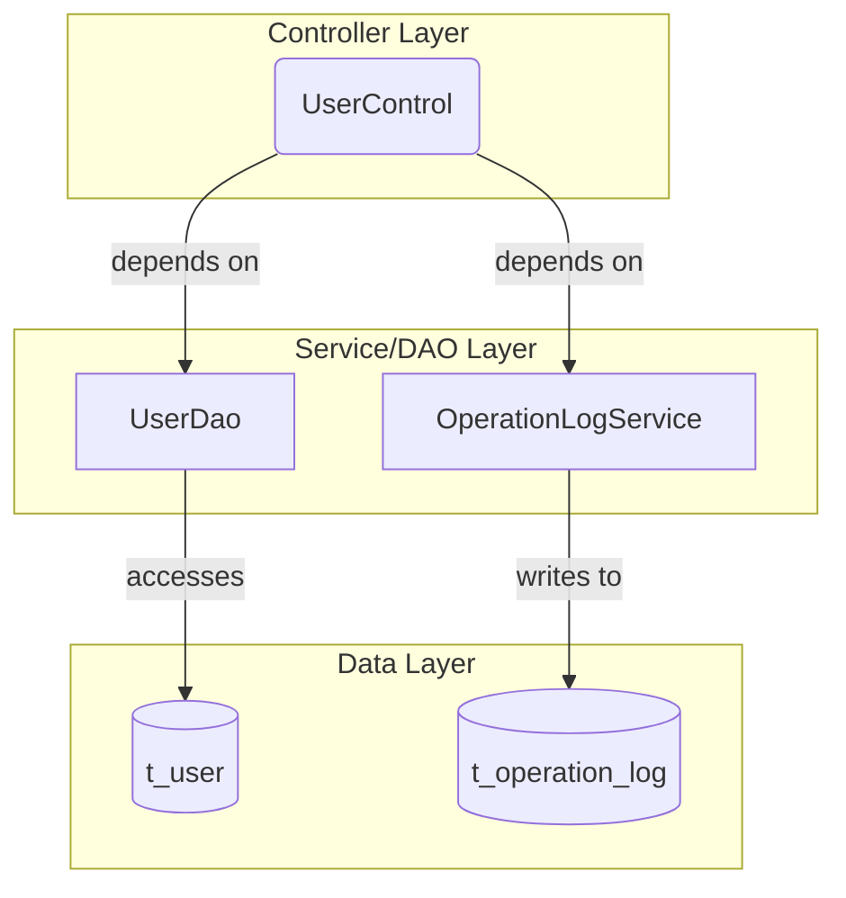

# User Authentication and Session Management - Spec

[← Back to Overview](../overview.md)

## Architecture

### Service Layer

The authentication chain follows a traditional Spring MVC architecture with the following layers:

- **Controller Layer**: `UserControl` handles HTTP requests for login, logout, and language switching
- **Service/DAO Layer**: `UserDao` provides data access for user authentication and validation
- **Logging Service**: `OperationLogService` (from operation-log module) records login activities
- **View Layer**: JSP pages for login interfaces and workspace views

### Dependency Graph



### Shared Services

| Service | Scope | Usage |
|---------|-------|-------|
| UserDao | Cross-chain | Used by user-authentication, user-administration, and operation-log-audit chains for user data access |

## API Contracts

### GET /user/index

**Request**:
- Method: GET
- Path: `/user/index`
- Parameters: None

**Response**:
- Status: 200 OK
- Content-Type: text/html
- Body: JSP view rendering of login page

**Validation**: No input validation required

---

### POST /user/login

**Request**:
- Method: POST
- Path: `/user/login`
- Content-Type: application/x-www-form-urlencoded
- Parameters:
  - `username` (string, required): User login name
  - `password` (string, required): User password
  - `role` (string, required): User role (USER/ADMIN)
  - `qcId` (string, conditional): QC/HC/C number (required for USER role)

**Response**:
- Success (302 Redirect): Redirect to appropriate workspace based on role
- Failure (200 OK): Return to login page with error message

**Validation Rules**:
- All fields are required except qcId (conditional on role)
- Password must not be empty
- Role must be valid enum value

**Status Codes**:
- 302: Successful authentication, redirect to workspace
- 200: Authentication failed, return error message
- 400: Invalid request parameters

> 📎 Source: src/main/java/com/springMVC/control/UserControl.java → login()

---

### POST /user/loginAdmin

**Request**:
- Method: POST
- Path: `/user/loginAdmin`
- Content-Type: application/x-www-form-urlencoded
- Parameters:
  - `username` (string, required): Admin login name
  - `password` (string, required): Admin password

**Response**:
- Success (302 Redirect): Redirect to admin panel
- Failure (200 OK): Return to admin login page with error message

**Validation Rules**:
- Both username and password are required
- Admin-specific authentication logic applies

**Status Codes**:
- 302: Successful admin authentication
- 200: Authentication failed
- 400: Invalid request parameters

> 📎 Source: src/main/java/com/springMVC/control/UserControl.java → loginAdmin()

---

### GET /user/logout

**Request**:
- Method: GET
- Path: `/user/logout`
- Parameters: None

**Response**:
- Status: 302 Redirect
- Location: Login page URL
- Side Effect: Session invalidated

**Status Codes**:
- 302: Session cleared, redirect to login

> 📎 Source: src/main/java/com/springMVC/control/UserControl.java → logout()

---

### GET /user/changeLan

**Request**:
- Method: GET
- Path: `/user/changeLan`
- Parameters:
  - `lang` (string, required): Language code (e.g., zh_CN, en_US)

**Response**:
- Status: 302 Redirect
- Side Effect: User session language preference updated

**Status Codes**:
- 302: Language changed, redirect to current page
- 400: Invalid language code

> 📎 Source: src/main/java/com/springMVC/control/UserControl.java → changeLan()

## Data Model

### Entity Relationships

```erDiagram
  USER ||--o{ OPERATION_LOG : "generates"
  USER {
  }
  OPERATION_LOG {
  }
```

> Entity field definitions: See [user](../../services/user.md) for USER entity, [operation-log](../../services/operation-log.md) for OPERATION_LOG entity

### Table Schemas

**t_user** (Primary authentication table)
- Stores user credentials, role information, and QC/HC/C identifiers
- Referenced by: UserDao for authentication queries

**t_operation_log** (Audit trail table)
- Records login activities and other user operations
- Written by: OperationLogService after successful authentication

> Detailed schema definitions: See [user](../../services/user.md) and [operation-log](../../services/operation-log.md)

## Integration Specs

### Internal Service Integration

#### UserDao Integration

**Purpose**: User data access for authentication and validation

**Methods Used**:
- User lookup by username and role
- QC/HC/C ID validation
- Password verification

**Access Pattern**: Synchronous database query during login flow

**⚠️ [PERF:no-cache] UserDao queries user data from database on every login attempt without caching layer, potentially causing performance issues under high concurrent login scenarios.**
> 📎 Source: src/main/java/com/springMVC/control/UserControl.java → login() calls UserDao

#### OperationLogService Integration

**Purpose**: Record login activity for audit purposes

**Invocation Point**: After successful credential validation, before redirect

**Data Recorded**:
- User ID
- Login timestamp
- IP address
- Login result (success/failure)

**⚠️ [ERR:no-rollback] Login activity logging occurs after session creation but before redirect; if logging fails, there is no rollback mechanism for the already-created session, leading to inconsistent state.**
> 📎 Source: src/main/java/com/springMVC/control/UserControl.java → login() calls OperationLogService

### External System Integration

No external system integrations in this chain.

## Error Handling

### Error Scenarios

| Scenario | Error Code | Behavior | Fallback |
|----------|-----------|----------|----------|
| Invalid username | Authentication failure | Return to login with error message | N/A |
| Invalid password | Authentication failure | Return to login with error message | N/A |
| Invalid role | Validation error | Return to login with error message | N/A |
| Missing QC ID (USER role) | Validation error | Return to login with error message | N/A |
| Database connection failure | System error | Display system error page | Retry or contact admin |
| Operation log write failure | Partial success | Session created but log missing | ⚠️ No retry mechanism |

### Exception Handling

**⚠️ [ERR:no-timeout] UserDao database queries do not specify explicit timeout configuration, which may cause hanging requests if database becomes unresponsive.**
> 📎 Source: src/main/java/com/springMVC/control/UserControl.java → login() delegates to UserDao

**⚠️ [ERR:cascade-failure] Shared UserDao service failure affects all three dependent chains (user-authentication, user-administration, operation-log-audit), creating a single point of failure across multiple business capabilities.**
> 📎 Source: Shared service definition in chain metadata

**⚠️ [ERR:no-conflict-resolution] Concurrent login attempts for the same user from different sessions do not have conflict resolution logic; both sessions may remain active simultaneously.**
> 📎 Source: src/main/java/com/springMVC/control/UserControl.java → login() session creation logic

## Security

### Authentication Mechanism

- **Credential Storage**: Passwords stored in t_user table (encryption algorithm TBD)
- **Session Management**: HTTP Session-based authentication
- **Role-Based Access**: USER and ADMIN roles with different authentication flows

### Permission Checks

**⚠️ [OWASP:A01] No explicit permission check at /user/index endpoint; unauthenticated users can access login page freely, which is expected, but there is no rate limiting to prevent brute force attacks on the login endpoint.**
> 📎 Source: src/main/java/com/springMVC/control/UserControl.java → index()

**⚠️ [OWASP:A01] POST /user/login and POST /user/loginAdmin endpoints lack account lockout mechanism after multiple failed attempts, making them vulnerable to brute force attacks.**
> 📎 Source: src/main/java/com/springMVC/control/UserControl.java → login(), loginAdmin()

**⚠️ [OWASP:A02] Password transmission over HTTP form submission; if TLS is not enforced at the web server level, credentials may be transmitted in plaintext.**
> 📎 Source: src/main/webapp/WEB-INF/jsp/login.jsp form submission

### Data Access Scope

- UserDao accesses only authenticated user's own record during login
- OperationLogService writes audit records with user context
- No cross-user data access in authentication flow

### Session Security

- Session created upon successful authentication
- Session invalidated on logout via GET /user/logout
- Session contains: user ID, role, QC ID (for USER role)

**⚠️ [OWASP:A01] Session fixation protection not explicitly implemented; no session regeneration after successful login detected in code flow.**
> 📎 Source: src/main/java/com/springMVC/control/UserControl.java → login() session creation

## Performance

### Latency Concerns

**⚠️ [PERF:cascade-call] Login flow involves synchronous cascade: UserControl → UserDao (DB query) → OperationLogService (DB write), creating sequential database dependencies that increase end-to-end latency.**
> 📎 Source: src/main/java/com/springMVC/control/UserControl.java → login() method flow

**⚠️ [PERF:bottleneck] Shared UserDao service is used by three different chains (user-authentication, user-administration, operation-log-audit); high load in any chain may impact authentication performance due to shared database connection pool.**
> 📎 Source: Chain metadata - sharedServices: ["UserDao"], sharedAcross: ["user-administration", "operation-log-audit"]

### Caching Strategy

**⚠️ [PERF:no-cache] No caching layer identified for user authentication data; every login attempt triggers fresh database query through UserDao, increasing database load under concurrent access scenarios.**
> 📎 Source: src/main/java/com/springMVC/control/UserControl.java → login() direct UserDao invocation

### Optimization Recommendations

1. Implement connection pooling for UserDao database access
2. Add caching for frequently accessed user profiles (with invalidation on password change)
3. Consider async logging for OperationLogService to reduce login response time
4. Implement circuit breaker pattern for shared UserDao service to prevent cascade failures
