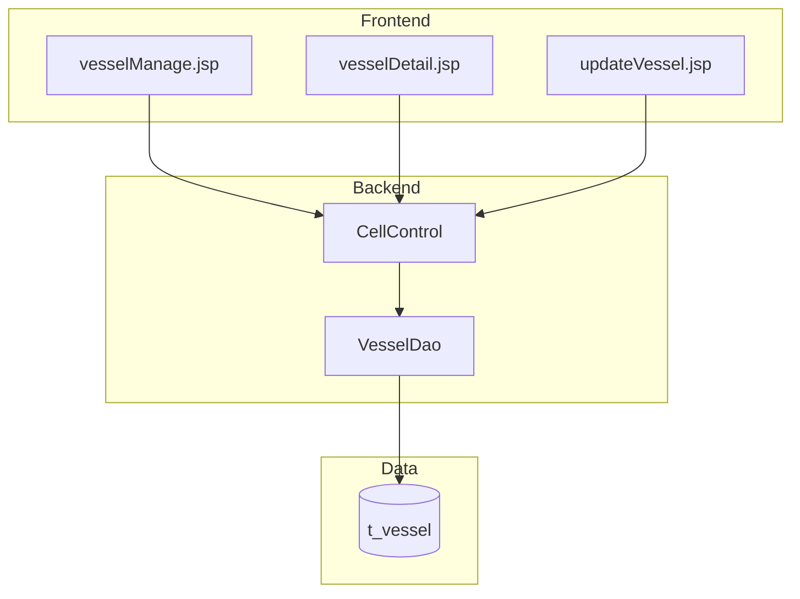

# Vessel Configuration Management - Technical Specification

[← Back to Overview](../overview.md)

## Architecture

### Service Layer

```text
Frontend (JSP Pages)
    ↓
CellControl (Spring MVC Controller)
    ↓
VesselDao (Shared Data Access Layer)
    ↓
Database (t_vessel table)
```

**组件说明**：
- **CellControl**: Spring MVC 控制器，处理所有船舶配置相关的 HTTP 请求
- **VesselDao**: 共享的数据访问层服务，被 vessel-configuration、vessel-refuel-configuration、vessel-color-configuration 三个链共享
- **Database**: 关系型数据库，存储船舶配置数据

### 依赖图



### 共享服务边界

VesselDao 作为共享服务，被以下链共同使用：
- **vessel-configuration**: 船舶基础配置管理
- **vessel-refuel-configuration**: 船舶加油配置
- **vessel-color-configuration**: 船舶颜色配置

⚠️ [PERF:bottleneck] VesselDao 作为三个链的共享数据访问层，可能成为性能瓶颈，特别是在高并发场景下。建议监控 DAO 层的查询性能和连接池使用情况。
> 📎 Source: TBD — VesselDao implementation file path not accessible

⚠️ [ERR:cascade-failure] 若 VesselDao 服务出现故障，将同时影响三个依赖链的所有船舶相关操作。建议实施健康检查和降级策略。
> 📎 Source: TBD — VesselDao implementation file path not accessible

## API Contracts

### GET /user/allVessel

获取所有船舶列表。

**Request**:
```http
GET /user/allVessel
```

**Response**:
```json
{
  "code": 200,
  "data": [
    {
      "id": "number",
      "vesselid": "string",
      "deck_hold": "string",
      "bay": "number",
      "rowStart": "number",
      "rowEnd": "number",
      "tierStart": "number",
      "tierEnd": "number"
    }
  ]
}
```

> 📎 Source: src/main/java/com/springMVC/control/CellControl.java → getVessel()

### GET /user/searchVessel

按关键字搜索船舶。

**Request**:
```http
GET /user/searchVessel?key={keyword}
```

**Query Parameters**:
| 参数 | 类型 | 必填 | 说明 |
|------|------|------|------|
| key | string | 是 | 搜索关键字 |

**Response**:
```json
{
  "code": 200,
  "data": [
    {
      "id": "number",
      "vesselid": "string",
      "deck_hold": "string",
      "bay": "number"
    }
  ]
}
```

> 📎 Source: src/main/java/com/springMVC/control/CellControl.java → searchCompanyTractor()

### GET /user/addVessel

进入新增船舶页面。

**Request**:
```http
GET /user/addVessel
```

**Response**: 返回 vessel-detail.jsp 视图

> 📎 Source: src/main/java/com/springMVC/control/CellControl.java → addVessel()

### POST /user/saveVessel

保存新船舶配置。

**Request**:
```http
POST /user/saveVessel
Content-Type: application/x-www-form-urlencoded

vesselid=xxx&deck_hold=xxx&bay=xxx&rowStart=xxx&rowEnd=xxx&tierStart=xxx&tierEnd=xxx
```

**Body Parameters**:
| 参数 | 类型 | 必填 | 说明 |
|------|------|------|------|
| vesselid | string | 是 | 船舶编号 |
| deck_hold | string | 是 | 甲板/货舱标识 |
| bay | number | 是 | Bay 编号 |
| rowStart | number | 是 | Row 起始值 |
| rowEnd | number | 是 | Row 结束值 |
| tierStart | number | 是 | Tier 起始值 |
| tierEnd | number | 是 | Tier 结束值 |

**Validation Rules**:
- vesselid + deck_hold + bay 组合必须唯一
- rowStart ≤ rowEnd
- tierStart ≤ tierEnd

**Response**:
```json
{
  "code": 200,
  "message": "success"
}
```

或（重复时）:
```json
{
  "code": 400,
  "message": "Duplicate vessel configuration"
}
```

> 📎 Source: src/main/java/com/springMVC/control/CellControl.java → saveVessel()

### GET /user/modifyVessel

进入修改船舶页面。

**Request**:
```http
GET /user/modifyVessel?id={vesselId}
```

**Query Parameters**:
| 参数 | 类型 | 必填 | 说明 |
|------|------|------|------|
| id | number | 是 | 船舶 ID |

**Response**: 返回 update-vessel.jsp 视图，携带船舶数据

> 📎 Source: src/main/java/com/springMVC/control/CellControl.java → modVessel()

### POST /user/updateVessel

更新船舶配置。

**Request**:
```http
POST /user/updateVessel
Content-Type: application/x-www-form-urlencoded

id=xxx&vesselid=xxx&deck_hold=xxx&bay=xxx&rowStart=xxx&rowEnd=xxx&tierStart=xxx&tierEnd=xxx
```

**Response**:
```json
{
  "code": 200,
  "message": "updated"
}
```

> 📎 Source: src/main/java/com/springMVC/control/CellControl.java → updateVessel()

### GET /user/delVessel

删除船舶配置。

**Request**:
```http
GET /user/delVessel?id={vesselId}
```

**Query Parameters**:
| 参数 | 类型 | 必填 | 说明 |
|------|------|------|------|
| id | number | 是 | 船舶 ID |

**Response**:
```json
{
  "code": 200,
  "message": "deleted"
}
```

> 📎 Source: src/main/java/com/springMVC/control/CellControl.java → delVessel()

## Data Model

### Entity Relationships

```erDiagram
  VESSEL ||--o{ VESSEL_REFUEL : "has"
  VESSEL ||--o{ VESSEL_COLOR : "has"
```

> 实体字段定义详见 [cell](../../services/cell.md) 模块级文档

### Table Schema

**t_vessel** (推断表名，需确认)

| 字段 | 类型 | 约束 | 说明 |
|------|------|------|------|
| id | BIGINT | PK, AUTO_INCREMENT | 主键 |
| vesselid | VARCHAR | NOT NULL | 船舶编号 |
| deck_hold | VARCHAR | NOT NULL | 甲板/货舱标识 |
| bay | INT | NOT NULL | Bay 编号 |
| rowStart | INT | NOT NULL | Row 起始值 |
| rowEnd | INT | NOT NULL | Row 结束值 |
| tierStart | INT | NOT NULL | Tier 起始值 |
| tierEnd | INT | NOT NULL | Tier 结束值 |
| created_at | TIMESTAMP | DEFAULT CURRENT_TIMESTAMP | 创建时间 |
| updated_at | TIMESTAMP | ON UPDATE CURRENT_TIMESTAMP | 更新时间 |

**Unique Constraint**: (vesselid, deck_hold, bay)

> 📎 Source: TBD — Database schema definition file not accessible

## Integration Specs

### Shared Service: VesselDao

VesselDao 作为共享数据访问层，提供以下方法（推断）：

| 方法 | 用途 | 调用方 |
|------|------|--------|
| queryAllVessels() | 查询所有船舶 | CellControl.getVessel() |
| searchVessels(key) | 按关键字搜索 | CellControl.searchCompanyTractor() |
| checkUniqueness(vesselid, deck_hold, bay) | 检查唯一性 | CellControl.saveVessel() |
| insertVessel(data) | 插入新船舶 | CellControl.saveVessel() |
| getVesselById(id) | 按 ID 查询 | CellControl.modVessel() |
| updateVessel(data) | 更新船舶 | CellControl.updateVessel() |
| deleteVessel(id) | 删除船舶 | CellControl.delVessel() |

⚠️ [PERF:no-circuit-breaker] VesselDao 作为共享服务，未实现熔断机制。当数据库响应缓慢时，可能导致所有依赖链的请求堆积。建议添加超时控制和熔断器。
> 📎 Source: TBD — VesselDao implementation file path not accessible

⚠️ [ERR:no-conflict-resolution] 多个链同时通过 VesselDao 访问同一船舶数据时，可能存在并发冲突。建议实施乐观锁或版本号机制。
> 📎 Source: TBD — VesselDao implementation file path not accessible

### External Systems

无外部系统集成。

## Error Handling

### 错误场景

| 场景 | 错误码 | 处理方式 |
|------|--------|----------|
| 船舶配置重复 | 400 | 返回错误提示，阻止保存 |
| 船舶不存在 | 404 | 修改/删除时返回错误 |
| 参数缺失 | 400 | 返回参数校验错误 |
| 数据库异常 | 500 | 记录日志，返回通用错误 |

### 异常流程

1. **保存时重复检测失败**：
   - Controller 调用 VesselDao.checkUniqueness()
   - 若发现重复，返回错误消息给前端
   - 前端显示错误提示，用户修正后重新提交

2. **删除关联数据检查**：
   - ⚠️ [ERR:no-rollback] 当前实现可能未在删除前检查关联的加油配置或颜色配置。若直接删除船舶，可能导致关联数据成为孤儿记录。建议在 VesselDao.deleteVessel() 中添加前置校验或级联删除逻辑。
   > 📎 Source: TBD — VesselDao.deleteVessel() implementation not accessible

3. **数据库连接失败**：
   - ⚠️ [ERR:no-timeout] 若 VesselDao 未设置查询超时，数据库连接挂起可能导致线程阻塞。建议配置合理的超时时间（如 30 秒）。
   > 📎 Source: TBD — VesselDao configuration not accessible

## Security

### 认证与授权

⚠️ [OWASP:A01] 当前 API 端点未明确展示认证和权限检查逻辑。所有船舶配置操作（增删改）应确保只有授权用户可执行。建议在 CellControl 的各 handler 方法中添加 @PreAuthorize 或类似注解进行权限控制。
> 📎 Source: src/main/java/com/springMVC/control/CellControl.java — authentication/authorization logic not visible in available data

### 数据访问范围

- 船舶配置数据属于系统基础数据，可能需要限制特定角色（如调度员、管理员）才能修改
- 删除操作应特别谨慎，建议添加二次确认或软删除机制

⚠️ [OWASP:A01] 删除接口 GET /user/delVessel 使用 GET 方法执行删除操作，不符合 RESTful 规范且可能被 CSRF 攻击利用。建议改为 POST 或 DELETE 方法，并添加 CSRF token 验证。
> 📎 Source: src/main/java/com/springMVC/control/CellControl.java → delVessel()

### 输入校验

- 所有用户输入应在 Controller 层进行校验
- SQL 注入防护：VesselDao 应使用参数化查询而非字符串拼接

## Performance

### 端到端延迟关注点

| 环节 | 潜在瓶颈 | 建议 |
|------|----------|------|
| 搜索接口 | LIKE 模糊查询可能较慢 | 为船舶名称字段添加索引 |
| 唯一性检查 | 每次保存都需查询数据库 | 考虑添加应用层缓存或唯一索引 |
| VesselDao 共享 | 多链共用可能竞争资源 | 监控连接池使用情况，考虑读写分离 |

⚠️ [PERF:cascade-call] CellControl 到 VesselDao 再到数据库的同步调用链，在高并发下可能成为瓶颈。建议评估是否需要引入缓存层（如 Redis）缓存频繁读取的船舶列表。
> 📎 Source: TBD — Caching strategy not visible in available code

⚠️ [PERF:no-cache] 船舶列表查询（GET /user/allVessel）每次请求都访问数据库，未使用缓存。对于变化不频繁的基础数据，建议添加短期缓存（如 5 分钟 TTL）。
> 📎 Source: src/main/java/com/springMVC/control/CellControl.java → getVessel()

### 数据库优化建议

1. 为 (vesselid, deck_hold, bay) 添加联合唯一索引，既保证唯一性又加速查询
2. 为搜索字段（如船舶名称）添加普通索引
3. 考虑分页查询，避免一次性加载大量数据

## Assumptions & TBDs

1. **TBD**: VesselDao 的具体实现类和文件路径需要确认
2. **TBD**: 数据库表的确切名称和完整字段定义
3. **TBD**: 唯一性校验是在 Controller 层还是 DAO 层执行
4. **TBD**: 是否有事务管理机制（@Transactional）包裹保存/更新/删除操作
5. **假设**: Spring MVC 框架处理请求路由和视图渲染
6. **假设**: 使用传统 JDBC 或 MyBatis 作为 ORM 框架