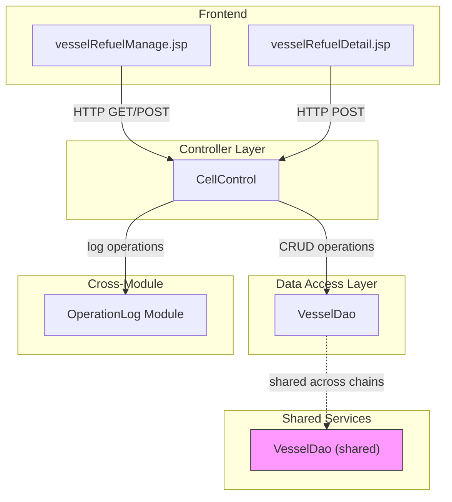
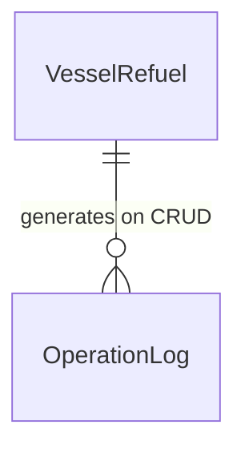

# Vessel Refuel Configuration - Spec

[← Back to Overview](../overview.md)

## Architecture

### Service Layer

The vessel refuel configuration chain follows a traditional Spring MVC architecture:

```
Frontend (JSP) → CellControl (Controller) → VesselDao (DAO) → Database
                                              ↓
                                         OperationLog (Cross-module)
```

**Layer Responsibilities**:
- **CellControl**: HTTP request handler, routes requests to appropriate service methods
- **VesselDao**: Data access object for vessel refuel configuration persistence
- **OperationLog**: Cross-module service for audit logging

### Dependency Graph



### Shared Services

| Service | Scope | Usage Pattern |
|---------|-------|---------------|
| VesselDao | Shared across vessel-configuration, vessel-color-configuration, vessel-refuel-configuration | Direct DAO injection in CellControl for CRUD operations |

> 📎 Source: Chain data indicates VesselDao is listed in both downstreamServices and sharedServices

## API Contracts

### GET /user/allVesselRefuel

**Handler**: `CellControl.getVesselRefuel()`

**Request**: No parameters

**Response**: List of vessel refuel configurations

**Status Codes**:
- 200: Success, returns refuel list
- 500: Internal server error

> 📎 Source: src/main/java/com/springMVC/control/CellControl.java → getVesselRefuel()

### GET /user/searchVesselRefuel

**Handler**: `CellControl.searchVesselRefuel()`

**Request Parameters**:
| Parameter | Type | Required | Description |
|-----------|------|----------|-------------|
| key | String | Yes | Search keyword for filtering refuel records |

**Response**: Filtered list of vessel refuel configurations matching the keyword

**Status Codes**:
- 200: Success, returns filtered results
- 400: Missing or invalid search key
- 500: Internal server error

> 📎 Source: src/main/java/com/springMVC/control/CellControl.java → searchVesselRefuel()

### GET /user/addVesselRefuel

**Handler**: `CellControl.addVesselRefuel()`

**Request**: No parameters

**Response**: View model for new refuel configuration form

**Status Codes**:
- 200: Success, renders add form page
- 500: Internal server error

> 📎 Source: src/main/java/com/springMVC/control/CellControl.java → addVesselRefuel()

### GET /user/modifyVesselRefuel

**Handler**: `CellControl.updateVesselRefuel()`

**Request Parameters**:
| Parameter | Type | Required | Description |
|-----------|------|----------|-------------|
| id | Long/String | Yes | Refuel configuration ID to modify |

**Response**: View model with existing refuel configuration data for editing

**Status Codes**:
- 200: Success, renders edit form with data
- 404: Refuel configuration not found
- 500: Internal server error

> 📎 Source: src/main/java/com/springMVC/control/CellControl.java → updateVesselRefuel()

### POST /user/updateVesselRefuelStatus

**Handler**: `CellControl.updateVesselRefuelStatus()`

**Request Body/Form Parameters**:
| Parameter | Type | Required | Description |
|-----------|------|----------|-------------|
| vesselid | Long/String | Yes | Vessel identifier |
| is_refuel | Boolean/Integer | Yes | Refuel status flag |

**Response**: Operation result confirmation

**Status Codes**:
- 200: Success, status updated
- 400: Missing required parameters
- 404: Vessel not found
- 500: Internal server error

> 📎 Source: src/main/java/com/springMVC/control/CellControl.java → updateVesselRefuelStatus()

### GET /user/delVesselRefuel

**Handler**: `CellControl.delVesselRefuel()`

**Request Parameters**:
| Parameter | Type | Required | Description |
|-----------|------|----------|-------------|
| id | Long/String | Yes | Refuel configuration ID to delete |

**Response**: Deletion confirmation

**Status Codes**:
- 200: Success, record deleted
- 404: Refuel configuration not found
- 500: Internal server error

> 📎 Source: src/main/java/com/springMVC/control/CellControl.java → delVesselRefuel()

## Data Model

### Entity Relationships



> See [cell](../../services/cell.md) for VesselRefuel entity field definitions
> See [operation-log](../../services/operation-log.md) for OperationLog entity field definitions

### Table Schemas

**t_vessel_refuel** (TBD: Exact schema needs verification from entity definition)

Expected fields based on API contracts:
- id: Primary key
- vesselid: Foreign key to vessel
- is_refuel: Status flag
- Additional configuration fields (TBD)

> 📎 Source: TBD — Need to locate VesselRefuel entity class definition

**t_operation_log** (Managed by operation-log module)

> See [operation-log](../../services/operation-log.md) for complete schema

## Integration Specs

### VesselDao Integration

**Type**: Internal DAO service (shared across multiple chains)

**Access Pattern**: Direct method invocation from CellControl

**Operations Used**:
- findAll() / list(): Retrieve all refuel configurations
- searchByKey(String key): Search by keyword
- findById(Long id): Retrieve single configuration
- save(VesselRefuel entity): Create new configuration
- update(VesselRefuel entity): Update existing configuration
- updateStatus(Long vesselid, Boolean is_refuel): Update status only
- deleteById(Long id): Delete configuration

**⚠️ [PERF:no-circuit-breaker]**: VesselDao is a shared service used across vessel-configuration, vessel-color-configuration, and vessel-refuel-configuration chains. High load on one chain could impact others. No circuit breaker pattern detected in the chain data.

> 📎 Source: Chain data shows VesselDao in sharedServices and downstreamServices

### OperationLog Integration

**Type**: Cross-module service integration

**Trigger**: Automatic logging on SAVE/UPDATE/DELETE operations on VesselRefuel

**Integration Pattern**: CellControl delegates to operation-log module after successful CRUD operations

**⚠️ [ERR:no-rollback]**: If operation-log fails after a successful CRUD operation, there is no rollback mechanism described. The primary operation succeeds but audit trail may be incomplete.

> 📎 Source: Flow step 6 indicates "Log Refuel Operation" triggered by SAVE/UPDATE/DELETE actions

## Error Handling

### Error Scenarios

| Scenario | Error Code | Fallback Behavior |
|----------|------------|-------------------|
| Refuel config not found (modify/delete) | 404 | Display error message, redirect to list |
| Missing required parameters | 400 | Display validation error on form |
| Database operation failure | 500 | Display generic error, log exception |
| Operation log failure | 500 (partial) | Primary operation succeeds, log warning |

### ⚠️ Risk Annotations

**⚠️ [ERR:no-timeout]**: Cross-service call to operation-log module does not specify timeout configuration. If operation-log is slow or unresponsive, it could block the refuel configuration operation.

> 📎 Source: Flow step dependency on operation-log module without specified timeout

**⚠️ [ERR:cascade-failure]**: VesselDao is shared across three chains (vessel-configuration, vessel-color-configuration, vessel-refuel-configuration). A failure in VesselDao would cascade to all dependent chains simultaneously.

> 📎 Source: sharedAcross field lists vessel-configuration and vessel-color-configuration

**⚠️ [ERR:no-conflict-resolution]**: No explicit concurrency control mechanism described for simultaneous updates to the same refuel configuration by multiple users.

> 📎 Source: TBD — Need to verify if VesselDao or database layer implements optimistic/pessimistic locking

## Security

### Authentication & Authorization

**Authentication**: All endpoints are under `/user/` path prefix, suggesting user authentication is required.

**Authorization**: 
- View/Search operations: Likely available to authenticated users with read permissions
- Add/Modify/Delete operations: Require write permissions for vessel refuel configuration
- Status update: May have separate permission controls

**⚠️ [OWASP:A01]**: Permission checks at individual API endpoint level need verification. The chain data does not specify role-based access control details for each operation.

> 📎 Source: TBD — Need to examine CellControl for @PreAuthorize or similar security annotations

### Data Access Scope

- Users should only access refuel configurations they are authorized to view
- Delete operations should validate ownership/permissions before execution

**⚠️ [OWASP:A01]**: No explicit mention of data scope filtering (e.g., department-level access control) in the chain data. Need to verify if VesselDao queries include tenant/department filters.

> 📎 Source: TBD — Need to examine VesselDao query implementations for data scope enforcement

## Performance

### End-to-End Latency Concerns

**Critical Path**: User action → CellControl → VesselDao → Database → Response

**Potential Bottlenecks**:
1. **VesselDao shared service**: Used by 3 chains, could become a bottleneck under high concurrent load
2. **Search operation**: Keyword search without index optimization could be slow on large datasets
3. **Operation log synchronous call**: Logging happens synchronously after CRUD operations, adding latency

**⚠️ [PERF:bottleneck]**: VesselDao is a shared service across vessel-configuration, vessel-color-configuration, and vessel-refuel-configuration chains. Concurrent heavy usage from multiple chains could cause contention.

> 📎 Source: sharedAcross field indicates 3 chains depend on VesselDao

**⚠️ [PERF:no-cache]**: No caching strategy mentioned for frequently accessed refuel configuration lists. Each list view triggers a fresh database query through VesselDao.

> 📎 Source: TBD — Need to verify if CellControl or VesselDao implements any caching mechanism

**⚠️ [PERF:cascade-call]**: The updateVesselRefuelStatus operation triggers both VesselDao update and OperationLog insert sequentially. Under high load, this synchronous dual-write pattern could degrade performance.

> 📎 Source: Flow steps 5 and 6 show sequential execution of status update and operation logging

### Optimization Recommendations

1. Implement read-through caching for frequently accessed refuel configuration lists
2. Consider async operation logging to reduce response time for CRUD operations
3. Add database indexes on search fields used by searchVesselRefuel
4. Implement connection pooling for VesselDao to handle concurrent requests efficiently
