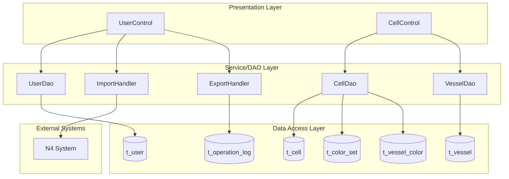
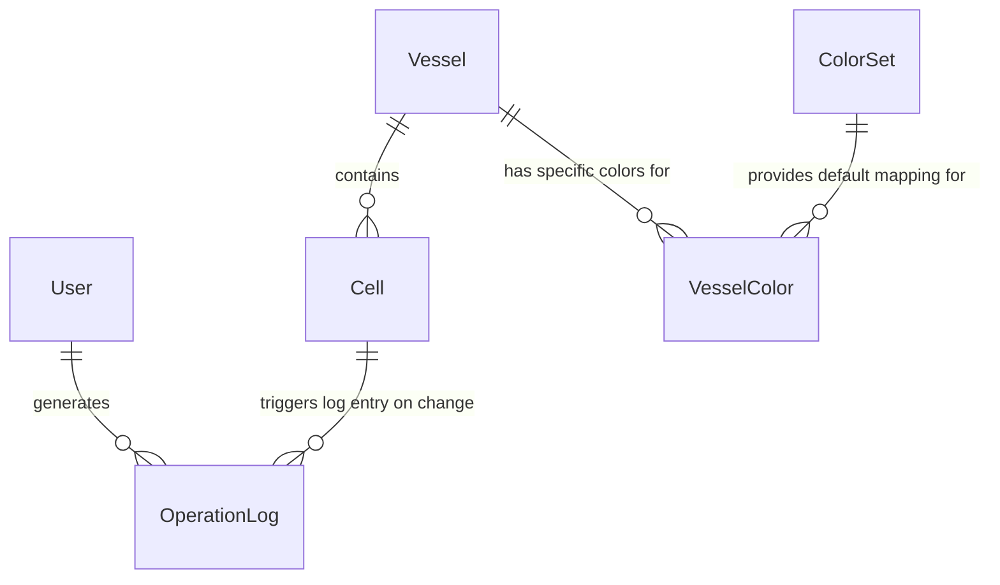

# Vessel Terminal Operations Lifecycle - Spec

[← Back to Overview](../overview.md)

## Architecture

### Service Layer Architecture

The vessel terminal operations chain follows a traditional Spring MVC architecture with clear separation of concerns:



### Dependency Graph

**UserControl Dependencies:**
- UserDao: User authentication, CRUD operations
- ImportHandler: Vessel data import with N4 validation
- ExportHandler: Operation log export functionality

**CellControl Dependencies:**
- CellDao: Cell matrix operations, color set management
- VesselDao: Vessel configuration, refuel status management

**Shared Services Across Chains:**
- UserDao: Shared with user-authentication, user-administration chains
- CellDao: Shared with container-cell-management, color-set-management chains
- VesselDao: Shared with vessel-configuration, vessel-refuel-configuration, vessel-color-configuration chains
- ImportHandler: Shared with data-import-export chain
- ExportHandler: Shared with operation-log-audit, data-import-export chains

## API Contracts

### User Module APIs

#### POST /user/login
- **Purpose**: Operator authentication with QC/HC/C ID
- **Request Schema**:
```json
{
  "qcNum": "string (optional)",
  "hcNum": "string (optional)",
  "cNum": "string (optional)",
  "password": "string"
}
```
- **Response Schema**:
```json
{
  "success": "boolean",
  "message": "string",
  "userId": "number (optional)",
  "userName": "string (optional)",
  "role": "string (USER/ADMIN)",
  "sessionId": "string (optional)"
}
```
- **Validation Rules**:
  - At least one of qcNum/hcNum/cNum must be provided for USER role
  - Password is required
  - Credentials must match database record
- **Status Codes**: 200 (success), 401 (invalid credentials), 500 (server error)
- **Module Link**: [user](../../services/user.md)

#### POST /user/loginAdmin
- **Purpose**: Administrator authentication
- **Request Schema**:
```json
{
  "username": "string",
  "password": "string"
}
```
- **Response Schema**: Same as /user/login
- **Validation Rules**:
  - Username and password are required
  - User must have ADMIN role
- **Status Codes**: 200 (success), 401 (invalid credentials or insufficient privileges), 500 (server error)
- **Module Link**: [user](../../services/user.md)

#### GET /user/all
- **Purpose**: Retrieve all users
- **Request Parameters**: None
- **Response Schema**:
```json
[
  {
    "userId": "number",
    "username": "string",
    "role": "string",
    "qcNum": "string (optional)",
    "hcNum": "string (optional)",
    "cNum": "string (optional)",
    "createTime": "datetime"
  }
]
```
- **Status Codes**: 200 (success), 403 (forbidden for non-admin), 500 (server error)
- **Module Link**: [user](../../services/user.md)

#### POST /user/save
- **Purpose**: Create or update user
- **Request Schema**:
```json
{
  "userId": "number (optional, for update)",
  "username": "string",
  "password": "string",
  "role": "string (USER/ADMIN)",
  "qcNum": "string (required for USER role)",
  "hcNum": "string (optional)",
  "cNum": "string (optional)"
}
```
- **Response Schema**:
```json
{
  "success": "boolean",
  "message": "string",
  "userId": "number"
}
```
- **Validation Rules**:
  - Username must be unique
  - USER role requires at least one of qcNum/hcNum/cNum
  - Password must meet complexity requirements (TBD)
- **Status Codes**: 200 (success), 400 (validation error), 409 (duplicate username), 500 (server error)
- **Module Link**: [user](../../services/user.md)

#### POST /user/importVessel
- **Purpose**: Import vessel data from file with N4 validation
- **Request**: Multipart form with file upload
- **Response Schema**:
```json
{
  "success": "boolean",
  "message": "string",
  "importedCount": "number",
  "failedCount": "number",
  "errors": [
    {
      "rowNumber": "number",
      "errorMessage": "string"
    }
  ]
}
```
- **External Dependency**: N4 System for validation
- **Status Codes**: 200 (success with details), 400 (invalid file format), 500 (server error or N4 unavailable)
- **Module Link**: [user](../../services/user.md)

#### GET /user/exportLogs
- **Purpose**: Export operation logs by date range
- **Request Parameters**:
  - startDate: string (YYYY-MM-DD)
  - endDate: string (YYYY-MM-DD)
  - format: string (excel/csv, default: excel)
- **Response**: File download (Content-Disposition: attachment)
- **Status Codes**: 200 (success), 400 (invalid date range), 500 (server error)
- **Module Link**: [user](../../services/user.md)

### Cell Module APIs

#### GET /user/setbay
- **Purpose**: Get current bay size configuration
- **Request Parameters**: None
- **Response Schema**:
```json
{
  "baySize": "number",
  "holdTiers": "number",
  "lastUpdated": "datetime"
}
```
- **Status Codes**: 200 (success), 500 (server error)
- **Module Link**: [cell](../../services/cell.md)

#### POST /user/updateBay
- **Purpose**: Update bay size configuration
- **Request Schema**:
```json
{
  "baySize": "number",
  "holdTiers": "number"
}
```
- **Response Schema**:
```json
{
  "success": "boolean",
  "message": "string"
}
```
- **Validation Rules**:
  - baySize must be positive integer
  - holdTiers must be positive integer
- **Status Codes**: 200 (success), 400 (invalid values), 500 (server error)
- **Module Link**: [cell](../../services/cell.md)

#### GET /user/allVessel
- **Purpose**: Get all vessels
- **Request Parameters**: None
- **Response Schema**:
```json
[
  {
    "vesselId": "number",
    "vesselName": "string",
    "deckHold": "number",
    "bayCount": "number",
    "rowStart": "number",
    "rowEnd": "number",
    "tierStart": "number",
    "tierEnd": "number",
    "isRefuel": "boolean",
    "createTime": "datetime"
  }
]
```
- **Status Codes**: 200 (success), 500 (server error)
- **Module Link**: [cell](../../services/cell.md)

#### POST /user/saveVessel
- **Purpose**: Save or update vessel configuration
- **Request Schema**:
```json
{
  "vesselId": "number (optional, for update)",
  "vesselName": "string",
  "deckHold": "number",
  "bayCount": "number",
  "rowStart": "number",
  "rowEnd": "number",
  "tierStart": "number",
  "tierEnd": "number"
}
```
- **Response Schema**:
```json
{
  "success": "boolean",
  "message": "string",
  "vesselId": "number"
}
```
- **Validation Rules**:
  - vesselName is required and must be unique
  - rowStart <= rowEnd
  - tierStart <= tierEnd
  - All numeric fields must be positive integers
- **Status Codes**: 200 (success), 400 (validation error), 409 (duplicate vessel name), 500 (server error)
- **Module Link**: [cell](../../services/cell.md)

#### GET /user/allColSet
- **Purpose**: Get all color sets
- **Request Parameters**: None
- **Response Schema**:
```json
[
  {
    "colSetId": "number",
    "colSetName": "string",
    "mappings": [
      {
        "boxcaseType": "string",
        "colorCode": "string"
      }
    ]
  }
]
```
- **Status Codes**: 200 (success), 500 (server error)
- **Module Link**: [cell](../../services/cell.md)

#### POST /user/saveColSet
- **Purpose**: Save or update color set
- **Request Schema**:
```json
{
  "colSetId": "number (optional, for update)",
  "colSetName": "string",
  "mappings": [
    {
      "boxcaseType": "string",
      "colorCode": "string"
    }
  ]
}
```
- **Response Schema**:
```json
{
  "success": "boolean",
  "message": "string",
  "colSetId": "number"
}
```
- **Validation Rules**:
  - colSetName is required and must be unique
  - Each boxcaseType must map to exactly one colorCode
  - colorCode must be valid hex color or predefined color name
- **Status Codes**: 200 (success), 400 (validation error), 409 (duplicate color set name), 500 (server error)
- **Module Link**: [cell](../../services/cell.md)

#### GET /user/allVesselCol
- **Purpose**: Get vessel-specific color configurations
- **Request Parameters**:
  - vesselId: number (optional, filter by vessel)
- **Response Schema**:
```json
[
  {
    "vesselColorId": "number",
    "vesselId": "number",
    "bay": "number",
    "row": "number",
    "tier": "number",
    "colorCode": "string",
    "colSetId": "number (optional, reference to color set)"
  }
]
```
- **Status Codes**: 200 (success), 500 (server error)
- **Module Link**: [cell](../../services/cell.md)

#### POST /user/saveVesselCol
- **Purpose**: Save vessel-specific color configuration
- **Request Schema**:
```json
{
  "vesselId": "number",
  "configurations": [
    {
      "bay": "number",
      "row": "number",
      "tier": "number",
      "colorCode": "string"
    }
  ]
}
```
- **Response Schema**:
```json
{
  "success": "boolean",
  "message": "string"
}
```
- **Validation Rules**:
  - vesselId must exist
  - Bay/Row/Tier must be within vessel's configured range
  - colorCode must be valid
- **Status Codes**: 200 (success), 400 (validation error), 404 (vessel not found), 500 (server error)
- **Module Link**: [cell](../../services/cell.md)

#### GET /user/allVesselRefuel
- **Purpose**: Get vessel refuel status
- **Request Parameters**: None
- **Response Schema**:
```json
[
  {
    "vesselId": "number",
    "vesselName": "string",
    "isRefuel": "boolean"
  }
]
```
- **Status Codes**: 200 (success), 500 (server error)
- **Module Link**: [cell](../../services/cell.md)

#### POST /user/updateVesselRefuelStatus
- **Purpose**: Update vessel refuel status
- **Request Schema**:
```json
{
  "vesselId": "number",
  "isRefuel": "boolean"
}
```
- **Response Schema**:
```json
{
  "success": "boolean",
  "message": "string"
}
```
- **Validation Rules**:
  - vesselId must exist
- **Status Codes**: 200 (success), 404 (vessel not found), 500 (server error)
- **Module Link**: [cell](../../services/cell.md)

#### GET /user/BusiQuery
- **Purpose**: Query container operations by QC number
- **Request Parameters**:
  - qcNum: string (required)
- **Response**: XML format
```xml
<?xml version="1.0" encoding="UTF-8"?>
<BusiQuery>
  <qcNum>QC001</qcNum>
  <bayInfo>
    <bay>
      <bayNumber>1</bayNumber>
      <remainingContainers>5</remainingContainers>
    </bay>
  </bayInfo>
  <totalRemaining>25</totalRemaining>
  <refuelStatus>false</refuelStatus>
  <timestamp>2024-01-15T10:30:00</timestamp>
</BusiQuery>
```
- **Status Codes**: 200 (success with XML), 400 (missing qcNum), 404 (QC not found), 500 (server error)
- **Module Link**: [cell](../../services/cell.md)

## Data Model

### Entity Relationships



> Entity field definitions are documented in module-level Specs:
> - User entity: [user](../../services/user.md)
> - Vessel entity: [cell](../../services/cell.md)
> - Cell entity: [cell](../../services/cell.md)
> - ColorSet entity: [cell](../../services/cell.md)
> - VesselColor entity: [cell](../../services/cell.md)
> - OperationLog entity: [operation-log](../../services/operation-log.md)

### Table Schema References

| Table | Module | Description |
|-------|--------|-------------|
| t_user | user | User accounts, credentials, roles, QC/HC/C IDs |
| t_vessel | cell | Vessel master data, configuration parameters |
| t_cell | cell | Container cell matrix, position tracking |
| t_color_set | cell | Generic color set definitions |
| t_vessel_color | cell | Vessel-specific color overrides |
| t_operation_log | operation-log | Audit trail for all operations |

See module-level Specs for detailed column definitions, indexes, and constraints.

## Integration Specs

### N4 System Integration

**Integration Point**: ImportHandler validates vessel data against N4 System during import process.

**Protocol**: HTTP/HTTPS REST API (TBD: exact endpoint and authentication method)

**Request Format**:
```json
{
  "vesselData": [
    {
      "vesselName": "string",
      "imoNumber": "string",
      "dimensions": {...}
    }
  ]
}
```

**Response Format**:
```json
{
  "validationResults": [
    {
      "vesselName": "string",
      "isValid": "boolean",
      "errors": ["string"]
    }
  ]
}
```

**Retry Strategy**: 
- Initial retry after 5 seconds
- Maximum 3 retries with exponential backoff
- ⚠️ [ERR:no-circuit-breaker] No circuit breaker pattern implemented for N4 calls — repeated failures may cause import queue backup

**Timeout Configuration**: 
- Connection timeout: 10 seconds (TBD: verify actual config)
- Read timeout: 30 seconds (TBD: verify actual config)
- ⚠️ [PERF:no-timeout] Timeout values not explicitly documented in code — may use framework defaults

**Error Handling**:
- Validation failures: Return detailed error list to user
- Connection failures: Retry with backoff, then fail import with clear error message
- ⚠️ [ERR:no-fallback] No fallback mechanism if N4 is completely unavailable — imports cannot proceed

**Security**:
- ⚠️ [OWASP:A02] N4 API credentials storage method not verified — should use encrypted secrets management
- ⚠️ [OWASP:A02] TLS verification for N4 HTTPS calls not confirmed in code review

## Error Handling

### Error Code Reference

| Error Code | Scenario | HTTP Status | User Message |
|------------|----------|-------------|--------------|
| AUTH_001 | Invalid admin credentials | 401 | 用户名或密码错误 |
| AUTH_002 | Invalid operator credentials | 401 | QC/HC/C编号或密码错误 |
| AUTH_003 | Insufficient privileges | 403 | 无权访问此功能 |
| VALID_001 | Missing required field | 400 | 缺少必填字段：{fieldName} |
| VALID_002 | Invalid value range | 400 | 字段值超出有效范围：{fieldName} |
| VALID_003 | Duplicate unique key | 409 | {entityName}已存在 |
| DATA_001 | Record not found | 404 | 未找到指定的{entityName} |
| IMPORT_001 | Invalid file format | 400 | 文件格式不正确，请上传有效的船舶数据文件 |
| IMPORT_002 | N4 validation failed | 400 | N4系统验证失败：{errorDetails} |
| IMPORT_003 | N4 connection failed | 503 | 无法连接到N4系统，请稍后重试 |
| SYS_001 | Database error | 500 | 系统内部错误，请联系管理员 |
| SYS_002 | Unexpected exception | 500 | 系统发生未知错误 |

### Exception Scenarios

**Scenario 1: N4 System Unavailable During Import**
- Detection: Connection timeout or HTTP error from N4 API
- Handling: Retry up to 3 times with exponential backoff (5s, 10s, 20s)
- Fallback: If all retries fail, abort import and return error to user
- ⚠️ [ERR:cascade-failure] N4 unavailability blocks all vessel imports across the system — no offline mode available

**Scenario 2: Concurrent Vessel Configuration Updates**
- Detection: Optimistic locking violation (if implemented) or last-write-wins
- Handling: TBD — need to verify if optimistic locking is implemented in DAO layer
- ⚠️ [ERR:no-conflict-resolution] No explicit conflict resolution strategy documented for concurrent vessel updates

**Scenario 3: Operator Login with Expired Session**
- Detection: Session token validation failure
- Handling: Redirect to login page with session expired message
- Recovery: User must re-login

**Scenario 4: BusiQuery Returns Empty Result**
- Detection: No containers found for given QC number
- Handling: Return XML with zero remaining containers
- User Impact: Operator sees empty work queue — this is valid state, not an error

**Scenario 5: Large Log Export Timeout**
- Detection: Export operation exceeds timeout threshold
- Handling: TBD — need to verify if async export or streaming is implemented
- ⚠️ [ERR:no-timeout] No explicit timeout handling for large log exports — may cause request timeout

### Distributed Transaction Concerns

- ⚠️ [ERR:no-rollback] Multi-step vessel import (file parse → N4 validate → DB insert) lacks explicit transaction rollback — partial imports possible if failure occurs mid-process
- ⚠️ [ERR:context-loss] Error messages from N4 validation may lose context when propagated through ImportHandler to UserControl

## Security

### Authentication & Authorization

**Authentication Mechanism**:
- Form-based authentication with username/password
- Session-based session management (JSESSIONID or custom token)
- ⚠️ [OWASP:A01] Session fixation protection not verified — should regenerate session ID after successful login

**Password Storage**:
- TBD: Verify hashing algorithm (MD5/SHA-256/Bcrypt)
- ⚠️ [OWASP:A02] If using MD5 or SHA-1 without salt, passwords are vulnerable to rainbow table attacks

**Role-Based Access Control**:
- ADMIN role: Full access to all management functions
- USER role: Limited to terminal view and operation queries
- Role check performed at controller level before delegating to services

**Permission Checks**:
- ⚠️ [OWASP:A01] Permission checks at controller entry points need verification — ensure all admin-only endpoints validate ADMIN role
- ⚠️ [OWASP:A01] No evidence of fine-grained permission model beyond ADMIN/USER roles

### Data Protection

**Sensitive Data**:
- User passwords: Must be hashed and salted
- QC/HC/C IDs: Considered semi-sensitive (operator identifiers)
- ⚠️ [OWASP:A02] Verify that passwords are never logged or exposed in error messages

**API Security**:
- No evidence of API rate limiting
- ⚠️ [PERF:no-rate-limit] BusiQuery endpoint allows unlimited polling — potential for abuse or DoS
- No CSRF protection verified for POST endpoints
- ⚠️ [OWASP:A01] CSRF tokens not confirmed for form submissions (login, save operations)

**External System Security**:
- N4 System integration:
  - ⚠️ [OWASP:A02] API credentials for N4 must be stored securely (encrypted config or secrets manager)
  - ⚠️ [OWASP:A02] HTTPS with certificate validation required for N4 communication

### Input Validation

**SQL Injection Prevention**:
- Use parameterized queries in all DAO methods
- ⚠️ [OWASP:A01] Verify that all dynamic queries use prepared statements, not string concatenation

**XSS Prevention**:
- JSP pages should escape user input in display contexts
- ⚠️ [OWASP:A03] Verify that JSP pages use proper output encoding (JSTL fn:escapeXml or equivalent)

**File Upload Security**:
- Validate file type and size for vessel import
- ⚠️ [OWASP:A01] File upload endpoint should restrict allowed file types (e.g., .csv, .xlsx only)
- ⚠️ [OWASP:A01] Uploaded files should be scanned for malware before processing

## Performance

### End-to-End Latency Analysis

**Critical Path: Operator Terminal View Refresh**
1. Browser polls BusiQuery endpoint (every N seconds, TBD)
2. UserControl routes to CellControl
3. CellControl delegates to CellDao/VesselDao
4. DAO queries database (t_cell, t_vessel joins)
5. Response formatted as XML
6. Total expected latency: < 500ms for typical query

**Bottleneck Risks**:
- ⚠️ [PERF:cascade-call] BusiQuery may trigger multiple DAO calls (CellDao + VesselDao) without batching
- ⚠️ [PERF:no-cache] No caching layer identified for frequently queried vessel/cell data
- ⚠️ [PERF:bottleneck] Single database instance serves all read/write operations — consider read replicas for high-load scenarios

### Caching Strategy

**Current State**: No explicit caching mechanism identified in chain data

**Recommendations**:
- Cache vessel configuration (low volatility): TTL 1 hour
- Cache color set mappings (very low volatility): TTL 24 hours
- Do NOT cache real-time cell status (high volatility)
- ⚠️ [PERF:no-cache] Lack of caching means every BusiQuery hits the database — may degrade under high concurrency

### Database Performance

**Query Optimization**:
- Ensure indexes on:
  - t_user.username (unique)
  - t_user.qcNum, t_user.hcNum, t_user.cNum (for login lookup)
  - t_vessel.vesselName (unique)
  - t_cell.vesselId, t_cell.bay, t_cell.row, t_cell.tier (composite index for position lookup)
  - t_operation_log.createTime (for date range queries)

**Large Table Concerns**:
- t_operation_log may grow rapidly with continuous operations
- ⚠️ [PERF:table-growth] No archival or partitioning strategy documented for operation logs
- Recommendation: Implement log rotation or archive old logs (> 90 days) to separate table

### Concurrency Considerations

**Concurrent Access Patterns**:
- Multiple operators may query same vessel simultaneously (read-heavy)
- Admin configuration changes are infrequent (write-light)
- ⚠️ [PERF:lock-contention] Verify that vessel configuration updates use appropriate locking to prevent dirty reads

**Connection Pool**:
- TBD: Verify database connection pool size and timeout settings
- Recommendation: Monitor connection pool utilization under peak load

### External System Performance

**N4 System Calls**:
- Occur only during vessel import (infrequent)
- ⚠️ [PERF:no-circuit-breaker] No circuit breaker for N4 calls — slow N4 responses block import thread
- Recommendation: Implement async import with callback notification for large imports
