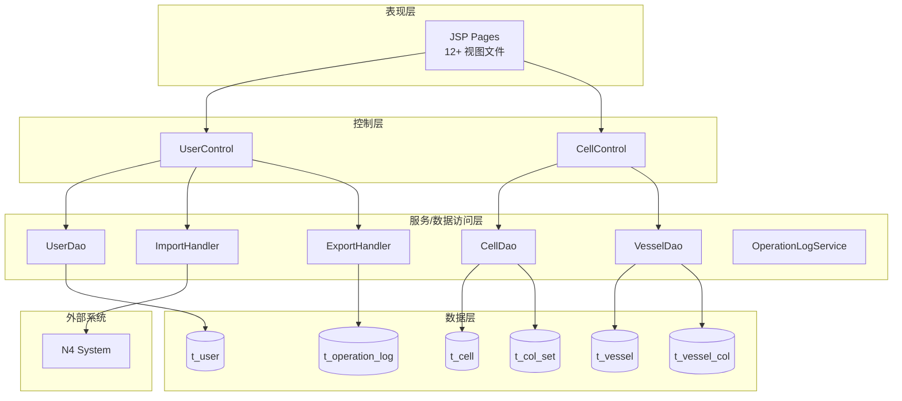
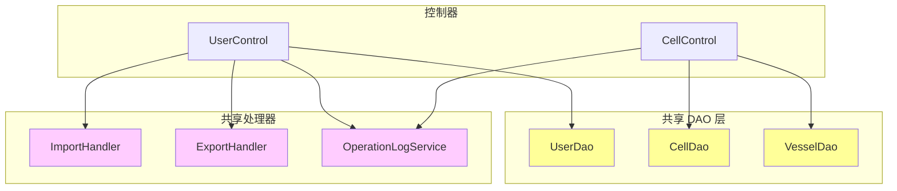

# Vessel Management Terminal System - Technical Overview

[← Back to Repository Root](../README.md)

## 1. 技术架构概览

### 系统整体架构

本系统采用传统的 Spring MVC 三层架构，服务于港口船舶作业管理场景。系统包含 **10 条端到端业务链**，覆盖用户认证、船舶配置、集装箱颜色管理、操作审计等核心功能。



### 架构特点

- **单体应用**: 所有功能模块部署在同一应用中，通过 Spring MVC 框架协调
- **共享 DAO 模式**: UserDao、CellDao、VesselDao 被多条业务链共享，形成跨链依赖
- **同步处理**: 大部分业务操作采用同步调用链，包括数据库写入和外部系统验证
- **传统 JSP 视图**: 前端使用 JSP 模板引擎渲染页面，无独立前端框架

---

## 2. 服务架构

### 控制器分布

| 控制器 | 负责业务链 | 页面数量 |
|--------|-----------|---------|
| **UserControl** | user-authentication, user-administration, operation-log-audit, data-import-export, vessel-terminal-operations | 4 |
| **CellControl** | color-set-management, container-cell-management, vessel-color-configuration, vessel-configuration, vessel-refuel-configuration, vessel-terminal-operations | 8 |

### 共享服务矩阵

| 共享服务 | 使用方业务链 | 潜在风险 |
|---------|------------|---------|
| **UserDao** | user-authentication, user-administration, operation-log-audit, vessel-terminal-operations | ⚠️ 单点故障影响 4 条链 |
| **CellDao** | color-set-management, container-cell-management, vessel-terminal-operations | ⚠️ 并发写入冲突风险 |
| **VesselDao** | vessel-configuration, vessel-refuel-configuration, vessel-color-configuration, vessel-terminal-operations | ⚠️ 高并发瓶颈 |
| **ImportHandler** | data-import-export, vessel-terminal-operations | ⚠️ N4 系统依赖 |
| **ExportHandler** | operation-log-audit, data-import-export, vessel-terminal-operations | ⚠️ 大数据量同步处理 |
| **OperationLogService** | user-authentication, user-administration, vessel-color-configuration, vessel-refuel-configuration | ⚠️ 日志写入失败无回滚 |

### 服务依赖图



### 模块边界

根据 DDD 领域划分：

| 领域上下文 | 类型 | 核心实体 | 对应业务链 |
|-----------|------|---------|-----------|
| **船舶作业上下文** | 核心域 | Vessel, VesselCol, VesselRefuel, Cell, CellMatrix, ColSet, BaySize | vessel-configuration, vessel-refuel-configuration, vessel-color-configuration, container-cell-management, color-set-management, vessel-terminal-operations |
| **用户身份上下文** | 支撑域 | User, ShowLog | user-authentication, user-administration |
| **操作审计上下文** | 通用域 | OperationLog | operation-log-audit |

---

## 3. 数据架构

### 核心数据实体关系

```erDiagram
  USER ||--o{ OPERATION_LOG : "generates"
  VESSEL ||--o{ CELL : "contains"
  VESSEL ||--o{ VESSEL_COL : "has color config"
  VESSEL ||--o{ VESSEL_REFUEL : "has refuel status"
  COL_SET ||--o{ VESSEL_COL : "provides default mapping"
  BAY_CONFIG ||--o{ CELL_MATRIX : "defines"
  CELL_MATRIX ||--o{ OPERATION_LOG : "triggers on change"
```

### 数据库表清单

| 表名 | 所属模块 | 主要用途 | 关联业务链 |
|------|---------|---------|-----------|
| **t_user** | user | 用户账户、凭证、角色、QC/HC/C 编号 | user-authentication, user-administration, operation-log-audit |
| **t_vessel** | cell | 船舶主数据、配置参数（deck_hold, bay, row/tier 范围） | vessel-configuration, vessel-refuel-configuration, vessel-color-configuration |
| **t_cell** | cell | 集装箱单元格矩阵、位置跟踪 | container-cell-management, vessel-terminal-operations |
| **t_col_set** | cell | 通用颜色集定义（箱型到颜色的映射） | color-set-management, container-cell-management |
| **t_vessel_col** | cell | 船舶特定颜色覆盖配置 | vessel-color-configuration, vessel-terminal-operations |
| **t_vessel_refuel** | cell | 船舶加油状态配置 | vessel-refuel-configuration, vessel-terminal-operations |
| **t_bay_config** | cell | Bay 尺寸配置 | container-cell-management |
| **t_cell_matrix** | cell | 计算后的单元格矩阵数据 | container-cell-management |
| **t_operation_log** | operation-log | 所有操作的审计日志 | operation-log-audit, user-administration, vessel-color-configuration, vessel-refuel-configuration |

### 数据流模式

#### 船舶配置数据流
```
vesselManage.jsp → CellControl → VesselDao → t_vessel
                                    ↓
                              t_vessel_col (颜色配置)
                                    ↓
                              t_vessel_refuel (加油状态)
```

#### 操作审计数据流
```
任意 CRUD 操作 → CellControl/UserControl → OperationLogService → t_operation_log
```

#### 数据导入流程
```
importPage.jsp → UserControl → ImportHandler → N4 System (验证)
                                              ↓
                                         VesselDao → t_vessel
```

### 共享数据访问风险

⚠️ **[ERR:no-conflict-resolution]** CellDao 和 VesselDao 被多条链共享，存在并发写入冲突风险：
- color-set-management 和 container-cell-management 同时操作 t_col_set
- vessel-configuration、vessel-refuel-configuration、vessel-color-configuration 同时操作 t_vessel 及相关表
- 未实现乐观锁或版本号机制

⚠️ **[ERR:no-rollback]** 分布式操作缺乏协调回滚机制：
- 船舶删除时未检查关联的加油配置或颜色配置，可能产生孤儿记录
- 操作日志写入失败不影响主业务，但导致审计不完整
- N4 验证通过后本地保存失败，无法回滚 N4 侧状态

---

## 4. 集成架构

### 外部系统集成

#### N4 系统集成

**集成点**: ImportHandler 在船舶数据导入过程中调用 N4 系统进行验证

**协议**: HTTP/HTTPS REST API（具体端点和认证方式需代码确认）

**调用模式**: 
- 逐条记录验证（O(n) 外部调用）
- 同步阻塞式调用

**重试策略**:
- 初始重试间隔：5 秒
- 最大重试次数：3 次
- 指数退避机制

**超时配置**: 
- 连接超时：10 秒（TBD：需验证实际配置）
- 读取超时：30 秒（TBD：需验证实际配置）

**错误处理**:
- 验证失败：返回详细错误列表给用户
- 连接失败：重试后退避，导入失败并提示清晰错误信息

⚠️ **[ERR:no-circuit-breaker]** N4 系统调用未实现熔断器模式，重复失败可能导致导入队列积压

⚠️ **[ERR:no-fallback]** N4 完全不可用时没有降级机制，导入操作无法继续进行

⚠️ **[PERF:cascade-call]** ImportHandler 对每条船舶记录单独调用 N4 验证，1000 条记录产生 1000 次外部调用，线性扩展问题严重

### 内部服务集成

| 集成方向 | 调用方 | 被调用方 | 集成模式 |
|---------|-------|---------|---------|
| 认证 → 审计 | UserControl.login() | OperationLogService | 同步调用，登录成功后记录日志 |
| 配置 → 审计 | CellControl.saveXXX() | OperationLogService | 同步调用，CRUD 操作后记录日志 |
| 导入 → 验证 | ImportHandler | N4 System | 同步 HTTP 调用 |
| 导出 → 查询 | ExportHandler | UserDao/VesselDao | 同步数据库查询 |

⚠️ **[ERR:no-timeout]** 多处跨服务调用未明确配置超时策略：
- CellControl → CellDao/VesselDao
- UserControl → UserDao
- ImportHandler → N4 System

⚠️ **[ERR:cascade-failure]** 共享服务故障会级联影响多条业务链：
- UserDao 故障影响 user-authentication、user-administration、operation-log-audit
- CellDao 故障影响 color-set-management、container-cell-management
- VesselDao 故障影响 vessel-configuration、vessel-refuel-configuration、vessel-color-configuration

---

## 5. 安全架构

### OWASP 风险汇总

#### A01:2021 - 失效的访问控制

| 风险点 | 位置 | 影响 |
|--------|------|------|
| 缺少权限检查 | CellControl 所有 API 端点 | 未授权用户可能操作颜色集合、船舶配置 |
| 缺少权限检查 | UserControl 用户管理端点 | 非管理员可能执行用户增删改操作 |
| 缺少权限检查 | /user/exportLogs | 普通用户可能导出敏感操作日志 |
| 缺少速率限制 | POST /user/login, /user/loginAdmin | 易受暴力破解攻击 |
| GET 方法执行删除 | GET /user/delVessel, /user/delColSet | 不符合 RESTful 规范，可能被 CSRF 利用 |
| 会话固定保护缺失 | login() 会话创建逻辑 | 登录后未重新生成会话 ID |
| 并发登录无冲突解决 | 同一用户多会话同时活跃 | 可能导致权限混淆 |

**建议措施**:
- 在所有控制器方法添加 `@PreAuthorize` 或自定义拦截器进行角色验证
- 为登录接口添加账户锁定机制（如 5 次失败后锁定 15 分钟）
- 将删除操作改为 POST/DELETE 方法并添加 CSRF Token 验证
- 登录成功后强制重新生成会话 ID

#### A02:2021 - 加密失败

| 风险点 | 位置 | 影响 |
|--------|------|------|
| 密码存储格式不明 | t_user 表 password 字段 | 若明文存储则为严重漏洞 |
| 密码传输未强制 TLS | 登录表单提交 | 凭证可能在传输中被截获 |
| N4 通信加密未确认 | ImportHandler → N4 System | 船舶数据可能在传输中暴露 |
| 颜色值字段无格式约束 | POST /user/saveColSet color 字段 | 可能存储恶意脚本导致 XSS |
| 操作日志敏感数据未脱敏 | old_values/new_values 字段 | 可能泄露业务敏感信息 |
| N4 API 凭证存储方式未验证 | ImportHandler 配置 | 应使用加密密钥管理服务 |

**建议措施**:
- 立即验证 password 字段是否使用 bcrypt/argon2 等强哈希算法
- 强制全站 HTTPS，配置 HSTS 头
- 对 color 字段添加正则表达式验证（如 `^#[0-9A-Fa-f]{6}$`）
- 对操作日志中的敏感字段按角色进行脱敏显示
- 使用环境变量或密钥管理服务存储 N4 API 凭证

### 输入验证与防护

- **SQL 注入**: 依赖 DAO 层实现（需确认使用预编译语句而非字符串拼接）
- **XSS 防护**: JSP 页面应对输出数据进行转义（需验证 `<c:out>` 或等效机制）
- **文件上传验证**: ImportHandler 应验证文件魔数而非仅检查扩展名

---

## 6. 性能架构

### 性能风险汇总

#### PERF:bottleneck - 共享服务瓶颈

| 共享服务 | 影响链数量 | 风险描述 |
|---------|-----------|---------|
| **UserDao** | 4 条链 | 高并发下数据库连接池耗尽，影响认证、用户管理、审计 |
| **CellDao** | 3 条链 | 颜色集合和单元格矩阵查询竞争，可能成为 I/O 瓶颈 |
| **VesselDao** | 4 条链 | 船舶配置相关操作集中，高并发时响应延迟增加 |

**优化建议**:
- 监控各 DAO 的连接池使用情况，调整最大连接数
- 考虑读写分离，将查询操作路由到只读副本
- 为高频查询添加应用层缓存（如 Caffeine/Ehcache）

#### PERF:no-cache - 缺少缓存机制

| 场景 | 当前行为 | 建议 |
|------|---------|------|
| GET /user/allColSet | 每次请求直接查询数据库 | 添加 5 分钟 TTL 缓存 |
| GET /user/allVessel | 每次请求直接查询数据库 | 添加短期缓存，船舶配置变更时失效 |
| GET /user/allVesselCol | 每次请求直接查询数据库 | 按 vesselId 缓存 |
| UserDao 用户查询 | 每次登录都查询数据库 | 缓存用户基本信息，密码变更时失效 |
| Bay 配置读取 | 每次请求查询数据库 | 添加读穿透缓存 |

#### PERF:cascade-call - 同步级联调用

| 调用链 | 问题描述 | 影响 |
|--------|---------|------|
| login() → UserDao → OperationLogService | 登录流程涉及两次数据库操作 | 增加登录响应时间 |
| updateBay() → CellDao.recalculateCellMatrix() | Bay 尺寸更新触发复杂矩阵重算 | 同步阻塞请求线程 |
| saveVesselCol() → VesselDao + OperationLogService | 保存操作同步写入主数据和日志 | 增加写操作延迟 |
| ImportHandler → N4 System (×n) | 每条记录单独验证 | O(n) 外部调用，大规模导入极慢 |

**优化建议**:
- 将 OperationLogService 调用改为异步（使用 @Async 或消息队列）
- 对于大型船舶的矩阵重算，考虑后台任务处理
- 实现批量 N4 验证 API，减少网络往返次数
- 大文件导入改为异步任务，前端轮询结果

#### PERF:no-circuit-breaker - 缺少熔断机制

| 依赖服务 | 风险 | 建议 |
|---------|------|------|
| N4 System | 不可用时导入操作完全阻塞 | 实现熔断器，快速失败并提供友好提示 |
| UserDao/CellDao/VesselDao | 数据库响应缓慢时请求堆积 | 配置查询超时，实现断路器模式 |

#### PERF:no-locking - 并发控制缺失

- CellDao 共享访问无显式锁机制，并发更新单元格矩阵可能导致数据不一致
- 船舶配置修改无乐观锁，后提交者覆盖先提交者

**建议**: 在关键表添加 version 字段实现乐观锁，或使用数据库行锁

### 数据库优化建议

1. **索引优化**:
   - t_col_set.boxcase: 唯一索引（加速唯一性校验）
   - t_vessel.(vesselid, deck_hold, bay): 联合唯一索引
   - t_vessel_col.(vesselid, bay, rowStart, rowEnd): 组合索引
   - t_operation_log.userid, timestamp: 复合索引（加速日志查询）

2. **分页支持**:
   - GET /user/allColSet、GET /user/allVessel 等列表接口添加分页参数
   - 避免一次性加载大量数据

3. **查询优化**:
   - 搜索接口避免全表 LIKE 模糊匹配，考虑全文索引或 Elasticsearch

---

## 7. 技术栈与基础设施

### 技术栈

| 层级 | 技术选型 | 说明 |
|------|---------|------|
| **Web 框架** | Spring MVC | 传统 MVC 架构，基于 Servlet |
| **视图层** | JSP | 服务端渲染，无独立前端框架 |
| **数据访问** | JDBC / MyBatis (推测) | 需代码确认具体 ORM 框架 |
| **数据库** | 关系型数据库 (MySQL/Oracle 推测) | 需配置确认具体类型 |
| **文件处理** | Apache POI (推测) | Excel 文件解析 |
| **XML 处理** | JAXB/DOM (推测) | BusiQuery 接口 XML 序列化 |
| **国际化** | Spring i18n | 支持语言切换 (/user/changeLan) |

### 基础设施假设

- **应用服务器**: Tomcat/Jetty (Spring Boot 内嵌或外部部署)
- **数据库连接池**: HikariCP/DBCP (需配置确认)
- **会话管理**: HTTP Session (基于 Cookie)
- **日志框架**: Log4j/SLF4J (需代码确认)

### 待确认事项 (TBD)

1. **VesselDao 实现细节**: 具体类路径、事务管理配置、并发控制机制
2. **数据库确切类型**: MySQL、Oracle 或其他
3. **ORM 框架**: MyBatis、Hibernate 或纯 JDBC
4. **密码加密算法**: 需验证 t_user.password 字段的存储格式
5. **N4 系统接口规范**: 具体 API 端点、认证方式、请求/响应 schema
6. **文件上传大小限制**: ImportHandler 的最大文件大小配置
7. **操作日志保留策略**: t_operation_log 的数据清理机制
8. **监控与告警**: 现有监控体系及关键指标

---

## 附录：业务链索引

| 业务链 | 类型 | 页面数 | 控制器 | 详细文档 |
|--------|------|-------|--------|---------|
| [Color Set Management](../journeys/color-set-management.md) | full-stack | 3 | CellControl | [Spec](../journeys/color-set-management.md) |
| [Container Cell Management](../journeys/container-cell-management.md) | full-stack | 2 | CellControl | [Spec](../journeys/container-cell-management.md) |
| [Vessel Data Import/Export](../journeys/data-import-export.md) | full-stack | 2 | UserControl | [Spec](../journeys/data-import-export.md) |
| [Operation Log Audit](../journeys/operation-log-audit.md) | full-stack | 2 | UserControl | [Spec](../journeys/operation-log-audit.md) |
| [User Administration](../journeys/user-administration.md) | full-stack | 4 | UserControl | [Spec](../journeys/user-administration.md) |
| [User Authentication](../journeys/user-authentication.md) | full-stack | 4 | UserControl | [Spec](../journeys/user-authentication.md) |
| [Vessel Color Configuration](../journeys/vessel-color-configuration.md) | full-stack | 2 | CellControl | [Spec](../journeys/vessel-color-configuration.md) |
| [Vessel Configuration](../journeys/vessel-configuration.md) | full-stack | 3 | CellControl | [Spec](../journeys/vessel-configuration.md) |
| [Vessel Refuel Configuration](../journeys/vessel-refuel-configuration.md) | full-stack | 2 | CellControl | [Spec](../journeys/vessel-refuel-configuration.md) |
| [Vessel Terminal Operations](../journeys/vessel-terminal-operations.md) | full-stack | 12 | UserControl, CellControl | [Spec](../journeys/vessel-terminal-operations.md) |

---

*最后更新: 2026-08-04*