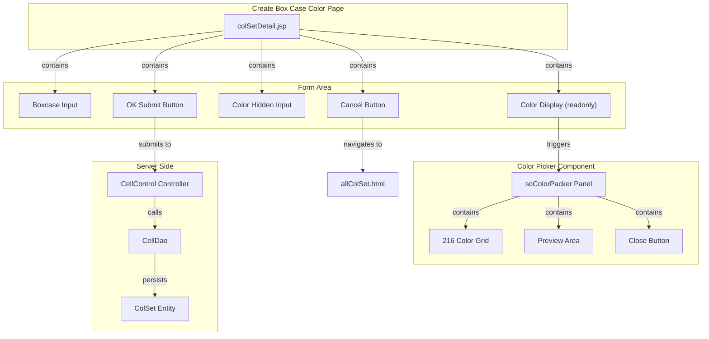
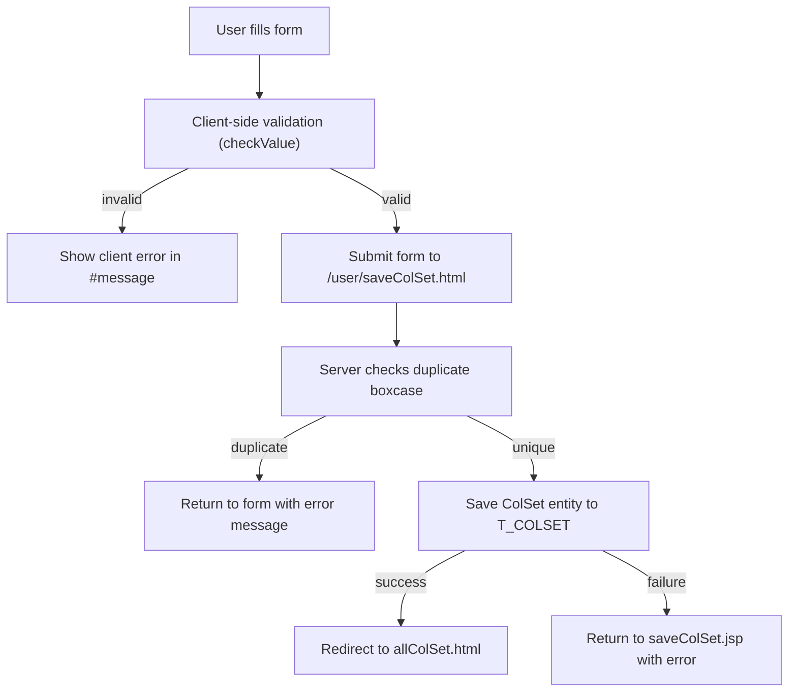

# Create Box Case Color - Technical Specification

## 1. Architecture & Component Tree

This is a legacy JSP page using Spring MVC with jQuery for client-side interactions. The page follows a simple form-submission pattern without modern component architecture.



> 📎 Source: src/main/webapp/WEB-INF/jsp/colSetDetail.jsp; src/main/java/com/springMVC/control/CellControl.java

## 2. State Management

This is a server-rendered JSP page with minimal client-side state management:

### Local State (Client-side)
- **Form fields**: Managed by HTML form elements (`boxcase`, `color` inputs)
- **Error messages**: Controlled via DOM manipulation (`display: none/block`)
  - `#ess`: Server-side error message container
  - `#message`: Client-side validation error container
  - `#show`: Error text content element

### Server-side State
- **Model attribute**: `colSet` (ColSet entity) bound to the form via Spring's `<form:form>`
- **Result message**: `result` attribute passed from controller for error display

### Computed Properties
- None (legacy JSP, no reactive framework)

### Watchers
- None (no reactive framework)

> 📎 Source: src/main/webapp/WEB-INF/jsp/colSetDetail.jsp → checkValue(), show(); src/main/java/com/springMVC/control/CellControl.java → saveColSet()

## 3. API Integration

### POST /user/saveColSet.html

**Request Method**: POST (form submission)

**Request Parameters** (form-encoded):
| Parameter | Type | Required | Description |
|-----------|------|----------|-------------|
| boxcase | String | Yes | Box case name (max 20 chars) |
| color | String | Yes | Hex color value (max 12 chars, e.g., `#FFCC00`) |

**Response Behavior**:
- **Success**: Redirect to `/user/allColSet.html` (302 redirect)
- **Duplicate boxcase**: Return to `colSetDetail.jsp` with `result="A boxcase with the same name already exists!"`
- **Save failure**: Return to `saveColSet.jsp` (note: this references a non-existent view) with `result="The operation failed"`

**Server-side Logic**:
```java
@RequestMapping(value = "/saveColSet", method = RequestMethod.POST)
public ModelAndView saveColSet(HttpServletRequest request, ModelMap model) {
    String boxcase = request.getParameter("boxcase");
    String color = request.getParameter("color");

    if (cellDao.getColSetByBoxcase(boxcase) != null) {
        model.addAttribute("result", "A boxcase with the same name already exists!");
        return new ModelAndView("colSetDetail", model);
    }

    ColSet colSet = new ColSet();
    colSet.setBoxcase(boxcase);
    colSet.setColor(color);
    boolean success = cellDao.saveOrUpdateColSet(colSet);
    if (success) {
        return new ModelAndView("redirect:/user/allColSet.html");
    } else {
        model.addAttribute("result", "The operation failed");
        return new ModelAndView("saveColSet", model);
    }
}
```

> 📎 Source: src/main/java/com/springMVC/control/CellControl.java → saveColSet()

### Database Schema (T_COLSET)

| Column | Type | Constraints | Description |
|--------|------|-------------|-------------|
| colsetid | Integer | Primary Key, Sequence (colset_seq) | Auto-generated ID |
| BOXCASE | VARCHAR(10) | Not Null | Box case name |
| COLOR | VARCHAR(15) | Not Null | Hex color value |

> 📎 Source: src/main/java/com/springMVC/entity/ColSet.java

## 4. Data Flow & Transformation

### Form Submission Flow



### Color Selection Flow

1. User clicks on readonly input `#colors`
2. `soColorPacker` plugin creates a color picker panel appended to `<body>`
3. User hovers over color cells → preview area updates background and hex value
4. User clicks a color cell:
   - Callback receives `{color: "#XXXXXX"}`
   - `process()` function sets hidden input `#color` value
   - Color picker panel is removed from DOM
5. On form submit, the hidden `color` input value is sent to server

> 📎 Source: src/main/webapp/WEB-INF/jsp/colSetDetail.jsp → process(); src/main/webapp/js/jquery.soColorPicker-1.0.js → callback

### Data Transformation

| Source | Transformation | Target |
|--------|---------------|--------|
| Color picker selection | Hex string (e.g., `#FFCC00`) | Hidden input `#color` value |
| Form submission | Raw string parameters | ColSet entity properties |
| ColSet entity | JPA persistence | T_COLSET table row |

## 5. Interaction Logic

### Color Picker Interaction Pattern

**Plugin**: `jquery.soColorPacker-1.0.js`

**Configuration**:
```javascript
jQuery('#colors').soColorPacker({
    size: 2,              // Medium size (162px width)
    textChange: false,    // Do not write color value to trigger element
    colorChange: 2,       // Change background color of trigger element
    callback: function(c) {
        process(c.color); // Write to hidden input
    }
});
```

**Behavior**:
- Clicking `#colors` toggles the picker panel visibility
- Panel is positioned absolutely below the trigger element
- IE6 compatibility via `bgiframe` plugin
- Clicking outside or selecting a color closes the panel
- Panel contains 216 colors (6×6×6 RGB combinations)

> 📎 Source: src/main/webapp/WEB-INF/jsp/colSetDetail.jsp → soColorPacker init; src/main/webapp/js/jquery.soColorPicker-1.0.js

### Form Validation Rules

**Client-side validation** (`checkValue()`):
```javascript
function checkValue(){
    // Hide previous errors
    document.getElementById("ess").style.display="none";
    document.getElementById("message").style.display="none";

    var boxcase = document.getElementById("boxcase").value;
    var color = document.getElementById("color").value;

    if(boxcase==""){
        document.getElementById("show").innerHTML = "The boxcase cannot be empty!";
        document.getElementById("message").style.display='';
        return false;
    } else {
        if(boxcase.length>20){
            document.getElementById("show").innerHTML = "The boxcase is too long!";
            document.getElementById("message").style.display='';
            return false;
        }
    }

    if(color ==""){
        document.getElementById("show").innerHTML = "The color cannot be empty!";
        document.getElementById("message").style.display='';
        return false;
    } else {
        if(color.length>12){
            document.getElementById("show").innerHTML = "The color is too long!";
            document.getElementById("message").style.display='';
            return false;
        }
    }

    return true;
}
```

**Validation rules summary**:
- `boxcase`: required, max length 20
- `color`: required, max length 12

> 📎 Source: src/main/webapp/WEB-INF/jsp/colSetDetail.jsp → checkValue()

### Conditional Rendering

| Element | Condition | Behavior |
|---------|-----------|----------|
| `#ess` (server error) | `${!empty result}` | Show red error text from server |
| `#message` (client error) | Validation fails | Show red error text, hide `#ess` |
| Error messages | Input focus (`onfocus="show()"`) | Hide both error containers |

> 📎 Source: src/main/webapp/WEB-INF/jsp/colSetDetail.jsp → c:if test="${!empty result }"; show()

## 6. Error Handling

### Client-side Errors

| Error Type | Trigger | Display Location | Message |
|------------|---------|------------------|---------|
| Empty boxcase | Submit with empty boxcase | `#message` / `#show` | "The boxcase cannot be empty!" |
| Boxcase too long | Submit with boxcase > 20 chars | `#message` / `#show` | "The boxcase is too long!" |
| Empty color | Submit without selecting color | `#message` / `#show` | "The color cannot be empty!" |
| Color too long | Submit with color > 12 chars | `#message` / `#show` | "The color is too long!" |

### Server-side Errors

| Error Type | Trigger | Display Location | Message |
|------------|---------|------------------|---------|
| Duplicate boxcase | Boxcase already exists in DB | `#ess` | "A boxcase with the same name already exists!" |
| Save failure | DAO save operation returns false | N/A (wrong view name) | "The operation failed" |

⚠️ [ERR:view-name] The error handling for save failure references a non-existent view `saveColSet.jsp`. The correct view should be `colSetDetail.jsp` to allow users to retry. This will cause a 404 error when save fails.
> 📎 Source: src/main/java/com/springMVC/control/CellControl.java → saveColSet() line 163

⚠️ [ERR:no-loading] Form submission has no loading state indicator. Users may click submit multiple times during slow network conditions, potentially causing duplicate submissions.
> 📎 Source: src/main/webapp/WEB-INF/jsp/colSetDetail.jsp → form onsubmit

⚠️ [ERR:no-csrf] Form submission does not include CSRF token protection. The POST endpoint `/user/saveColSet.html` is vulnerable to Cross-Site Request Forgery attacks.
> 📎 Source: src/main/webapp/WEB-INF/jsp/colSetDetail.jsp → form:form action="${actionUrl}"

## 7. Security

### Authentication

- Page access requires user session (Spring Security or custom filter)
- Logout functionality available via top-right icon

### Authorization

- No explicit role-based access control visible in the code
- Access control likely handled at URL level by Spring Security configuration (not in scope)

### Input Validation

| Field | Client-side | Server-side | Notes |
|-------|-------------|-------------|-------|
| boxcase | Max 20 chars | Not validated | ⚠️ Server does not validate length |
| color | Max 12 chars | Not validated | ⚠️ Server does not validate length |
| boxcase uniqueness | N/A | Checked via DAO | ✅ Server checks for duplicates |

⚠️ [OWASP:A03] Server-side does not validate input length for `boxcase` and `color` parameters. Only client-side JavaScript validation exists, which can be bypassed. The database column constraints (VARCHAR(10) for BOXCASE, VARCHAR(15) for COLOR) provide some protection but may cause SQL errors instead of graceful error messages.
> 📎 Source: src/main/java/com/springMVC/control/CellControl.java → saveColSet() lines 147-148

⚠️ [OWASP:A01] No CSRF token included in the form. Spring Security's CSRF protection may be disabled or not configured for this endpoint.
> 📎 Source: src/main/webapp/WEB-INF/jsp/colSetDetail.jsp → form:form (no csrf input visible)

⚠️ [OWASP:A02] Error messages expose internal system details (e.g., "The operation failed" without specific reason). While not directly exposing sensitive data, generic error messages make debugging difficult for legitimate users.
> 📎 Source: src/main/java/com/springMVC/control/CellControl.java → saveColSet() line 162

### Data Sanitization

- Color values are stored as-is from the color picker (hex format like `#FFCC00`)
- No XSS sanitization visible for stored color values
- When displayed in `colorManage.jsp`, color is used in inline style (`background-color:${col.color}`), which could be vulnerable to CSS injection if malicious values are stored

⚠️ [OWASP:A03] Color value is rendered directly into inline CSS style without sanitization in `colorManage.jsp`. A malicious user could inject CSS expressions or other harmful styles if they can control the color value through other means.
> 📎 Source: src/main/webapp/WEB-INF/jsp/colorManage.jsp → line 72: `style="background-color:${col.color};"`

## 8. Performance

### Rendering Optimization

- Static page with minimal dynamic content
- No lazy loading (single form page)
- jQuery library loaded synchronously in `<head>`

⚠️ [PERF:sync-js] jQuery and color picker plugins are loaded synchronously in the `<head>` section, blocking page rendering. Consider moving script tags to the end of `<body>` or using async/defer attributes.
> 📎 Source: src/main/webapp/WEB-INF/jsp/colSetDetail.jsp → lines 11-13

### Bundle Size

- jQuery 1.11.1 (~94KB minified)
- soColorPicker plugin (~4KB)
- bgiframe plugin (~2KB)
- Total JS payload: ~100KB uncompressed

### Network Requests

- Single form submission on save
- No AJAX calls
- No polling or WebSocket connections

### Browser Compatibility

- Uses IE-specific CSS expression: `height: expression((documentElement.clientHeight > 200) ? "200px" : "100%")!important;`
- Includes `bgiframe` plugin for IE6 compatibility
- Meta tag: `X-UA-Compatible: IE=edge`

⚠️ [PERF:legacy-css] CSS expression (`expression()`) is an IE-only feature that causes performance issues and is not supported in modern browsers. This indicates the page was designed for legacy IE browsers and may have rendering inconsistencies in modern browsers.
> 📎 Source: src/main/webapp/WEB-INF/jsp/colSetDetail.jsp → line 20
