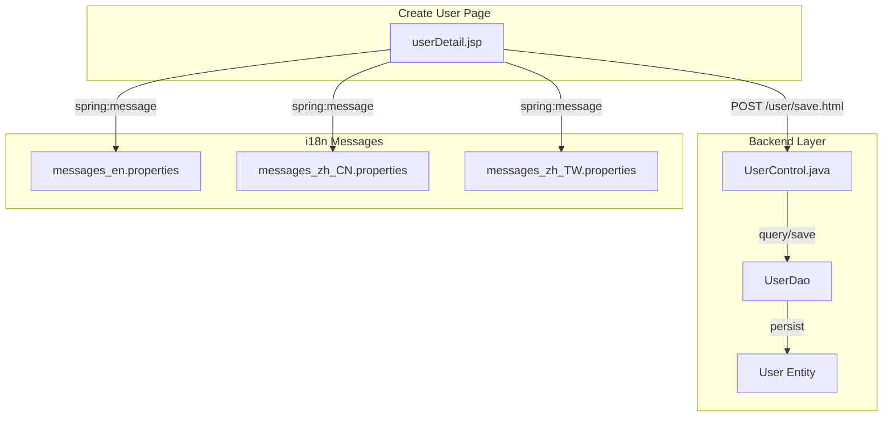
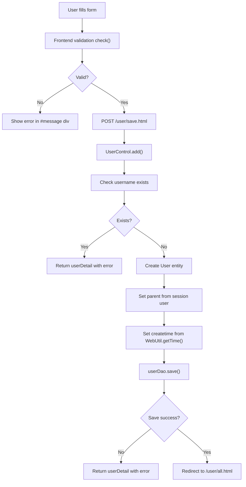

# Create User Page - Technical Specification

## 1. Architecture & Component Tree

This is a legacy JSP-based page using Spring MVC framework with server-side rendering.



**Component Structure**:
- **View Layer**: `src/main/webapp/WEB-INF/jsp/userDetail.jsp` - JSP template with embedded JavaScript validation
- **Controller Layer**: `src/main/java/com/springMVC/control/UserControl.java` - Spring MVC controller handling GET (render form) and POST (save user)
- **DAO Layer**: `UserDao` - Database access for user operations
- **Entity Layer**: `src/main/java/com/springMVC/entity/User.java` - JPA entity mapping to T_USER table
- **i18n Layer**: Properties files for multi-language support (EN, ZH-CN, ZH-TW)

> 📎 Source: src/main/webapp/WEB-INF/jsp/userDetail.jsp; src/main/java/com/springMVC/control/UserControl.java

## 2. State Management

### Server-Side State

| State | Type | Storage | Description |
|-------|------|---------|-------------|
| `user` (ModelAttribute) | Form backing object | Request scope | Binds form fields to User entity |
| `result` | String | ModelMap | Error message from backend validation |
| `Constants.USER_LOGIN` | User object | HTTP Session | Current logged-in user (used to set parent field) |
| Locale | Locale object | Session | Language preference for i18n messages |

> 📎 Source: src/main/java/com/springMVC/control/UserControl.java → addUser(), add()

### Client-Side State

| State | Type | Location | Description |
|-------|------|----------|-------------|
| Form field values | DOM input elements | HTML form | username, qcid, password, cpassword, role |
| Error display state | CSS display property | #message, #ess divs | Hidden/shown based on validation status |

> 📎 Source: src/main/webapp/WEB-INF/jsp/userDetail.jsp → check(), show() functions

### No Global Store

This is a traditional server-rendered application without client-side state management libraries. All state is managed through:
- HTTP session (server-side)
- Form submission and model attributes (request-response cycle)
- DOM manipulation via vanilla JavaScript

## 3. API Integration

### POST /user/save.html

**Endpoint**: `/user/save` (mapped via `@RequestMapping(value = "/save", method = RequestMethod.POST)`)

**Request Parameters** (form-encoded):

| Parameter | Type | Required | Description |
|-----------|------|----------|-------------|
| username | String | Yes | User's login name (max 10 chars) |
| qcid | String | No | QC identifier (max 6 chars) |
| role | String | Yes | "USER" or "ADMIN" |
| password | String | Yes | User's password (max 6 chars) |
| cpassword | String | Yes | Password confirmation (max 6 chars) |

> 📎 Source: src/main/java/com/springMVC/control/UserControl.java → add() method parameters

**Response Behavior**:

| Scenario | HTTP Status | Response |
|----------|-------------|----------|
| Success | 302 Redirect | Redirect to `/user/all.html` |
| Username exists | 200 OK | Render userDetail.jsp with `result` attribute containing error message |
| Database save failure | 200 OK | Render userDetail.jsp with `result` attribute containing error message |

**Server-Side Processing Logic**:

```java
// Pseudocode representation of add() method
1. Extract parameters: username, role, password, qcid
2. Check if username already exists via userDao.getUserByName(username)
3. If exists: return view with error "The username already exists!"
4. Get current logged-in user from session (Constants.USER_LOGIN)
5. Generate createtime using WebUtil.getTime()
6. Create new User entity with:
   - username, qcid, role, password from request
   - createtime from step 5
   - parent from current user's username
7. Call userDao.save(user)
8. If save succeeds: redirect to /user/all.html
9. If save fails: return view with error "Sorry,it can't add user!"
```

> 📎 Source: src/main/java/com/springMVC/control/UserControl.java → add() lines 329-366

**Error Handling**:

| Error Condition | Error Message Key | Display Location |
|-----------------|-------------------|------------------|
| Username already exists | error_username_exists | ${result} in JSP |
| Database save failure | error_can_not_add_user | ${result} in JSP |

> 📎 Source: src/main/resources/messages_en.properties; src/main/java/com/springMVC/control/UserControl.java

⚠️ [ERR:no-loading] Form submission has no loading indicator - user may click submit multiple times during slow database operations
> 📎 Source: src/main/webapp/WEB-INF/jsp/userDetail.jsp → form onsubmit handler

⚠️ [ERR:no-csrf] Form submission lacks CSRF token protection - vulnerable to cross-site request forgery attacks
> 📎 Source: src/main/webapp/WEB-INF/jsp/userDetail.jsp → form:form tag without CSRF token

## 4. Data Flow & Transformation

### Data Flow Diagram



### Data Transformation Rules

| Field | Source | Transformation | Target |
|-------|--------|----------------|--------|
| username | Form input | Trimmed by browser, validated length ≤10 | User.username (VARCHAR 20) |
| qcid | Form input | Validated length ≤6 | User.qcid (VARCHAR 20) |
| role | Radio button | Direct string "USER" or "ADMIN" | User.role (VARCHAR 10) |
| password | Password input | Validated length ≤6, stored as plain text | User.password (VARCHAR 6) |
| parent | Session user | Retrieved from Constants.USER_LOGIN.getUsername() | User.parent (VARCHAR 10) |
| createtime | Server time | Generated by WebUtil.getTime() - format unclear | User.createtime (VARCHAR 14) |

> 📎 Source: src/main/java/com/springMVC/control/UserControl.java → add(); src/main/java/com/springMVC/entity/User.java

⚠️ [OWASP:A02] Password stored in plain text in database - no hashing or encryption applied
> 📎 Source: src/main/java/com/springMVC/entity/User.java → password field; src/main/java/com/springMVC/control/UserControl.java → user.setPassword(password)

⚠️ [OWASP:A02] Password transmitted in plain text over HTTP - no TLS enforcement visible
> 📎 Source: src/main/webapp/WEB-INF/jsp/userDetail.jsp → form action

## 5. Interaction Logic

### Form Validation (Client-Side)

The `check()` function performs sequential validation:

```javascript
function check(){
    // Hide previous errors
    document.getElementById("ess").style.display="none";
    
    // Validate username
    var name = document.getElementById("username").value;
    if(name ==""){
        showError("error_username_empty");
        return false;
    } else if(name.length>10){
        showError("error_username_too_long");
        return false;
    }
    
    // Validate password
    var password = document.getElementById("password").value;
    if(password ==""){
        showError("error_password_empty");
        return false;
    } else if(password.length>6){
        showError("error_password_too_long");
        return false;
    }
    
    // Validate confirm password
    var cpassword = document.getElementById("cpassword").value;
    if(cpassword ==""){
        showError("error_confirm_password_empty");
        return false;
    } else if(cpassword.length>6){
        showError("error_confirm_password_too_long");
        return false;
    }
    
    // Check password match
    if(password != cpassword){
        showError("error_password__not_match");
        return false;
    }
    
    // Validate qcid length (note: missing empty check)
    if(qcid.length>6){  // ⚠️ Bug: qcid not defined in this scope
        showError("error_qcname_too_long");
        return false;
    }
    
    return true;
}
```

> 📎 Source: src/main/webapp/WEB-INF/jsp/userDetail.jsp → check() function lines 55-104

⚠️ [ERR:bug] Variable `qcid` is referenced but not declared in check() function scope - should be `document.getElementById("qcid").value`
> 📎 Source: src/main/webapp/WEB-INF/jsp/userDetail.jsp → line 98

### Conditional Rendering

| Condition | Element | Behavior |
|-----------|---------|----------|
| `${!empty result}` | `<tr id="ess">` | Shows backend error message in red |
| Frontend validation fail | `<tr id="message">` | Shows frontend error, initially hidden (display:none) |
| Input focus event | #ess, #message | Both error areas hidden via show() function |

> 📎 Source: src/main/webapp/WEB-INF/jsp/userDetail.jsp → c:if test; show() function

### Navigation Logic

| Trigger | Action | Target |
|---------|--------|--------|
| Click CANCEL button | `back()` function | `window.location.href="all.html"` |
| Click LOGOUT image | `sh()` function with confirm dialog | `logout.html` after confirmation |
| Form submit success | Server-side redirect | `/user/all.html` |

> 📎 Source: src/main/webapp/WEB-INF/jsp/userDetail.jsp → back(), sh() functions

## 6. Error Handling

### Frontend Validation Errors

Handled by `check()` function returning `false` to prevent form submission. Errors displayed in `#message` div with red styling.

### Backend Business Errors

| Error Scenario | Detection Method | User Feedback |
|----------------|------------------|---------------|
| Username already exists | `userDao.getUserByName()` returns non-null | `${result}` displays "The username already exists!" |
| Database save failure | Exception caught in try-catch block | `${result}` displays "Sorry,it can't add user!" |

> 📎 Source: src/main/java/com/springMVC/control/UserControl.java → add() method

### Missing Error Handling

⚠️ [ERR:no-validation] No server-side validation for password length - relies solely on client-side JavaScript which can be bypassed
> 📎 Source: src/main/java/com/springMVC/control/UserControl.java → add() method does not validate password length

⚠️ [ERR:no-sanitization] No input sanitization for username/qcid - potential XSS if values are reflected elsewhere
> 📎 Source: src/main/java/com/springMVC/control/UserControl.java → add() method uses raw request parameters

⚠️ [ERR:no-concurrency] No duplicate submission prevention - rapid clicks may create multiple requests
> 📎 Source: src/main/webapp/WEB-INF/jsp/userDetail.jsp → no disabled state on submit button during processing

## 7. Security

### Authentication & Authorization

| Aspect | Implementation | Status |
|--------|----------------|--------|
| Session management | HTTP session with Constants.USER_LOGIN attribute | ✅ Implemented |
| Role-based access | Admin-only links in admin.jsp via limitAccountStr check | ⚠️ Weak - URL-level protection unclear |
| Parent tracking | New user's parent set from session user | ✅ Implemented |

> 📎 Source: src/main/java/com/springMVC/control/UserControl.java → add() line 342; src/main/java/com/springMVC/control/UserControl.java → all() lines 379-385

⚠️ [OWASP:A01] No explicit authorization check in /user/add endpoint - relies on admin.jsp link hiding rather than server-side role verification
> 📎 Source: src/main/java/com/springMVC/control/UserControl.java → addUser() method has no role check

⚠️ [OWASP:A02] Passwords stored as plain text in T_USER table (VARCHAR 6) - no hashing algorithm applied
> 📎 Source: src/main/java/com/springMVC/entity/User.java → @Column(name = "PASSWORD", length = 6)

⚠️ [OWASP:A02] Password field limited to 6 characters - extremely weak password policy
> 📎 Source: src/main/webapp/WEB-INF/jsp/userDetail.jsp → password validation length>6; src/main/java/com/springMVC/entity/User.java → PASSWORD column length 6

⚠️ [OWASP:A01] No CSRF token in form submission - form:form tag does not include CSRF protection
> 📎 Source: src/main/webapp/WEB-INF/jsp/userDetail.jsp → form:form without CSRF token

### Data Exposure

| Risk | Details |
|------|---------|
| Password in logs | Password parameter logged in debug statement: `LOG.debug("execute add USER : " + username + "," + role)` - role logged but not password directly |
| Sensitive data in URL | No sensitive data in URL parameters for this page |

> 📎 Source: src/main/java/com/springMVC/control/UserControl.java → line 353

## 8. Performance

### Rendering Performance

| Aspect | Assessment |
|--------|------------|
| Page complexity | Low - simple form with 5 input fields |
| JavaScript overhead | Minimal - vanilla JS validation only |
| CSS complexity | Low - inline styles and simple ID selectors |

### Network Performance

| Aspect | Assessment |
|--------|------------|
| API calls | Single POST request per submission |
| Payload size | Small - form-encoded parameters only |
| Response handling | Server-side redirect (302) on success |

### Optimization Opportunities

⚠️ [PERF:no-debounce] No debounce on form submission - users can trigger multiple submissions rapidly
> 📎 Source: src/main/webapp/WEB-INF/jsp/userDetail.jsp → submit button has no disabled state management

⚠️ [PERF:no-cache] No client-side caching strategy - each page load requires full server render
> 📎 Source: src/main/webapp/WEB-INF/jsp/userDetail.jsp → no cache headers or localStorage usage

### Legacy Technology Concerns

- **JSP technology**: Server-side rendering limits interactivity and requires full page reloads
- **Inline JavaScript**: Validation logic embedded in JSP makes maintenance difficult
- **No AJAX**: Form submission causes full page navigation even on validation errors
- **IE compatibility code**: Uses `height: expression()` CSS hack for IE6-7 compatibility

> 📎 Source: src/main/webapp/WEB-INF/jsp/userDetail.jsp → line 15 CSS expression
