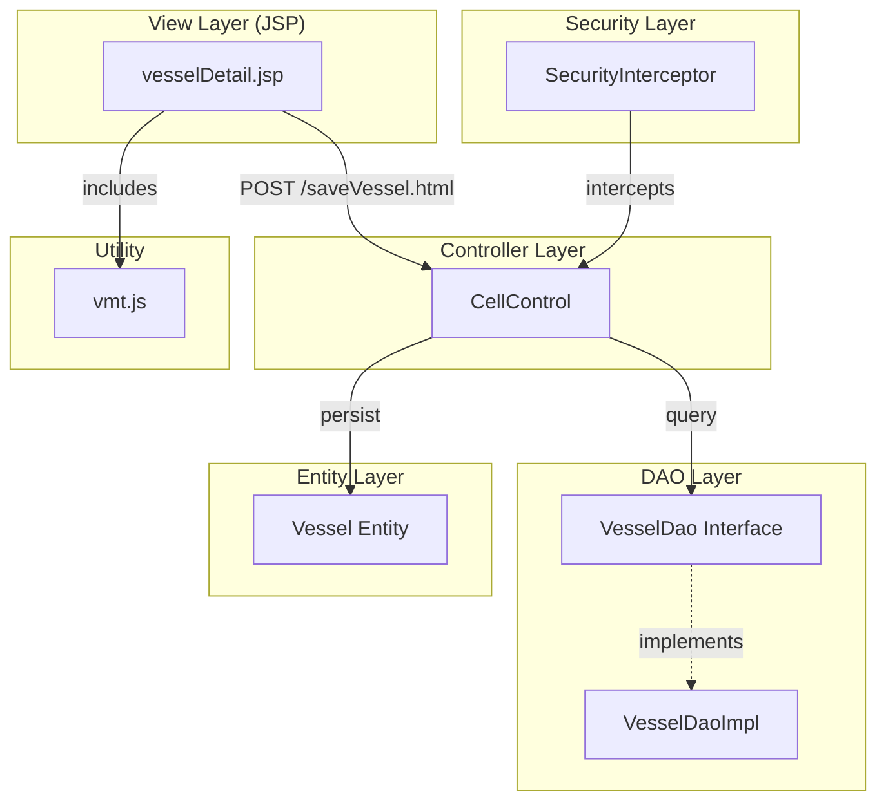
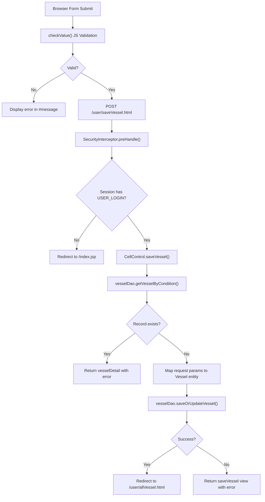

# Create Vessel - Technical Specification

## 1. Architecture & Component Tree

### Technology Stack
- **Framework**: Spring MVC 3.0 (Java)
- **View Layer**: JSP with JSTL and Spring Form tags
- **Persistence**: Hibernate 3 with JPA annotations
- **Database**: Oracle (via C3P0 connection pool)
- **Client-side**: Vanilla JavaScript, jQuery (vmt.js)

### Component Hierarchy



> 📎 Source: src/main/webapp/WEB-INF/jsp/vesselDetail.jsp; src/main/java/com/springMVC/control/CellControl.java; src/main/java/com/springMVC/dao/VesselDao.java; src/main/java/com/springMVC/entity/Vessel.java; src/main/java/com/springMVC/filter/SecurityInterceptor.java

---

## 2. State Management

### Client-Side State

| State Variable | Type | Scope | Purpose |
|----------------|------|-------|---------|
| `is_processing` | boolean | Global (vmt.js) | Prevents concurrent AJAX requests |
| DOM element visibility | display style | Page-level | Controls error message visibility (`#message`, `#ess`) |

**State Flow**:
1. User focuses on input field → `show()` hides all error messages
2. User submits form → `checkValue()` validates and shows/hides `#message`
3. Server returns error → JSP renders `${result}` in `#ess` if non-empty

> 📎 Source: src/main/webapp/js/vmt.js → is_processing; src/main/webapp/WEB-INF/jsp/vesselDetail.jsp → show(), checkValue()

### Server-Side State

| State | Storage | Key | Purpose |
|-------|---------|-----|---------|
| User login status | HttpSession | `Constants.USER_LOGIN` | Authentication check |
| Error message | ModelMap | `result` | Passes validation/save errors to view |
| Vessel object | ModelAttribute | `vessel` | Binds form data to entity |

> 📎 Source: src/main/java/com/springMVC/control/CellControl.java → saveVessel(); src/main/java/com/springMVC/filter/SecurityInterceptor.java → preHandle()

---

## 3. API Integration

### Endpoint: POST /user/saveVessel.html

**Request**:
- **Method**: POST
- **Content-Type**: application/x-www-form-urlencoded
- **Parameters**:

| Parameter | Type | Required | Max Length | Description |
|-----------|------|----------|------------|-------------|
| vesselid | String | Yes | 30 | Vessel identifier |
| deck_hold | String | Yes | 1 | Deck/Hold indicator (A/B) |
| bay | String | Yes | 3 (HTML), 10 (JS) | Bay number (numeric string) |
| rowStart | String | Yes | 2 | Row range start (numeric string) |
| rowEnd | String | Yes | 3 | Row range end (numeric string) |
| tierStart | String | Yes | 2 | Tier range start (numeric string) |
| tierEnd | String | Yes | 2 (HTML), 3 (JS) | Tier range end (numeric string) |

**Response**:
- **Success**: HTTP 302 redirect to `/user/allVessel.html`
- **Duplicate Error**: HTTP 200 with view `vesselDetail`, model attribute `result = "the vesselid,deck_hold,bay already exists!"`
- **Save Failure**: HTTP 200 with view `saveVessel` (note: incorrect view name, should be `vesselDetail`), model attribute `result = "The operation failed"`

**Error Handling**:
- Client-side validation errors: Displayed in `#message` div with red text
- Server-side duplicate check: Displayed in `#ess` div via `${result}` EL expression
- Save failure: Same as duplicate error display mechanism

⚠️ [ERR:inconsistent-view] The error path returns view name "saveVessel" which does not match the actual JSP file "vesselDetail.jsp". This may cause a 404 error when save fails.
> 📎 Source: src/main/java/com/springMVC/control/CellControl.java → saveVessel() line 269: `return new ModelAndView("saveVessel", model);`

> 📎 Source: src/main/java/com/springMVC/control/CellControl.java → saveVessel()

### Database Operations

**Query for Duplicate Check**:
```java
List list = vesselDao.getVesselByCondition(vesselid, deck_hold, bay);
```
- Checks if a record with the same vesselid + deck_hold + bay combination exists
- Returns List<Vessel>, empty if no match

**Save Operation**:
```java
boolean success = vesselDao.saveOrUpdateVessel(uv);
```
- Uses Hibernate's saveOrUpdate mechanism
- Returns true if successful, false otherwise

> 📎 Source: src/main/java/com/springMVC/dao/VesselDaoImpl.java → getVesselByCondition(), saveOrUpdateVessel()

---

## 4. Data Flow & Transformation

### Request Flow



> 📎 Source: src/main/webapp/WEB-INF/jsp/vesselDetail.jsp → checkValue(); src/main/java/com/springMVC/control/CellControl.java → saveVessel()

### Data Mapping

| Form Field | Request Param | Vessel Entity Field | DB Column | Java Type |
|------------|---------------|---------------------|-----------|-----------|
| vesselid | vesselid | vesselid | vesselid (VARCHAR 10) | String |
| deck_hold | deck_hold | deck_hold | deck_hold (VARCHAR 10) | String |
| bay | bay | bay | bay (VARCHAR 10) | String |
| rowStart | rowStart | rowStart | rowstart (VARCHAR 10) | String |
| rowEnd | rowEnd | rowEnd | rowend (VARCHAR 10) | String |
| tierStart | tierStart | tierStart | tierstart (VARCHAR 10) | String |
| tierEnd | tierEnd | tierEnd | tierend (VARCHAR 10) | String |

**Note**: All numeric fields (bay, rowStart, rowEnd, tierStart, tierEnd) are stored as VARCHAR strings in the database, not as numeric types. Frontend JS validation ensures they contain only digits.

> 📎 Source: src/main/java/com/springMVC/entity/Vessel.java; src/main/java/com/springMVC/control/CellControl.java → saveVessel()

### Enum Mapping

**deck_hold Values**:
- Frontend: `<option value="A">A</option>`, `<option value="B">B</option>`
- Backend: Stored as String "A" or "B"
- No transformation layer; direct pass-through

> 📎 Source: src/main/webapp/WEB-INF/jsp/vesselDetail.jsp → select#deck_hold

---

## 5. Interaction Logic

### Form Validation Pattern

**Client-Side Validation** (`checkValue()` function):
- Sequential field-by-field validation
- Stops at first error and displays message
- Uses `document.getElementById().value` for field access
- Calls `checkNumber(str)` utility from vmt.js for numeric validation

**Validation Sequence**:
1. vesselid: empty check → length check
2. deck_hold: empty check → length check → enum check (A/B)
3. bay: empty check → length check → numeric check
4. rowStart: empty check → length check → numeric check
5. rowEnd: empty check → length check → numeric check
6. tierStart: empty check → length check → numeric check
7. tierEnd: empty check → length check → numeric check

**Error Display Logic**:
```javascript
document.getElementById("show").innerHTML = "error message";
document.getElementById("message").style.display='';
return false;
```

> 📎 Source: src/main/webapp/WEB-INF/jsp/vesselDetail.jsp → checkValue(); src/main/webapp/js/vmt.js → checkNumber()

### Conditional Rendering

**JSP Conditional Blocks**:
```jsp
<c:if test="${!empty result }">
    <td style="color: red; font-size: 15px;" colspan="2" align="center">${result}</td>
</c:if>
```
- Renders error message row only when `result` model attribute is non-empty
- Applied CSS: red color, 15px font size, centered alignment

**Default Hidden Elements**:
```html
<tr id="message" style="display:none;">
    <td id="show" style="color:red;font-size:15px;" colspan="2" align="center"></td>
</tr>
```
- Client-side error container hidden by default
- Shown via JavaScript when validation fails

> 📎 Source: src/main/webapp/WEB-INF/jsp/vesselDetail.jsp → c:if, tr#message

### Dialog/Modal Patterns

This page does not use dialogs, modals, or drawers. All interactions are inline form submissions and page redirects.

---

## 6. Error Handling

### Client-Side Errors

| Error Type | Detection | Display Location | Message |
|------------|-----------|------------------|---------|
| Empty field | `value == ""` | `#message` div | Field-specific message |
| Length exceeded | `value.length > max` | `#message` div | "The {field} is too long!" |
| Invalid enum | `value != "A" && value != "B"` | `#message` div | "The deck_hold should be 'A' or 'B' !" |
| Non-numeric | `!checkNumber(value)` | `#message` div | "The {field} should be number !" |

⚠️ [ERR:no-loading-state] Form submission has no loading indicator. Users may click submit multiple times during slow network conditions, causing duplicate requests despite the `is_processing` flag in vmt.js (which is not used by this form).
> 📎 Source: src/main/webapp/WEB-INF/jsp/vesselDetail.jsp → form:form onsubmit

### Server-Side Errors

| Error Type | Detection | Response | View |
|------------|-----------|----------|------|
| Duplicate record | `vesselDao.getVesselByCondition()` returns non-empty list | HTTP 200, model.result set | vesselDetail |
| Save failure | `vesselDao.saveOrUpdateVessel()` returns false | HTTP 200, model.result set | saveVessel (incorrect) |

⚠️ [ERR:wrong-view-name] When save fails, the controller returns view name "saveVessel" but the actual JSP file is "vesselDetail.jsp". This will cause a 404 error unless a separate saveVessel.jsp exists.
> 📎 Source: src/main/java/com/springMVC/control/CellControl.java → saveVessel() line 269

⚠️ [ERR:no-csrf-protection] The form does not include CSRF token protection. Spring Security CSRF protection is not configured in springMVC-servlet.xml.
> 📎 Source: src/main/webapp/WEB-INF/jsp/vesselDetail.jsp → form:form; src/main/webapp/WEB-INF/springMVC-servlet.xml

### Fallback UI

- No retry logic implemented
- No graceful degradation for network failures
- Browser default error handling applies for HTTP errors

---

## 7. Security

### Authentication

**Mechanism**: Session-based authentication via `SecurityInterceptor`

**Configuration**:
```xml
<mvc:interceptor>
    <mvc:mapping path="/user/*" />
    <bean class="com.springMVC.filter.SecurityInterceptor">
        <property name="excludedUrls">
            <list>
                <value>login</value>
                <value>index</value>
                <value>logout</value>
                <value>changeLan</value>
            </list>
        </property>
    </bean>
</mvc:interceptor>
```

**Check Logic**:
```java
HttpSession session = request.getSession();
if (session.getAttribute(Constants.USER_LOGIN) == null) {
    session.setAttribute("error", "Please login first!");
    response.sendRedirect(request.getContextPath()+"/index.jsp");
}
```

⚠️ [OWASP:A01] Session fixation vulnerability: The interceptor does not regenerate session ID after successful login. An attacker could fixate a session before authentication.
> 📎 Source: src/main/java/com/springMVC/filter/SecurityInterceptor.java → preHandle()

### Authorization

- No role-based access control implemented
- Any authenticated user can create vessel configurations
- No field-level permissions

⚠️ [OWASP:A01] Missing authorization checks: No verification that the logged-in user has permission to create vessel configurations. Any authenticated user can perform this action.
> 📎 Source: src/main/java/com/springMVC/control/CellControl.java → saveVessel()

### Input Sanitization

**Client-Side**:
- HTML maxlength attributes limit input length
- JavaScript `checkNumber()` validates numeric fields character-by-character

**Server-Side**:
- No explicit input sanitization in controller
- Hibernate parameterized queries prevent SQL injection
- No XSS protection on input fields

⚠️ [OWASP:A03] No server-side input sanitization: The controller directly uses `request.getParameter()` values without sanitization. While Hibernate prevents SQL injection, stored data could contain XSS payloads if rendered unsanitized in other views.
> 📎 Source: src/main/java/com/springMVC/control/CellControl.java → saveVessel() lines 245-263

### Data Exposure

- No sensitive data (passwords, tokens) in this page
- Vessel configuration data is business data, not PII

---

## 8. Performance

### Rendering Optimization

**Current State**:
- Simple JSP with minimal dynamic content
- No lazy loading implemented
- No pagination (single record form)

⚠️ [PERF:no-lazy] Static resources (vmt.js, logout.jpg) are loaded without lazy loading or caching headers configuration visible in the JSP.
> 📎 Source: src/main/webapp/WEB-INF/jsp/vesselDetail.jsp → script src, img src

### Database Performance

**Query Pattern**:
- Single SELECT query for duplicate check: `getVesselByCondition(vesselid, deck_hold, bay)`
- Single INSERT/UPDATE via Hibernate: `saveOrUpdateVessel(uv)`

**Potential Issues**:
- No database indexing information available for T_Vessel table
- If vesselid + deck_hold + bay is not indexed, duplicate check could be slow on large datasets

⚠️ [PERF:missing-index] Unknown if T_Vessel table has composite index on (vesselid, deck_hold, bay). Without this index, duplicate check queries will perform full table scans on large datasets.
> 📎 Source: src/main/java/com/springMVC/dao/VesselDaoImpl.java → getVesselByCondition()

### Network Performance

- No request debouncing on form submission
- No client-side caching
- Single round-trip for form submission

### Bundle Size

- vmt.js is a shared utility file (~350 lines) included on multiple pages
- No code splitting or tree shaking (legacy JSP architecture)

---

## Assumptions & TBDs

1. **TBD**: The exact database schema for T_Vessel table (column types, constraints, indexes) is not visible in the codebase. Assumed VARCHAR(10) based on JPA @Column annotations.

2. **TBD**: The implementation of `VesselDaoImpl.getVesselByCondition()` and `saveOrUpdateVessel()` methods was not fully read. Assumed standard Hibernate query and save operations.

3. **Assumption**: The `saveVessel` view name returned on save failure is a bug. The correct view should be `vesselDetail` to match the JSP filename.

4. **Assumption**: The `checkNumber()` function in vmt.js correctly validates numeric strings. Verified by reading the function implementation.

5. **TBD**: Internationalization messages (e.g., `<spring:message code="name" />`) are resolved from messages.properties files not included in the analysis scope.
