# Manage Vessel Bay Row - Technical Specification

## 1. Architecture & Component Tree

This is a legacy JSP-based page using Spring MVC framework with server-side rendering. The page follows a traditional request-response pattern without client-side framework.

```mermaid
graph TD
  subgraph sub_page ["Vessel Bay Row Detail Page"]
    vesselColorDetail["vesselColorDetail.jsp"]
  end
  subgraph sub_form ["Form Area"]
    vesselIdField["Vessel ID Input"]
    deckHoldSelect["Deck/Hold Select"]
    bayField["Bay Input"]
    rowStartField["Row Start Input"]
    rowEndField["Row End Input"]
    tierStartField["Tier Start Input"]
    tierEndField["Tier End Input"]
    idHidden["ID Hidden Field"]
  end
  subgraph sub_actions ["Action Buttons"]
    okBtn["OK Submit Button"]
    cancelBtn["Cancel Button"]
    logoutIcon["Logout Icon"]
  end
  subgraph sub_messages ["Message Areas"]
    serverMsg["Server Error Message"]
    clientMsg["Client Validation Message"]
  end

  vesselColorDetail -->|contains| vesselIdField
  vesselColorDetail -->|contains| deckHoldSelect
  vesselColorDetail -->|contains| bayField
  vesselColorDetail -->|contains| rowStartField
  vesselColorDetail -->|contains| rowEndField
  vesselColorDetail -->|contains| tierStartField
  vesselColorDetail -->|contains| tierEndField
  vesselColorDetail -->|contains| idHidden
  vesselColorDetail -->|contains| okBtn
  vesselColorDetail -->|contains| cancelBtn
  vesselColorDetail -->|contains| logoutIcon
  vesselColorDetail -->|contains| serverMsg
  vesselColorDetail -->|contains| clientMsg

  okBtn -->|onsubmit checkValue| vesselColorDetail
  cancelBtn -->|onclick back| vesselColorDetail
  logoutIcon -->|onclick sh| vesselColorDetail
```



**Component Structure**:
- **Page Template**: `vesselColorDetail.jsp` - Single JSP file handling both add and edit modes via conditional rendering (`c:choose`)
- **Shared Library**: `vmt.js` - Provides utility functions including `checkNumber()` for numeric validation
- **Backend Controller**: `CellControl.java` - Handles GET requests for add/modify pages and POST request for save operation
- **Entity Model**: `VesselCol.java` - JPA entity mapped to `T_VESSELCOL` table

> 📎 Source: src/main/webapp/WEB-INF/jsp/vesselColorDetail.jsp; src/main/webapp/js/vmt.js; src/main/java/com/springMVC/control/CellControl.java; src/main/java/com/springMVC/entity/VesselCol.java

## 2. State Management

This is a server-rendered JSP page with no client-side state management framework. State is managed through:

### Server-Side State
- **Model Attribute**: `vesselCol` object passed from controller to view
  - In add mode: Empty `VesselCol` instance (or null)
  - In edit mode: Populated `VesselCol` instance fetched by ID
- **Session State**: User login information stored in session (`Constants.USER_LOGIN`)
- **Request Parameters**: Form fields submitted via POST

### Client-Side State
- **DOM State**: Form field values stored in HTML input elements
- **Validation State**: Error messages displayed in `<tr id="message">` element (initially hidden via `display:none`)
- **Server Response State**: Error message from backend displayed in `<tr id="ess">` when `${result}` is not empty

### Conditional Rendering Logic
```jsp
<c:choose>
    <c:when test="${!empty vesselCol}">
        <!-- Edit mode: pre-populated form with selected option logic -->
    </c:when>
    <c:otherwise>
        <!-- Add mode: empty form with default selection -->
    </c:otherwise>
</c:choose>
```

> 📎 Source: src/main/webapp/WEB-INF/jsp/vesselColorDetail.jsp → c:choose block (lines 210-313); src/main/java/com/springMVC/control/CellControl.java → addVesselBayColor() / modVesselCol() (lines 419-429)

## 3. API Integration

### Endpoint: POST /user/saveVesselCol.html

**Request Method**: POST (form submission)

**Request Parameters** (form-encoded):

| Parameter | Type | Required | Description |
|-----------|------|----------|-------------|
| vesselid | String | Yes | Vessel visit ID (max 30 chars) |
| deck_hold | String | Yes | Deck/Hold identifier ("A" or "B") |
| bay | String | Yes | Bay number (numeric string, max 10 chars) |
| rowStart | String | Yes | Start row number (numeric string, max 2 chars) |
| rowEnd | String | Yes | End row number (numeric string, max 3 chars) |
| tierStart | String | No* | Start tier number (numeric string, even number, max 2 chars) |
| tierEnd | String | No* | End tier number (numeric string, even number, max 3 chars) |
| id | Integer | No | Record ID (present only in edit mode) |

*tierStart and tierEnd must be both empty or both filled

**Response Behavior**:
- **Success**: HTTP redirect to `/user/allVesselCol.html` (302 redirect)
- **Failure**: Returns same view (`vesselColorDetail`) with `result` model attribute containing error message "The operation failed"

**Server-Side Processing Logic**:
```java
// Pseudo-code representation of saveOrUpdateVesselCol
if (id parameter exists) {
    // UPDATE mode
    fetch existing record by ID
    update all fields with form values
    save to database
    log UPDATE operation with old and new values
} else {
    // INSERT mode
    create new VesselCol instance
    set all fields from form values
    save to database
    log SAVE operation with new values
}
```

> 📎 Source: src/main/java/com/springMVC/control/CellControl.java → saveOrUpdateVesselCol() (lines 440-496)

### Related Endpoints (Navigation)

| Endpoint | Method | Purpose |
|----------|--------|---------|
| /user/addVesselCol.html | GET | Load empty form for adding new record |
| /user/modifyVesselCol.html?id={id} | GET | Load form with existing data for editing |
| /user/allVesselCol.html | GET | List page (navigation target after save/cancel) |
| /user/delVesselCol.html?id={id} | GET | Delete record (from list page) |

> 📎 Source: src/main/java/com/springMVC/control/CellControl.java → addVesselBayColor() / modVesselCol() / delVesselCol() (lines 419-438)

## 4. Data Flow & Transformation

### Data Flow Diagram

```
User Input → Client Validation (checkValue) → Form Submit → Controller (saveOrUpdateVesselCol)
                                                                              ↓
                                                                      Database Save
                                                                              ↓
                                                                      Operation Log
                                                                              ↓
                                                                 Redirect to List Page
```

### Field-Level Data Transformation

| Field | Frontend Type | Backend Type | Database Type | Transformation |
|-------|--------------|--------------|---------------|----------------|
| id | Hidden input (Integer) | Integer | INTEGER (vcid) | Direct mapping |
| vesselid | Text input (String) | String | VARCHAR(10) | Direct mapping |
| deck_hold | Select (String) | String | VARCHAR(10) | Direct mapping |
| bay | Text input (String) | String | VARCHAR(10) | Stored as string despite numeric validation |
| rowStart | Text input (String) | String | VARCHAR(10) | Stored as string despite numeric validation |
| rowEnd | Text input (String) | String | VARCHAR(10) | Stored as string despite numeric validation |
| tierStart | Text input (String) | String | VARCHAR(10) | Stored as string despite numeric validation |
| tierEnd | Text input (String) | String | VARCHAR(10) | Stored as string despite numeric validation |

**Note**: All numeric fields (bay, rowStart, rowEnd, tierStart, tierEnd) are validated as numbers on the client side but stored as strings in the database. This design choice allows for potential non-numeric values in the future but requires careful handling in queries.

> 📎 Source: src/main/java/com/springMVC/entity/VesselCol.java → @Column annotations (lines 21-40); src/main/webapp/WEB-INF/jsp/vesselColorDetail.jsp → input fields (lines 216-247)

### Enum/Constant Mapping

| Value | Meaning |
|-------|---------|
| "A" | Deck (甲板) |
| "B" | Hold (货舱) |

> 📎 Source: src/main/webapp/WEB-INF/jsp/vesselColorDetail.jsp → select options (lines 222-231)

## 5. Interaction Logic

### Form Validation Pattern

The page uses a custom JavaScript function `checkValue()` for client-side validation before form submission:

```javascript
function checkValue(){
    // Hide previous error messages
    document.getElementById("ess").style.display="none";
    document.getElementById("message").style.display="none";
    
    // Get all field values
    var vesselid = document.getElementById("vesselid").value;
    var deck_hold = document.getElementById("deck_hold").value;
    // ... other fields
    
    // Validate each field sequentially
    // Return false on first validation failure
    // Return true if all validations pass
}
```

**Validation Execution Flow**:
1. Clear previous error messages
2. Extract all form field values
3. Validate vesselid (not empty, length ≤ 30)
4. Validate deck_hold (not empty, length = 1, value is "A" or "B")
5. Validate bay (not empty, length ≤ 10, is numeric)
6. Validate rowStart (not empty, length ≤ 2, is numeric)
7. Validate rowEnd (not empty, length ≤ 3, is numeric)
8. Validate rowStart ≤ rowEnd
9. Validate rowStart and rowEnd have same parity (both odd or both even)
10. Validate tierStart (if filled: length ≤ 2, is numeric)
11. Validate tierEnd (if filled: length ≤ 3, is numeric)
12. Validate tierStart/tierEnd consistency (both empty or both filled)
13. If both tiers filled: validate both are even numbers
14. If both tiers filled: validate tierStart ≤ tierEnd
15. Return true if all validations pass

> 📎 Source: src/main/webapp/WEB-INF/jsp/vesselColorDetail.jsp → checkValue() (lines 40-191)

### Numeric Validation Utility

The `checkNumber()` function from `vmt.js` is used for numeric validation:

```javascript
function checkNumber(str){
   if(str==null||str==""){
        return  false;
   }else if(str.length==0){
        return  false;
   }else{
         for(i=0;i<str.length;i++){
           if(str.charAt(i)<'0'||str.charAt(i)>'9'){
              return   false;
              break;
            }
         }
    }
   return true;
}
```

> 📎 Source: src/main/webapp/js/vmt.js → checkNumber() (lines 351-366)

### Conditional Rendering Rules

| Condition | Element | Behavior |
|-----------|---------|----------|
| `${!empty vesselCol}` | Form content | Shows edit mode with pre-populated values |
| `${empty vesselCol}` | Form content | Shows add mode with empty/default values |
| `${vesselCol.deck_hold =='A'}` | deck_hold select | Sets "A" as selected option |
| `${!empty result}` | `<tr id="ess">` | Displays server error message in red |
| Validation failure | `<tr id="message">` | Displays client validation error (shown via JS) |

> 📎 Source: src/main/webapp/WEB-INF/jsp/vesselColorDetail.jsp → c:choose/c:if blocks (lines 210-313)

### Dialog/Modal Patterns

This page does not use dialogs or modals. Navigation is handled via direct URL redirects.

## 6. Error Handling

### Client-Side Error Handling

**Validation Errors**: Displayed in `<td id="show">` element within `<tr id="message">` row. The row is initially hidden (`style="display:none"`) and shown via JavaScript when validation fails.

Error display mechanism:
```javascript
document.getElementById("show").innerHTML = "Error message";
document.getElementById("message").style.display='';
return false;
```

**Error Categories**:
- Empty field errors
- Length exceeded errors
- Format errors (non-numeric values)
- Range errors (start > end)
- Parity errors (odd/even mismatch)
- Consistency errors (tier fields must be both filled or both empty)

⚠️ [ERR:ux] No visual feedback for successful form submission - user only sees redirect without confirmation message
> 📎 Source: src/main/webapp/WEB-INF/jsp/vesselColorDetail.jsp → checkValue() (lines 40-191)

⚠️ [ERR:validation] Client-side validation can be bypassed - no server-side validation for field formats, lengths, or business rules (parity, range checks)
> 📎 Source: src/main/java/com/springMVC/control/CellControl.java → saveOrUpdateVesselCol() (lines 440-496)

### Server-Side Error Handling

**Save Failure**: When database save operation returns false, the controller adds `result` attribute with value "The operation failed" and returns the same view.

**Exception Handling**: No explicit try-catch blocks in the save method. Unhandled exceptions will result in default Spring MVC error pages.

⚠️ [ERR:exception] No exception handling in saveOrUpdateVesselCol - database errors, constraint violations, or unexpected exceptions will cause unhandled errors
> 📎 Source: src/main/java/com/springMVC/control/CellControl.java → saveOrUpdateVesselCol() (lines 440-496)

⚠️ [ERR:concurrency] No optimistic locking or version checking - concurrent edits to the same record may cause lost updates
> 📎 Source: src/main/java/com/springMVC/entity/VesselCol.java → no @Version field

### Fallback UI

- Server errors display generic "The operation failed" message without specific error details
- No retry mechanism implemented
- No loading state indicators during form submission

## 7. Security

### Authentication

- Page access requires active user session (checked via `Constants.USER_LOGIN` in session)
- Logout functionality available via icon click with confirmation dialog

⚠️ [OWASP:A01] No explicit authorization checks in controller methods - any authenticated user can access add/modify/delete operations regardless of role
> 📎 Source: src/main/java/com/springMVC/control/CellControl.java → addVesselBayColor() / modVesselCol() / saveOrUpdateVesselCol() (lines 419-496)

### CSRF Protection

⚠️ [OWASP:A01] Form submission does not include CSRF token - vulnerable to Cross-Site Request Forgery attacks
> 📎 Source: src/main/webapp/WEB-INF/jsp/vesselColorDetail.jsp → form:form tag (lines 212, 269)

### Input Sanitization

- Client-side validation provides basic input format checking
- Server-side code directly uses request parameters without sanitization
- JSP uses `<c:out>` for output encoding, which provides XSS protection for displayed values

⚠️ [OWASP:A03] Server-side code does not sanitize or validate input parameters beyond basic null checks - relies entirely on client-side validation for format and business rule enforcement
> 📎 Source: src/main/java/com/springMVC/control/CellControl.java → saveOrUpdateVesselCol() (lines 442-448)

### Sensitive Data Exposure

- Form includes hidden `id` field which exposes internal database IDs
- No sensitive data (passwords, tokens) present in this page

### Session Management

- User session retrieved via `request.getSession().getAttribute(Constants.USER_LOGIN)`
- No session timeout handling visible in this page

## 8. Performance

### Rendering Optimization

- Page uses simple HTML table layout with minimal CSS
- No JavaScript frameworks loaded (only jQuery via vmt.js for AJAX utilities, not used in this page)
- Server-side rendering eliminates client-side rendering overhead

### Bundle Size

- Single JSP file (~12KB)
- Shared vmt.js library (~10KB) - contains many unused functions for this page (getData, callBack, showTime, etc.)

⚠️ [PERF:re-render] vmt.js library contains extensive polling and real-time update logic that is not used by this static form page, increasing initial load time unnecessarily
> 📎 Source: src/main/webapp/js/vmt.js → entire file (366 lines, most functions unused by vesselColorDetail.jsp)

### Lazy Loading

- No images except logout icon
- No lazy loading needed for this simple form page

### Caching

- No explicit caching headers set
- Browser may cache the JSP page, but form should always be fresh due to dynamic content

### Database Performance

- Single record fetch for edit mode (`getVesselColById`)
- Single insert/update operation for save
- Operation log write after successful save

No significant performance concerns for typical usage patterns.
