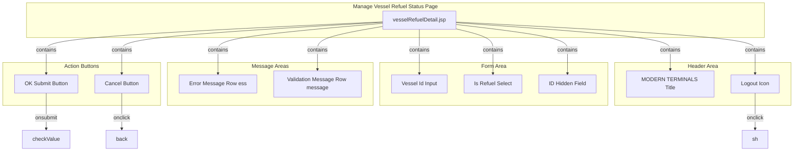

# Manage Vessel Refuel Status - Technical Specification

## 1. Architecture & Component Tree

This is a legacy JSP-based page using Spring MVC framework with JSTL and Spring Form tags. The page follows a traditional server-side rendering pattern.



> 📎 Source: src/main/webapp/WEB-INF/jsp/vesselRefuelDetail.jsp → template structure

**Component Details:**

| Component | Type | Description |
|-----------|------|-------------|
| vesselRefuelDetail.jsp | JSP View | Main page template with Spring Form tags |
| vesselIdField | HTML input[type=text] | Text input for vessel ID, maxlength=30 |
| isRefuelSelect | HTML select | Dropdown with Yes/No options |
| idHidden | HTML input[type=hidden] | Hidden field for record ID (modify mode) |
| okBtn | HTML input[type=submit] | Form submission button |
| cancelBtn | HTML input[type=button] | Navigation button to list page |
| errorMsg | HTML tr[id=ess] | Server-side error message display |
| validationMsg | HTML tr[id=message] | Client-side validation error display |

## 2. State Management

This page uses traditional JSP server-side state management with no client-side state framework.

**Server-Side State:**

| State Variable | Source | Type | Description |
|----------------|--------|------|-------------|
| `vesselRefuel` | Model attribute from controller | VesselRefuel entity | Contains id, vesselid, is_refuel fields; null in add mode, populated in modify mode |
| `result` | Model attribute from controller | String | Error message from failed save operation |
| `searchKey` | Not used on this page | - | Used only in list page |

**Client-Side State (DOM-based):**

| State | Storage | Description |
|-------|---------|-------------|
| Form field values | DOM input elements | vesselid, is_refuel, id field values |
| Validation errors | DOM element #show | Temporary validation error messages |
| Message visibility | CSS display property | #message and #ess rows toggled via JavaScript |

> 📎 Source: src/main/java/com/springMVC/control/CellControl.java → addVesselRefuel(), updateVesselRefuel(); src/main/webapp/WEB-INF/jsp/vesselRefuelDetail.jsp → form:form modelAttribute

**Data Flow:**

```
Controller (GET) → ModelMap.addObject("vesselRefuel", entity) → JSP renders form with pre-filled values
User submits form → checkValue() validates → POST to /updateVesselRefuelStatus.html → Controller processes → Redirect or return with error
```

## 3. API Integration

### 3.1 Update Vessel Refuel Status

**Endpoint:** `POST /user/updateVesselRefuelStatus.html`

**Request Parameters:**

| Parameter | Type | Required | Description |
|-----------|------|----------|-------------|
| vesselid | String | Yes | Vessel visit ID, max 30 characters |
| is_refuel | String | Yes | "Yes" or "No" |
| id | String | No (add mode) / Yes (modify mode) | Record ID for update operations |

**Response Behavior:**

| Scenario | Response | Action |
|----------|----------|--------|
| Add success | Redirect to `/user/allVesselRefuel.html` | Navigate to list page |
| Update success | Redirect to `/user/allVesselRefuel.html` | Navigate to list page |
| Add/Update failure | Return view `vesselRefuelDetail` with `result` attribute | Display error message on same page |

**Backend Logic:**

```java
// Pseudo-code from CellControl.java
if (idStr is not blank) {
    existVR = vesselDao.getVesselRefuelById(id);
    // UPDATE path
    oldValue = existVR.toString();
    existVR.setVesselid(vesselid);
    existVR.setIs_refuel(is_refuel);
    success = vesselDao.saveOrUpdateVesselRefuel(existVR);
    if (success) {
        saveOperationLog(user, UPDATE, oldValue, existVR.toString());
        redirect to allVesselRefuel.html;
    } else {
        model.addAttribute("result", "The operation failed");
        return vesselRefuelDetail view;
    }
} else {
    // ADD path
    vr = new VesselRefuel();
    vr.setVesselid(vesselid);
    vr.setIs_refuel(is_refuel);
    success = vesselDao.saveOrUpdateVesselRefuel(vr);
    if (success) {
        saveOperationLog(user, SAVE, null, vr.toString());
        redirect to allVesselRefuel.html;
    } else {
        model.addAttribute("result", "The operation failed");
        return vesselRefuelDetail view;
    }
}
```

> 📎 Source: src/main/java/com/springMVC/control/CellControl.java → updateVesselRefuelStatus()

### 3.2 Related Endpoints

| Endpoint | Method | Purpose |
|----------|--------|---------|
| `/user/addVesselRefuel.html` | GET | Load empty form for adding new record |
| `/user/modifyVesselRefuel.html?id={id}` | GET | Load form with existing data for modification |
| `/user/delVesselRefuel.html?id={id}` | GET | Delete record and redirect to list |
| `/user/allVesselRefuel.html` | GET | List page with pagination |

> 📎 Source: src/main/java/com/springMVC/control/CellControl.java → addVesselRefuel(), modifyVesselRefuel(), delVesselRefuel()

### 3.3 Loading States & Error Handling

⚠️ [ERR:no-loading] No loading indicator during form submission. User may click submit multiple times if response is slow.
> 📎 Source: src/main/webapp/WEB-INF/jsp/vesselRefuelDetail.jsp → form:form onsubmit

⚠️ [ERR:generic-error] Backend returns generic error message "The operation failed" without specific error details. Database constraint violations or other exceptions are not communicated to the user.
> 📎 Source: src/main/java/com/springMVC/control/CellControl.java → model.addAttribute("result", "The operation failed")

⚠️ [ERR:no-retry] No retry mechanism for failed operations. User must manually re-submit the form.
> 📎 Source: src/main/java/com/springMVC/control/CellControl.java → updateVesselRefuelStatus()

## 4. Data Flow & Transformation

### 4.1 Entity Structure

**VesselRefuel Entity:**

```java
@Entity
@Table(name = "T_VesselRefuel")
public class VesselRefuel {
    @Id
    @GeneratedValue(strategy=GenerationType.SEQUENCE, generator="vesselRefuel")
    @Column(name = "vrid")
    private Integer id;

    @Column(name = "vesselid", length = 10)
    private String vesselid;

    @Column(name = "is_refuel", length = 5)
    private String is_refuel;
}
```

> 📎 Source: src/main/java/com/springMVC/entity/VesselRefuel.java

**Note:** Database column constraints (vesselid length=10, is_refuel length=5) are stricter than frontend validation (maxlength=30). This mismatch could cause database errors if users enter values between 11-30 characters.

⚠️ [ERR:validation-mismatch] Frontend allows vesselid up to 30 characters but database column is limited to 10 characters. This will cause SQL errors for inputs between 11-30 characters.
> 📎 Source: src/main/java/com/springMVC/entity/VesselRefuel.java → @Column(name = "vesselid", length = 10); src/main/webapp/WEB-INF/jsp/vesselRefuelDetail.jsp → maxlength="30"

### 4.2 Data Transformation Rules

| Field | Transformation | Location |
|-------|----------------|----------|
| is_refuel (display) | Conditional selection in dropdown based on existing value | JSP c:choose block |
| id (modify mode) | Extracted from URL parameter, stored in hidden field | Controller @ModelAttribute binding |
| vesselid (input) | No transformation, direct string input | HTML input element |

### 4.3 Operation Logging

All CRUD operations are logged with the following structure:

```java
LogUtil.buildOperationLog(
    user,                           // Current logged-in user from session
    Function.VESSEL_REFUEL_CONFIGURATION,  // Module identifier
    ActionType.UPDATE/SAVE/DELETE,  // Operation type
    oldValue,                       // Previous state (null for ADD)
    newValue                        // New state (null for DELETE)
)
```

> 📎 Source: src/main/java/com/springMVC/control/CellControl.java → saveOperationLog()

## 5. Interaction Logic

### 5.1 Form Validation (checkValue function)

**Validation Sequence:**

1. Hide previous error messages (#ess and #message)
2. Get vesselid and is_refuel values from DOM
3. Validate vesselid:
   - Empty check → show "Vessel Visit Id cannot be empty!"
   - Length > 30 → show "Vessel Visit Id is too long!"
4. Validate is_refuel:
   - Empty check → show "Is Refuel cannot be empty!"
   - Length > 3 → show "Is Refuel is too long!"
   - Value not "Yes" or "No" → show "Is Refuel should be 'Yes' or 'No'!"
5. Return true if all validations pass, false otherwise

> 📎 Source: src/main/webapp/WEB-INF/jsp/vesselRefuelDetail.jsp → checkValue()

### 5.2 Conditional Rendering

**JSP Conditional Blocks:**

```jsp
<c:choose>
    <c:when test="${!empty vesselRefuel}">
        <!-- Modify mode: pre-fill form with existing data -->
        <input value='<c:out value="${vesselRefuel.vesselid }"/>' />
        <select>
            <c:when test="${vesselRefuel.is_refuel =='Yes' }">
                <option value="Yes" selected>Yes</option>
                <option value="No">No</option>
            </c:when>
            <c:otherwise>
                <option value="Yes">Yes</option>
                <option value="No" selected>No</option>
            </c:otherwise>
        </select>
    </c:when>
    <c:otherwise>
        <!-- Add mode: empty form -->
        <input />
        <select>
            <option value="Yes">Yes</option>
            <option value="No">No</option>
        </select>
    </c:otherwise>
</c:choose>
```

> 📎 Source: src/main/webapp/WEB-INF/jsp/vesselRefuelDetail.jsp → c:choose blocks

### 5.3 Navigation Functions

| Function | Trigger | Destination |
|----------|---------|-------------|
| `back()` | Cancel button click | `allVesselRefuel.html` |
| `sh()` | Logout icon click | Confirmation dialog → `logout.html` |
| `show()` | Not explicitly called in current code | Hides error messages |

> 📎 Source: src/main/webapp/WEB-INF/jsp/vesselRefuelDetail.jsp → back(), sh(), show()

## 6. Error Handling

### 6.1 Client-Side Validation Errors

| Error Condition | Error Message | Display Element |
|-----------------|---------------|-----------------|
| vesselid empty | "Vessel Visit Id cannot be empty!" | #show (inside #message row) |
| vesselid > 30 chars | "Vessel Visit Id is too long!" | #show (inside #message row) |
| is_refuel empty | "Is Refuel cannot be empty!" | #show (inside #message row) |
| is_refuel > 3 chars | "Is Refuel is too long!" | #show (inside #message row) |
| is_refuel not Yes/No | "Is Refuel should be 'Yes' or 'No'!" | #show (inside #message row) |

### 6.2 Server-Side Errors

| Error Condition | Error Message | Display Element |
|-----------------|---------------|-----------------|
| Database save failure | "The operation failed" | #ess row (${result}) |

### 6.3 Risk Annotations

⚠️ [ERR:no-loading] Form submission has no loading state indicator. Users may double-click submit button causing duplicate requests.
> 📎 Source: src/main/webapp/WEB-INF/jsp/vesselRefuelDetail.jsp → form:form onsubmit="return checkValue()"

⚠️ [ERR:generic-error] Backend returns generic "The operation failed" message without distinguishing between different failure causes (database constraint violation, connection error, etc.).
> 📎 Source: src/main/java/com/springMVC/control/CellControl.java → model.addAttribute("result", "The operation failed")

⚠️ [ERR:validation-mismatch] Frontend validation allows vesselid up to 30 characters but database column is defined as length=10. Inputs between 11-30 characters will pass frontend validation but fail at database level.
> 📎 Source: src/main/java/com/springMVC/entity/VesselRefuel.java → @Column(name = "vesselid", length = 10); src/main/webapp/WEB-INF/jsp/vesselRefuelDetail.jsp → maxlength="30"

⚠️ [ERR:no-csrf] Form submission does not include CSRF token protection. The application relies solely on session-based authentication without CSRF tokens.
> 📎 Source: src/main/webapp/WEB-INF/jsp/vesselRefuelDetail.jsp → form:form (no CSRF token visible)

## 7. Security

### 7.1 Authentication

**Security Interceptor:** All requests (except excluded URLs) are checked for session attribute `USERINFO` (Constants.USER_LOGIN). Unauthenticated users are redirected to `index.jsp`.

```java
if (session.getAttribute(Constants.USER_LOGIN) == null) {
    session.setAttribute("error", "Please login first!");
    response.sendRedirect(request.getContextPath()+"/index.jsp");
}
```

> 📎 Source: src/main/java/com/springMVC/filter/SecurityInterceptor.java → preHandle()

### 7.2 Authorization

No role-based access control is implemented. Any authenticated user can perform add/modify/delete operations on vessel refuel records.

⚠️ [OWASP:A01] No role-based authorization checks. Any authenticated user can modify or delete vessel refuel records regardless of their role or permissions.
> 📎 Source: src/main/java/com/springMVC/control/CellControl.java → updateVesselRefuelStatus(), delVesselRefuel()

### 7.3 Session Management

User information is stored in HTTP session under key `USERINFO`. Session is invalidated on logout.

> 📎 Source: src/main/java/com/springMVC/util/Constants.java → USER_LOGIN = "USERINFO"

### 7.4 Input Sanitization

**XSS Protection:**
- JSP uses `<c:out>` tag for output escaping, which provides basic XSS protection
- Form inputs are bound via Spring Form tags which handle basic sanitization

⚠️ [OWASP:A03] While `<c:out>` provides XSS protection for displayed values, the application does not implement comprehensive input sanitization. Special characters in vesselid could potentially cause issues if not properly handled by the database layer.
> 📎 Source: src/main/webapp/WEB-INF/jsp/vesselRefuelDetail.jsp → c:out value="${vesselRefuel.vesselid }"

### 7.5 CSRF Protection

⚠️ [OWASP:A01] No CSRF token implementation detected. Forms do not include CSRF tokens, making them vulnerable to cross-site request forgery attacks.
> 📎 Source: src/main/webapp/WEB-INF/jsp/vesselRefuelDetail.jsp → form:form (no token field)

## 8. Performance

### 8.1 Rendering Optimization

- **Static resources**: JavaScript file `vmt.js` includes version query parameter (`?v=3`) for cache busting
- **CSS**: Inline styles used throughout, no external stylesheet references

⚠️ [PERF:inline-css] All CSS is inline within the JSP file. This prevents browser caching of styles and increases page load time for repeated visits.
> 📎 Source: src/main/webapp/WEB-INF/jsp/vesselRefuelDetail.jsp → style block

### 8.2 Legacy Browser Compatibility

The page includes IE compatibility meta tag and uses legacy CSS expressions:

```css
height: expression((documentElement.clientHeight > 200) ? "200px" : "100%")!important;
```

This CSS expression is IE-specific and deprecated in modern browsers.

⚠️ [PERF:legacy-css] Uses deprecated IE-only CSS expressions which are not supported in modern browsers and may cause rendering inconsistencies.
> 📎 Source: src/main/webapp/WEB-INF/jsp/vesselRefuelDetail.jsp → height: expression(...)

### 8.3 Database Operations

Each form submission triggers:
1. One SELECT query (in modify mode to fetch existing record)
2. One INSERT or UPDATE query
3. One INSERT query for operation log

No batching or optimization is implemented for these operations.

### 8.4 Bundle Size

- Single JavaScript dependency: `vmt.js`
- No module bundling or code splitting (traditional JSP architecture)
