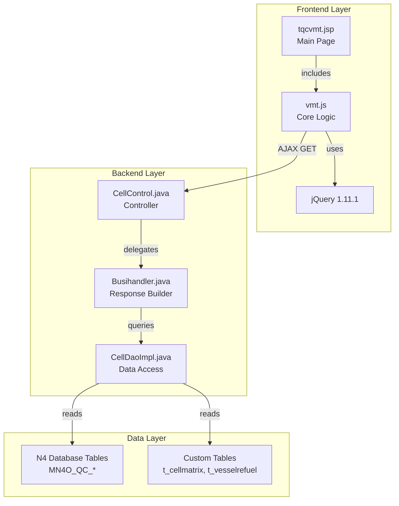
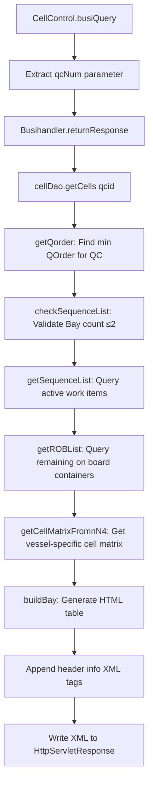

# QC Terminal Display - Technical Specification

## 1. Architecture & Component Tree

### 1.1 Technology Stack
- **Frontend**: JSP (JavaServer Pages), jQuery 1.11.1, vanilla JavaScript
- **Backend**: Spring MVC, Hibernate 3, JDBC Template
- **Data Exchange**: Custom XML format (not standard REST/JSON)
- **Styling**: Inline CSS + external box.css

### 1.2 Component Hierarchy



### 1.3 File Structure

| File | Path | Responsibility |
|------|------|----------------|
| tqcvmt.jsp | src/main/webapp/WEB-INF/jsp/tqcvmt.jsp | Main page template, CSS styles, initial HTML structure |
| vmt.js | src/main/webapp/js/vmt.js | Client-side logic: AJAX polling, data parsing, UI updates, time synchronization |
| CellControl.java | src/main/java/com/springMVC/control/CellControl.java | Spring MVC controller, routes /user/BusiQuery endpoint |
| Busihandler.java | src/main/java/com/accenture/vmt/Busihandler.java | Builds XML response with header info and table HTML |
| CellDaoImpl.java | src/main/java/com/springMVC/dao/CellDaoImpl.java | Data access layer: queries N4 database, builds cell matrix, handles business logic |

> 📎 Source: Repository file structure

## 2. State Management

### 2.1 Global Variables (vmt.js)

| Variable | Type | Purpose | Initial Value |
|----------|------|---------|---------------|
| firstLoad | boolean | Tracks if this is the first data load | true |
| firstLoadServerDateTime | Date/null | Server timestamp from first response | null |
| firstLocalDateTime | Date/null | Local timestamp when first response received | null |
| is_processing | boolean | Prevents concurrent AJAX requests | false |
| debugMode | boolean | Enables/disables debug message display | false |
| refreshMode | number | Adaptive refresh strategy (1/2/3) | 3 |
| lastTimeOut | boolean | Tracks if last request timed out | false |
| timeOutTimes | number | Consecutive timeout counter | 0 |
| allowedTimeOutTimes | number | Max allowed timeouts before aggressive backoff | 3 |
| intervalID | number | setInterval handle for getData() | undefined |
| lastInterval | number | Previous polling interval in ms | 0 |
| thisInterval | number | Current polling interval in ms | 15000 |

### 2.2 DOM State Elements

| Element ID | Type | Data Source | Update Frequency |
|------------|------|-------------|------------------|
| qcNum | hidden input | JSP model attribute ${qcNum} | Static (page load) |
| current_date | span | Calculated from server time | Every 1 second |
| current_time | span | Calculated from server time | Every 1 second |
| tablebackground1 | td | Signal indicator image | Per AJAX response |
| QC | span | qcNum value | On page load |
| bayNm | span | API response <bayNm> | Per AJAX response |
| QCAct | span | API response <QCAct> | Per AJAX response |
| rmain | span | API response <rmain> | Per AJAX response |
| reful | span | API response <reful> | Per AJAX response |
| Vessl | span | API response <Vessl> | Per AJAX response |
| tableList | div | API response <table_info> | Per AJAX response |
| msg | div | Debug messages | On error/debug |
| loading | div | Loading indicator | Hidden after first load |

> 📎 Source: src/main/webapp/js/vmt.js → global variables; src/main/webapp/WEB-INF/jsp/tqcvmt.jsp → DOM elements

### 2.3 Time Synchronization Logic

The page implements a client-server time sync mechanism to display accurate server time:

1. **First Load**: Capture `firstLoadServerDateTime` from API response `<dateTimeNow>` tag and `firstLocalDateTime` from `new Date()`
2. **Subsequent Updates**: Calculate elapsed seconds since `firstLocalDateTime`, add to `firstLoadServerDateTime` to derive current server time
3. **Display**: Format as "yyyy-MM-dd hh:mm:ss" using custom `Date.prototype.format()` extension

This approach avoids repeated server time queries and compensates for network latency.

> 📎 Source: src/main/webapp/js/vmt.js → setTime(), calculateCurrentTime(), showTime()

## 3. API Integration

### 3.1 Endpoint: /user/BusiQuery.html

**Request:**
- **Method**: GET
- **URL**: `/user/BusiQuery.html?qcNum={qcNum}`
- **Parameters**:
  - `qcNum` (required): Quay Crane identifier (e.g., "QC83")
- **Headers**: None special
- **Timeout**: 9000ms (9 seconds)

**Response Format**: Custom XML (Content-Type: text/xml; charset=UTF-8)

```xml
<type>
  <dateTimeNow>2024-01-15 14:30:25</dateTimeNow>
  <hInfo>bayNm;QCAct;rmain;reful;Vessl</hInfo>
  <bayNm>BAY:35D</bayNm>
  <QCAct>DISCH</QCAct>
  <rmain>Remaining Container:12</rmain>
  <reful>Is Refueling:No</reful>
  <Vessl>VESSEL001</Vessl>
  <isRef>No</isRef>
  <table_info>
    <table width="100%" height="70%" align="center">
      <!-- HTML table rows generated by buildBay() -->
      <tr>
        <td id="tier" class="tierNum">Tier</td>
        <td id="R01" class="load">01</td>
        ...
      </tr>
      <tr>
        <td id="T02" class="tierNum">02</td>
        <td id="T02R01" class="discharge">ORQ</td>
        ...
      </tr>
    </table>
  </table_info>
</type>
```

**Error Response** (on GeneralException or Exception):
```xml
<type>
  <dateTimeNow>2024-01-15 14:30:25</dateTimeNow>
  <table_info>
    <div align="center">
      <br><br><br><br>
      <span style="color:red;font-size:20px;" id="error_msg">error_query_db_error</span>
    </div>
  </table_info>
</type>
```

> 📎 Source: src/main/java/com/accenture/vmt/Busihandler.java → returnResponse()

### 3.2 Response Parsing Logic

The frontend uses custom string parsing functions (not XML DOM parser):

| Function | Purpose | Extraction Pattern |
|----------|---------|-------------------|
| getTimeContent() | Extract dateTimeNow | `<dateTimeNow>...</dateTimeNow>` |
| getBaseContent() | Extract header fields | `<{tagName}>...</{tagName}>` (offset +7 chars) |
| getListContent() | Extract table HTML | `<table_info>...</table_info>` (offset +12 chars) |

⚠️ [PERF:main-thread] String-based XML parsing is fragile and inefficient. Uses substring/indexOf which breaks if tag order changes or contains nested tags. No validation of XML structure.
> 📎 Source: src/main/webapp/js/vmt.js → getTimeContent(), getBaseContent(), getListContent()

### 3.3 Session Expiration Detection

The frontend checks for session expiration by inspecting response text:
- Condition 1: `xhr.responseText.toLowerCase().indexOf("<title>login") > -1`
- Condition 2: `xhr.responseText.indexOf('name="err_msg" value="error_webpage_expired"') > -1`

If either condition is true, redirect to login page.

> 📎 Source: src/main/webapp/js/vmt.js → callBack() success handler

### 3.4 Error Handling Matrix

| Error Scenario | HTTP Status | Frontend Action | Signal Indicator |
|----------------|-------------|-----------------|------------------|
| Session expired | 200 (login page HTML) | Redirect to login | RED |
| Network timeout | 0 or 120xx series | Log error, retry with backoff | RED |
| Database timeout | 200 (error XML) | Display error message in table area | RED |
| Connection refused | 0 | Log error, retry with backoff | RED |
| General exception | 200 (error XML) | Display error message | RED |

Network error codes handled: 12029, 12002, 12012, 12030, 12031, 12151, 12152, 12007 (IE-specific WinHTTP errors)

> 📎 Source: src/main/webapp/js/vmt.js → error handler

## 4. Data Flow & Transformation

### 4.1 Backend Data Retrieval Flow



### 4.2 Key Data Transformations

#### 4.2.1 Deck/Hold Code Conversion
```javascript
// In Busihandler.returnResponse()
if ("A".equals(DeckHold)) {
    DeckHold = "D";  // Deck
} else if ("B".equals(DeckHold)) {
    DeckHold = "H";  // Hold
}
```

#### 4.2.2 Tier Number Calculation
```java
// For Hold (B): j=0→"00", j=1→"02", j=2→"04", j=3→"06", j=4→"08", j>=5→j*2
// For Deck (A): 78 + j*2
public String getTier(String deckhold, int j) {
    if (deckhold.equals("A")) {
        return String.valueOf(78 + j * 2);  // Deck tiers: 78, 80, 82...
    } else if (deckhold.equals("B")) {
        // Hold tiers: 00, 02, 04, 06, 08, 10, 12...
        if (j >= 5) return String.valueOf(j * 2);
        else if (j == 4) return "08";
        else if (j == 3) return "06";
        else if (j == 2) return "04";
        else if (j == 1) return "02";
        else if (j == 0) return "00";
    }
}
```

#### 4.2.3 Cell Info Composition
```java
// Priority order: O (OOG) → R (Reefer) → X (Tank) → Q/T/W (Multi-lift) → Bay# (Cross-bay) → 20 (20ft)
public String getCellInfo(SequenceVO sequenceVO, String acrossBay) {
    StringBuffer cellInfo = new StringBuffer();
    if (isoog.equals("1")) cellInfo.append("O");
    if (ispowered.equals("1")) cellInfo.append("R");
    if (istank.equals("1")) cellInfo.append("X");
    if (isquad.equals("1")) cellInfo.append("Q");
    if (istwin.equals("1")) cellInfo.append("W");
    if (istandem.equals("1")) cellInfo.append("T");
    if (acrossBay.equals("1") && issingle.equals("1") && complexunit.equals("")) {
        cellInfo.append(cellbay);  // e.g., "33" or "35"
    }
    if (twentyInd != null && twentyInd.equals("Y")) {
        cellInfo.append("20");
    }
    return cellInfo.toString();
}
```

> 📎 Source: src/main/java/com/springMVC/dao/CellDaoImpl.java → getCellInfo()

### 4.3 Dangerous Goods (DG) Indicator

⚠️ [OWASP:A03] The DG hazard check function `getHazardList()` is commented out (FIR-TMT-000005), meaning dangerous goods indicators will never display. This is a temporary block that may have become permanent without proper risk assessment.
> 📎 Source: src/main/java/com/springMVC/dao/CellDaoImpl.java → getHazardList() line 1787-1832

The code attempts to mark DG containers with a yellow/red asterisk (*) in the corner:
```java
if (is_dg != null && is_dg == "1") {  // ⚠️ Bug: should use .equals() not ==
    if (cellInfo.equals("&nbsp;")) {
        cellInfo += "<span class=\"dgind\">*</span>";
    } else {
        cellInfo += "<span class=\"infodgind\">*</span>";
    }
}
```

⚠️ [PERF:re-render] String comparison uses `==` instead of `.equals()`, which will always return false for String objects in Java. This means DG indicators will never render even if the SQL query were enabled.
> 📎 Source: src/main/java/com/springMVC/dao/CellDaoImpl.java → buildBay() line 1292

## 5. Interaction Logic

### 5.1 Keyboard Shortcuts

| Key | keyCode | Action | Implementation |
|-----|---------|--------|----------------|
| `*` (numpad multiply) | 106 | Trigger logout confirmation | `mykeydown()` in inline script |
| Backspace | 8 | Prevent navigation back (if not in input) | `LoadingComplete()` keydown handler |

### 5.2 Conditional Rendering Rules

#### 5.2.1 Refueling Highlight
```javascript
// In callBack()
var isRefuel = getBaseContent(xhr, "isRef");
if (isRefuel == 'Yes') {
    var reful = document.getElementById("reful");
    reful.style = "color: red !important;";
} else {
    var reful = document.getElementById("reful");
    reful.style = "";
}
```

#### 5.2.2 20ft Container Detection (Discharge Mode Only)
```java
// In CellDaoImpl.getCells()
if (qType != null && "DISCH".equals(qType)) {
    if (minBay != null && maxBay != null && minBay.equals(maxBay) 
        && (Integer.parseInt(minBay) % 2 == 0)) {
        cellHashMap = getTwentyUnitList(cellHashMap, qcid, vesselid, minBay);
    }
}
```
Only triggers when:
- Operation type is DISCH (discharge/unload)
- Single Bay (minBay == maxBay)
- Bay number is even (e.g., 34, 36)

This checks adjacent odd-numbered Bays (Bay-1 and Bay+1) for 20ft containers that share the same physical space.

> 📎 Source: src/main/java/com/springMVC/dao/CellDaoImpl.java → getCells() line 102-107

### 5.3 Form Validation

No user-input forms exist on this page. All data comes from:
1. URL parameter `qcNum` (validated by backend)
2. Server-side database queries

### 5.4 Dialog/Modal Patterns

Only one interaction component exists:
- **Logout Confirmation**: Browser-native `window.confirm()` dialog
  - No custom styling
  - Blocking modal (pauses execution until user responds)
  - Message sourced from Spring message bundle: `<spring:message code="confirm_logout" />`

## 6. Error Handling

### 6.1 Frontend Error States

| Error Type | Detection Method | User Feedback | Recovery |
|------------|------------------|---------------|----------|
| Session expired | Response contains login page HTML | Redirect to login | User must re-login |
| Network timeout | readyState=0 or IE WinHTTP errors | Red signal indicator | Auto-retry with exponential backoff |
| Database error | Response contains error XML | Error message in table area | Auto-retry on next poll |
| JavaScript exception | try-catch in callBack | Red signal indicator + debug msg | Continue polling |

### 6.2 Backend Exception Handling

| Exception Type | Handling Strategy | User Message |
|----------------|-------------------|--------------|
| GeneralException("error_no_qc_working") | Return error XML | "No working instruction for current QC" |
| GeneralException("db_query_time_out") | Return error XML | "Database query timeout" |
| GeneralException("cannot_get_connection") | Return error XML | "Database cannot be connected" |
| GeneralException("error_more_than_3bay") | Return error XML | "More than 2 bays detected" |
| IOException | Print stack trace, no response | (Connection broken) |
| Unexpected Exception | Print stack trace, return generic error XML | "error_query_db_error" |

⚠️ [ERR:logging] Backend catches exceptions but only prints stack traces without structured logging. Critical errors like database connection failures should trigger alerts.
> 📎 Source: src/main/java/com/accenture/vmt/Busihandler.java → catch blocks

### 6.3 Retry Logic

The adaptive refresh mechanism (refreshMode=3) implements exponential backoff:

```javascript
// After successful request: reset timeout counter
timeOutTimes = 0;
lastTimeOut = false;

// After failed request: increment counter
timeOutTimes++;
lastTimeOut = true;

// Interval adjustment logic:
if (lastTimeOut) {
    if (timeOutTimes == 1) thisInterval = 20000;       // 20s
    else if (timeOutTimes == 2) thisInterval = 25000;   // 25s
    else thisInterval = 30000;                           // 30s (max)
} else {
    // Gradually restore to normal frequency
    if (lastInterval == 30000) thisInterval = 25000;
    else if (lastInterval == 25000 || lastInterval == 25000) thisInterval = 20000;
    else if (lastInterval == 20000 || lastInterval == 20000) thisInterval = 15000;
    else thisInterval = 15000;
}
```

⚠️ [PERF:polling] Maximum polling interval is 30 seconds, which may still be excessive during prolonged network issues. Consider implementing circuit breaker pattern with longer backoff (e.g., 60s, 120s) and manual refresh button.
> 📎 Source: src/main/webapp/js/vmt.js → getData() finally block

## 7. Security

### 7.1 Authentication & Session Management

- **Session Check**: Frontend detects session expiration by checking for login page HTML in AJAX response
- **Logout**: Simple redirect to `logout.html` after user confirmation
- **No CSRF Protection**: GET requests do not include CSRF tokens

⚠️ [OWASP:A01] No CSRF protection on API endpoints. While currently read-only (GET), if future modifications add POST/PUT operations, they would be vulnerable to CSRF attacks.
> 📎 Source: src/main/java/com/springMVC/control/CellControl.java → @RequestMapping methods

### 7.2 Input Validation

- **qcNum Parameter**: Passed directly to SQL queries via prepared statements (safe from SQL injection)
- **No XSS Sanitization**: Server-generated HTML table is inserted directly into DOM via `innerHTML`

⚠️ [OWASP:A03] Server-generated HTML content from `buildBay()` is injected into DOM using `pnl.innerHTML = value` without sanitization. If any database field contains malicious JavaScript, it would execute. While current data sources are controlled, this is a potential XSS vector.
> 📎 Source: src/main/webapp/js/vmt.js → setContent() line 325; src/main/java/com/springMVC/dao/CellDaoImpl.java → buildBay()

### 7.3 Data Exposure

- **IP Address Logging**: Backend logs client IP addresses for audit purposes (CGM170276)
- **Session ID in Logs**: Session IDs are logged alongside IP addresses

⚠️ [OWASP:A02] Client IP addresses and session IDs are logged in application logs. Ensure log files are properly secured and rotated to prevent unauthorized access to sensitive operational data.
> 📎 Source: src/main/java/com/accenture/vmt/Busihandler.java → lines 71-123

### 7.4 Hardcoded Credentials/Keys

No hardcoded credentials found in reviewed files.

## 8. Performance

### 8.1 Rendering Optimization

- **Full Table Replacement**: Each AJAX response replaces entire `#tableList` content via `innerHTML`. No incremental updates or virtual DOM.
- **No Pagination**: Entire cell matrix rendered at once. For large vessels with many rows/tiers, this could cause layout thrashing.

⚠️ [PERF:large-list] Full table replacement on every poll (every 15-30 seconds) causes complete DOM reflow. For vessels with 20+ rows and 10+ tiers, this results in 200+ cells being recreated each time. Consider using DocumentFragment or incremental DOM updates.
> 📎 Source: src/main/webapp/js/vmt.js → setContent("tableList", tableInfo)

### 8.2 Network Optimization

- **Cache Disabled**: `cache: false` in AJAX request prevents browser caching
- **No Compression**: XML responses are not compressed (no Accept-Encoding header)
- **Polling Instead of WebSocket**: Continuous polling every 15-30 seconds creates unnecessary network overhead

⚠️ [PERF:polling] Polling-based architecture generates constant HTTP requests even when data hasn't changed. For a terminal with 10+ QC terminals, this creates significant server load. Consider WebSocket or Server-Sent Events (SSE) for real-time push updates.
> 📎 Source: src/main/webapp/js/vmt.js → $.ajax() configuration

### 8.3 Memory Leaks

- **Image Preloading**: `greenImg` and `redImg` are preloaded as global Image objects (good practice)
- **setInterval Cleanup**: `intervalID` is properly cleared and reset when interval changes
- **No Event Listener Cleanup**: The `keydown` handler in `LoadingComplete()` is attached to `document` but never removed

⚠️ [PERF:re-render] Multiple `setInterval` timers could accumulate if `getData()` throws exceptions before clearing the previous interval. The `finally` block handles this, but exceptions in the try block before reaching finally could leave orphaned intervals.
> 📎 Source: src/main/webapp/js/vmt.js → getData() try-finally block

### 8.4 Bundle Size

- **jQuery 1.11.1**: ~94KB minified. For a simple polling page, this is excessive. Could be replaced with vanilla JS fetch/XMLHttpRequest.
- **No Minification**: vmt.js is not minified (365 lines, ~12KB)
- **No Lazy Loading**: All resources loaded upfront

⚠️ [PERF:no-lazy] jQuery 1.11.1 is overkill for this page's needs. The page only uses `$.ajax()`, `$(document).on()`, and basic selectors. Consider replacing with native Fetch API or lightweight alternatives to reduce bundle size by ~90KB.
> 📎 Source: src/main/webapp/js/vmt.js → jQuery usage

### 8.5 Database Query Optimization

- **Multiple Queries per Request**: A single `/BusiQuery` call triggers 5-10 separate SQL queries (getQorder, checkSequenceList, getSequenceList, getROBList, getCellMatrix, etc.)
- **No Query Caching**: Each poll executes fresh queries against N4 database
- **Complex Joins**: Queries join 8-10 tables (MN4O_QC_inv_wq, MN4O_QC_inv_wi, MN4O_QC_inv_unit, etc.)

⚠️ [PERF:main-thread] Complex multi-table joins executed on every poll (every 15-30 seconds) put significant load on the database. For terminals with high QC concurrency, this could cause database connection pool exhaustion. Consider materialized views or query result caching with short TTL.
> 📎 Source: src/main/java/com/springMVC/dao/CellDaoImpl.java → getSequenceList() SQL (lines 600-640)
