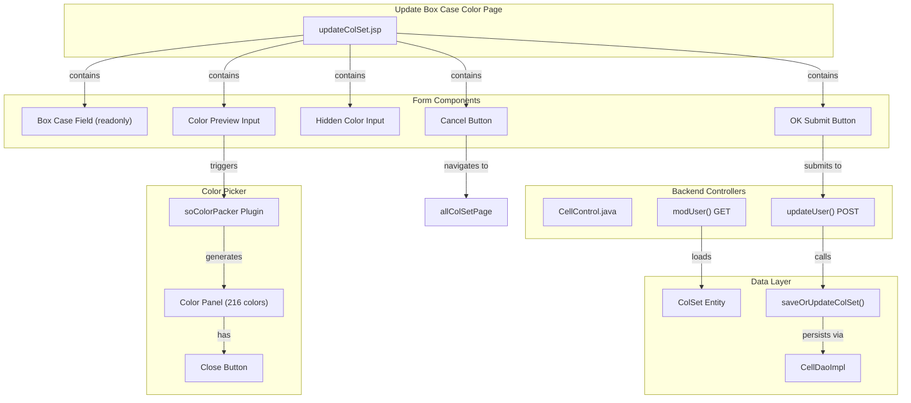

# Update Box Case Color - Technical Specification

## 1. Architecture & Component Tree

This is a legacy JSP-based page using Spring MVC framework with jQuery for client-side interactions.



> 📎 Source: src/main/webapp/WEB-INF/jsp/updateColSet.jsp; src/main/java/com/springMVC/control/CellControl.java

## 2. State Management

### Local State (Client-side)

| State Variable | Type | Source | Description |
|---------------|------|--------|-------------|
| `col.boxcase` | String | Server model attribute | Current box case name (readonly) |
| `col.color` | String | Server model attribute | Current color value (hex format) |
| `col.id` | Integer | Server model attribute | Record ID for update |
| `result` | String | Server model attribute | Operation result message (optional) |

### Form Data Flow

```
Server (GET /user/modifyColSet.html?id=X)
  ↓ loads ColSet by ID
ModelMap { col: ColSet }
  ↓ renders JSP
updateColSet.jsp displays initial values
  ↓ user selects color via picker
jQuery callback updates hidden input #color
  ↓ user clicks OK
checkValue() validates → POST /user/updateColSet.html
  ↓ backend processes
CellControl.updateUser() updates ColSet.color
  ↓ success
Redirect to /user/allColSet.html
  ↓ failure
Return to updateColSet.jsp with result message
```

> 📎 Source: src/main/webapp/WEB-INF/jsp/updateColSet.jsp → init(), process(); src/main/java/com/springMVC/control/CellControl.java → modUser(), updateUser()

## 3. API Integration

### GET: Load Page Data

**Endpoint**: `/user/modifyColSet.html` (inferred from colorManage.jsp link pattern)

**Request Parameters**:
| Parameter | Type | Required | Description |
|-----------|------|----------|-------------|
| id | Integer | Yes | ColSet record ID |

**Response**: Renders `updateColSet.jsp` with model attributes:
- `col`: ColSet object containing `id`, `boxcase`, `color`

> 📎 Source: src/main/java/com/springMVC/control/CellControl.java → modUser()

### POST: Update Color

**Endpoint**: `/user/updateColSet.html`

**Method**: POST

**Request Parameters**:
| Parameter | Type | Required | Description |
|-----------|------|----------|-------------|
| id | Integer | Yes | ColSet record ID |
| color | String | Yes | New color value (hex format, max 12 chars) |
| boxcase | String | No | Box case name (readonly, not used in update) |

**Response**:
- **Success**: Redirect to `/user/allColSet.html`
- **Failure**: Render `updateColSet.jsp` with `result = "The operation failed"`

**Backend Logic**:
```java
int id = Integer.valueOf(request.getParameter("id"));
String color = (String) request.getParameter("color");
ColSet colSet = cellDao.getColSetById(id);
colSet.setColor(color);
boolean success = cellDao.saveOrUpdateColSet(colSet);
```

> 📎 Source: src/main/java/com/springMVC/control/CellControl.java → updateUser()

### Database Operation

**Method**: `CellDao.saveOrUpdateColSet(ColSet colSet)`

**Implementation**: Uses Hibernate `saveOrUpdate()` to persist changes to `T_COLSET` table.

**Error Handling**: Catches exceptions, prints stack trace, returns `false` on failure.

> 📎 Source: src/main/java/com/springMVC/dao/CellDaoImpl.java → saveOrUpdateColSet()

## 4. Data Flow & Transformation

### Data Model: ColSet Entity

| Field | DB Column | Type | Constraints | Description |
|-------|-----------|------|-------------|-------------|
| id | colsetid | Integer | PK, Sequence | Primary key |
| color | COLOR | String(15) | Nullable | Hex color value (e.g., #FF0000) |
| boxcase | BOXCASE | String(10) | Nullable | Box case name |

> 📎 Source: src/main/java/com/springMVC/entity/ColSet.java

### Color Value Transformation

1. **Initial Load**: Backend passes `col.color` (e.g., `#FF0000`) to JSP
2. **Display**: 
   - Hidden input `#color` stores the raw value
   - Visible input `#colorShow` displays background color via inline style `background-color:${col.color}`
3. **User Selection**: Color picker returns hex value (e.g., `#00FF00`)
4. **Update**: JavaScript `process()` function writes selected value to hidden input
5. **Submit**: Form posts the hidden input value to backend
6. **Persistence**: Backend updates `T_COLSET.COLOR` column

> 📎 Source: src/main/webapp/WEB-INF/jsp/updateColSet.jsp → input#color, input#colorShow, function process()

## 5. Interaction Logic

### Color Picker Integration

**Plugin**: `jquery.soColorPacker-1.0.js`

**Configuration**:
```javascript
jQuery('#colorShow').soColorPacker({
    size: 2,              // Medium size (216px width)
    textChange: false,    // Do not change text content
    colorChange: 2,       // Change background color
    callback: function(c) {
        process(c.color); // c.color contains hex value like "#FF0000"
    }
});
```

**Color Panel Structure**:
- 216 color cells (6×6×6 RGB combinations)
- Each cell: 11px × 11px with border
- Hover preview bar showing selected color and hex value
- Close button to dismiss panel

> 📎 Source: src/main/webapp/WEB-INF/jsp/updateColSet.jsp → soColorPacker config; src/main/webapp/js/jquery.soColorPicker-1.0.js

### Form Validation

**Function**: `checkValue()`

**Validation Rules**:
1. Color field must not be empty
2. Color field length must be ≤ 12 characters

**Error Display**:
- Sets `#message` row visibility to visible
- Inserts error text into `#show` cell
- Returns `false` to prevent form submission

> 📎 Source: src/main/webapp/WEB-INF/jsp/updateColSet.jsp → function checkValue()

### Conditional Rendering

**Server-side (JSTL)**:
```jsp
<c:if test="${!empty result}">
    <td style="color:red;font-size:15px;">${result}</td>
</c:if>
```

Displays operation result message only when `result` model attribute is present.

> 📎 Source: src/main/webapp/WEB-INF/jsp/updateColSet.jsp → tr#ess

## 6. Error Handling

### Client-side Validation Errors

| Error Condition | Message | Display Location |
|----------------|---------|------------------|
| Empty color value | "The color cannot be empty!" | `#message` row, red text |
| Color value > 12 chars | "The color is too long!" | `#message` row, red text |

> 📎 Source: src/main/webapp/WEB-INF/jsp/updateColSet.jsp → function checkValue()

### Server-side Errors

| Error Condition | Handling | User Feedback |
|----------------|----------|---------------|
| Database update failure | Catch exception, return false | "The operation failed" displayed on page |
| Invalid ID parameter | NumberFormatException (unhandled) | ⚠️ [ERR:input] No validation for non-numeric ID parameter
> 📎 Source: src/main/java/com/springMVC/control/CellControl.java → updateUser()

⚠️ [ERR:async] Database exception caught but only printed to console, no structured error logging or user-friendly message beyond generic "The operation failed"
> 📎 Source: src/main/java/com/springMVC/dao/CellDaoImpl.java → saveOrUpdateColSet()

⚠️ [ERR:input] No server-side validation for color value length or format; relies solely on client-side validation which can be bypassed
> 📎 Source: src/main/java/com/springMVC/control/CellControl.java → updateUser()

## 7. Security

### Authentication & Authorization

- Page access controlled via Spring MVC controller mapping
- Session-based authentication assumed (standard Spring Security pattern)
- Logout functionality requires user confirmation

⚠️ [OWASP:A01] No explicit authorization checks in controller methods; any authenticated user can modify any box case color by manipulating the `id` parameter
> 📎 Source: src/main/java/com/springMVC/control/CellControl.java → updateUser()

### Input Validation

- Client-side validation for color field (non-empty, max 12 chars)
- Server-side uses raw request parameters without additional sanitization

⚠️ [OWASP:A03] Color value accepted directly from request parameter without server-side validation or sanitization; vulnerable if database column constraints are insufficient
> 📎 Source: src/main/java/com/springMVC/control/CellControl.java → updateUser() line 131

### Data Exposure

- Box case ID exposed in URL parameter (`modifyColSet.html?id=${col.id}`)
- Color values stored as plain text in database

⚠️ [OWASP:A02] Sequential integer IDs exposed in URLs may allow enumeration of all box case records
> 📎 Source: src/main/webapp/WEB-INF/jsp/colorManage.jsp → line 74

## 8. Performance

### Rendering Optimization

- Static CSS and JS files loaded via context path
- Color picker plugin generates 216 DOM elements on each click
- No lazy loading or virtualization needed (single record page)

### Potential Issues

⚠️ [PERF:re-render] Color picker recreates entire DOM structure (216 color cells) on every click instead of reusing cached instance
> 📎 Source: src/main/webapp/js/jquery.soColorPicker-1.0.js → newColorHtml() function

⚠️ [PERF:no-lazy] jQuery library (v1.11.1) and multiple plugins loaded synchronously in head section, blocking page render
> 📎 Source: src/main/webapp/WEB-INF/jsp/updateColSet.jsp → lines 11-13

### Bundle Size

- jQuery 1.11.1 (~94KB minified)
- soColorPicker plugin (~3KB)
- bgiframe plugin (~2KB)
- Total JS payload: ~100KB before compression