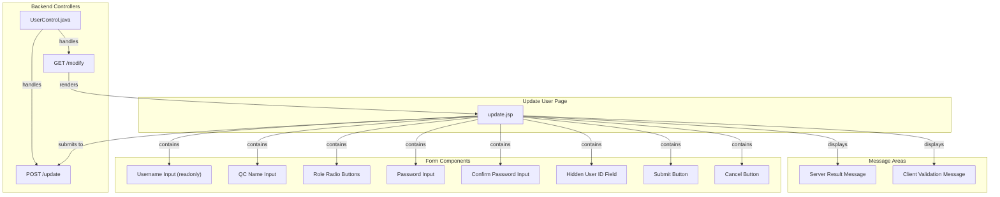
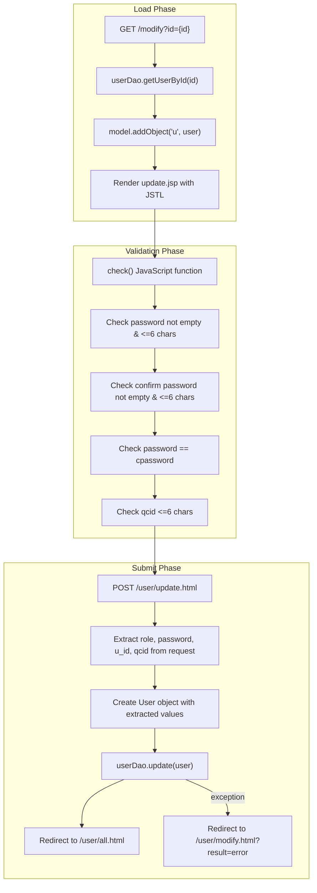

# Update User Page Specification

## 1. Architecture & Component Tree

This is a legacy JSP page using Spring MVC with server-side rendering. No client-side framework (React/Vue/Angular) is used.

> 📎 Source: src/main/webapp/WEB-INF/jsp/update.jsp; src/main/java/com/springMVC/control/UserControl.java

## 2. State Management

This is a stateless JSP page with no client-side state management library. State is managed as follows:

**Server-Side State:**
- `model.addAttribute("u", user)` - User object loaded from database via `userDao.getUserById()`
- `model.addAttribute("result", result)` - Error message from previous failed update attempt
- Form fields are populated via JSTL `<c:out>` tags binding to `${u.username}`, `${u.qcid}`, etc.

**Client-Side State:**
- DOM element visibility controlled via JavaScript (`document.getElementById().style.display`)
- No persistent client storage (localStorage/sessionStorage not used)

**Computed Properties:**
- Role radio button checked state determined by `${u.role == 'USER'}` or `${u.role == 'ADMIN'}` conditional logic

> 📎 Source: src/main/java/com/springMVC/control/UserControl.java → modUser(); src/main/webapp/WEB-INF/jsp/update.jsp → c:choose, c:when

## 3. API Integration

### GET /user/modify.html

**Purpose**: Load the update form with existing user data

**Request Parameters:**
| Parameter | Type | Required | Description |
|-----------|------|----------|-------------|
| id | Integer | Yes | User ID to edit |

**Response**: Renders `update.jsp` view with model attributes:
- `u`: User object containing {id, username, qcid, role, password}
- `result`: Optional error message string from previous failed update

> 📎 Source: src/main/java/com/springMVC/control/UserControl.java → modUser()

### POST /user/update.html

**Purpose**: Submit updated user information

**Request Body (form-urlencoded):**
| Field | Type | Required | Description |
|-------|------|----------|-------------|
| u_id | Integer | Yes | User ID (hidden field) |
| username | String | Yes | Username (readonly, sent but not updated) |
| qcid | String | Yes | QC name (max 6 chars) |
| role | String | Yes | "USER" or "ADMIN" |
| password | String | Yes | New password (max 6 chars) |
| cpassword | String | Yes | Confirm password (must match password) |

**Response:**
- **Success**: HTTP 302 redirect to `/user/all.html` (user list page)
- **Failure**: HTTP 302 redirect to `/user/modify.html` with `result` parameter containing error message

**Error Handling:**
- Backend catches exceptions during `userDao.update()` and sets error message via `messageUtil.getMessage("error_can_not_update_user", request)`
- Frontend validation errors displayed in `#message` div with red text

> 📎 Source: src/main/java/com/springMVC/control/UserControl.java → updateUser()

⚠️ [OWASP:A01] No CSRF token protection on form submission. The form uses plain POST without anti-CSRF tokens, making it vulnerable to cross-site request forgery attacks.
> 📎 Source: src/main/webapp/WEB-INF/jsp/update.jsp → form:form method="POST"

⚠️ [OWASP:A02] Password stored in plaintext in database column with length 6. The User entity defines PASSWORD column with length 6, suggesting passwords are stored without hashing. Additionally, the password value is pre-filled in the form's value attribute, exposing it in HTML source.
> 📎 Source: src/main/java/com/springMVC/entity/User.java → @Column(name = "PASSWORD", length = 6); src/main/webapp/WEB-INF/jsp/update.jsp → input type="password" value='${u.password}'

## 4. Data Flow & Transformation

**Data Transformations:**
- Role value: Database stores "USER"/"ADMIN" strings → Frontend displays as radio button labels via `<spring:message code="user" />` and `<spring:message code="admin" />`
- Password: Pre-filled from `${u.password}` but masked by `type="password"` input
- User ID: Passed as hidden field `u_id`, parsed to Integer in backend with NumberFormatException handling

> 📎 Source: src/main/webapp/WEB-INF/jsp/update.jsp → check(), form:form; src/main/java/com/springMVC/control/UserControl.java → updateUser()

## 5. Interaction Logic

### Form Validation (check() function)

The `check()` function performs sequential client-side validation:

1. Hide any existing server error message (`#ess` div)
2. Validate password field:
   - Empty check → show "密码不能为空"
   - Length > 6 → show "密码太长"
3. Validate confirm password field:
   - Empty check → show "确认密码不能为空"
   - Length > 6 → show "确认密码太长"
4. Validate password match: password != cpassword → show "密码不匹配"
5. Validate QC name length: qcid.length > 6 → show "QC姓名太长"
6. Return true if all validations pass, false otherwise

**Validation Display**: Errors shown in `#message` div (initially hidden, displayed via `style.display=''`) with red color and 15px font size.

> 📎 Source: src/main/webapp/WEB-INF/jsp/update.jsp → check()

### Cancel Action (back() function)

1. Hide server error message (`#ess` div)
2. Hide client validation message (`#message` div)
3. Redirect to `all.html` (user list page)

> 📎 Source: src/main/webapp/WEB-INF/jsp/update.jsp → back()

### Logout Action (sh() function)

1. Show browser native confirm dialog with i18n message "confirm_logout"
2. If confirmed, redirect to `logout.html`

> 📎 Source: src/main/webapp/WEB-INF/jsp/update.jsp → sh()

### Conditional Rendering

- **Server error message** (`#ess`): Shown only when `${!empty result}` is true
- **Role radio buttons**: Checked state determined by `${u.role == 'USER'}` or `${u.role == 'ADMIN'}` using JSTL `<c:choose>/<c:when>`

> 📎 Source: src/main/webapp/WEB-INF/jsp/update.jsp → c:if test="${!empty result}", c:when test="${u.role =='USER'}"

## 6. Error Handling

### Client-Side Validation Errors

| Error Condition | Message Key | Chinese Message | English Message |
|-----------------|-------------|-----------------|-----------------|
| Password empty | error_password_empty | 密码不能为空 | The password cannot be empty! |
| Password too long | error_password_too_long | 密码太长 | Password is too long! |
| Confirm password empty | error_confirm_password_empty | 确认密码不能为空 | The confirm password cannot be empty! |
| Confirm password too long | error_confirm_password_too_long | 确认密码太长 | The confirm password is too long! |
| Password mismatch | error_password__not_match | 密码不匹配 | Passwords do not match! |
| QC name too long | error_qcname_too_long | QC姓名太长 | QCName is too long! |

> 📎 Source: src/main/resources/messages_zh_CN.properties; src/main/resources/messages_en.properties

### Server-Side Errors

| Error Condition | Message Key | Behavior |
|-----------------|-------------|----------|
| Database update failure | error_can_not_update_user | Redirect back to modify page with error result parameter |
| Invalid user ID format | NumberFormatException caught | id defaults to 0, update likely fails |

⚠️ [ERR:async] No loading state indicator during form submission. The form submits synchronously via traditional POST, so the browser shows its own loading indicator, but there is no custom loading UI feedback for the user.
> 📎 Source: src/main/webapp/WEB-INF/jsp/update.jsp → form:form onsubmit="return check();"

⚠️ [ERR:validation] Backend does not re-validate password length or match constraints. The backend directly accepts password and qcid from request parameters without enforcing the same length limits (6 chars) or password matching logic that the frontend validates. A malicious user could bypass frontend validation.
> 📎 Source: src/main/java/com/springMVC/control/UserControl.java → updateUser() lines 418-432

## 7. Security

### Authentication & Authorization

- **Page Access Control**: The update page is accessible only via the "modify" link in admin.jsp, which is conditionally rendered based on user permissions (non-limit mode). However, there is no explicit route-level guard preventing direct access to `/user/modify.html`.

⚠️ [OWASP:A01] No explicit authorization check on the /user/modify.html endpoint. Any authenticated user who knows the URL pattern could potentially access the modify page by guessing user IDs, as there is no verification that the requesting user has ADMIN role.
> 📎 Source: src/main/java/com/springMVC/control/UserControl.java → modUser()

⚠️ [OWASP:A03] User password value is rendered in HTML input's value attribute. Although the input type is "password" (masked in browser), the actual password value is present in the HTML source, visible via "View Source" or browser DevTools.
> 📎 Source: src/main/webapp/WEB-INF/jsp/update.jsp → input type="password" value='<c:out value="${u.password }"></c:out>'

### Data Protection

- **Password Storage**: The User entity defines PASSWORD column with length 6, indicating plaintext storage without hashing. This is a critical security vulnerability.
- **No HTTPS Enforcement**: No evidence of HTTPS-only configuration in the JSP or controller code.

⚠️ [OWASP:A02] Passwords stored in plaintext with maximum length of 6 characters. The database schema allows only 6-character passwords stored without hashing, violating modern security standards for password storage.
> 📎 Source: src/main/java/com/springMVC/entity/User.java → @Column(name = "PASSWORD", length = 6)

### Input Sanitization

- **XSS Prevention**: User input is rendered via `<c:out>` tags which provide automatic HTML escaping, mitigating XSS risks for displayed data.
- **SQL Injection**: Uses JPA/Hibernate ORM (UserDao), which provides parameterized queries, reducing SQL injection risk.

## 8. Performance

### Rendering Optimization

- **Static Assets**: Logout image loaded via `/images/logout.jpg">` - no lazy loading or responsive sizing.
- **CSS**: Inline styles used throughout, no external stylesheet. Minimal CSS footprint but not optimized for caching.

⚠️ [PERF:no-lazy] Logout image loaded without lazy loading attribute. The image is always loaded regardless of whether the user interacts with the logout button.
> 📎 Source: src/main/webapp/WEB-INF/jsp/update.jsp → img src=".../images/logout.jpg"

### Bundle Size

- **No JavaScript Framework**: Pure vanilla JavaScript with minimal functions (check, back, sh, show), resulting in negligible JS payload.
- **No External Libraries**: Only JSTL and Spring tag libraries used on server side.

### Network Efficiency

- **Synchronous Form Submission**: Traditional POST causes full page reload on submit, which is less efficient than AJAX but acceptable for this simple form.
- **No Caching Headers**: No evidence of HTTP caching configuration for the JSP response.
