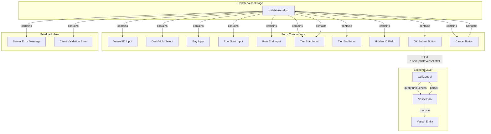

# Update Vessel - Technical Specification

## 1. Architecture & Component Tree

This is a legacy JSP-based page using Spring MVC framework with server-side rendering. The page follows a traditional request-response pattern without client-side state management.



> 📎 Source: src/main/webapp/WEB-INF/jsp/updateVessel.jsp → template; src/main/java/com/springMVC/control/CellControl.java → updateVessel()

## 2. State Management

This page uses **server-side state management** with no client-side state framework:

- **Form Data**: Managed by Spring's `<form:form>` tag with `modelAttribute="vessel"`, binding to the `Vessel` entity object passed from the controller
- **Pre-filled Values**: Retrieved via GET request to `/user/modifyVessel.html?id={id}`, which loads the existing vessel record and passes it as model attribute
- **Validation State**: 
  - Client-side: JavaScript `checkValue()` function validates on submit, displays errors in `message` row (initially hidden)
  - Server-side: Controller adds `result` attribute to model on validation failure, displayed in `ess` row
- **Navigation State**: No browser history management; direct URL redirects via `window.location.href`

**Key State Variables** (JavaScript):
- None persisted; all validation is transient during form submission

> 📎 Source: src/main/webapp/WEB-INF/jsp/updateVessel.jsp → form:form modelAttribute="vessel"; src/main/java/com/springMVC/control/CellControl.java → modVessel()

## 3. API Integration

### 3.1 Load Vessel Data (GET)

**Endpoint**: `/user/modifyVessel.html`  
**Method**: GET  
**Query Params**: `id` (vessel ID)  
**Response**: Renders `updateVessel.jsp` with pre-filled form data

**Controller Logic**:
```java
@RequestMapping(value = "/modifyVessel", method = RequestMethod.GET)
public ModelAndView modVessel(@ModelAttribute("vessel") Vessel vessel, HttpServletRequest request, ModelMap model) {
    Vessel vessel2 = vesselDao.getVesselById(vessel.getId());
    model.addObject("vessel", vessel2);
    return new ModelAndView("updateVessel", model);
}
```

### 3.2 Update Vessel (POST)

**Endpoint**: `/user/updateVessel.html`  
**Method**: POST  
**Content-Type**: `application/x-www-form-urlencoded`  

**Request Body Parameters**:
| Parameter | Type | Required | Description |
|-----------|------|----------|-------------|
| id | Integer | Yes | Vessel record ID (hidden field) |
| vesselid | String | Yes | Vessel name/identifier (max 30 chars) |
| deck_hold | String | Yes | Deck/Hold indicator ('A' or 'B') |
| bay | String | Yes | Bay number (numeric, max 10 chars) |
| rowStart | String | Yes | Row start value (numeric, max 2 chars) |
| rowEnd | String | Yes | Row end value (numeric, max 3 chars) |
| tierStart | String | Yes | Tier start value (numeric, max 2 chars) |
| tierEnd | String | Yes | Tier end value (numeric, max 2 chars) |

**Response Scenarios**:

1. **Success**: HTTP 302 redirect to `/user/allVessel.html`
2. **Duplicate Key Error**: HTTP 200 with `updateVessel.jsp` rendered, model attribute `result = "the vesselid,deck_hold,bay already exists!"`
3. **Update Failure**: HTTP 200 with `updateVessel.jsp` rendered, model attribute `result = "The operation failed"`

**Controller Logic**:
```java
@RequestMapping(value = "/updateVessel", method = RequestMethod.POST)
public ModelAndView updateVessel(HttpServletRequest request, ModelMap model) {
    int id = Integer.valueOf(request.getParameter("id"));
    String vesselid = request.getParameter("vesselid");
    String deck_hold = request.getParameter("deck_hold");
    String bay = request.getParameter("bay");

    List list = vesselDao.getVesselByCondition(vesselid, deck_hold, bay);
    if (list != null && list.size() > 0) {
        model.addAttribute("result", "the vesselid,deck_hold,bay already exists!");
        return new ModelAndView("updateVessel", model);
    }

    Vessel uv = vesselDao.getVesselById(id);
    uv.setVesselid(vesselid);
    uv.setDeck_hold(deck_hold);
    uv.setBay(bay);
    uv.setRowStart(request.getParameter("rowStart"));
    uv.setRowEnd(request.getParameter("rowEnd"));
    uv.setTierStart(request.getParameter("tierStart"));
    uv.setTierEnd(request.getParameter("tierEnd"));

    boolean success = vesselDao.saveOrUpdateVessel(uv);
    if (success) {
        return new ModelAndView("redirect:/user/allVessel.html");
    } else {
        model.addAttribute("result", "The operation failed");
        return new ModelAndView("updateVessel", model);
    }
}
```

**Uniqueness Check Query** (HQL):
```sql
from Vessel where vesselid=? and deck_hold=? and bay=?
```

> 📎 Source: src/main/java/com/springMVC/control/CellControl.java → updateVessel(); src/main/java/com/springMVC/dao/VesselDaoImpl.java → getVesselByCondition()

### 3.3 Error Handling

- **Client-side validation errors**: Displayed dynamically in `message` row via JavaScript DOM manipulation (`document.getElementById("show").innerHTML`)
- **Server-side errors**: Rendered in `ess` row via JSTL conditional (`<c:if test="${!empty result}">`)
- **No HTTP error codes**: All errors return HTTP 200 with error messages in response body
- **No retry logic**: User must manually correct and resubmit

⚠️ [ERR:no-loading] Form submission has no loading indicator; user may click OK multiple times causing duplicate submissions
> 📎 Source: src/main/webapp/WEB-INF/jsp/updateVessel.jsp → checkValue()

⚠️ [ERR:no-csrf] Form submission lacks CSRF token protection; vulnerable to cross-site request forgery attacks
> 📎 Source: src/main/webapp/WEB-INF/jsp/updateVessel.jsp → form:form

## 4. Data Flow & Transformation

### 4.1 Data Flow Diagram

```
User Action → Browser → Spring MVC Controller → DAO → Database
     ↑                                              ↓
     └────────── JSP Rendering ← Model ← Entity ←──┘
```

### 4.2 Data Transformation Rules

**Entity Mapping** (Vessel.java → Database T_Vessel table):

| Java Field | DB Column | Type | Max Length | Notes |
|------------|-----------|------|------------|-------|
| id | vmid | Integer (Sequence) | - | Primary key, auto-generated |
| vesselid | vesselid | String | 10 | Note: DB column length is 10, but frontend allows 30 |
| deck_hold | deck_hold | String | 10 | Stored as 'A' or 'B' |
| bay | bay | String | 10 | Numeric string |
| rowStart | rowstart | String | 10 | Numeric string |
| rowEnd | rowend | String | 10 | Numeric string |
| tierStart | tierstart | String | 10 | Numeric string |
| tierEnd | tierend | String | 10 | Numeric string |

⚠️ [ERR:data-mismatch] Frontend validation allows vesselid up to 30 characters, but database column is defined as VARCHAR(10). This will cause truncation or SQL errors for inputs between 11-30 characters.
> 📎 Source: src/main/webapp/WEB-INF/jsp/updateVessel.jsp → maxlength="30"; src/main/java/com/springMVC/entity/Vessel.java → @Column(name = "vesselid" , length = 10)

**Numeric Validation**: All numeric fields (bay, rowStart, rowEnd, tierStart, tierEnd) are validated as strings using `checkNumber()` helper function (defined in external `vmt.js`), but stored as String type in database rather than Integer.

### 4.3 Enum Mapping

**deck_hold values**:
- `'A'` → Deck (甲板)
- `'B'` → Hold (舱位)

No additional transformation; values are stored and displayed as-is.

> 📎 Source: src/main/java/com/springMVC/entity/Vessel.java → deck_hold

## 5. Interaction Logic

### 5.1 Form Validation (Client-Side)

**Validation Function**: `checkValue()`  
**Trigger**: Form `onsubmit` event  

**Validation Sequence** (short-circuit on first error):
1. Hide previous error messages (`ess` and `message` rows)
2. Validate `vesselid`: not empty, length ≤ 30
3. Validate `deck_hold`: not empty, length = 1, value ∈ {'A', 'B'}
4. Validate `bay`: not empty, length ≤ 10, is numeric
5. Validate `rowStart`: not empty, length ≤ 2, is numeric *(Note: code checks `tierEnd` variable instead of `rowStart` — bug)*
6. Validate `rowEnd`: not empty, length ≤ 3, is numeric
7. Validate `tierStart`: not empty, length ≤ 2, is numeric
8. Validate `tierEnd`: not empty, length ≤ 3, is numeric

⚠️ [ERR:logic-bug] Line 106 checks `tierEnd` variable instead of `rowStart` for emptiness validation. This means if `rowStart` is empty but `tierEnd` has a value, the validation will pass incorrectly.
> 📎 Source: src/main/webapp/WEB-INF/jsp/updateVessel.jsp → line 106: `if(tierEnd =="")`

### 5.2 Conditional Rendering

**Error Display Logic**:
- `ess` row: Shown when `${!empty result}` (server-side error)
- `message` row: Initially hidden (`display:none`), shown via JavaScript when client validation fails

**Dropdown Pre-selection**:
```jsp
<c:choose>
   <c:when test="${vessel.deck_hold =='A' }">
       <option value="A" selected="selected" >A</option>
       <option value="B">B</option>
   </c:when>
   <c:otherwise>
       <option value="A">A</option>
       <option value="B" selected="selected">B</option>
   </c:otherwise>
</c:choose>
```

### 5.3 Navigation Logic

- **Cancel Button**: `onclick="back()"` → `window.location.href = "allVessel.html"`
- **Logout Icon**: `onclick="sh()"` → Confirm dialog → `window.location.href = "logout.html"`
- **Success Redirect**: Server-side redirect via `ModelAndView("redirect:/user/allVessel.html")`

> 📎 Source: src/main/webapp/WEB-INF/jsp/updateVessel.jsp → back(), sh()

## 6. Error Handling

### 6.1 Validation Errors

| Error Type | Detection | Display Location | Message |
|------------|-----------|------------------|---------|
| Empty field | Client-side JS | `message` row (red text) | Field-specific message |
| Invalid format | Client-side JS | `message` row (red text) | Field-specific message |
| Duplicate key | Server-side HQL query | `ess` row (red text) | "the vesselid,deck_hold,bay already exists!" |
| Database failure | Server-side DAO | `ess` row (red text) | "The operation failed" |

### 6.2 Risk Annotations

⚠️ [ERR:no-loading] No loading state during form submission; users may double-click OK button causing race conditions
> 📎 Source: src/main/webapp/WEB-INF/jsp/updateVessel.jsp → onsubmit="return checkValue();"

⚠️ [ERR:no-csrf] Form lacks CSRF token; Spring Security CSRF protection not configured
> 📎 Source: src/main/webapp/WEB-INF/jsp/updateVessel.jsp → form:form

⚠️ [ERR:sql-injection] HQL query uses positional parameters (safe), but raw request parameters are used without sanitization in controller
> 📎 Source: src/main/java/com/springMVC/control/CellControl.java → request.getParameter()

⚠️ [ERR:exception-swallow] DAO methods catch exceptions and print stack trace but return null/empty, hiding failures from caller
> 📎 Source: src/main/java/com/springMVC/dao/VesselDaoImpl.java → getVesselByCondition() try-catch block

## 7. Security

### 7.1 Authentication & Authorization

- **Session-based auth**: Relies on servlet session management (no explicit auth check in controller)
- **No role-based access control**: Any authenticated user can modify vessel data
- **No input sanitization**: User inputs are directly bound to entity fields without XSS filtering

⚠️ [OWASP:A01] No authentication guard on update endpoint; relies solely on session presence without explicit authorization check
> 📎 Source: src/main/java/com/springMVC/control/CellControl.java → updateVessel()

⚠️ [OWASP:A03] User input rendered via `<c:out>` provides basic XSS protection, but no server-side input validation beyond length checks
> 📎 Source: src/main/webapp/WEB-INF/jsp/updateVessel.jsp → c:out value="${vessel.vesselid}"

⚠️ [OWASP:A02] Sensitive vessel configuration data transmitted over HTTP (no HTTPS enforcement visible in code)
> 📎 Source: src/main/webapp/WEB-INF/jsp/updateVessel.jsp → form action="/user/updateVessel.html"

### 7.2 Data Protection

- **No encryption**: All data stored in plaintext in database
- **No audit logging**: No tracking of who modified vessel records or when
- **Direct object reference**: Vessel ID passed as URL parameter, vulnerable to IDOR attacks if authorization is weak

⚠️ [OWASP:A01] Direct object reference vulnerability: vessel ID exposed in URL parameter without ownership verification
> 📎 Source: src/main/java/com/springMVC/control/CellControl.java → modVessel(@ModelAttribute("vessel") Vessel vessel)

## 8. Performance

### 8.1 Rendering Optimization

- **Server-side rendering**: Full page reload on every interaction; no AJAX or partial updates
- **No caching**: Each request queries database directly; no client-side or server-side caching
- **Minimal CSS/JS**: Inline styles and scripts; no bundling or minification

### 8.2 Database Performance

- **Single query per operation**: Uniqueness check + fetch-by-ID + save (3 queries total)
- **No indexing strategy visible**: HQL query on `vesselid + deck_hold + bay` may be slow without composite index
- **N+1 query risk**: Low for this page (single entity operations)

⚠️ [PERF:no-index] Uniqueness check query on (vesselid, deck_hold, bay) may lack composite database index, causing full table scan on large datasets
> 📎 Source: src/main/java/com/springMVC/dao/VesselDaoImpl.java → getVesselByCondition() HQL query

⚠️ [PERF:full-reload] Every form submission triggers full page reload; no AJAX optimization for better UX
> 📎 Source: src/main/webapp/WEB-INF/jsp/updateVessel.jsp → form:form method="POST"

### 8.3 Bundle Size

- **External dependency**: `vmt.js` loaded on every page (purpose unclear from this file)
- **No lazy loading**: All resources loaded upfront
- **Legacy browser support**: IE compatibility mode enabled (`X-UA-Compatible: IE=edge`)
