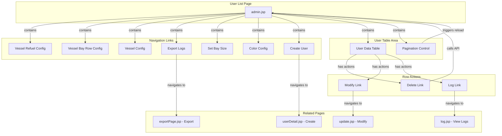

# User List Page - Technical Specification

## 1. Architecture & Component Tree

This is a legacy JSP-based web application using Spring MVC framework. The page architecture follows a traditional server-side rendering pattern with JSTL tag libraries for templating.



**Component Structure**:
- **Main Page**: `admin.jsp` - Server-side rendered JSP with embedded CSS and JavaScript
- **Tag Libraries**: JSTL core (`c:`), Spring tags (`spring:`), Pager taglib (`pg:`)
- **Styling**: Inline CSS in `<style>` block, no external stylesheet
- **JavaScript**: Inline functions for logout confirmation and delete confirmation

> 📎 Source: src/main/webapp/WEB-INF/jsp/admin.jsp → full file structure

## 2. State Management

This is a stateless server-rendered application. State is managed entirely on the server side through HTTP sessions and request parameters.

**Server-Side State**:
- **Session Attributes**:
  - `Constants.USER_LOGIN`: Current logged-in User object
  - `Constants.QC_ID`: Current QC device ID
  - `SessionLocaleResolver.LOCALE_SESSION_ATTRIBUTE_NAME`: User's locale preference
- **Request Attributes** (passed via ModelMap):
  - `pm`: PageManage object containing user list data (`pm.datas`, `pm.total`, `pm.pagesize`)
  - `limit`: String "Yes" if current user is in restricted account list
  - `idd`: Hidden field storing user ID (from `pm.userid`)

**Client-Side State**:
- No client-side state management (no JavaScript frameworks)
- DOM manipulation via vanilla JavaScript for showing/hiding error messages
- Browser native confirm dialogs for destructive actions

**Data Flow**:
```
Backend Controller (UserControl.listAllUser())
  ↓ prepares ModelMap with pm (PageManage) and limit flag
JSP Template (admin.jsp)
  ↓ renders HTML with JSTL iteration over ${pm.datas}
Browser
  ↓ displays table rows
User Action (click DELETE/MODIFY/LOG)
  ↓ sends GET request with user ID parameter
Backend Controller
  ↓ processes action, redirects back to /user/all.html
```

> 📎 Source: src/main/java/com/springMVC/control/UserControl.java → listAllUser(); src/main/webapp/WEB-INF/jsp/admin.jsp → c:forEach, hidden inputs

## 3. API Integration

All API calls are traditional HTTP GET requests triggered by anchor tags or form submissions. No AJAX/fetch usage.

### 3.1 List All Users
- **Endpoint**: `GET /user/all.html`
- **Parameters**: `pager.offset` (optional, integer for pagination)
- **Response**: Renders `admin.jsp` with model attributes:
  - `pm`: PageManage object with fields:
    - `datas`: List<User> - array of user objects
    - `total`: int - total record count
    - `pagesize`: int - records per page
    - `userid`: int - current user ID (for hidden field)
  - `limit`: String "Yes" or null
- **Error Handling**: None visible at UI level; exceptions caught in controller but not displayed

> 📎 Source: src/main/java/com/springMVC/control/UserControl.java → listAllUser() lines 369-388

### 3.2 Delete User
- **Endpoint**: `GET /user/del.html?id={userId}`
- **Parameters**: `id` (user ID to delete)
- **Response**: Redirects to `/user/all.html` after deletion
- **Error Handling**: Exceptions caught and printed to console, but user sees no error message; always redirects back

> 📎 Source: src/main/java/com/springMVC/control/UserControl.java → delUser() lines 390-398

⚠️ [OWASP:A01] Delete operation uses GET method instead of POST/DELETE, making it vulnerable to CSRF attacks via image tags or links
> 📎 Source: src/main/java/com/springMVC/control/UserControl.java → delUser() @RequestMapping(value = "/del", method = RequestMethod.GET)

### 3.3 Get User for Modification
- **Endpoint**: `GET /user/modify.html?id={userId}`
- **Parameters**: `id` (user ID to modify)
- **Response**: Renders `update.jsp` with model attribute:
  - `u`: User object with pre-filled data (username, qcid, role, password, id)
  - `result`: Optional error message string

> 📎 Source: src/main/java/com/springMVC/control/UserControl.java → modUser() lines 400-412

### 3.4 Update User
- **Endpoint**: `POST /user/update.html`
- **Parameters** (form data):
  - `role`: String ("USER" or "ADMIN")
  - `password`: String
  - `u_id`: int (user ID)
  - `qcid`: String
- **Response**: Redirects to `/user/all.html` on success; redirects to `/user/modify.html?result={error}` on failure
- **Error Handling**: On exception, adds error message to model and redirects back to modify page with result parameter

> 📎 Source: src/main/java/com/springMVC/control/UserControl.java → updateUser() lines 415-441

### 3.5 View User Logs
- **Endpoint**: `GET /user/log.html?id={userId}`
- **Parameters**: 
  - `id` or `userid` (user ID)
  - `pager.offset` (optional, for pagination)
- **Response**: Renders `log.jsp` with model attribute:
  - `pm`: PageManage object with log entries
    - `datas`: List<ShowLog> - array of log objects with fields: username, qcid, loginTime, operation
    - `total`: int
    - `pagesize`: int
    - `userid`: int

> 📎 Source: src/main/java/com/springMVC/control/UserControl.java → showLog() lines 443-475

### 3.6 Export Logs
- **Endpoint**: `GET /user/exportLogs.html?fromTime={fromTime}&toTime={toTime}`
- **Parameters**:
  - `fromTime`: String (format: yyyy-mm-dd hh:mi:ss)
  - `toTime`: String (format: yyyy-mm-dd hh:mi:ss)
- **Response**: Triggers file download (response content type set by ExportHandler)
- **Error Handling**: ParseException declared in method signature but no explicit handling

> 📎 Source: src/main/java/com/springMVC/control/UserControl.java → exportLogs() lines 508-516

### 3.7 Create User
- **Endpoint**: `GET /user/add.html` - Shows create form
- **Endpoint**: `POST /user/save.html` - Submits new user
- **Parameters** (form data):
  - `username`: String
  - `role`: String ("USER" or "ADMIN")
  - `password`: String
  - `qcid`: String
- **Response**: On success, redirects to `/user/all.html`; on failure (username exists), re-renders `userDetail.jsp` with error message in `result` attribute
- **Error Handling**: Checks for duplicate username before saving; catches exceptions during save operation

> 📎 Source: src/main/java/com/springMVC/control/UserControl.java → addUser() lines 323-327, add() lines 329-366

## 4. Data Flow & Transformation

### 4.1 User Entity Structure
Based on code analysis, the User entity contains:
- `id`: int - Primary key
- `username`: String - Login name
- `password`: String - Plain text password (⚠️ security concern)
- `qcid`: String - QC device identifier
- `role`: String - "USER" or "ADMIN"
- `createtime`: String - Creation timestamp
- `parent`: String - Creator's username

> 📎 Source: src/main/java/com/springMVC/control/UserControl.java → User object usage in add(), updateUser()

### 4.2 ShowLog Entity Structure
- `id`: int
- `userid`: int - Reference to User
- `username`: String
- `qcid`: String
- `loginTime`: String - Format: yyyyMMddHHmmss
- `operation`: String - e.g., "LOGIN"

> 📎 Source: src/main/java/com/springMVC/control/UserControl.java → ShowLog usage in login(), showLog()

### 4.3 PageManage Structure
Generic pagination wrapper:
- `datas`: List<?> - Paginated data items
- `total`: int - Total record count
- `pagesize`: int - Items per page
- `userid`: int - Context user ID

> 📎 Source: src/main/java/com/springMVC/control/UserControl.java → getAllUser(), getUserLog()

### 4.4 Data Transformations

**Time Format Conversion (Log Display)**:
```jsp
<fmt:parseDate value="${log.loginTime}" pattern="yyyyMMddHHmmss" var="test"/>
<fmt:formatDate value="${test}" pattern="yyyy-MM-dd HH:mm:ss"/>
```
- Input: `20240115143022`
- Output: `2024-01-15 14:30:22`

> 📎 Source: src/main/webapp/WEB-INF/jsp/log.jsp → fmt:parseDate, fmt:formatDate

**QC ID Construction**:
```java
String qcid = "".equals(idQc) ? ("".equals(idHc) ? "C" + idC : "HC" + idHc) : "QC" + idQc;
```
- Logic: Priority order QC > HC > C
- Examples: "QC01", "HC02", "C03"

> 📎 Source: src/main/java/com/springMVC/control/UserControl.java → login() line 117

**Restricted Account Check**:
```java
String limitAccountStr = PropertiesUtil.getPropertiesValue("limitAccount");
for (String temp : limitAccountStr.split(",")) {
    if (StringUtils.equals(temp, user.getUsername())) {
        model.put("limit", "Yes");
    }
}
```
- Reads comma-separated usernames from properties file
- Sets `limit` flag for conditional UI rendering

> 📎 Source: src/main/java/com/springMVC/control/UserControl.java → listAllUser() lines 380-385

## 5. Interaction Logic

### 5.1 Form Validation (Client-Side)

**Create User Form (`userDetail.jsp`)**:
Validation function `check()` executes on form submit:
1. Hide previous error messages (`ess` element)
2. Validate USERNAME: not empty, length ≤ 10
3. Validate PASSWORD: not empty, length ≤ 6
4. Validate CONFIRM PASSWORD: not empty, length ≤ 6
5. Check PASSWORD === CONFIRM PASSWORD
6. Validate QCID: length ≤ 6
7. If any validation fails, display error in `message` div and return false
8. If all pass, return true to allow form submission

> 📎 Source: src/main/webapp/WEB-INF/jsp/userDetail.jsp → check() function lines 55-104

**Update User Form (`update.jsp`)**:
Validation function `check()` executes on form submit:
1. Hide previous error messages
2. Validate PASSWORD: not empty, length ≤ 6
3. Validate CONFIRM PASSWORD: not empty, length ≤ 6
4. Check PASSWORD === CONFIRM PASSWORD
5. Validate QCID: length ≤ 6
6. Note: USERNAME is readonly, so no validation needed

> 📎 Source: src/main/webapp/WEB-INF/jsp/update.jsp → check() function lines 51-90

**Export Logs Form (`exportPage.jsp`)**:
Validation function `exportLogs()` executes on button click:
1. Get fromTime and toTime values
2. Check both are not null/empty and length == 19
3. Validate format using `strDateTime()` regex: `/^(\d{1,4})(-|\/)(\d{1,2})\2(\d{1,2}) (\d{1,2}):(\d{1,2}):(\d{1,2})$/`
4. Compare times using `comptime()`: end time must be >= start time
5. If valid, navigate to `exportLogs.html?fromTime={fromTime}&toTime={toTime}`

> 📎 Source: src/main/webapp/WEB-INF/jsp/exportPage.jsp → exportLogs(), strDateTime(), comptime() lines 40-98

### 5.2 Conditional Rendering

**Navigation Links Visibility**:
```jsp
<c:choose>
    <c:when test="${ limit == 'Yes' }">
        <!-- Limited links: Vessel Refuel Configure, Vessel Bay Row Configure -->
    </c:when>
    <c:otherwise>
        <!-- Full links: includes Create User, Export Logs, etc. -->
    </c:otherwise>
</c:choose>
```

> 📎 Source: src/main/webapp/WEB-INF/jsp/admin.jsp → c:choose block lines 48-126

**User List Empty State**:
```jsp
<c:if test="${! empty pm.datas}">
    <c:forEach var="user" items="${pm.datas}">
        <!-- Render table rows -->
    </c:forEach>
</c:if>
```
- If `pm.datas` is empty, no table rows are rendered (table header still shows)

> 📎 Source: src/main/webapp/WEB-INF/jsp/admin.jsp → c:if test lines 74-88

**Error Message Display**:
- Server-side errors: Displayed in `ess` div when `${result}` is not empty
- Client-side errors: Displayed in `message` div (initially hidden, shown via JavaScript)

> 📎 Source: src/main/webapp/WEB-INF/jsp/userDetail.jsp → tr#ess, tr#message

### 5.3 Pagination Logic

Uses custom pager taglib (`pg:pager`):
```jsp
<pg:pager items="${pm.total}" maxPageItems="${pm.pagesize}" url="all.html" export="offset,currentPageNumber=pageNumber">
    <pg:first><a href="${pageUrl}">HOME</a></pg:first>
    <pg:prev><a href="${pageUrl}">PRE</a></pg:prev>
    <pg:pages>
        <c:choose>
            <c:when test="${currentPageNumber eq pageNumber}">
                <font color="red">${pageNumber}</font>
            </c:when>
            <c:otherwise>
                <a href="${pageUrl}">${pageNumber}</a>
            </c:otherwise>
        </c:choose>
    </pg:pages>
    <pg:next><a href="${pageUrl}">NEXT</a></pg:next>
    <pg:last><a href="${pageUrl}">END</a></pg:last>
</pg:pager>
```

- Current page number highlighted in red
- Offset parameter passed via URL for backend pagination

> 📎 Source: src/main/webapp/WEB-INF/jsp/admin.jsp → pg:pager block lines 94-117

## 6. Error Handling

### 6.1 Client-Side Validation Errors
- Displayed in red text within the form page
- Messages sourced from i18n properties files via `<spring:message>` tags
- Examples:
  - "The username cannot be empty!"
  - "Username is too long!"
  - "Passwords do not match!"

> 📎 Source: src/main/resources/messages_en.properties → error_* keys

### 6.2 Server-Side Errors
- Duplicate username: Returns to form page with `result` attribute containing error message
- Database connection failures: Caught in controller, error message added to model
- Update failures: Redirects back to modify page with error result parameter

⚠️ [ERR:delete] Delete operation silently swallows exceptions without user feedback
> 📎 Source: src/main/java/com/springMVC/control/UserControl.java → delUser() lines 392-396 (catch block only prints stack trace)

⚠️ [ERR:log] Log retrieval exceptions are caught but not communicated to user; page may render with null data
> 📎 Source: src/main/java/com/springMVC/control/UserControl.java → showLog() lines 467-471

### 6.3 Missing Error States
- No loading indicators for any operations
- No retry mechanisms for failed requests
- No network error handling (all operations assume successful HTTP responses)

## 7. Security

### 7.1 Authentication & Session Management
- User credentials stored in session after login (`Constants.USER_LOGIN`)
- Logout clears session and redirects to login page
- Session-based authentication (no JWT or token-based auth)

> 📎 Source: src/main/java/com/springMVC/control/UserControl.java → login(), logout()

⚠️ [OWASP:A07] Passwords stored and transmitted in plain text (no hashing or encryption visible in code)
> 📎 Source: src/main/java/com/springMVC/control/UserControl.java → login() line 152, add() line 349

⚠️ [OWASP:A01] No CSRF protection tokens on forms (no Spring Security CSRF configuration visible)
> 📎 Source: src/main/webapp/WEB-INF/jsp/userDetail.jsp → form:form without CSRF token

⚠️ [OWASP:A01] Destructive operations (delete) use GET method, vulnerable to CSRF via link clicking
> 📎 Source: src/main/java/com/springMVC/control/UserControl.java → delUser() @RequestMapping(method = RequestMethod.GET)

### 7.2 Authorization
- Role-based access control via session attribute checking
- Restricted account list loaded from properties file for granular permission control
- No method-level security annotations visible

> 📎 Source: src/main/java/com/springMVC/control/UserControl.java → listAllUser() lines 379-385

### 7.3 Input Sanitization
- User input rendered via `<c:out>` which provides XSS protection by escaping HTML entities
- Form inputs use standard HTML input elements (no innerHTML/dangerouslySetInnerHTML usage)

> 📎 Source: src/main/webapp/WEB-INF/jsp/admin.jsp → c:out value="${user.username}"

⚠️ [OWASP:A03] Time format validation uses client-side JavaScript only; server-side validation not visible in controller code
> 📎 Source: src/main/webapp/WEB-INF/jsp/exportPage.jsp → strDateTime() regex validation

## 8. Performance

### 8.1 Rendering Optimization
- Server-side rendering eliminates client-side JavaScript overhead
- Pagination limits data transferred per request
- No virtualization for table rows (acceptable for typical user counts)

### 8.2 Resource Loading
- Inline CSS and JavaScript (no external file requests)
- Single image resource for logout icon
- No lazy loading implemented (not applicable for this page type)

⚠️ [PERF:main-thread] All validation logic runs on main thread with no debouncing; rapid form submissions could cause multiple requests
> 📎 Source: src/main/webapp/WEB-INF/jsp/userDetail.jsp → check() function called on every form submit

### 8.3 Bundle Size
- Minimal JavaScript footprint (only validation and confirmation functions)
- No third-party libraries loaded on this page
- JSP compilation happens at server startup

### 8.4 Database Query Patterns
- Pagination implemented at database level (offset-based)
- ⚠️ [PERF:polling] No caching mechanism visible; each page refresh triggers fresh database query
> 📎 Source: src/main/java/com/springMVC/control/UserControl.java → listAllUser() calls userDao.getAllUser(offset) on every request
